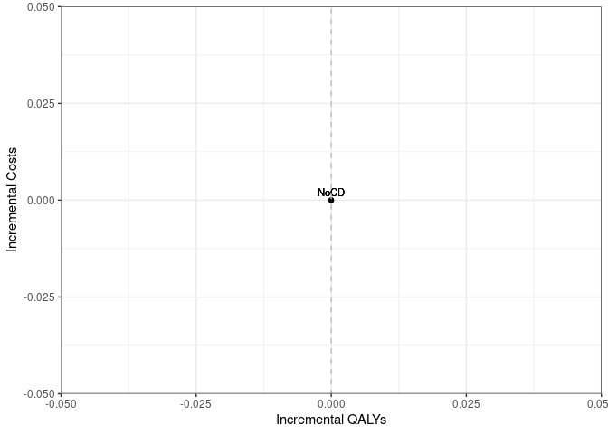

Case Detection Scenario Main Analysis
================

    ## 
    ## > errors<-c(
    ## +   ERR_INCORRECT_SETTING_VARIABLE=-1,
    ## +   ERR_INCORRECT_VECTOR_SIZE=-2,
    ## +   ERR_INCORRECT_INPUT_VAR=-3,
    ## +   ERR_EVENT_STACK_FULL=-4,
    ## +   .... [TRUNCATED] 
    ## 
    ## > record_mode<-c(
    ## +   record_mode_none=0,
    ## +   record_mode_agent=1,
    ## +   record_mode_event=2,
    ## +   record_mode_some_event=3
    ## + )
    ## 
    ## > agent_creation_mode<-c(
    ## +   agent_creation_mode_one=0,
    ## +   agent_creation_mode_all=1,
    ## +   agent_creation_mode_pre=2
    ## + )
    ## 
    ## > medication_classes<-c(
    ## +   MED_CLASS_SABA=1,
    ## +   MED_CLASS_LABA=2,
    ## +   MED_CLASS_LAMA=4,
    ## +   MED_CLASS_ICS=8,
    ## +   MED_CLASS_MACRO=16
    ## + )
    ## 
    ## > events<-c(
    ## +     event_start=0,
    ## +     event_fixed=1,
    ## +     event_birthday=2,
    ## +     event_smoking_change=3,
    ## +     event_COPD=4,
    ## +     event_exacerbat .... [TRUNCATED]

    ## Initializing the session

    ## [1] 0

**Global inputs:**

- Medication adherence is 0.7
- Smoking adherence is 0.7
- Cost discounting: 0.015
- QALY discounting: 0.015
- Time horizon: 20
- The WTP threshold for NMB is 50000

**Case detection inputs:**

- Case detection occurs at 3 year intervals.
- An outpatient diagnosis costs 61.18
- The utility gain due to symptom relief from treatment is 0.0367

## S1 All patients scenario

All patients are eligible. The cost of case detection is:

| None | CDQ17 | FlowMeter | FlowMeter_CDQ |
|-----:|------:|----------:|--------------:|
|    0 | 11.56 |     30.46 |         42.01 |

#### S1NoCD: No Case detection

    ## [1] 0

    ## Terminating the session

    ## [1] 0

#### S1NoCD2: No Case detection- Other time interval

    ## Initializing the session

    ## [1] 0

    ## [1] 0

    ## Terminating the session

    ## [1] 0

#### S1A: CDQ ≥17 points

    ## Initializing the session

    ## [1] 0

    ## [1] 0

    ## Terminating the session

    ## [1] 0

#### S1B: Screening Spirometry with BD

    ## Initializing the session

    ## [1] 0

    ## [1] 0

    ## Terminating the session

    ## [1] 0

#### S1C: CDQ ≥17 points and Screening Spirometry with BD

    ## Initializing the session

    ## [1] 0

    ## [1] 0

    ## Terminating the session

    ## [1] 0

| Scenario  | Agents | PatientYears | CopdPYs | NCaseDetections | DiagnosedPYs | OverdiagnosedPYs | SABA | LAMA | LAMALABA | ICSLAMALABA | Mild | Moderate | Severe | VerySevere | MildPY | ModeratePY | SeverePY | VerySeverePY | NoCOPD | GOLD1 | GOLD2 | GOLD3 | GOLD4 | Cost | CostpAgent | QALY | QALYpAgent | NMB | IncrementalCosts | IncrementalQALY | ICER | IncrementalNMB |
|:----------|-------:|-------------:|--------:|----------------:|-------------:|-----------------:|-----:|-----:|---------:|------------:|-----:|---------:|-------:|-----------:|-------:|-----------:|---------:|-------------:|-------:|------:|------:|------:|------:|-----:|-----------:|-----:|-----------:|----:|-----------------:|----------------:|-----:|---------------:|
| S1NoCD    |      0 |            0 |       0 |               0 |            0 |                0 |  NaN |  NaN |      NaN |         NaN |    0 |        0 |      0 |          0 |    NaN |        NaN |      NaN |          NaN |      0 |     0 |     0 |     0 |     0 |    0 |        NaN |    0 |        NaN | NaN |                0 |               0 |  NaN |              0 |
| S1NoCD2   |      0 |            0 |       0 |               0 |            0 |                0 |  NaN |  NaN |      NaN |         NaN |    0 |        0 |      0 |          0 |    NaN |        NaN |      NaN |          NaN |      0 |     0 |     0 |     0 |     0 |    0 |        NaN |    0 |        NaN | NaN |                0 |               0 |  NaN |              0 |
| S1NoCDAvg |      0 |            0 |       0 |               0 |            0 |                0 |  NaN |  NaN |      NaN |         NaN |    0 |        0 |      0 |          0 |    NaN |        NaN |      NaN |          NaN |      0 |     0 |     0 |     0 |     0 |    0 |        NaN |    0 |        NaN | NaN |                0 |               0 |  NaN |              0 |
| S1a       |      0 |            0 |       0 |               0 |            0 |                0 |  NaN |  NaN |      NaN |         NaN |    0 |        0 |      0 |          0 |    NaN |        NaN |      NaN |          NaN |      0 |     0 |     0 |     0 |     0 |    0 |        NaN |    0 |        NaN | NaN |              NaN |             NaN |  NaN |            NaN |
| S1b       |      0 |            0 |       0 |               0 |            0 |                0 |  NaN |  NaN |      NaN |         NaN |    0 |        0 |      0 |          0 |    NaN |        NaN |      NaN |          NaN |      0 |     0 |     0 |     0 |     0 |    0 |        NaN |    0 |        NaN | NaN |              NaN |             NaN |  NaN |            NaN |
| S1c       |      0 |            0 |       0 |               0 |            0 |                0 |  NaN |  NaN |      NaN |         NaN |    0 |        0 |      0 |          0 |    NaN |        NaN |      NaN |          NaN |      0 |     0 |     0 |     0 |     0 |    0 |        NaN |    0 |        NaN | NaN |              NaN |             NaN |  NaN |            NaN |

*Treatment rate:* SABA is expressed per all patient-years, LAMA,
LAMA/LABA, ICS/LAMA/LABA are per COPD patient-years *Exacerbations:*
Total exacerbations and rate per COPD patient-year: *GOLD Stage:*
Cumulative patient-years *Cost/QALY:* Total cost and QALYs *NMB:* Net
Monetary Benefit is calculated as QALY per patient-year \* Lamba - Cost
per patient-year

------------------------------------------------------------------------

## S2 Symptomatic patients scenario

Patients with symptoms at year 1 are eligible. The cost of case
detection is:

    ## Initializing the session

    ## [1] 0

| None | FlowMeter |
|-----:|----------:|
|    0 |     24.33 |

#### S2NoCD: No Case detection

    ## [1] 0

    ## Terminating the session

    ## [1] 0

#### S2a: Screening Spirometry without BD

    ## Initializing the session

    ## [1] 0

    ## [1] 0

    ## Terminating the session

    ## [1] 0

| Scenario | Agents | PatientYears | CopdPYs | NCaseDetections | DiagnosedPYs | OverdiagnosedPYs | SABA | LAMA | LAMALABA | ICSLAMALABA | Mild | Moderate | Severe | VerySevere | MildPY | ModeratePY | SeverePY | VerySeverePY | NoCOPD | GOLD1 | GOLD2 | GOLD3 | GOLD4 | Cost | CostpAgent | QALY | QALYpAgent | NMB | IncrementalCosts | IncrementalQALY | ICER | IncrementalNMB |
|:---------|-------:|-------------:|--------:|----------------:|-------------:|-----------------:|-----:|-----:|---------:|------------:|-----:|---------:|-------:|-----------:|-------:|-----------:|---------:|-------------:|-------:|------:|------:|------:|------:|-----:|-----------:|-----:|-----------:|----:|-----------------:|----------------:|-----:|---------------:|
| S2NoCD   |      0 |            0 |       0 |               0 |            0 |                0 |  NaN |  NaN |      NaN |         NaN |    0 |        0 |      0 |          0 |    NaN |        NaN |      NaN |          NaN |      0 |     0 |     0 |     0 |     0 |    0 |        NaN |    0 |        NaN | NaN |                0 |               0 |  NaN |              0 |
| S2a      |      0 |            0 |       0 |               0 |            0 |                0 |  NaN |  NaN |      NaN |         NaN |    0 |        0 |      0 |          0 |    NaN |        NaN |      NaN |          NaN |      0 |     0 |     0 |     0 |     0 |    0 |        NaN |    0 |        NaN | NaN |              NaN |             NaN |  NaN |            NaN |

*Treatment rate:* SABA is expressed per all patient-years, LAMA,
LAMA/LABA, ICS/LAMA/LABA are per COPD patient-years *Exacerbations:*
Total exacerbations and rate per COPD patient-year: *GOLD Stage:*
Cumulative patient-years *Cost/QALY:* Total cost and QALYs *NMB:* Net
Monetary Benefit is calculated as QALY per patient-year \* Lamba - Cost
per patient-year

------------------------------------------------------------------------

## S3 Smoking history scenario

Ever smokers ≥50 years of age are eligible. The cost of case detection
is:

    ## Initializing the session

    ## [1] 0

| None | CDQ195 | CDQ165 | FlowMeter | FlowMeter_CDQ |
|-----:|-------:|-------:|----------:|--------------:|
|    0 |  11.56 |  11.56 |     24.33 |         42.01 |

#### S3NoCD: No Case detection

    ## [1] 0

    ## Terminating the session

    ## [1] 0

#### S3a: CDQ ≥19.5 points

    ## Initializing the session

    ## [1] 0

    ## [1] 0

    ## Terminating the session

    ## [1] 0

#### S3b: CDQ ≥16.5 points

    ## Initializing the session

    ## [1] 0

    ## [1] 0

    ## Terminating the session

    ## [1] 0

#### S3c: Screening spirometry without BD

    ## Initializing the session

    ## [1] 0

    ## [1] 0

    ## Terminating the session

    ## [1] 0

#### S3d: Screening Spirometry with BD + CDQ ≥17 points

    ## Initializing the session

    ## [1] 0

    ## [1] 0

    ## Terminating the session

    ## [1] 0

| Scenario | Agents | PatientYears | CopdPYs | NCaseDetections | DiagnosedPYs | OverdiagnosedPYs | SABA | LAMA | LAMALABA | ICSLAMALABA | Mild | Moderate | Severe | VerySevere | MildPY | ModeratePY | SeverePY | VerySeverePY | NoCOPD | GOLD1 | GOLD2 | GOLD3 | GOLD4 | Cost | CostpAgent | QALY | QALYpAgent | NMB | IncrementalCosts | IncrementalQALY | ICER | IncrementalNMB |
|:---------|-------:|-------------:|--------:|----------------:|-------------:|-----------------:|-----:|-----:|---------:|------------:|-----:|---------:|-------:|-----------:|-------:|-----------:|---------:|-------------:|-------:|------:|------:|------:|------:|-----:|-----------:|-----:|-----------:|----:|-----------------:|----------------:|-----:|---------------:|
| S3NoCD   |      0 |            0 |       0 |               0 |            0 |                0 |  NaN |  NaN |      NaN |         NaN |    0 |        0 |      0 |          0 |    NaN |        NaN |      NaN |          NaN |      0 |     0 |     0 |     0 |     0 |    0 |        NaN |    0 |        NaN | NaN |                0 |               0 |  NaN |              0 |
| S3a      |      0 |            0 |       0 |               0 |            0 |                0 |  NaN |  NaN |      NaN |         NaN |    0 |        0 |      0 |          0 |    NaN |        NaN |      NaN |          NaN |      0 |     0 |     0 |     0 |     0 |    0 |        NaN |    0 |        NaN | NaN |              NaN |             NaN |  NaN |            NaN |
| S3b      |      0 |            0 |       0 |               0 |            0 |                0 |  NaN |  NaN |      NaN |         NaN |    0 |        0 |      0 |          0 |    NaN |        NaN |      NaN |          NaN |      0 |     0 |     0 |     0 |     0 |    0 |        NaN |    0 |        NaN | NaN |              NaN |             NaN |  NaN |            NaN |
| S3c      |      0 |            0 |       0 |               0 |            0 |                0 |  NaN |  NaN |      NaN |         NaN |    0 |        0 |      0 |          0 |    NaN |        NaN |      NaN |          NaN |      0 |     0 |     0 |     0 |     0 |    0 |        NaN |    0 |        NaN | NaN |              NaN |             NaN |  NaN |            NaN |
| S3d      |      0 |            0 |       0 |               0 |            0 |                0 |  NaN |  NaN |      NaN |         NaN |    0 |        0 |      0 |          0 |    NaN |        NaN |      NaN |          NaN |      0 |     0 |     0 |     0 |     0 |    0 |        NaN |    0 |        NaN | NaN |              NaN |             NaN |  NaN |            NaN |

*Treatment rate:* SABA is expressed per all patient-years, LAMA,
LAMA/LABA, ICS/LAMA/LABA are per COPD patient-years *Exacerbations:*
Total exacerbations and rate per COPD patient-year *GOLD Stage:*
Cumulative patient-years *Cost/QALY:* Total cost and QALYs *NMB:* Net
Monetary Benefit is calculated as QALY per patient-year \* Lamba - Cost
per patient-year

------------------------------------------------------------------------

## All Scenarios

*Ordered by descending Net Monetary Benefit*

| Scenario | Agents | Cost | CostpAgent | QALY | QALYpAgent | ICER | IncrementalNMB |
|:---------|-------:|-----:|-----------:|-----:|-----------:|-----:|---------------:|
| S1NoCD   |      0 |    0 |        NaN |    0 |        NaN |  NaN |              0 |
| S2NoCD   |      0 |    0 |        NaN |    0 |        NaN |  NaN |              0 |
| S3NoCD   |      0 |    0 |        NaN |    0 |        NaN |  NaN |              0 |
| S1a      |      0 |    0 |        NaN |    0 |        NaN |  NaN |            NaN |
| S1b      |      0 |    0 |        NaN |    0 |        NaN |  NaN |            NaN |
| S1c      |      0 |    0 |        NaN |    0 |        NaN |  NaN |            NaN |
| S2a      |      0 |    0 |        NaN |    0 |        NaN |  NaN |            NaN |
| S3a      |      0 |    0 |        NaN |    0 |        NaN |  NaN |            NaN |
| S3b      |      0 |    0 |        NaN |    0 |        NaN |  NaN |            NaN |
| S3c      |      0 |    0 |        NaN |    0 |        NaN |  NaN |            NaN |
| S3d      |      0 |    0 |        NaN |    0 |        NaN |  NaN |            NaN |

------------------------------------------------------------------------

## Cost Effectiveness Plane

Adjusted to the total population

| Scenario  | Agents | PropAgents | Cost | CostpAgent | CostpAgentExcluded | CostpAgentAll | QALY | QALYpAgent | QALYpAgentExcluded | QALYpAgentAll | IncrementalCosts | IncrementalQALY | ICERAdj | ICER | INMB |
|:----------|-------:|-----------:|-----:|-----------:|-------------------:|--------------:|-----:|-----------:|-------------------:|--------------:|-----------------:|----------------:|--------:|-----:|-----:|
| S1NoCDAvg |      0 |          1 |    0 |        NaN |                  0 |           NaN |    0 |        NaN |                  0 |           NaN |                0 |               0 |     NaN |  NaN |  NaN |
| S1a       |      0 |          1 |    0 |        NaN |                  0 |           NaN |    0 |        NaN |                  0 |           NaN |              NaN |             NaN |     NaN |  NaN |  NaN |
| S1b       |      0 |          1 |    0 |        NaN |                  0 |           NaN |    0 |        NaN |                  0 |           NaN |              NaN |             NaN |     NaN |  NaN |  NaN |
| S1c       |      0 |          1 |    0 |        NaN |                  0 |           NaN |    0 |        NaN |                  0 |           NaN |              NaN |             NaN |     NaN |  NaN |  NaN |
| S2NoCD    |      0 |        NaN |    0 |        NaN |                NaN |           NaN |    0 |        NaN |                NaN |           NaN |                0 |               0 |     NaN |  NaN |  NaN |
| S2a       |      0 |        NaN |    0 |        NaN |                NaN |           NaN |    0 |        NaN |                NaN |           NaN |              NaN |             NaN |     NaN |  NaN |  NaN |
| S3NoCD    |      0 |        NaN |    0 |        NaN |                NaN |           NaN |    0 |        NaN |                NaN |           NaN |                0 |               0 |     NaN |  NaN |  NaN |
| S3a       |      0 |        NaN |    0 |        NaN |                NaN |           NaN |    0 |        NaN |                NaN |           NaN |              NaN |             NaN |     NaN |  NaN |  NaN |
| S3b       |      0 |        NaN |    0 |        NaN |                NaN |           NaN |    0 |        NaN |                NaN |           NaN |              NaN |             NaN |     NaN |  NaN |  NaN |
| S3c       |      0 |        NaN |    0 |        NaN |                NaN |           NaN |    0 |        NaN |                NaN |           NaN |              NaN |             NaN |     NaN |  NaN |  NaN |
| S3d       |      0 |        NaN |    0 |        NaN |                NaN |           NaN |    0 |        NaN |                NaN |           NaN |              NaN |             NaN |     NaN |  NaN |  NaN |

    ## Warning: Removed 8 rows containing missing values or values outside the scale range
    ## (`geom_point()`).

    ## Warning: Removed 8 rows containing missing values or values outside the scale range
    ## (`geom_text()`).

<!-- -->

## Clinical Results for all scenarios

Adjusted to the total population

| Scenario  | PropAgents | ProppPatientYears | ProppCopdPYs | SABAAll | LAMAAll | LAMALABAAll | ICSLAMALABAAll | MildpAgentAll | ModeratepAgentAll | SeverepAgentAll | VerySeverepAgentAll | NoCOPDpPYAll | GOLD1pPYAll | GOLD2pPYAll | GOLD3pPYAll | GOLD4pPYAll | DiagnosedpPYAll |
|:----------|-----------:|------------------:|-------------:|--------:|--------:|------------:|---------------:|--------------:|------------------:|----------------:|--------------------:|-------------:|------------:|------------:|------------:|------------:|----------------:|
| S1NoCDAvg |          1 |                 1 |            1 |     NaN |     NaN |         NaN |            NaN |           NaN |               NaN |             NaN |                 NaN |          NaN |         NaN |         NaN |         NaN |         NaN |             NaN |
| S1a       |          1 |                 1 |            1 |     NaN |     NaN |         NaN |            NaN |           NaN |               NaN |             NaN |                 NaN |          NaN |         NaN |         NaN |         NaN |         NaN |             NaN |
| S1b       |          1 |                 1 |            1 |     NaN |     NaN |         NaN |            NaN |           NaN |               NaN |             NaN |                 NaN |          NaN |         NaN |         NaN |         NaN |         NaN |             NaN |
| S1c       |          1 |                 1 |            1 |     NaN |     NaN |         NaN |            NaN |           NaN |               NaN |             NaN |                 NaN |          NaN |         NaN |         NaN |         NaN |         NaN |             NaN |
| S2NoCD    |        NaN |               NaN |          NaN |     NaN |     NaN |         NaN |            NaN |           NaN |               NaN |             NaN |                 NaN |          NaN |         NaN |         NaN |         NaN |         NaN |             NaN |
| S2a       |        NaN |               NaN |          NaN |     NaN |     NaN |         NaN |            NaN |           NaN |               NaN |             NaN |                 NaN |          NaN |         NaN |         NaN |         NaN |         NaN |             NaN |
| S3NoCD    |        NaN |               NaN |          NaN |     NaN |     NaN |         NaN |            NaN |           NaN |               NaN |             NaN |                 NaN |          NaN |         NaN |         NaN |         NaN |         NaN |             NaN |
| S3a       |        NaN |               NaN |          NaN |     NaN |     NaN |         NaN |            NaN |           NaN |               NaN |             NaN |                 NaN |          NaN |         NaN |         NaN |         NaN |         NaN |             NaN |
| S3b       |        NaN |               NaN |          NaN |     NaN |     NaN |         NaN |            NaN |           NaN |               NaN |             NaN |                 NaN |          NaN |         NaN |         NaN |         NaN |         NaN |             NaN |
| S3c       |        NaN |               NaN |          NaN |     NaN |     NaN |         NaN |            NaN |           NaN |               NaN |             NaN |                 NaN |          NaN |         NaN |         NaN |         NaN |         NaN |             NaN |
| S3d       |        NaN |               NaN |          NaN |     NaN |     NaN |         NaN |            NaN |           NaN |               NaN |             NaN |                 NaN |          NaN |         NaN |         NaN |         NaN |         NaN |             NaN |

## Time elapsed

Run time for this notebook:

``` r
end.time <- Sys.time()
time.taken <- end.time - start.time
time.taken
```

    ## Time difference of 18.16696 mins
