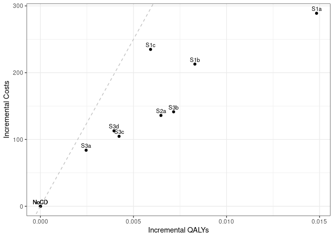

Case Detection Scenario Main Analysis
================
05 September, 2024

    ## 
    ## > errors<-c(
    ## +   ERR_INCORRECT_SETTING_VARIABLE=-1,
    ## +   ERR_INCORRECT_VECTOR_SIZE=-2,
    ## +   ERR_INCORRECT_INPUT_VAR=-3,
    ## +   ERR_EVENT_STACK_FULL=-4,
    ## +   .... [TRUNCATED] 
    ## 
    ## > record_mode<-c(
    ## +   record_mode_none=0,
    ## +   record_mode_agent=1,
    ## +   record_mode_event=2,
    ## +   record_mode_some_event=3
    ## + )
    ## 
    ## > agent_creation_mode<-c(
    ## +   agent_creation_mode_one=0,
    ## +   agent_creation_mode_all=1,
    ## +   agent_creation_mode_pre=2
    ## + )
    ## 
    ## > medication_classes<-c(
    ## +   MED_CLASS_SABA=1,
    ## +   MED_CLASS_LABA=2,
    ## +   MED_CLASS_LAMA=4,
    ## +   MED_CLASS_ICS=8,
    ## +   MED_CLASS_MACRO=16
    ## + )
    ## 
    ## > events<-c(
    ## +     event_start=0,
    ## +     event_fixed=1,
    ## +     event_birthday=2,
    ## +     event_smoking_change=3,
    ## +     event_COPD=4,
    ## +     event_exacerbat .... [TRUNCATED]

``` r
# CHANGE: Add a timer (will see addition below to print time too)
# Start timer
start.time <- Sys.time()
```

``` r
# CHANGE: Add save paths (will see later, we also add lines to save to csv)
outputs <- "../outputs/"
files <- list(
  s1 = "s1.csv",
  s2 = "s2.csv",
  s3 = "s3.csv",
  sall = "sall.csv",
  ceplane = "ceplane.csv",
  clinical = "clinicalresults.csv"
)

# Apply file.path to each element in list to create path to file in outputs
paths <- lapply(files, function(filename) file.path(outputs, filename))
```

    ## Initializing the session

    ## [1] 0

**Global inputs:**

  - Medication adherence is 0.7
  - Smoking adherence is 0.7
  - Cost discounting: 0.015
  - QALY discounting: 0.015
  - Time horizon: 20
  - The WTP threshold for NMB is 50000

**Case detection inputs:**

  - Case detection occurs at 3 year intervals.
  - An outpatient diagnosis costs 61.18
  - The utility gain due to symptom relief from treatment is 0.0367

## S1 All patients scenario

All patients are eligible. The cost of case detection is:

| None | CDQ17 | FlowMeter | FlowMeter\_CDQ |
| ---: | ----: | --------: | -------------: |
|    0 | 11.56 |     30.46 |          42.01 |

#### S1NoCD: No Case detection

    ## [1] 0

    ## Terminating the session

    ## [1] 0

#### S1NoCD2: No Case detection- Other time interval

    ## Initializing the session

    ## [1] 0

    ## [1] 0

    ## Terminating the session

    ## [1] 0

#### S1A: CDQ ≥17 points

    ## Initializing the session

    ## [1] 0

    ## [1] 0

    ## Terminating the session

    ## [1] 0

#### S1B: Screening Spirometry with BD

    ## Initializing the session

    ## [1] 0

    ## [1] 0

    ## Terminating the session

    ## [1] 0

#### S1C: CDQ ≥17 points and Screening Spirometry with BD

    ## Initializing the session

    ## [1] 0

    ## [1] 0

    ## Terminating the session

    ## [1] 0

| Scenario  | Agents | PatientYears | CopdPYs | NCaseDetections | DiagnosedPYs | OverdiagnosedPYs |  SABA |  LAMA | LAMALABA | ICSLAMALABA |   Mild | Moderate | Severe | VerySevere | MildPY | ModeratePY | SeverePY | VerySeverePY |   NoCOPD |  GOLD1 |    GOLD2 |    GOLD3 |   GOLD4 |       Cost | CostpAgent |    QALY | QALYpAgent |      NMB | IncrementalCosts | IncrementalQALY |     ICER | IncrementalNMB |
| :-------- | -----: | -----------: | ------: | --------------: | -----------: | ---------------: | ----: | ----: | -------: | ----------: | -----: | -------: | -----: | ---------: | -----: | ---------: | -------: | -----------: | -------: | -----: | -------: | -------: | ------: | ---------: | ---------: | ------: | ---------: | -------: | ---------------: | --------------: | -------: | -------------: |
| S1NoCD    | 743128 |     12498758 | 1421786 |         3814132 |     262262.1 |         267345.0 | 0.017 | 0.136 |    0.151 |       0.080 | 307237 |  58063.0 |  97203 |     8413.0 |  0.216 |      0.041 |    0.068 |        0.006 | 10529668 | 577647 | 613813.0 | 136603.0 | 24218.0 | 1600395858 |   2153.594 | 9317379 |     12.538 | 624749.1 |            0.000 |           0.000 |      NaN |          0.000 |
| S1NoCD2   | 743351 |     12502871 | 1416604 |         2490059 |     266540.8 |         326548.0 | 0.021 | 0.136 |    0.152 |       0.080 | 305047 |  57264.0 |  96853 |     8544.0 |  0.215 |      0.040 |    0.068 |        0.006 | 10538283 | 575003 | 611602.0 | 137564.0 | 23387.0 | 1598537028 |   2150.447 | 9320810 |     12.539 | 624794.9 |            0.000 |           0.000 |      NaN |          0.000 |
| S1NoCDAvg | 743240 |     12500814 | 1419195 |         3152096 |     264401.5 |         296946.5 | 0.019 | 0.136 |    0.152 |       0.080 | 306142 |  57663.5 |  97028 |     8478.5 |  0.216 |      0.041 |    0.068 |        0.006 | 10533976 | 576325 | 612707.5 | 137083.5 | 23802.5 | 1599466443 |   2152.020 | 9319095 |     12.538 | 624772.0 |            0.000 |           0.000 |      NaN |          0.000 |
| S1a       | 743762 |     12517907 | 1425566 |         3721701 |     659857.1 |         267328.0 | 0.026 | 0.158 |    0.309 |       0.093 | 298195 |  55925.0 |  94747 |     8099.0 |  0.209 |      0.039 |    0.066 |        0.006 | 10544093 | 578834 | 614679.0 | 138214.0 | 24326.0 | 1807321435 |   2429.973 | 9340234 |     12.558 | 625474.8 |          276.379 |           0.020 | 13791.12 |        725.639 |
| S1b       | 744327 |     12525733 | 1426814 |         3768970 |     479884.5 |         266135.0 | 0.022 | 0.149 |    0.242 |       0.088 | 302101 |  57270.0 |  96209 |     8168.0 |  0.212 |      0.040 |    0.067 |        0.006 | 10550678 | 575118 | 619235.0 | 138350.0 | 24388.0 | 1760175403 |   2364.788 | 9341640 |     12.550 | 625157.8 |          211.194 |           0.012 | 17035.38 |        408.675 |
| S1c       | 744352 |     12529353 | 1424458 |         3785712 |     413653.6 |         267941.0 | 0.020 | 0.145 |    0.216 |       0.086 | 303537 |  57198.0 |  97020 |     8363.0 |  0.213 |      0.040 |    0.068 |        0.006 | 10556239 | 575540 | 618156.0 | 137190.0 | 23997.0 | 1784618220 |   2397.546 | 9343139 |     12.552 | 625204.7 |          243.952 |           0.014 | 17438.19 |        455.525 |

*Treatment rate:* SABA is expressed per all patient-years, LAMA,
LAMA/LABA, ICS/LAMA/LABA are per COPD patient-years *Exacerbations:*
Total exacerbations and rate per COPD patient-year: *GOLD Stage:*
Cumulative patient-years *Cost/QALY:* Total cost and QALYs *NMB:* Net
Monetary Benefit is calculated as QALY per patient-year \* Lamba - Cost
per patient-year

-----

## S2 Symptomatic patients scenario

Patients with symptoms at year 1 are eligible. The cost of case
detection is:

    ## Initializing the session

    ## [1] 0

| None | FlowMeter |
| ---: | --------: |
|    0 |     24.33 |

#### S2NoCD: No Case detection

    ## [1] 0

    ## Terminating the session

    ## [1] 0

#### S2a: Screening Spirometry without BD

    ## Initializing the session

    ## [1] 0

    ## [1] 0

    ## Terminating the session

    ## [1] 0

| Scenario | Agents | PatientYears | CopdPYs | NCaseDetections | DiagnosedPYs | OverdiagnosedPYs |  SABA |  LAMA | LAMALABA | ICSLAMALABA |   Mild | Moderate | Severe | VerySevere | MildPY | ModeratePY | SeverePY | VerySeverePY |  NoCOPD |  GOLD1 |  GOLD2 |  GOLD3 | GOLD4 |       Cost | CostpAgent |    QALY | QALYpAgent |      NMB | IncrementalCosts | IncrementalQALY |     ICER | IncrementalNMB |
| :------- | -----: | -----------: | ------: | --------------: | -----------: | ---------------: | ----: | ----: | -------: | ----------: | -----: | -------: | -----: | ---------: | -----: | ---------: | -------: | -----------: | ------: | -----: | -----: | -----: | ----: | ---------: | ---------: | ------: | ---------: | -------: | ---------------: | --------------: | -------: | -------------: |
| S2NoCD   | 441551 |      7285932 | 1003225 |         2218016 |     192665.2 |           154284 | 0.017 | 0.141 |    0.158 |       0.088 | 227208 |    42560 |  70869 |       6005 |  0.226 |      0.042 |    0.071 |        0.006 | 5971718 | 371999 | 451002 | 110829 | 20022 | 1172222127 |   2654.783 | 5415116 |     12.264 | 610537.8 |            0.000 |           0.000 |      NaN |          0.000 |
| S2a      | 441650 |      7300020 | 1009033 |         2177405 |     372664.5 |           154839 | 0.023 | 0.156 |    0.268 |       0.096 | 225636 |    41689 |  69330 |       5933 |  0.224 |      0.041 |    0.069 |        0.006 | 5979687 | 373791 | 452824 | 112243 | 20668 | 1270487699 |   2876.684 | 5428810 |     12.292 | 611728.8 |          221.901 |           0.028 | 7852.913 |       1190.959 |

*Treatment rate:* SABA is expressed per all patient-years, LAMA,
LAMA/LABA, ICS/LAMA/LABA are per COPD patient-years *Exacerbations:*
Total exacerbations and rate per COPD patient-year: *GOLD Stage:*
Cumulative patient-years *Cost/QALY:* Total cost and QALYs *NMB:* Net
Monetary Benefit is calculated as QALY per patient-year \* Lamba - Cost
per patient-year

-----

## S3 Smoking history scenario

Ever smokers ≥50 years of age are eligible. The cost of case detection
is:

    ## Initializing the session

    ## [1] 0

| None | CDQ195 | CDQ165 | FlowMeter | FlowMeter\_CDQ |
| ---: | -----: | -----: | --------: | -------------: |
|    0 |  11.56 |  11.56 |     24.33 |          42.01 |

#### S3NoCD: No Case detection

    ## [1] 0

    ## Terminating the session

    ## [1] 0

#### S3a: CDQ ≥19.5 points

    ## Initializing the session

    ## [1] 0

    ## [1] 0

    ## Terminating the session

    ## [1] 0

#### S3b: CDQ ≥16.5 points

    ## Initializing the session

    ## [1] 0

    ## [1] 0

    ## Terminating the session

    ## [1] 0

#### S3c: Screening spirometry without BD

    ## Initializing the session

    ## [1] 0

    ## [1] 0

    ## Terminating the session

    ## [1] 0

#### S3d: Screening Spirometry with BD + CDQ ≥17 points

    ## Initializing the session

    ## [1] 0

    ## [1] 0

    ## Terminating the session

    ## [1] 0

| Scenario | Agents | PatientYears |  CopdPYs | NCaseDetections | DiagnosedPYs | OverdiagnosedPYs |  SABA |  LAMA | LAMALABA | ICSLAMALABA |   Mild | Moderate | Severe | VerySevere | MildPY | ModeratePY | SeverePY | VerySeverePY |  NoCOPD |  GOLD1 |  GOLD2 | GOLD3 | GOLD4 |       Cost | CostpAgent |    QALY | QALYpAgent |      NMB | IncrementalCosts | IncrementalQALY |      ICER | IncrementalNMB |
| :------- | -----: | -----------: | -------: | --------------: | -----------: | ---------------: | ----: | ----: | -------: | ----------: | -----: | -------: | -----: | ---------: | -----: | ---------: | -------: | -----------: | ------: | -----: | -----: | ----: | ----: | ---------: | ---------: | ------: | ---------: | -------: | ---------------: | --------------: | --------: | -------------: |
| S3NoCD   | 345450 |      5208286 | 841471.1 |         1603050 |     158180.7 |           116168 | 0.019 | 0.136 |    0.154 |       0.086 | 194615 |    36765 |  61597 |       5258 |  0.231 |      0.044 |    0.073 |        0.006 | 4148912 | 308848 | 377049 | 96969 | 18033 | 1009751817 |   2923.004 | 3878935 |     11.229 | 558509.2 |            0.000 |           0.000 |       NaN |          0.000 |
| S3a      | 344340 |      5197762 | 833689.8 |         1584975 |     219164.8 |           116499 | 0.021 | 0.143 |    0.204 |       0.091 | 193454 |    36061 |  60428 |       5144 |  0.232 |      0.043 |    0.072 |        0.006 | 4146289 | 307402 | 371486 | 96629 | 18033 | 1058616300 |   3074.334 | 3873043 |     11.248 | 559312.1 |          151.330 |           0.019 |  7929.873 |        802.847 |
| S3b      | 344561 |      5196697 | 838424.9 |         1553204 |     344909.7 |           116433 | 0.027 | 0.156 |    0.295 |       0.097 | 188947 |    34967 |  59240 |       5108 |  0.225 |      0.042 |    0.071 |        0.006 | 4140620 | 309847 | 373103 | 97217 | 18001 | 1098068656 |   3186.863 | 3875123 |     11.247 | 559140.7 |          263.859 |           0.018 | 14735.648 |        631.449 |
| S3c      | 345148 |      5204332 | 833864.4 |         1571979 |     281157.0 |           116595 | 0.024 | 0.149 |    0.250 |       0.093 | 190299 |    35940 |  59561 |       5174 |  0.228 |      0.043 |    0.071 |        0.006 | 4152282 | 307788 | 372092 | 96099 | 17678 | 1069636233 |   3099.065 | 3879671 |     11.241 | 558930.9 |          176.061 |           0.012 | 14726.663 |        421.702 |
| S3d      | 344912 |      5200162 | 828170.5 |         1577866 |     251763.3 |           116254 | 0.023 | 0.147 |    0.228 |       0.093 | 191089 |    35389 |  59661 |       5230 |  0.231 |      0.043 |    0.072 |        0.006 | 4153845 | 303151 | 370428 | 96214 | 18507 | 1075013391 |   3116.776 | 3876329 |     11.239 | 558813.4 |          193.772 |           0.010 | 19458.355 |        304.142 |

*Treatment rate:* SABA is expressed per all patient-years, LAMA,
LAMA/LABA, ICS/LAMA/LABA are per COPD patient-years *Exacerbations:*
Total exacerbations and rate per COPD patient-year *GOLD Stage:*
Cumulative patient-years *Cost/QALY:* Total cost and QALYs *NMB:* Net
Monetary Benefit is calculated as QALY per patient-year \* Lamba - Cost
per patient-year

-----

## All Scenarios

*Ordered by descending Net Monetary Benefit*

| Scenario | Agents |       Cost | CostpAgent |    QALY | QALYpAgent |      ICER | IncrementalNMB |
| :------- | -----: | ---------: | ---------: | ------: | ---------: | --------: | -------------: |
| S2a      | 441650 | 1270487699 |   2876.684 | 5428810 |     12.292 |  7852.913 |       1190.959 |
| S3a      | 344340 | 1058616300 |   3074.334 | 3873043 |     11.248 |  7929.873 |        802.847 |
| S1a      | 743762 | 1807321435 |   2429.973 | 9340234 |     12.558 | 13791.124 |        725.639 |
| S3b      | 344561 | 1098068656 |   3186.863 | 3875123 |     11.247 | 14735.648 |        631.449 |
| S1c      | 744352 | 1784618220 |   2397.546 | 9343139 |     12.552 | 17438.189 |        455.525 |
| S3c      | 345148 | 1069636233 |   3099.065 | 3879671 |     11.241 | 14726.663 |        421.702 |
| S1b      | 744327 | 1760175403 |   2364.788 | 9341640 |     12.550 | 17035.376 |        408.675 |
| S3d      | 344912 | 1075013391 |   3116.776 | 3876329 |     11.239 | 19458.355 |        304.142 |
| S1NoCD   | 743128 | 1600395858 |   2153.594 | 9317379 |     12.538 |       NaN |          0.000 |
| S2NoCD   | 441551 | 1172222127 |   2654.783 | 5415116 |     12.264 |       NaN |          0.000 |
| S3NoCD   | 345450 | 1009751817 |   2923.004 | 3878935 |     11.229 |       NaN |          0.000 |

-----

## Cost Effectiveness Plane

Adjusted to the total population

| Scenario  | Agents | PropAgents |       Cost | CostpAgent | CostpAgentExcluded | CostpAgentAll |    QALY | QALYpAgent | QALYpAgentExcluded | QALYpAgentAll | IncrementalCosts | IncrementalQALY |   ICERAdj |      ICER |       INMB |
| :-------- | -----: | ---------: | ---------: | ---------: | -----------------: | ------------: | ------: | ---------: | -----------------: | ------------: | ---------------: | --------------: | --------: | --------: | ---------: |
| S1NoCDAvg | 743240 |  1.0000000 | 1599466443 |   2152.020 |              0.000 |      2152.020 | 9319095 |   12.53848 |            0.00000 |      12.53848 |          0.00000 |       0.0000000 |       NaN |       NaN |   0.000000 |
| S1a       | 743762 |  1.0000000 | 1807321435 |   2429.973 |              0.000 |      2429.973 | 9340234 |   12.55809 |            0.00000 |      12.55809 |        277.95257 |       0.0196138 | 14171.293 | 13791.124 | 702.736263 |
| S1b       | 744327 |  1.0000000 | 1760175403 |   2364.788 |              0.000 |      2364.788 | 9341640 |   12.55045 |            0.00000 |      12.55045 |        212.76756 |       0.0119708 | 17773.880 | 17035.376 | 385.772441 |
| S1c       | 744352 |  1.0000000 | 1784618220 |   2397.546 |              0.000 |      2397.546 | 9343139 |   12.55204 |            0.00000 |      12.55204 |        245.52585 |       0.0135630 | 18102.668 | 17438.189 | 432.622386 |
| S2NoCD    | 441551 |  0.5940894 | 1172222127 |   2654.783 |           1416.175 |      2152.019 | 5415116 |   12.26385 |           12.94041 |      12.53847 |          0.00000 |       0.0000000 |       NaN |       NaN | \-0.420303 |
| S2a       | 441650 |  0.5942226 | 1270487699 |   2876.684 |           1416.175 |      2284.043 | 5428810 |   12.29211 |           12.94041 |      12.55517 |        132.02380 |       0.0167010 |  7905.166 |  7852.913 | 702.603533 |
| S3NoCD    | 345450 |  0.4647893 | 1009751817 |   2923.004 |           1482.477 |      2152.019 | 3878935 |   11.22864 |           13.67596 |      12.53847 |          0.00000 |       0.0000000 |       NaN |       NaN | \-0.420303 |
| S3a       | 344340 |  0.4632958 | 1058616300 |   3074.334 |           1482.477 |      2219.978 | 3873043 |   11.24773 |           13.67596 |      12.55097 |         67.95925 |       0.0124963 |  5438.352 |  7929.873 | 556.435226 |
| S3b       | 344561 |  0.4635932 | 1098068656 |   3186.863 |           1482.477 |      2272.619 | 3875123 |   11.24655 |           13.67596 |      12.54970 |        120.60002 |       0.0112284 | 10740.594 | 14735.648 | 440.401243 |
| S3c       | 345148 |  0.4643830 | 1069636233 |   3099.065 |           1482.477 |      2233.193 | 3879671 |   11.24060 |           13.67596 |      12.54502 |         81.17449 |       0.0065462 | 12400.176 | 14726.663 | 245.717029 |
| S3d       | 344912 |  0.4640654 | 1075013391 |   3116.776 |           1482.477 |      2240.899 | 3876329 |   11.23860 |           13.67596 |      12.54487 |         88.87997 |       0.0063928 | 13903.144 | 19458.355 | 230.339544 |

<!-- -->

## Clinical Results for all scenarios

Adjusted to the total population

| Scenario  | PropAgents | ProppPatientYears | ProppCopdPYs |   SABAAll |   LAMAAll | LAMALABAAll | ICSLAMALABAAll | MildpAgentAll | ModeratepAgentAll | SeverepAgentAll | VerySeverepAgentAll | NoCOPDpPYAll | GOLD1pPYAll | GOLD2pPYAll | GOLD3pPYAll | GOLD4pPYAll | DiagnosedpPYAll |
| :-------- | ---------: | ----------------: | -----------: | --------: | --------: | ----------: | -------------: | ------------: | ----------------: | --------------: | ------------------: | -----------: | ----------: | ----------: | ----------: | ----------: | --------------: |
| S1NoCDAvg |  1.0000000 |         1.0000000 |    1.0000000 | 0.0190266 | 0.1357432 |   0.1515257 |      0.0801041 |     0.4119019 |         0.0775840 |       0.1305473 |           0.0114075 |    0.8426631 |   0.0461030 |   0.0490134 |   0.0109660 |   0.0019041 |       0.1863039 |
| S1a       |  1.0000000 |         1.0000000 |    1.0000000 | 0.0262779 | 0.1582833 |   0.3092818 |      0.0934938 |     0.4009280 |         0.0751921 |       0.1273889 |           0.0108892 |    0.8423208 |   0.0462405 |   0.0491040 |   0.0110413 |   0.0019433 |       0.4628738 |
| S1b       |  1.0000000 |         1.0000000 |    1.0000000 | 0.0216795 | 0.1487316 |   0.2420039 |      0.0880135 |     0.4058713 |         0.0769420 |       0.1292564 |           0.0109737 |    0.8423202 |   0.0459149 |   0.0494370 |   0.0110453 |   0.0019470 |       0.3363329 |
| S1c       |  1.0000000 |         1.0000000 |    1.0000000 | 0.0202327 | 0.1449461 |   0.2159760 |      0.0863541 |     0.4077869 |         0.0768427 |       0.1303416 |           0.0112353 |    0.8425207 |   0.0459353 |   0.0493366 |   0.0109495 |   0.0019153 |       0.2903937 |
| S2NoCD    |  0.5940894 |         0.5828365 |    0.7068972 | 0.0190266 | 0.1357432 |   0.1515257 |      0.0801041 |     0.4119019 |         0.0775840 |       0.1305473 |           0.0114075 |    0.8426631 |   0.0461030 |   0.0490134 |   0.0109660 |   0.0019041 |       0.1863039 |
| S2a       |  0.5942226 |         0.5839636 |    0.7109900 | 0.0225757 | 0.1469023 |   0.2299972 |      0.0864231 |     0.4097520 |         0.0764054 |       0.1284651 |           0.0113095 |    0.8423146 |   0.0462022 |   0.0491242 |   0.0110734 |   0.0019549 |       0.3124301 |
| S3NoCD    |  0.4647893 |         0.4166357 |    0.5929216 | 0.0190266 | 0.1357432 |   0.1515257 |      0.0801041 |     0.4119019 |         0.0775840 |       0.1305473 |           0.0114075 |    0.8426631 |   0.0461030 |   0.0490134 |   0.0109660 |   0.0019041 |       0.1863039 |
| S3a       |  0.4632958 |         0.4157938 |    0.5874387 | 0.0200771 | 0.1396384 |   0.1806867 |      0.0826892 |     0.4107586 |         0.0767152 |       0.1291075 |           0.0112662 |    0.8431905 |   0.0460182 |   0.0485956 |   0.0109434 |   0.0019047 |       0.2302829 |
| S3b       |  0.4635932 |         0.4157087 |    0.5907751 | 0.0226844 | 0.1473421 |   0.2345720 |      0.0867410 |     0.4046112 |         0.0752277 |       0.1274826 |           0.0112154 |    0.8428115 |   0.0462169 |   0.0487277 |   0.0109909 |   0.0019022 |       0.3182725 |
| S3c       |  0.4643830 |         0.4163195 |    0.5875617 | 0.0212950 | 0.1429157 |   0.2075432 |      0.0843738 |     0.4062089 |         0.0764953 |       0.1278442 |           0.0112978 |    0.8432096 |   0.0460298 |   0.0486271 |   0.0108981 |   0.0018759 |       0.2739416 |
| S3d       |  0.4640654 |         0.4159859 |    0.5835496 | 0.0207044 | 0.1419324 |   0.1945197 |      0.0842248 |     0.4073608 |         0.0757706 |       0.1280070 |           0.0113757 |    0.8436268 |   0.0456711 |   0.0485048 |   0.0109091 |   0.0019425 |       0.2539677 |

## Time elapsed

Run time for this notebook:

``` r
end.time <- Sys.time()
time.taken <- end.time - start.time
time.taken
```

    ## Time difference of 17.11151 mins
