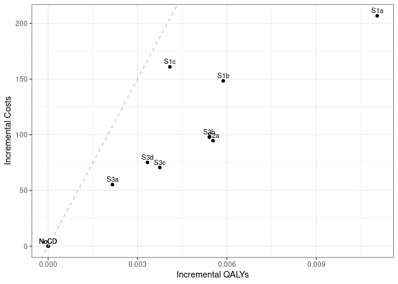

Case Detection Scenario Main Analysis
================
05 September, 2024

    ## 
    ## > errors<-c(
    ## +   ERR_INCORRECT_SETTING_VARIABLE=-1,
    ## +   ERR_INCORRECT_VECTOR_SIZE=-2,
    ## +   ERR_INCORRECT_INPUT_VAR=-3,
    ## +   ERR_EVENT_STACK_FULL=-4,
    ## +   .... [TRUNCATED] 
    ## 
    ## > record_mode<-c(
    ## +   record_mode_none=0,
    ## +   record_mode_agent=1,
    ## +   record_mode_event=2,
    ## +   record_mode_some_event=3
    ## + )
    ## 
    ## > agent_creation_mode<-c(
    ## +   agent_creation_mode_one=0,
    ## +   agent_creation_mode_all=1,
    ## +   agent_creation_mode_pre=2
    ## + )
    ## 
    ## > medication_classes<-c(
    ## +   MED_CLASS_SABA=1,
    ## +   MED_CLASS_LABA=2,
    ## +   MED_CLASS_LAMA=4,
    ## +   MED_CLASS_ICS=8,
    ## +   MED_CLASS_MACRO=16
    ## + )
    ## 
    ## > events<-c(
    ## +     event_start=0,
    ## +     event_fixed=1,
    ## +     event_birthday=2,
    ## +     event_smoking_change=3,
    ## +     event_COPD=4,
    ## +     event_exacerbat .... [TRUNCATED]

``` r
# CHANGE: Add a timer (will see addition below to print time too)
# Start timer
start.time <- Sys.time()
```

``` r
# CHANGE: Add save paths (will see later, we also add lines to save to csv)
outputs <- "../outputs/"
files <- list(
  s1 = "s1_5y.csv",
  s2 = "s2_5y.csv",
  s3 = "s3_5y.csv",
  sall = "sall_5y.csv",
  ceplane = "ceplane_5y.csv",
  clinical = "clinicalresults_5y.csv"
)

# Apply file.path to each element in list to create path to file in outputs
paths <- lapply(files, function(filename) file.path(outputs, filename))
```

    ## Initializing the session

    ## [1] 0

**Global inputs:**

  - Medication adherence is 0.7
  - Smoking adherence is 0.7
  - Cost discounting: 0.015
  - QALY discounting: 0.015
  - Time horizon: 20
  - The WTP threshold for NMB is 50000

**Case detection inputs:**

  - Case detection occurs at 5 year intervals.
  - An outpatient diagnosis costs 61.18
  - The utility gain due to symptom relief from treatment is 0.0367

## S1 All patients scenario

All patients are eligible. The cost of case detection is:

| None | CDQ17 | FlowMeter | FlowMeter\_CDQ |
| ---: | ----: | --------: | -------------: |
|    0 | 11.56 |     30.46 |          42.01 |

#### S1NoCD2: No Case detection- Other time interval

    ## [1] 0

    ## Terminating the session

    ## [1] 0

#### S1NoCD: No Case detection

    ## Initializing the session

    ## [1] 0

    ## [1] 0

    ## Terminating the session

    ## [1] 0

#### S1A: CDQ ≥17 points

    ## Initializing the session

    ## [1] 0

    ## [1] 0

    ## Terminating the session

    ## [1] 0

#### S1B: Screening Spirometry with BD

    ## Initializing the session

    ## [1] 0

    ## [1] 0

    ## Terminating the session

    ## [1] 0

#### S1C: CDQ ≥17 points and Screening Spirometry with BD

    ## Initializing the session

    ## [1] 0

    ## [1] 0

    ## Terminating the session

    ## [1] 0

| Scenario  | Agents | PatientYears | CopdPYs | NCaseDetections | DiagnosedPYs | OverdiagnosedPYs |  SABA |  LAMA | LAMALABA | ICSLAMALABA |   Mild | Moderate | Severe | VerySevere | MildPY | ModeratePY | SeverePY | VerySeverePY |   NoCOPD |  GOLD1 |    GOLD2 |    GOLD3 |   GOLD4 |       Cost | CostpAgent |    QALY | QALYpAgent |      NMB | IncrementalCosts | IncrementalQALY |      ICER | IncrementalNMB |
| :-------- | -----: | -----------: | ------: | --------------: | -----------: | ---------------: | ----: | ----: | -------: | ----------: | -----: | -------: | -----: | ---------: | -----: | ---------: | -------: | -----------: | -------: | -----: | -------: | -------: | ------: | ---------: | ---------: | ------: | ---------: | -------: | ---------------: | --------------: | --------: | -------------: |
| S1NoCD2   | 743128 |     12498758 | 1421786 |         3814132 |     262262.1 |         267345.0 | 0.017 | 0.136 |    0.151 |       0.080 | 307237 |  58063.0 |  97203 |     8413.0 |  0.216 |      0.041 |    0.068 |        0.006 | 10529668 | 577647 | 613813.0 | 136603.0 | 24218.0 | 1600395858 |   2153.594 | 9317379 |     12.538 | 624749.1 |            0.000 |           0.000 |       NaN |          0.000 |
| S1NoCD    | 743351 |     12502871 | 1416604 |         2490059 |     266540.8 |         326548.0 | 0.021 | 0.136 |    0.152 |       0.080 | 305047 |  57264.0 |  96853 |     8544.0 |  0.215 |      0.040 |    0.068 |        0.006 | 10538283 | 575003 | 611602.0 | 137564.0 | 23387.0 | 1598537028 |   2150.447 | 9320810 |     12.539 | 624794.9 |            0.000 |           0.000 |       NaN |          0.000 |
| S1NoCDAvg | 743240 |     12500814 | 1419195 |         3152096 |     264401.5 |         296946.5 | 0.019 | 0.136 |    0.152 |       0.080 | 306142 |  57663.5 |  97028 |     8478.5 |  0.216 |      0.041 |    0.068 |        0.006 | 10533976 | 576325 | 612707.5 | 137083.5 | 23802.5 | 1599466443 |   2152.020 | 9319095 |     12.538 | 624772.0 |            0.000 |           0.000 |       NaN |          0.000 |
| S1a       | 744354 |     12532134 | 1425989 |         2457274 |     571835.4 |         326319.0 | 0.028 | 0.155 |    0.274 |       0.090 | 300088 |  56736.0 |  95847 |     8244.0 |  0.210 |      0.040 |    0.067 |        0.006 | 10557270 | 581884 | 613563.0 | 137615.0 | 23313.0 | 1752926443 |   2354.963 | 9349016 |     12.560 | 625640.3 |          204.516 |           0.021 |  9739.527 |        845.413 |
| S1b       | 744122 |     12527982 | 1429938 |         2475394 |     422558.0 |         327263.0 | 0.024 | 0.146 |    0.216 |       0.087 | 304696 |  57169.0 |  97097 |     8371.0 |  0.213 |      0.040 |    0.068 |        0.006 | 10550106 | 582747 | 615511.0 | 137592.0 | 24234.0 | 1719863654 |   2311.266 | 9342006 |     12.554 | 625408.8 |          160.819 |           0.015 | 10379.531 |        613.872 |
| S1c       | 744408 |     12523569 | 1426705 |         2481953 |     366887.9 |         327543.0 | 0.023 | 0.141 |    0.194 |       0.083 | 305511 |  56971.0 |  95940 |     8226.0 |  0.214 |      0.040 |    0.067 |        0.006 | 10548830 | 581922 | 613367.0 | 136806.0 | 24671.0 | 1712210641 |   2300.097 | 9338065 |     12.544 | 624914.1 |          149.650 |           0.005 | 27838.899 |        119.129 |

*Treatment rate:* SABA is expressed per all patient-years, LAMA,
LAMA/LABA, ICS/LAMA/LABA are per COPD patient-years *Exacerbations:*
Total exacerbations and rate per COPD patient-year: *GOLD Stage:*
Cumulative patient-years *Cost/QALY:* Total cost and QALYs *NMB:* Net
Monetary Benefit is calculated as QALY per patient-year \* Lamba - Cost
per patient-year

-----

## S2 Symptomatic patients scenario

Patients with symptoms at year 1 are eligible. The cost of case
detection is:

    ## Initializing the session

    ## [1] 0

| None | FlowMeter |
| ---: | --------: |
|    0 |     24.33 |

#### S2NoCD: No Case detection

    ## [1] 0

    ## Terminating the session

    ## [1] 0

#### S2a: Screening Spirometry without BD

    ## Initializing the session

    ## [1] 0

    ## [1] 0

    ## Terminating the session

    ## [1] 0

| Scenario | Agents | PatientYears |   CopdPYs | NCaseDetections | DiagnosedPYs | OverdiagnosedPYs |  SABA |  LAMA | LAMALABA | ICSLAMALABA |   Mild | Moderate | Severe | VerySevere | MildPY | ModeratePY | SeverePY | VerySeverePY |  NoCOPD |  GOLD1 |  GOLD2 |  GOLD3 | GOLD4 |       Cost | CostpAgent |    QALY | QALYpAgent |      NMB | IncrementalCosts | IncrementalQALY |     ICER | IncrementalNMB |
| :------- | -----: | -----------: | --------: | --------------: | -----------: | ---------------: | ----: | ----: | -------: | ----------: | -----: | -------: | -----: | ---------: | -----: | ---------: | -------: | -----------: | ------: | -----: | -----: | -----: | ----: | ---------: | ---------: | ------: | ---------: | -------: | ---------------: | --------------: | -------: | -------------: |
| S2NoCD   | 441928 |      7297147 | 1006399.3 |         1451115 |     196458.2 |           189364 | 0.021 | 0.143 |    0.161 |       0.088 | 229866 |    42583 |  71068 |       6045 |  0.228 |      0.042 |    0.071 |        0.006 | 5979065 | 373031 | 452552 | 111082 | 20415 | 1179924911 |   2669.948 | 5422979 |     12.271 | 610889.1 |            0.000 |           0.000 |      NaN |          0.000 |
| S2a      | 441121 |      7288287 |  997037.5 |         1433110 |     323817.8 |           189564 | 0.025 | 0.154 |    0.243 |       0.095 | 224659 |    41635 |  70018 |       5850 |  0.225 |      0.042 |    0.070 |        0.006 | 5979711 | 367437 | 448653 | 111244 | 20854 | 1240789795 |   2812.811 | 5419996 |     12.287 | 611530.7 |          142.862 |           0.016 | 9106.416 |        641.542 |

*Treatment rate:* SABA is expressed per all patient-years, LAMA,
LAMA/LABA, ICS/LAMA/LABA are per COPD patient-years *Exacerbations:*
Total exacerbations and rate per COPD patient-year: *GOLD Stage:*
Cumulative patient-years *Cost/QALY:* Total cost and QALYs *NMB:* Net
Monetary Benefit is calculated as QALY per patient-year \* Lamba - Cost
per patient-year

-----

## S3 Smoking history scenario

Ever smokers ≥50 years of age are eligible. The cost of case detection
is:

    ## Initializing the session

    ## [1] 0

| None | CDQ195 | CDQ165 | FlowMeter | FlowMeter\_CDQ |
| ---: | -----: | -----: | --------: | -------------: |
|    0 |  11.56 |  11.56 |     24.33 |          42.01 |

#### S3NoCD: No Case detection

    ## [1] 0

    ## Terminating the session

    ## [1] 0

#### S3a: CDQ ≥19.5 points

    ## Initializing the session

    ## [1] 0

    ## [1] 0

    ## Terminating the session

    ## [1] 0

#### S3b: CDQ ≥16.5 points

    ## Initializing the session

    ## [1] 0

    ## [1] 0

    ## Terminating the session

    ## [1] 0

#### S3c: Screening spirometry without BD

    ## Initializing the session

    ## [1] 0

    ## [1] 0

    ## Terminating the session

    ## [1] 0

#### S3d: Screening Spirometry with BD + CDQ ≥17 points

    ## Initializing the session

    ## [1] 0

    ## [1] 0

    ## Terminating the session

    ## [1] 0

| Scenario | Agents | PatientYears |  CopdPYs | NCaseDetections | DiagnosedPYs | OverdiagnosedPYs |  SABA |  LAMA | LAMALABA | ICSLAMALABA |   Mild | Moderate | Severe | VerySevere | MildPY | ModeratePY | SeverePY | VerySeverePY |  NoCOPD |  GOLD1 |  GOLD2 | GOLD3 | GOLD4 |       Cost | CostpAgent |    QALY | QALYpAgent |      NMB | IncrementalCosts | IncrementalQALY |       ICER | IncrementalNMB |
| :------- | -----: | -----------: | -------: | --------------: | -----------: | ---------------: | ----: | ----: | -------: | ----------: | -----: | -------: | -----: | ---------: | -----: | ---------: | -------: | -----------: | ------: | -----: | -----: | ----: | ----: | ---------: | ---------: | ------: | ---------: | -------: | ---------------: | --------------: | ---------: | -------------: |
| S3NoCD   | 344713 |      5200048 | 835154.9 |         1048581 |     156991.1 |           142750 | 0.022 | 0.137 |    0.154 |       0.086 | 194021 |    36328 |  60216 |       5242 |  0.232 |      0.043 |    0.072 |        0.006 | 4147281 | 306969 | 374604 | 95176 | 18190 |  996287204 |   2890.193 | 3873367 |     11.236 | 558934.7 |            0.000 |           0.000 |        NaN |          0.000 |
| S3a      | 344831 |      5199692 | 835367.3 |         1042828 |     203927.2 |           141521 | 0.024 | 0.142 |    0.190 |       0.090 | 193390 |    36056 |  60945 |       5228 |  0.232 |      0.043 |    0.073 |        0.006 | 4146632 | 305429 | 376133 | 96215 | 17350 | 1045268642 |   3031.249 | 3874091 |     11.235 | 558706.4 |          141.056 |         \-0.002 | \-80779.77 |      \-228.365 |
| S3b      | 344259 |      5196885 | 830288.8 |         1030224 |     297339.9 |           141051 | 0.029 | 0.153 |    0.257 |       0.097 | 189741 |    35595 |  60328 |       5233 |  0.229 |      0.043 |    0.073 |        0.006 | 4148597 | 303987 | 371394 | 96797 | 18159 | 1074556989 |   3121.362 | 3874191 |     11.254 | 559564.2 |          231.169 |           0.017 |   13429.70 |        629.494 |
| S3c      | 344359 |      5197169 | 829965.9 |         1037057 |     246176.6 |           140368 | 0.026 | 0.146 |    0.222 |       0.092 | 192149 |    35531 |  59930 |       5109 |  0.232 |      0.043 |    0.072 |        0.006 | 4149284 | 303121 | 373176 | 95597 | 17963 | 1045425869 |   3035.860 | 3873257 |     11.248 | 559350.7 |          145.667 |           0.011 |   12968.14 |        415.968 |
| S3d      | 343958 |      5184302 | 827278.1 |         1036861 |     225335.3 |           142808 | 0.025 | 0.144 |    0.208 |       0.090 | 192134 |    35660 |  59725 |       5223 |  0.232 |      0.043 |    0.072 |        0.006 | 4139446 | 300813 | 373295 | 95751 | 17340 | 1047428798 |   3045.223 | 3863483 |     11.232 | 558576.1 |          155.030 |         \-0.004 | \-38068.15 |      \-358.651 |

*Treatment rate:* SABA is expressed per all patient-years, LAMA,
LAMA/LABA, ICS/LAMA/LABA are per COPD patient-years *Exacerbations:*
Total exacerbations and rate per COPD patient-year *GOLD Stage:*
Cumulative patient-years *Cost/QALY:* Total cost and QALYs *NMB:* Net
Monetary Benefit is calculated as QALY per patient-year \* Lamba - Cost
per patient-year

-----

## All Scenarios

*Ordered by descending Net Monetary Benefit*

| Scenario | Agents |       Cost | CostpAgent |    QALY | QALYpAgent |        ICER | IncrementalNMB |
| :------- | -----: | ---------: | ---------: | ------: | ---------: | ----------: | -------------: |
| S1a      | 744354 | 1752926443 |   2354.963 | 9349016 |     12.560 |    9739.527 |        845.413 |
| S2a      | 441121 | 1240789795 |   2812.811 | 5419996 |     12.287 |    9106.416 |        641.542 |
| S3b      | 344259 | 1074556989 |   3121.362 | 3874191 |     11.254 |   13429.701 |        629.494 |
| S1b      | 744122 | 1719863654 |   2311.266 | 9342006 |     12.554 |   10379.531 |        613.872 |
| S3c      | 344359 | 1045425869 |   3035.860 | 3873257 |     11.248 |   12968.139 |        415.968 |
| S1c      | 744408 | 1712210641 |   2300.097 | 9338065 |     12.544 |   27838.899 |        119.129 |
| S1NoCD   | 743351 | 1598537028 |   2150.447 | 9320810 |     12.539 |         NaN |          0.000 |
| S2NoCD   | 441928 | 1179924911 |   2669.948 | 5422979 |     12.271 |         NaN |          0.000 |
| S3NoCD   | 344713 |  996287204 |   2890.193 | 3873367 |     11.236 |         NaN |          0.000 |
| S3a      | 344831 | 1045268642 |   3031.249 | 3874091 |     11.235 | \-80779.766 |      \-228.365 |
| S3d      | 343958 | 1047428798 |   3045.223 | 3863483 |     11.232 | \-38068.150 |      \-358.651 |

-----

## Cost Effectiveness Plane

Adjusted to the total population

| Scenario  | Agents | PropAgents |       Cost | CostpAgent | CostpAgentExcluded | CostpAgentAll |    QALY | QALYpAgent | QALYpAgentExcluded | QALYpAgentAll | IncrementalCosts | IncrementalQALY |     ICERAdj |        ICER |         INMB |
| :-------- | -----: | ---------: | ---------: | ---------: | -----------------: | ------------: | ------: | ---------: | -----------------: | ------------: | ---------------: | --------------: | ----------: | ----------: | -----------: |
| S1NoCDAvg | 743240 |  1.0000000 | 1599466443 |   2152.020 |              0.000 |      2152.020 | 9319095 |   12.53848 |            0.00000 |      12.53848 |          0.00000 |       0.0000000 |         NaN |         NaN |     0.000000 |
| S1a       | 744354 |  1.0000000 | 1752926443 |   2354.963 |              0.000 |      2354.963 | 9349016 |   12.55991 |            0.00000 |      12.55991 |        202.94319 |       0.0214250 |    9472.245 |    9739.527 |   868.308574 |
| S1b       | 744122 |  1.0000000 | 1719863654 |   2311.266 |              0.000 |      2311.266 | 9342006 |   12.55440 |            0.00000 |      12.55440 |        159.24546 |       0.0159203 |   10002.688 |   10379.531 |   636.767913 |
| S1c       | 744408 |  1.0000000 | 1712210641 |   2300.097 |              0.000 |      2300.097 | 9338065 |   12.54428 |            0.00000 |      12.54428 |        148.07681 |       0.0058020 |   25521.605 |   27838.899 |   142.024090 |
| S2NoCD    | 441928 |  0.5945966 | 1179924911 |   2669.948 |           1392.382 |      2152.019 | 5422979 |   12.27118 |           12.93050 |      12.53847 |          0.00000 |       0.0000000 |         NaN |         NaN |   \-0.420303 |
| S2a       | 441121 |  0.5935108 | 1240789795 |   2812.811 |           1392.382 |      2235.422 | 5419996 |   12.28687 |           12.93050 |      12.54850 |         83.40312 |       0.0100269 |    8317.911 |    9106.416 |   417.523169 |
| S3NoCD    | 344713 |  0.4637977 |  996287204 |   2890.193 |           1513.522 |      2152.019 | 3873367 |   11.23650 |           13.66464 |      12.53847 |          0.00000 |       0.0000000 |         NaN |         NaN |   \-0.420303 |
| S3a       | 344831 |  0.4639565 | 1045268642 |   3031.249 |           1513.522 |      2217.681 | 3874091 |   11.23475 |           13.66464 |      12.53728 |         65.66229 |     \-0.0011957 | \-54917.558 | \-80779.766 | \-125.865199 |
| S3b       | 344259 |  0.4631869 | 1074556989 |   3121.362 |           1513.522 |      2258.252 | 3874191 |   11.25371 |           13.66464 |      12.54793 |        106.23342 |       0.0094562 |   11234.316 |   13429.701 |   366.153959 |
| S3c       | 344359 |  0.4633214 | 1045425869 |   3035.860 |           1513.522 |      2218.854 | 3873257 |   11.24773 |           13.66464 |      12.54483 |         66.83501 |       0.0063609 |   10507.238 |   12968.139 |   250.787397 |
| S3d       | 343958 |  0.4627819 | 1047428798 |   3045.223 |           1513.522 |      2222.365 | 3863483 |   11.23243 |           13.66464 |      12.53905 |         70.34646 |       0.0005819 |  120887.662 | \-38068.150 |  \-41.670964 |

<!-- -->

## Clinical Results for all scenarios

Adjusted to the total population

| Scenario  | PropAgents | ProppPatientYears | ProppCopdPYs |   SABAAll |   LAMAAll | LAMALABAAll | ICSLAMALABAAll | MildpAgentAll | ModeratepAgentAll | SeverepAgentAll | VerySeverepAgentAll | NoCOPDpPYAll | GOLD1pPYAll | GOLD2pPYAll | GOLD3pPYAll | GOLD4pPYAll | DiagnosedpPYAll |
| :-------- | ---------: | ----------------: | -----------: | --------: | --------: | ----------: | -------------: | ------------: | ----------------: | --------------: | ------------------: | -----------: | ----------: | ----------: | ----------: | ----------: | --------------: |
| S1NoCDAvg |  1.0000000 |         1.0000000 |    1.0000000 | 0.0190266 | 0.1357432 |   0.1515257 |      0.0801041 |     0.4119019 |         0.0775840 |       0.1305473 |           0.0114075 |    0.8426631 |   0.0461030 |   0.0490134 |   0.0109660 |   0.0019041 |       0.1863039 |
| S1a       |  1.0000000 |         1.0000000 |    1.0000000 | 0.0278205 | 0.1549268 |   0.2739394 |      0.0902570 |     0.4031523 |         0.0762218 |       0.1287653 |           0.0110754 |    0.8424160 |   0.0464314 |   0.0489592 |   0.0109810 |   0.0018603 |       0.4010097 |
| S1b       |  1.0000000 |         1.0000000 |    1.0000000 | 0.0240794 | 0.1461848 |   0.2160964 |      0.0866929 |     0.4094705 |         0.0768275 |       0.1304853 |           0.0112495 |    0.8421234 |   0.0465156 |   0.0491309 |   0.0109828 |   0.0019344 |       0.2955079 |
| S1c       |  1.0000000 |         1.0000000 |    1.0000000 | 0.0229460 | 0.1408864 |   0.1937615 |      0.0826191 |     0.4104080 |         0.0765320 |       0.1288809 |           0.0110504 |    0.8423182 |   0.0464661 |   0.0489770 |   0.0109239 |   0.0019700 |       0.2571576 |
| S2NoCD    |  0.5945966 |         0.5837337 |    0.7091341 | 0.0190266 | 0.1357432 |   0.1515257 |      0.0801041 |     0.4119019 |         0.0775840 |       0.1305473 |           0.0114075 |    0.8426631 |   0.0461030 |   0.0490134 |   0.0109660 |   0.0019041 |       0.1863039 |
| S2a       |  0.5935108 |         0.5830250 |    0.7025376 | 0.0213314 | 0.1430966 |   0.2086117 |      0.0845276 |     0.4051710 |         0.0763628 |       0.1292281 |           0.0111539 |    0.8433352 |   0.0456832 |   0.0487233 |   0.0109825 |   0.0019397 |       0.2771304 |
| S3NoCD    |  0.4637977 |         0.4159768 |    0.5884711 | 0.0190266 | 0.1357432 |   0.1515257 |      0.0801041 |     0.4119019 |         0.0775840 |       0.1305473 |           0.0114075 |    0.8426631 |   0.0461030 |   0.0490134 |   0.0109660 |   0.0019041 |       0.1863039 |
| S3a       |  0.4639565 |         0.4159482 |    0.5886207 | 0.0197871 | 0.1389891 |   0.1723270 |      0.0819583 |     0.4110083 |         0.0772095 |       0.1315135 |           0.0113874 |    0.8426362 |   0.0459809 |   0.0491366 |   0.0110492 |   0.0018369 |       0.2193488 |
| S3b       |  0.4631869 |         0.4157237 |    0.5850423 | 0.0216425 | 0.1451569 |   0.2116335 |      0.0865639 |     0.4063152 |         0.0766304 |       0.1307544 |           0.0114003 |    0.8429898 |   0.0458738 |   0.0487649 |   0.0110971 |   0.0019018 |       0.2858278 |
| S3c       |  0.4633214 |         0.4157464 |    0.5848147 | 0.0205523 | 0.1408712 |   0.1912217 |      0.0835540 |     0.4095172 |         0.0765371 |       0.1302065 |           0.0112324 |    0.8430249 |   0.0458037 |   0.0489067 |   0.0110010 |   0.0018861 |       0.2498187 |
| S3d       |  0.4627819 |         0.4147172 |    0.5829209 | 0.0203317 | 0.1398437 |   0.1826426 |      0.0823006 |     0.4096488 |         0.0767396 |       0.1299805 |           0.0113902 |    0.8431383 |   0.0456570 |   0.0489498 |   0.0110192 |   0.0018370 |       0.2354817 |

## Time elapsed

Run time for this notebook:

``` r
end.time <- Sys.time()
time.taken <- end.time - start.time
time.taken
```

    ## Time difference of 17.12115 mins
