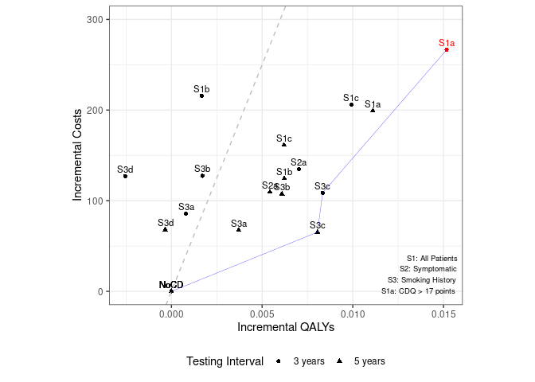
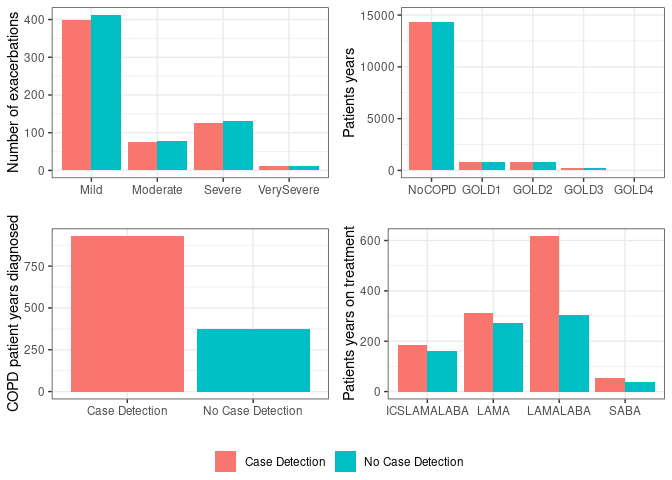
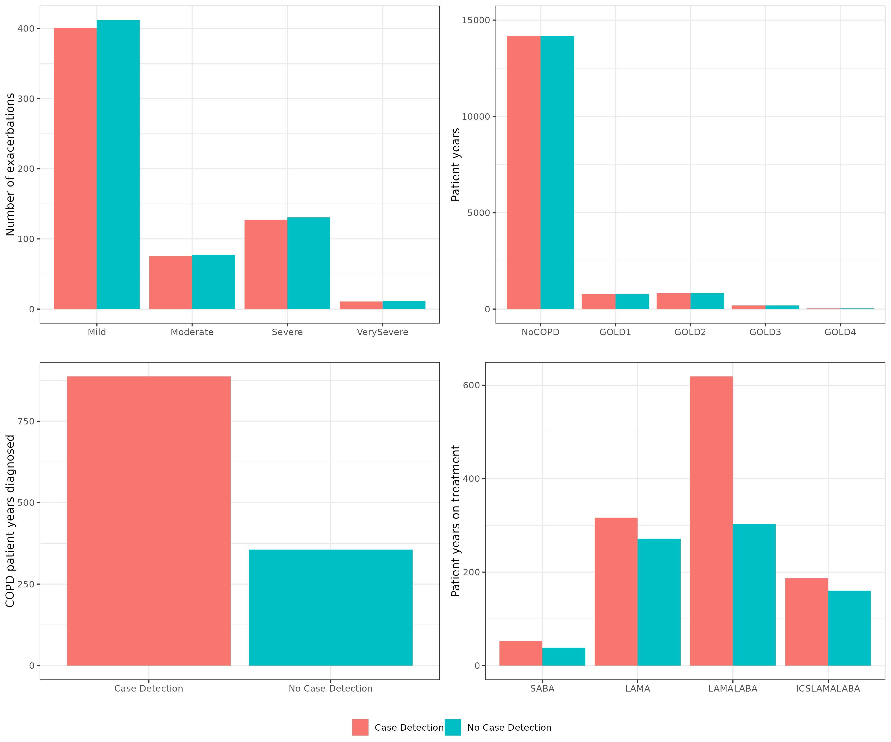

Process Model Results
================
10 September, 2024

This file processes the model results so they match up as closely as
possible to those in the publication.

``` r
# Clear environment before start
rm(list=ls())

# Set save location for figures generated when knit rmd
knitr::opts_chunk$set(fig.path = "../outputs/")

# Load required libraries
library(dplyr)
library(ggplot2)
library(ggpubr)
```

## Define file paths and import files

``` r
paths <- list(
  # Model results
  s1 = "../outputs/s1.csv",
  sall_3y = "../outputs/sall.csv",
  sall_5y = "../outputs/sall_5y.csv",
  ceplane_3y = "../outputs/ceplane.csv",
  ceplane_5y = "../outputs/ceplane_5y.csv",
  clinical = "../outputs/clinicalresults.csv",

  # Original study results
  paper_tab3 = "../../original_study/tab3.csv",
  original_sall = "../../original_study/sall.csv",
  original_ceplane = "../../original_study/ceplane.csv",

  # Outputs from this .Rmd file
  tab3_compare = "../outputs/tab3_compare_to_original.csv",
  fig3 = "../outputs/fig3-1.png",
  apx6v1 = "../outputs/appendix6v1-1.png",
  apx6v2 = "../outputs/appendix6v2-1.png"
)
```

``` r
s1 <- read.csv(paths$s1)
sall_3y <- read.csv(paths$sall_3y) %>% mutate("Interval" = "3 years")
sall_5y <- read.csv(paths$sall_5y) %>% mutate("Interval" = "5 years")
ceplane_3y <- read.csv(paths$ceplane_3y) %>% mutate("Interval" = "3 years")
ceplane_5y <- read.csv(paths$ceplane_5y) %>% mutate("Interval" = "5 years")
clinical <- read.csv(paths$clinical)

paper_tab3 <- read.csv(paths$paper_tab3)
original_sall <- read.csv(paths$original_sall)
original_ceplane <- read.csv(paths$original_ceplane)
```

## Table 3

Preview the results.

``` r
rbind(ceplane_3y, ceplane_5y) %>%
  arrange(Scenario)
```

<div class="kable-table">

| Scenario  | Agents | PropAgents |      Cost | CostpAgent | CostpAgentExcluded | CostpAgentAll |    QALY | QALYpAgent | QALYpAgentExcluded | QALYpAgentAll | IncrementalCosts | IncrementalQALY |     ICERAdj |       ICER |       INMB | Interval |
|:----------|-------:|-----------:|----------:|-----------:|-------------------:|--------------:|--------:|-----------:|-------------------:|--------------:|-----------------:|----------------:|------------:|-----------:|-----------:|:---------|
| S1NoCDAvg | 371714 |  1.0000000 | 800943990 |   2154.732 |              0.000 |      2154.732 | 4662659 |   12.54367 |            0.00000 |      12.54367 |          0.00000 |       0.0000000 |          NA |         NA |    0.00000 | 3 years  |
| S1NoCDAvg | 371714 |  1.0000000 | 800943990 |   2154.732 |              0.000 |      2154.732 | 4662659 |   12.54367 |            0.00000 |      12.54367 |          0.00000 |       0.0000000 |          NA |         NA |    0.00000 | 5 years  |
| S1a       | 371902 |  1.0000000 | 900481317 |   2421.287 |              0.000 |      2421.287 | 4670660 |   12.55885 |            0.00000 |      12.55885 |        266.55473 |       0.0151739 |   17566.697 |   16195.98 |  492.13863 | 3 years  |
| S1a       | 371757 |  1.0000000 | 875098848 |   2353.954 |              0.000 |      2353.954 | 4667327 |   12.55478 |            0.00000 |      12.55478 |        199.22209 |       0.0111061 |   17938.013 |   20430.79 |  356.08493 | 5 years  |
| S1b       | 372140 |  1.0000000 | 882188218 |   2370.582 |              0.000 |      2370.582 | 4668622 |   12.54534 |            0.00000 |      12.54534 |        215.84971 |       0.0016653 |  129616.173 |   67189.32 | -132.58475 | 3 years  |
| S1b       | 372238 |  1.0000000 | 848458397 |   2279.344 |              0.000 |      2279.344 | 4671548 |   12.54989 |            0.00000 |      12.54989 |        124.61202 |       0.0062224 |   20026.206 |   25910.57 |  186.51036 | 5 years  |
| S1c       | 371919 |  1.0000000 | 878053058 |   2360.872 |              0.000 |      2360.872 | 4668922 |   12.55360 |            0.00000 |      12.55360 |        206.13991 |       0.0099270 |   20765.538 |   18321.20 |  290.21108 | 3 years  |
| S1c       | 371786 |  1.0000000 | 861061064 |   2316.013 |              0.000 |      2316.013 | 4665869 |   12.54988 |            0.00000 |      12.54988 |        161.28077 |       0.0062057 |   25989.087 |   34018.45 |  149.00479 | 5 years  |
| S2NoCD    | 219759 |  0.5912045 | 592355610 |   2695.478 |           1372.698 |      2154.732 | 2696622 |   12.27081 |           12.93828 |      12.54367 |          0.00000 |       0.0000000 |          NA |         NA |    0.00000 | 3 years  |
| S2NoCD    | 220397 |  0.5929209 | 590082859 |   2677.363 |           1393.506 |      2154.732 | 2704639 |   12.27167 |           12.93985 |      12.54367 |          0.00000 |       0.0000000 |          NA |         NA |    0.00000 | 5 years  |
| S2a       | 221233 |  0.5951699 | 644478701 |   2913.122 |           1372.698 |      2289.512 | 2718304 |   12.28707 |           12.93828 |      12.55070 |        134.78032 |       0.0070259 |   19183.268 |   13391.77 |  216.51625 | 3 years  |
| S2a       | 220997 |  0.5945350 | 631718348 |   2858.493 |           1393.506 |      2264.492 | 2714422 |   12.28262 |           12.93985 |      12.54910 |        109.76015 |       0.0054317 |   20207.186 |   16541.19 |  161.82679 | 5 years  |
| S3NoCD    | 172154 |  0.4631356 | 494403150 |   2871.866 |           1536.084 |      2154.732 | 1934054 |   11.23444 |           13.67310 |      12.54367 |          0.00000 |       0.0000000 |          NA |         NA |    0.00000 | 3 years  |
| S3NoCD    | 172607 |  0.4643543 | 500398655 |   2899.064 |           1509.466 |      2154.732 | 1937979 |   11.22769 |           13.68450 |      12.54367 |          0.00000 |       0.0000000 |          NA |         NA |    0.00000 | 5 years  |
| S3a       | 172660 |  0.4644969 | 527017592 |   3052.343 |           1536.084 |      2240.382 | 1941269 |   11.24331 |           13.67310 |      12.54447 |         85.64968 |       0.0007989 |  107210.069 |   20354.54 |  -45.70489 | 3 years  |
| S3a       | 172800 |  0.4648735 | 525843604 |   3043.076 |           1509.466 |      2222.401 | 1941999 |   11.23842 |           13.68450 |      12.54738 |         67.66929 |       0.0037114 |   18232.598 |   13424.30 |  117.90297 | 5 years  |
| S3b       | 172336 |  0.4636253 | 542053886 |   3145.332 |           1536.084 |      2282.172 | 1937179 |   11.24071 |           13.67310 |      12.54539 |        127.43983 |       0.0017135 |   74374.400 |   43606.19 |  -41.76530 | 3 years  |
| S3b       | 172689 |  0.4645749 | 540529545 |   3130.075 |           1509.466 |      2262.361 | 1941365 |   11.24197 |           13.68450 |      12.54976 |        107.62875 |       0.0060916 |   17668.318 |   16178.59 |  196.95245 | 5 years  |
| S3c       | 172314 |  0.4635661 | 535046632 |   3105.068 |           1536.084 |      2263.411 | 1939341 |   11.25469 |           13.67310 |      12.55201 |        108.67955 |       0.0083369 |   13035.890 |   11516.85 |  308.16789 | 3 years  |
| S3c       | 172313 |  0.4635634 | 524243526 |   3042.391 |           1509.466 |      2220.074 | 1936949 |   11.24088 |           13.68450 |      12.55173 |         65.34232 |       0.0080535 |    8113.511 |   10873.57 |  337.33362 | 5 years  |
| S3d       | 172882 |  0.4650941 | 542727747 |   3139.296 |           1536.084 |      2281.728 | 1943060 |   11.23922 |           13.67310 |      12.54112 |        126.99637 |      -0.0025512 |  -49778.541 |   55904.12 | -254.55773 | 3 years  |
| S3d       | 172648 |  0.4644646 | 525750686 |   3045.217 |           1509.466 |      2222.768 | 1938413 |   11.22755 |           13.68450 |      12.54333 |         68.03656 |      -0.0003403 | -199908.462 | -978806.42 |  -85.05349 | 5 years  |

</div>

Combine, organise and modify results as per paper.

``` r
ceplane <- rbind(ceplane_3y, ceplane_5y) %>%
  # Remove scenarios 2 and 3 with no case detection, and scenario 2b
  filter(!(Scenario %in% c("S2NoCD", "S3NoCD", "S2b"))) %>%
  # Remove S1NoCDAvg from 5 years, then set interval of S1NoCDAvg to NA
  filter(!(Scenario == "S1NoCDAvg" & Interval == "5 years")) %>%
  mutate(Interval = ifelse(Scenario == "S1NoCDAvg", NA, Interval)) %>%
  # Remove INMB for S1NoCDAvg
  mutate(INMB = ifelse(Scenario!="S1NoCDAvg", INMB, NA)) %>%
  # Get INMB ranking
  mutate(Ranking = min_rank(desc(INMB)))

ceplane %>% arrange(Scenario)
```

<div class="kable-table">

| Scenario  | Agents | PropAgents |      Cost | CostpAgent | CostpAgentExcluded | CostpAgentAll |    QALY | QALYpAgent | QALYpAgentExcluded | QALYpAgentAll | IncrementalCosts | IncrementalQALY |     ICERAdj |       ICER |       INMB | Interval | Ranking |
|:----------|-------:|-----------:|----------:|-----------:|-------------------:|--------------:|--------:|-----------:|-------------------:|--------------:|-----------------:|----------------:|------------:|-----------:|-----------:|:---------|--------:|
| S1NoCDAvg | 371714 |  1.0000000 | 800943990 |   2154.732 |              0.000 |      2154.732 | 4662659 |   12.54367 |            0.00000 |      12.54367 |          0.00000 |       0.0000000 |          NA |         NA |         NA | NA       |      NA |
| S1a       | 371902 |  1.0000000 | 900481317 |   2421.287 |              0.000 |      2421.287 | 4670660 |   12.55885 |            0.00000 |      12.55885 |        266.55473 |       0.0151739 |   17566.697 |   16195.98 |  492.13863 | 3 years  |       1 |
| S1a       | 371757 |  1.0000000 | 875098848 |   2353.954 |              0.000 |      2353.954 | 4667327 |   12.55478 |            0.00000 |      12.55478 |        199.22209 |       0.0111061 |   17938.013 |   20430.79 |  356.08493 | 5 years  |       2 |
| S1b       | 372140 |  1.0000000 | 882188218 |   2370.582 |              0.000 |      2370.582 | 4668622 |   12.54534 |            0.00000 |      12.54534 |        215.84971 |       0.0016653 |  129616.173 |   67189.32 | -132.58475 | 3 years  |      15 |
| S1b       | 372238 |  1.0000000 | 848458397 |   2279.344 |              0.000 |      2279.344 | 4671548 |   12.54989 |            0.00000 |      12.54989 |        124.61202 |       0.0062224 |   20026.206 |   25910.57 |  186.51036 | 5 years  |       8 |
| S1c       | 371919 |  1.0000000 | 878053058 |   2360.872 |              0.000 |      2360.872 | 4668922 |   12.55360 |            0.00000 |      12.55360 |        206.13991 |       0.0099270 |   20765.538 |   18321.20 |  290.21108 | 3 years  |       5 |
| S1c       | 371786 |  1.0000000 | 861061064 |   2316.013 |              0.000 |      2316.013 | 4665869 |   12.54988 |            0.00000 |      12.54988 |        161.28077 |       0.0062057 |   25989.087 |   34018.45 |  149.00479 | 5 years  |      10 |
| S2a       | 221233 |  0.5951699 | 644478701 |   2913.122 |           1372.698 |      2289.512 | 2718304 |   12.28707 |           12.93828 |      12.55070 |        134.78032 |       0.0070259 |   19183.268 |   13391.77 |  216.51625 | 3 years  |       6 |
| S2a       | 220997 |  0.5945350 | 631718348 |   2858.493 |           1393.506 |      2264.492 | 2714422 |   12.28262 |           12.93985 |      12.54910 |        109.76015 |       0.0054317 |   20207.186 |   16541.19 |  161.82679 | 5 years  |       9 |
| S3a       | 172660 |  0.4644969 | 527017592 |   3052.343 |           1536.084 |      2240.382 | 1941269 |   11.24331 |           13.67310 |      12.54447 |         85.64968 |       0.0007989 |  107210.069 |   20354.54 |  -45.70489 | 3 years  |      13 |
| S3a       | 172800 |  0.4648735 | 525843604 |   3043.076 |           1509.466 |      2222.401 | 1941999 |   11.23842 |           13.68450 |      12.54738 |         67.66929 |       0.0037114 |   18232.598 |   13424.30 |  117.90297 | 5 years  |      11 |
| S3b       | 172336 |  0.4636253 | 542053886 |   3145.332 |           1536.084 |      2282.172 | 1937179 |   11.24071 |           13.67310 |      12.54539 |        127.43983 |       0.0017135 |   74374.400 |   43606.19 |  -41.76530 | 3 years  |      12 |
| S3b       | 172689 |  0.4645749 | 540529545 |   3130.075 |           1509.466 |      2262.361 | 1941365 |   11.24197 |           13.68450 |      12.54976 |        107.62875 |       0.0060916 |   17668.318 |   16178.59 |  196.95245 | 5 years  |       7 |
| S3c       | 172314 |  0.4635661 | 535046632 |   3105.068 |           1536.084 |      2263.411 | 1939341 |   11.25469 |           13.67310 |      12.55201 |        108.67955 |       0.0083369 |   13035.890 |   11516.85 |  308.16789 | 3 years  |       4 |
| S3c       | 172313 |  0.4635634 | 524243526 |   3042.391 |           1509.466 |      2220.074 | 1936949 |   11.24088 |           13.68450 |      12.55173 |         65.34232 |       0.0080535 |    8113.511 |   10873.57 |  337.33362 | 5 years  |       3 |
| S3d       | 172882 |  0.4650941 | 542727747 |   3139.296 |           1536.084 |      2281.728 | 1943060 |   11.23922 |           13.67310 |      12.54112 |        126.99637 |      -0.0025512 |  -49778.541 |   55904.12 | -254.55773 | 3 years  |      16 |
| S3d       | 172648 |  0.4644646 | 525750686 |   3045.217 |           1509.466 |      2222.768 | 1938413 |   11.22755 |           13.68450 |      12.54333 |         68.03656 |      -0.0003403 | -199908.462 | -978806.42 |  -85.05349 | 5 years  |      14 |

</div>

Reformat to match paper.

``` r
ceplane_pretty <- ceplane %>%
  # Round columns
  mutate(CostpAgentAll = paste0("$", round(CostpAgentAll, 0))) %>%
  mutate(QALYpAgentAll = round(QALYpAgentAll, 3)) %>%
  mutate(ICERAdj = round(ICERAdj, 0)) %>%
  # Create INMB and rank column
  mutate(INMBRank = ifelse(
    Scenario!="S1NoCDAvg",
    paste0(round(INMB, 0), "(", Ranking, ")"),
    NA)) %>%
  # Arrange and relabel the scenarios
  arrange(Scenario) %>%
  mutate(Scenario = recode(Scenario,
                           "S1NoCDAvg" = "S0: No case detection",
                           "S1a" = "(S1a) CDQ ≥ 17 points",
                           "S1b" = "(S1b) Screening spirometry",
                           "S1c" = "(S1c) CDQ + screening spirometry",
                           "S2a" = "(S2a) Screening spirometry",
                           "S3a" = "(S3a) CDQ ≥ 19.5 points",
                           "S3b" = "(S3b) CDQ ≥ 16.5 points",
                           "S3c" = "(S3c) Screening spirometry",
                           "S3d" = "(S3d) CDQ + screening spirometry")) %>%
  # Select, reorder and relabel columns
  select(Scenario, Interval, CostpAgentAll, QALYpAgentAll, ICERAdj, INMBRank) %>%
  rename("Testing interval" = Interval,
         "Costs per patient" = CostpAgentAll,
         "QALYs per patient" = QALYpAgentAll,
         "ICER" = ICERAdj,
         "INMB (ranking)" = INMBRank)

# Preview dataframe
ceplane_pretty
```

<div class="kable-table">

| Scenario                         | Testing interval | Costs per patient | QALYs per patient |    ICER | INMB (ranking) |
|:---------------------------------|:-----------------|:------------------|------------------:|--------:|:---------------|
| S0: No case detection            | NA               | \$2155            |            12.544 |      NA | NA             |
| (S1a) CDQ ≥ 17 points            | 3 years          | \$2421            |            12.559 |   17567 | 492(1)         |
| (S1a) CDQ ≥ 17 points            | 5 years          | \$2354            |            12.555 |   17938 | 356(2)         |
| (S1b) Screening spirometry       | 3 years          | \$2371            |            12.545 |  129616 | -133(15)       |
| (S1b) Screening spirometry       | 5 years          | \$2279            |            12.550 |   20026 | 187(8)         |
| (S1c) CDQ + screening spirometry | 3 years          | \$2361            |            12.554 |   20766 | 290(5)         |
| (S1c) CDQ + screening spirometry | 5 years          | \$2316            |            12.550 |   25989 | 149(10)        |
| (S2a) Screening spirometry       | 3 years          | \$2290            |            12.551 |   19183 | 217(6)         |
| (S2a) Screening spirometry       | 5 years          | \$2264            |            12.549 |   20207 | 162(9)         |
| (S3a) CDQ ≥ 19.5 points          | 3 years          | \$2240            |            12.544 |  107210 | -46(13)        |
| (S3a) CDQ ≥ 19.5 points          | 5 years          | \$2222            |            12.547 |   18233 | 118(11)        |
| (S3b) CDQ ≥ 16.5 points          | 3 years          | \$2282            |            12.545 |   74374 | -42(12)        |
| (S3b) CDQ ≥ 16.5 points          | 5 years          | \$2262            |            12.550 |   17668 | 197(7)         |
| (S3c) Screening spirometry       | 3 years          | \$2263            |            12.552 |   13036 | 308(4)         |
| (S3c) Screening spirometry       | 5 years          | \$2220            |            12.552 |    8114 | 337(3)         |
| (S3d) CDQ + screening spirometry | 3 years          | \$2282            |            12.541 |  -49779 | -255(16)       |
| (S3d) CDQ + screening spirometry | 5 years          | \$2223            |            12.543 | -199908 | -85(14)        |

</div>

## Figure 3

``` r
# Process data
ceplane_plot <- rbind(ceplane_3y, ceplane_5y) %>%
  # Remove scenario 2b
  filter(!(Scenario == "S2b")) %>%
  # Replace the NoCD results with a single NoCD category
  mutate(Scenario = ifelse(
    Scenario %in% c("S1NoCDAvg", "S2NoCD", "S3NoCD"), "NoCD", Scenario)) %>%
  # Add colour for S1a
  mutate(Colour = ifelse((Scenario == "S1a" & Interval == "3 years"), "A", "B"))
```

Find the efficiency frontier

``` r
# Remove negative QALY and then...
# Find highest ICER and remove those with a QALY less than that but ICER above
find_frontier <- ceplane_plot %>%
  filter(!(IncrementalQALY <= 0)) %>%
  arrange(ICERAdj) %>%
  filter(!(IncrementalQALY <= first(IncrementalQALY) & ICERAdj > first(ICERAdj)))

# Add first row to frontier df, and remove from the other
frontier <- find_frontier[1, , drop=FALSE]
find_frontier <- find_frontier[-1,]

# Repeat that, each time adding to frontier, until there are none remaining after filter
while (nrow(find_frontier) > 0){
  find_frontier <- find_frontier %>%
    arrange(ICERAdj) %>%
    filter(!(IncrementalQALY <= first(IncrementalQALY) & ICERAdj > first(ICERAdj)))
  frontier <- rbind(frontier, find_frontier[1, , drop=FALSE])
  find_frontier <- find_frontier[-1,]
}

# Add NoCD to start of frontier
frontier <- frontier %>%
  select(Scenario, IncrementalCosts, IncrementalQALY) %>%
  add_row(Scenario="NoCD", IncrementalCosts=0, IncrementalQALY=0) %>%
  arrange(IncrementalCosts)
frontier
```

<div class="kable-table">

| Scenario | IncrementalCosts | IncrementalQALY |
|:---------|-----------------:|----------------:|
| NoCD     |          0.00000 |       0.0000000 |
| S3c      |         65.34232 |       0.0080535 |
| S3c      |        108.67955 |       0.0083369 |
| S1a      |        266.55473 |       0.0151739 |

</div>

``` r
# Create plot
ggplot(data=ceplane_plot, aes(x=IncrementalQALY, y=IncrementalCosts)) + 
  geom_point(aes(shape=factor(Interval), colour=factor(Colour))) +
  geom_text(aes(label=Scenario, colour=factor(Colour)),vjust=-0.5, size=3) + 
  geom_abline(intercept=0, slope=50000, colour="grey", linetype="dashed") +
  scale_colour_manual(values=c("red", "black")) +
  theme_bw() +
  labs(x="Incremental QALYs", y="Incremental Costs", shape="Testing Interval") +
  theme(legend.position="bottom") +
  guides(colour="none") +
  # Add the efficiency frontier
  geom_path(data=frontier, aes(x=IncrementalQALY, y=IncrementalCosts),
            colour="blue", linewidth=0.1) +
  # Extend y axis to 300 like original (but x is already wider than original)
  ylim(c(0, 300)) +
  # Make 0 to 0.015 and 0 to 300 a square
  coord_fixed(ratio = (0.015 - 0) / (300 - 0)) +
  annotate(geom="text", x = Inf, y = -Inf,
           label = "S1: All Patients\nS2: Symptomatic\nS3: Smoking History\nS1a: CDQ > 17 points",
           hjust = 1.1, vjust = -0.3, size = 2.5)
```

<!-- -->

``` r
# Not needed if knitting, which will overwrite
ggsave(paths$fig3)
```

    ## Saving 7 x 5 in image

## Appendix 6

Using clinical…

``` r
# Create version of S1 but with scenarios renamed
s1_scen <- clinical %>%
  mutate(Scenario = recode(Scenario,
                           "S1a" = "Case Detection",
                           "S1NoCDAvg" = "No Case Detection"))

# Define function for creating the plots
plot_apx6 <- function(cols, suffix, ylab, multiply, factor=FALSE, ylim=FALSE) {
  #' Create appendix 6 subplots
  #' 
  #' @param cols list of columns which will be plot on x axis
  #' @param suffix string to be removed from column names
  #' @param ylab label for y axis
  #' @param multiply amount to multiply column values by
  #' @param factor whether to make the group col as factor using cols list
  #' @param ylim FALSE to use default, provide limits if want to adjust
  #' 
  #' @returns p ggplot object
  # Create dataframe for plotting
  ap6_df <- s1_scen %>%
    # Get the relevant scenarios
    filter(Scenario %in% c("No Case Detection", "Case Detection")) %>%
    # Adjust results so they reflect population of 1000
    mutate(across((cols), ~ . * multiply)) %>%
    # Select relevant columns and switch to long format
    select(Scenario, all_of(cols)) %>%
    tidyr::pivot_longer(cols=-Scenario, names_to="Group", values_to="Value") %>%
    # Remove suffix from group names
    mutate(Group = gsub(suffix, "", Group))

  # Add factor grouping if selected
  if (isTRUE(factor)) {
    ap6_df <- ap6_df %>%
      mutate(Group = factor(Group, levels = gsub(suffix, "", cols)))
  }

  # Create plot
  p <- ggplot(ap6_df, aes(x=Group, y=Value, fill=Scenario)) +
    geom_bar(stat="identity", position="dodge") +
    labs(x="", y=ylab, fill="") +
    theme_bw()

  # Adjust y axis limits if required
  if (!isFALSE(ylim)) {
    p <- p + ylim(ylim)
  }

  return(p)
}

cols <- c("MildpAgentAll", "ModeratepAgentAll", "SeverepAgentAll", "VerySeverepAgentAll")
p1 <- plot_apx6(cols, "pAgentAll", "Number of exacerbations", multiply=1000, factor=FALSE, ylim=FALSE)
```

    ## Warning: There was 1 warning in `mutate()`.
    ## ℹ In argument: `across((cols), ~. * multiply)`.
    ## Caused by warning:
    ## ! Using an external vector in selections was deprecated in tidyselect 1.1.0.
    ## ℹ Please use `all_of()` or `any_of()` instead.
    ##   # Was:
    ##   data %>% select(cols)
    ## 
    ##   # Now:
    ##   data %>% select(all_of(cols))
    ## 
    ## See <https://tidyselect.r-lib.org/reference/faq-external-vector.html>.

``` r
cols <- c("NoCOPDpPYAll", "GOLD1pPYAll", "GOLD2pPYAll", "GOLD3pPYAll", "GOLD4pPYAll")
p2 <- plot_apx6(cols, "pPYAll", "Patients years", multiply=17000, factor=TRUE, ylim=c(0, 15000))

p3 <- s1_scen %>%
    filter(Scenario %in% c("No Case Detection", "Case Detection")) %>%
    # Adjust results so they reflect population of 1000
    mutate(DiagnosedpPYAll = DiagnosedpPYAll * 2000) %>%
    ggplot(aes(x=Scenario, y=DiagnosedpPYAll, fill=Scenario)) +
    geom_bar(stat="identity", position="dodge") +
    labs(x="", y="COPD patient years diagnosed", fill="") +
    theme_bw()

cols <- c("SABAAll", "LAMAAll", "LAMALABAAll", "ICSLAMALABAAll")
p4 <- plot_apx6(cols, "All", "Patients years on treatment", multiply=2000, factor=FALSE, ylim=FALSE)

ggarrange(p1, p2, p3, p4, ncol=2, nrow=2, common.legend = TRUE, legend="bottom")
```

<!-- -->

``` r
ggsave(paths$apx6v1, width = 12, height = 10)
```

``` r
# Create version of S1 with scenarios renamed
s1_scen <- s1 %>%
  mutate(Scenario = recode(Scenario,
                           "S1a" = "Case Detection",
                           "S1NoCDAvg" = "No Case Detection"))

ap6_df <- s1_scen %>%
  # Get the relevant scenarios
  filter(Scenario %in% c("Case Detection", "No Case Detection")) %>%
  # Adjust results so they reflect population of 1000
  mutate(across(c(Mild, Moderate, Severe, VerySevere), ~ . / (Agents/1000))) %>%
  # Tidy and make long format for plotting
  select(Scenario, Mild, Moderate, Severe, VerySevere) %>%
  tidyr::pivot_longer(cols=-Scenario, names_to="Severity", values_to="Exacerbations")

p1 <- ggplot(ap6_df, aes(x=Severity, y=Exacerbations, fill=Scenario)) +
  geom_bar(stat="identity", position="dodge") +
  labs(x="", y="Number of exacerbations", fill="") +
  theme_bw()

ap6_df <- s1_scen %>%
  # Get the relevant scenarios
  filter(Scenario %in% c("Case Detection", "No Case Detection")) %>%
  # Adjust results so they reflect population of 1000
  mutate(across(c(NoCOPD, GOLD1, GOLD2, GOLD3, GOLD4), ~ . / (Agents/1000))) %>%
  # Tidy and make long format for plotting
  select(Scenario, NoCOPD, GOLD1, GOLD2, GOLD3, GOLD4) %>%
  tidyr::pivot_longer(cols=-Scenario, names_to="Severity", values_to="Years") %>%
  # Reorder Severity to have NoCOPD first
  mutate(Severity = factor(Severity, levels = c("NoCOPD", "GOLD1", "GOLD2", "GOLD3", "GOLD4")))

p2 <- ggplot(ap6_df, aes(x=Severity, y=Years, fill=Scenario)) +
  geom_bar(stat="identity", position="dodge") +
  labs(x="", y="Patient years", fill="") +
  ylim(c(0, 15000)) +
  theme_bw()

ap6_df <- s1_scen %>%
  # Get the relevant scenarios
  filter(Scenario %in% c("Case Detection", "No Case Detection")) %>%
  # Adjust results so they reflect population of 1000
  mutate(across(c(DiagnosedPYs), ~ . / (Agents/1000)))

p3 <- ggplot(ap6_df, aes(x=Scenario, y=DiagnosedPYs, fill=Scenario)) +
  geom_bar(stat="identity", position="dodge") +
  labs(x="", y="COPD patient years diagnosed", fill="") +
  theme_bw()

ap6_df <- s1_scen %>%
  # Get the relevant scenarios
  filter(Scenario %in% c("Case Detection", "No Case Detection")) %>%
  # Adjust
  mutate(across(c(SABA, LAMA, LAMALABA, ICSLAMALABA), ~ . * 2000)) %>%
  # Tidy and make long format for plotting
  select(Scenario, SABA, LAMA, LAMALABA, ICSLAMALABA) %>%
  tidyr::pivot_longer(cols=-Scenario, names_to="Group", values_to="Years") %>%
  # Reorder group to have NoCOPD first
  mutate(Group = factor(Group, levels = c("SABA", "LAMA", "LAMALABA", "ICSLAMALABA")))

p4 <- ggplot(ap6_df, aes(x=Group, y=Years, fill=Scenario)) +
  geom_bar(stat="identity", position="dodge") +
  labs(x="", y="Patient years on treatment", fill="") +
  theme_bw()

ggarrange(p1, p2, p3, p4, ncol=2, nrow=2, common.legend = TRUE, legend="bottom")
```

<!-- -->

``` r
ggsave(paths$apx6v2, width = 12, height = 10)
```
