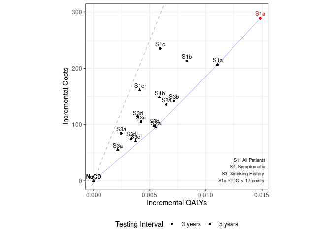

Process Model Results
================
15 October, 2024

This file processes the model results so they match up as closely as
possible to those in the publication.

It aims to produce **Table 3**, **Figure 3** and **Appendix 6**.

``` r
# Clear environment before start
rm(list=ls())

# Set save location for figures generated when knit rmd
knitr::opts_chunk$set(fig.path = "../outputs/")

# Load required libraries
library(dplyr)
library(ggplot2)
library(ggpubr)
```

## Define file paths and import files

``` r
paths <- list(
  # Model results
  s1 = "../outputs/s1.csv",
  sall_3y = "../outputs/sall.csv",
  sall_5y = "../outputs/sall_5y.csv",
  ceplane_3y = "../outputs/ceplane.csv",
  ceplane_5y = "../outputs/ceplane_5y.csv",
  clinical = "../outputs/clinicalresults.csv",

  # Original study results
  paper_tab3 = "../../original_study/tab3.csv",
  original_sall = "../../original_study/sall.csv",
  original_ceplane = "../../original_study/ceplane.csv",

  # Outputs from this .Rmd file
  tab3 = "../outputs/tab3.csv",
  tab3_compare = "../outputs/tab3_compare_to_original.csv",
  fig3 = "../outputs/fig3-1.png",
  apx6 = "../outputs/appendix6-1.png"
)
```

``` r
s1 <- read.csv(paths$s1)
sall_3y <- read.csv(paths$sall_3y) %>% mutate("Interval" = "3 years")
sall_5y <- read.csv(paths$sall_5y) %>% mutate("Interval" = "5 years")
ceplane_3y <- read.csv(paths$ceplane_3y) %>% mutate("Interval" = "3 years")
ceplane_5y <- read.csv(paths$ceplane_5y) %>% mutate("Interval" = "5 years")
clinical <- read.csv(paths$clinical)

paper_tab3 <- read.csv(paths$paper_tab3)
original_sall <- read.csv(paths$original_sall)
original_ceplane <- read.csv(paths$original_ceplane)
```

## Table 3

Preview the results.

``` r
rbind(ceplane_3y, ceplane_5y) %>%
  arrange(Scenario)
```

<div class="kable-table">

| Scenario  |   Agents | PropAgents |         Cost | CostpAgent | CostpAgentExcluded | CostpAgentAll |      QALY | QALYpAgent | QALYpAgentExcluded | QALYpAgentAll | IncrementalCosts | IncrementalQALY |  ICERAdj |     ICER |      INMB | Interval |
|:----------|---------:|-----------:|-------------:|-----------:|-------------------:|--------------:|----------:|-----------:|-------------------:|--------------:|-----------------:|----------------:|---------:|---------:|----------:|:---------|
| S1NoCDAvg | 74388586 |  1.0000000 | 159925565707 |   2149.867 |              0.000 |      2149.867 | 933240063 |   12.54547 |            0.00000 |      12.54547 |          0.00000 |       0.0000000 |       NA |       NA |   0.00000 | 3 years  |
| S1NoCDAvg | 74388586 |  1.0000000 | 159925565707 |   2149.867 |              0.000 |      2149.867 | 933240063 |   12.54547 |            0.00000 |      12.54547 |          0.00000 |       0.0000000 |       NA |       NA |   0.00000 | 5 years  |
| S1a       | 74380275 |  1.0000000 | 181401075128 |   2438.833 |              0.000 |      2438.833 | 934239602 |   12.56031 |            0.00000 |      12.56031 |        288.96609 |       0.0148400 | 19472.10 | 19152.73 | 453.03421 | 3 years  |
| S1a       | 74386318 |  1.0000000 | 175298229824 |   2356.592 |              0.000 |      2356.592 | 934033198 |   12.55652 |            0.00000 |      12.55652 |        206.72538 |       0.0110449 | 18716.85 | 19145.74 | 345.51881 | 5 years  |
| S1b       | 74383024 |  1.0000000 | 175747140584 |   2362.732 |              0.000 |      2362.732 | 933787724 |   12.55377 |            0.00000 |      12.55377 |        212.86487 |       0.0083008 | 25643.89 | 24838.02 | 202.17518 | 3 years  |
| S1b       | 74385413 |  1.0000000 | 170952563916 |   2298.200 |              0.000 |      2298.200 | 933637487 |   12.55135 |            0.00000 |      12.55135 |        148.33311 |       0.0058779 | 25235.73 | 26468.96 | 145.56189 | 5 years  |
| S1c       | 74393892 |  1.0000000 | 177409072797 |   2384.726 |              0.000 |      2384.726 | 933746980 |   12.55139 |            0.00000 |      12.55139 |        234.85933 |       0.0059192 | 39677.70 | 37796.70 |  61.09955 | 3 years  |
| S1c       | 74390720 |  1.0000000 | 171904343832 |   2310.830 |              0.000 |      2310.830 | 933570750 |   12.54956 |            0.00000 |      12.54956 |        160.96350 |       0.0040854 | 39399.80 | 42521.81 |  43.30591 | 5 years  |
| S2NoCD    | 44156404 |  0.5935911 | 117605933755 |   2663.395 |           1399.821 |      2149.867 | 541859031 |   12.27136 |           12.94584 |      12.54547 |          0.00000 |       0.0000000 |       NA |       NA |   0.00000 | 3 years  |
| S2NoCD    | 44157029 |  0.5935995 | 117807957835 |   2667.932 |           1393.167 |      2149.867 | 541828917 |   12.27050 |           12.94711 |      12.54547 |          0.00000 |       0.0000000 |       NA |       NA |   0.00000 | 5 years  |
| S2a       | 44164773 |  0.5937036 | 127735308298 |   2892.244 |           1399.821 |      2285.878 | 542449119 |   12.28239 |           12.94584 |      12.55195 |        136.01091 |       0.0064761 | 21002.14 | 20737.20 | 187.79161 | 3 years  |
| S2a       | 44154576 |  0.5935665 | 124844786047 |   2827.448 |           1393.167 |      2244.508 | 542208652 |   12.27978 |           12.94711 |      12.55101 |         94.64148 |       0.0055317 | 17108.96 | 17185.88 | 181.94301 | 5 years  |
| S3NoCD    | 34500334 |  0.4637853 |  99842281258 |   2893.951 |           1506.290 |      2149.867 | 387517176 |   11.23227 |           13.68129 |      12.54547 |          0.00000 |       0.0000000 |       NA |       NA |   0.00000 | 3 years  |
| S3NoCD    | 34491937 |  0.4636724 |  99999943602 |   2899.227 |           1502.021 |      2149.867 | 387401839 |   11.23166 |           13.68131 |      12.54547 |          0.00000 |       0.0000000 |       NA |       NA |   0.00000 | 5 years  |
| S3a       | 34507415 |  0.4638805 | 106095806862 |   3074.580 |           1506.290 |      2233.789 | 387796823 |   11.23807 |           13.68129 |      12.54793 |         83.92228 |       0.0024570 | 34156.94 | 31147.82 |  38.92579 | 3 years  |
| S3a       | 34494037 |  0.4637007 | 104115381916 |   3018.359 |           1502.021 |      2205.148 | 387590904 |   11.23646 |           13.68131 |      12.54763 |         55.28112 |       0.0021554 | 25648.14 | 24833.08 |  52.48718 | 5 years  |
| S3b       | 34499539 |  0.4637746 | 110363699543 |   3198.991 |           1506.290 |      2291.322 | 388038736 |   11.24765 |           13.68129 |      12.55263 |        141.45471 |       0.0071575 | 19763.12 | 19837.73 | 216.42072 | 3 years  |
| S3b       | 34509196 |  0.4639044 | 107308147373 |   3109.552 |           1502.021 |      2247.762 | 388040453 |   11.24455 |           13.68131 |      12.55088 |         97.89513 |       0.0054106 | 18093.14 | 16319.03 | 172.63598 | 5 years  |
| S3c       | 34496334 |  0.4637315 | 107627143927 |   3119.959 |           1506.290 |      2254.599 | 387776879 |   11.24110 |           13.68129 |      12.54970 |        104.73230 |       0.0042268 | 24777.92 | 25592.93 | 106.60970 | 3 years  |
| S3c       | 34504471 |  0.4638409 | 105270593424 |   3050.926 |           1502.021 |      2220.467 | 387852045 |   11.24063 |           13.68131 |      12.54922 |         70.59986 |       0.0037469 | 18842.32 | 16916.05 | 116.74399 | 5 years  |
| S3d       | 34507664 |  0.4638839 | 108255487965 |   3137.143 |           1506.290 |      2262.817 | 387911628 |   11.24132 |           13.68129 |      12.54943 |        112.94966 |       0.0039545 | 28562.49 | 26887.15 |  84.77408 | 3 years  |
| S3d       | 34501231 |  0.4637974 | 105602366018 |   3060.829 |           1502.021 |      2224.992 | 387776869 |   11.23951 |           13.68131 |      12.54881 |         75.12527 |       0.0033322 | 22545.40 | 20600.86 |  91.48361 | 5 years  |

</div>

Combine, organise and modify results as per paper.

``` r
ceplane <- rbind(ceplane_3y, ceplane_5y) %>%
  # Remove scenarios 2 and 3 with no case detection, and scenario 2b
  filter(!(Scenario %in% c("S2NoCD", "S3NoCD", "S2b"))) %>%
  # Remove S1NoCDAvg from 5 years, then set interval of S1NoCDAvg to NA
  filter(!(Scenario == "S1NoCDAvg" & Interval == "5 years")) %>%
  mutate(Interval = ifelse(Scenario == "S1NoCDAvg", NA, Interval)) %>%
  # Remove INMB for S1NoCDAvg
  mutate(INMB = ifelse(Scenario!="S1NoCDAvg", INMB, NA)) %>%
  # Get INMB ranking
  mutate(Ranking = min_rank(desc(INMB)))

ceplane %>% arrange(Scenario)
```

<div class="kable-table">

| Scenario  |   Agents | PropAgents |         Cost | CostpAgent | CostpAgentExcluded | CostpAgentAll |      QALY | QALYpAgent | QALYpAgentExcluded | QALYpAgentAll | IncrementalCosts | IncrementalQALY |  ICERAdj |     ICER |      INMB | Interval | Ranking |
|:----------|---------:|-----------:|-------------:|-----------:|-------------------:|--------------:|----------:|-----------:|-------------------:|--------------:|-----------------:|----------------:|---------:|---------:|----------:|:---------|--------:|
| S1NoCDAvg | 74388586 |  1.0000000 | 159925565707 |   2149.867 |              0.000 |      2149.867 | 933240063 |   12.54547 |            0.00000 |      12.54547 |          0.00000 |       0.0000000 |       NA |       NA |        NA | NA       |      NA |
| S1a       | 74380275 |  1.0000000 | 181401075128 |   2438.833 |              0.000 |      2438.833 | 934239602 |   12.56031 |            0.00000 |      12.56031 |        288.96609 |       0.0148400 | 19472.10 | 19152.73 | 453.03421 | 3 years  |       1 |
| S1a       | 74386318 |  1.0000000 | 175298229824 |   2356.592 |              0.000 |      2356.592 | 934033198 |   12.55652 |            0.00000 |      12.55652 |        206.72538 |       0.0110449 | 18716.85 | 19145.74 | 345.51881 | 5 years  |       2 |
| S1b       | 74383024 |  1.0000000 | 175747140584 |   2362.732 |              0.000 |      2362.732 | 933787724 |   12.55377 |            0.00000 |      12.55377 |        212.86487 |       0.0083008 | 25643.89 | 24838.02 | 202.17518 | 3 years  |       4 |
| S1b       | 74385413 |  1.0000000 | 170952563916 |   2298.200 |              0.000 |      2298.200 | 933637487 |   12.55135 |            0.00000 |      12.55135 |        148.33311 |       0.0058779 | 25235.73 | 26468.96 | 145.56189 | 5 years  |       8 |
| S1c       | 74393892 |  1.0000000 | 177409072797 |   2384.726 |              0.000 |      2384.726 | 933746980 |   12.55139 |            0.00000 |      12.55139 |        234.85933 |       0.0059192 | 39677.70 | 37796.70 |  61.09955 | 3 years  |      13 |
| S1c       | 74390720 |  1.0000000 | 171904343832 |   2310.830 |              0.000 |      2310.830 | 933570750 |   12.54956 |            0.00000 |      12.54956 |        160.96350 |       0.0040854 | 39399.80 | 42521.81 |  43.30591 | 5 years  |      15 |
| S2a       | 44164773 |  0.5937036 | 127735308298 |   2892.244 |           1399.821 |      2285.878 | 542449119 |   12.28239 |           12.94584 |      12.55195 |        136.01091 |       0.0064761 | 21002.14 | 20737.20 | 187.79161 | 3 years  |       5 |
| S2a       | 44154576 |  0.5935665 | 124844786047 |   2827.448 |           1393.167 |      2244.508 | 542208652 |   12.27978 |           12.94711 |      12.55101 |         94.64148 |       0.0055317 | 17108.96 | 17185.88 | 181.94301 | 5 years  |       6 |
| S3a       | 34507415 |  0.4638805 | 106095806862 |   3074.580 |           1506.290 |      2233.789 | 387796823 |   11.23807 |           13.68129 |      12.54793 |         83.92228 |       0.0024570 | 34156.94 | 31147.82 |  38.92579 | 3 years  |      16 |
| S3a       | 34494037 |  0.4637007 | 104115381916 |   3018.359 |           1502.021 |      2205.148 | 387590904 |   11.23646 |           13.68131 |      12.54763 |         55.28112 |       0.0021554 | 25648.14 | 24833.08 |  52.48718 | 5 years  |      14 |
| S3b       | 34499539 |  0.4637746 | 110363699543 |   3198.991 |           1506.290 |      2291.322 | 388038736 |   11.24765 |           13.68129 |      12.55263 |        141.45471 |       0.0071575 | 19763.12 | 19837.73 | 216.42072 | 3 years  |       3 |
| S3b       | 34509196 |  0.4639044 | 107308147373 |   3109.552 |           1502.021 |      2247.762 | 388040453 |   11.24455 |           13.68131 |      12.55088 |         97.89513 |       0.0054106 | 18093.14 | 16319.03 | 172.63598 | 5 years  |       7 |
| S3c       | 34496334 |  0.4637315 | 107627143927 |   3119.959 |           1506.290 |      2254.599 | 387776879 |   11.24110 |           13.68129 |      12.54970 |        104.73230 |       0.0042268 | 24777.92 | 25592.93 | 106.60970 | 3 years  |      10 |
| S3c       | 34504471 |  0.4638409 | 105270593424 |   3050.926 |           1502.021 |      2220.467 | 387852045 |   11.24063 |           13.68131 |      12.54922 |         70.59986 |       0.0037469 | 18842.32 | 16916.05 | 116.74399 | 5 years  |       9 |
| S3d       | 34507664 |  0.4638839 | 108255487965 |   3137.143 |           1506.290 |      2262.817 | 387911628 |   11.24132 |           13.68129 |      12.54943 |        112.94966 |       0.0039545 | 28562.49 | 26887.15 |  84.77408 | 3 years  |      12 |
| S3d       | 34501231 |  0.4637974 | 105602366018 |   3060.829 |           1502.021 |      2224.992 | 387776869 |   11.23951 |           13.68131 |      12.54881 |         75.12527 |       0.0033322 | 22545.40 | 20600.86 |  91.48361 | 5 years  |      11 |

</div>

Reformat to match paper.

``` r
ceplane_pretty <- ceplane %>%
  # Round columns
  mutate(CostpAgentAll = paste0("$", round(CostpAgentAll, 0))) %>%
  mutate(QALYpAgentAll = round(QALYpAgentAll, 3)) %>%
  mutate(ICERAdj = round(ICERAdj, 0)) %>%
  # Create INMB and rank column
  mutate(INMBRank = ifelse(
    Scenario!="S1NoCDAvg",
    paste0(round(INMB, 0), "(", Ranking, ")"),
    NA)) %>%
  # Arrange and relabel the scenarios
  arrange(Scenario) %>%
  mutate(Scenario = recode(Scenario,
                           "S1NoCDAvg" = "S0: No case detection",
                           "S1a" = "(S1a) CDQ ≥ 17 points",
                           "S1b" = "(S1b) Screening spirometry",
                           "S1c" = "(S1c) CDQ + screening spirometry",
                           "S2a" = "(S2a) Screening spirometry",
                           "S3a" = "(S3a) CDQ ≥ 19.5 points",
                           "S3b" = "(S3b) CDQ ≥ 16.5 points",
                           "S3c" = "(S3c) Screening spirometry",
                           "S3d" = "(S3d) CDQ + screening spirometry")) %>%
  # Select, reorder and relabel columns
  select(Scenario, Interval, CostpAgentAll, QALYpAgentAll, ICERAdj, INMBRank) %>%
  rename("Testing interval" = Interval,
         "Costs per patient" = CostpAgentAll,
         "QALYs per patient" = QALYpAgentAll,
         "ICER" = ICERAdj,
         "INMB (ranking)" = INMBRank)

# Save to csv
write.csv(ceplane_pretty, paths$tab3, row.names=FALSE)

# View dataframe
ceplane_pretty
```

<div class="kable-table">

| Scenario                         | Testing interval | Costs per patient | QALYs per patient |  ICER | INMB (ranking) |
|:---------------------------------|:-----------------|:------------------|------------------:|------:|:---------------|
| S0: No case detection            | NA               | \$2150            |            12.545 |    NA | NA             |
| (S1a) CDQ ≥ 17 points            | 3 years          | \$2439            |            12.560 | 19472 | 453(1)         |
| (S1a) CDQ ≥ 17 points            | 5 years          | \$2357            |            12.557 | 18717 | 346(2)         |
| (S1b) Screening spirometry       | 3 years          | \$2363            |            12.554 | 25644 | 202(4)         |
| (S1b) Screening spirometry       | 5 years          | \$2298            |            12.551 | 25236 | 146(8)         |
| (S1c) CDQ + screening spirometry | 3 years          | \$2385            |            12.551 | 39678 | 61(13)         |
| (S1c) CDQ + screening spirometry | 5 years          | \$2311            |            12.550 | 39400 | 43(15)         |
| (S2a) Screening spirometry       | 3 years          | \$2286            |            12.552 | 21002 | 188(5)         |
| (S2a) Screening spirometry       | 5 years          | \$2245            |            12.551 | 17109 | 182(6)         |
| (S3a) CDQ ≥ 19.5 points          | 3 years          | \$2234            |            12.548 | 34157 | 39(16)         |
| (S3a) CDQ ≥ 19.5 points          | 5 years          | \$2205            |            12.548 | 25648 | 52(14)         |
| (S3b) CDQ ≥ 16.5 points          | 3 years          | \$2291            |            12.553 | 19763 | 216(3)         |
| (S3b) CDQ ≥ 16.5 points          | 5 years          | \$2248            |            12.551 | 18093 | 173(7)         |
| (S3c) Screening spirometry       | 3 years          | \$2255            |            12.550 | 24778 | 107(10)        |
| (S3c) Screening spirometry       | 5 years          | \$2220            |            12.549 | 18842 | 117(9)         |
| (S3d) CDQ + screening spirometry | 3 years          | \$2263            |            12.549 | 28562 | 85(12)         |
| (S3d) CDQ + screening spirometry | 5 years          | \$2225            |            12.549 | 22545 | 91(11)         |

</div>

### Compare between our results, the paper, and their repository

Prepare our model results…

``` r
# Prepare sall model results to combine with original table
ceplane_prep <- ceplane %>%
  # Replace S1NoCDAvg with S0
  mutate(Scenario = replace(Scenario, Scenario == "S1NoCDAvg", "S0")) %>%
  # Round columns
  mutate(CostpAgentAll = round(CostpAgentAll, 0)) %>%
  mutate(QALYpAgentAll = round(QALYpAgentAll, 3)) %>%
  mutate(ICERAdj = round(ICERAdj, 0)) %>%
  mutate(INMB = round(INMB, 0)) %>%
  # Select relevant columns
  select(Scenario, Interval, CostpAgentAll, QALYpAgentAll, ICERAdj, INMB, Ranking)
ceplane_prep
```

<div class="kable-table">

| Scenario | Interval | CostpAgentAll | QALYpAgentAll | ICERAdj | INMB | Ranking |
|:---------|:---------|--------------:|--------------:|--------:|-----:|--------:|
| S0       | NA       |          2150 |        12.545 |      NA |   NA |      NA |
| S1a      | 3 years  |          2439 |        12.560 |   19472 |  453 |       1 |
| S1b      | 3 years  |          2363 |        12.554 |   25644 |  202 |       4 |
| S1c      | 3 years  |          2385 |        12.551 |   39678 |   61 |      13 |
| S2a      | 3 years  |          2286 |        12.552 |   21002 |  188 |       5 |
| S3a      | 3 years  |          2234 |        12.548 |   34157 |   39 |      16 |
| S3b      | 3 years  |          2291 |        12.553 |   19763 |  216 |       3 |
| S3c      | 3 years  |          2255 |        12.550 |   24778 |  107 |      10 |
| S3d      | 3 years  |          2263 |        12.549 |   28562 |   85 |      12 |
| S1a      | 5 years  |          2357 |        12.557 |   18717 |  346 |       2 |
| S1b      | 5 years  |          2298 |        12.551 |   25236 |  146 |       8 |
| S1c      | 5 years  |          2311 |        12.550 |   39400 |   43 |      15 |
| S2a      | 5 years  |          2245 |        12.551 |   17109 |  182 |       6 |
| S3a      | 5 years  |          2205 |        12.548 |   25648 |   52 |      14 |
| S3b      | 5 years  |          2248 |        12.551 |   18093 |  173 |       7 |
| S3c      | 5 years  |          2220 |        12.549 |   18842 |  117 |       9 |
| S3d      | 5 years  |          2225 |        12.549 |   22545 |   91 |      11 |

</div>

Prepare results from the paper…

``` r
# Convert costs to numeric
paper_tab3_prep <- paper_tab3 %>%
  mutate(CostpAgent = readr::parse_number(CostpAgent))
# Append "_paper" to columns (except Scenario and Interval)
icol <- which(names(paper_tab3_prep) %in% c("Scenario", "Interval"))
colnames(paper_tab3_prep)[-icol] <- paste(colnames(paper_tab3_prep)[-icol], "paper", sep = "_")
# Preview dataframe
paper_tab3_prep
```

<div class="kable-table">

| Scenario | Interval | CostpAgent_paper | QALYpAgent_paper | ICER_paper | IncrementalNMB_paper | Ranking_paper |
|:---------|:---------|-----------------:|-----------------:|-----------:|---------------------:|--------------:|
| S0       | NA       |             2151 |           12.546 |         NA |                   NA |            NA |
| S1a      | 3 years  |             2438 |           12.560 |      19632 |                  444 |             1 |
| S1a      | 5 years  |             2356 |           12.556 |      19847 |                  312 |             2 |
| S1b      | 3 years  |             2363 |           12.554 |      25894 |                  198 |             6 |
| S1b      | 5 years  |             2296 |           12.552 |      23187 |                  168 |             8 |
| S1c      | 3 years  |             2386 |           12.551 |      46956 |                   15 |            16 |
| S1c      | 5 years  |             2313 |           12.550 |      38673 |                   47 |            15 |
| S2a      | 3 years  |             2286 |           12.553 |      18908 |                  223 |             4 |
| S2a      | 5 years  |             2246 |           12.551 |      17514 |                  176 |             7 |
| S3a      | 3 years  |             2234 |           12.548 |      30366 |                   54 |            14 |
| S3a      | 5 years  |             2207 |           12.548 |      22636 |                   68 |            12 |
| S3b      | 3 years  |             2292 |           12.553 |      18438 |                  241 |             3 |
| S3b      | 5 years  |             2250 |           12.552 |      16251 |                  206 |             5 |
| S3c      | 3 years  |             2256 |           12.550 |      23972 |                  114 |             9 |
| S3c      | 5 years  |             2224 |           12.549 |      20278 |                  107 |            10 |
| S3d      | 3 years  |             2263 |           12.549 |      28245 |                   86 |            11 |
| S3d      | 5 years  |             2227 |           12.548 |      27591 |                   62 |            13 |

</div>

``` r
original_ceplane_prep <- original_ceplane %>%
  # Replace "NA" string with actual NaN for the interval
  mutate(Interval = replace(Interval, Interval == "NA", NA_character_)) %>%
  # Remove scenarios 2 and 3 with no case detection, and scenario 2b
  filter(!(Scenario %in% c("S2NoCD", "S3NoCD", "S2b"))) %>%
  # Replace S1NoCDAvg with S0
  mutate(Scenario = replace(Scenario, Scenario == "S1NoCDAvg", "S0")) %>%
  # Round columns
  mutate(CostpAgentAll = round(CostpAgentAll, 0)) %>%
  mutate(QALYpAgentAll = round(QALYpAgentAll, 3)) %>%
  mutate(ICERAdj = round(ICERAdj, 0)) %>%
  mutate(INMB = round(INMB, 0)) %>%
  # Select relevant columns
  select(Scenario, Interval, CostpAgentAll, QALYpAgentAll, ICERAdj, INMB)
# Append "_repo" to columns (except Scenario and Interval)
icol <- which(names(original_ceplane_prep) %in% c("Scenario", "Interval"))
colnames(original_ceplane_prep)[-icol] <- paste(
  colnames(original_ceplane_prep)[-icol], "repo", sep = "_")
original_ceplane_prep
```

<div class="kable-table">

| Scenario | Interval | CostpAgentAll_repo | QALYpAgentAll_repo | ICERAdj_repo | INMB_repo |
|:---------|:---------|-------------------:|-------------------:|-------------:|----------:|
| S0       | NA       |               2151 |             12.545 |           NA |         0 |
| S1a      | 3 years  |               2439 |             12.560 |        19665 |       446 |
| S1b      | 3 years  |               2365 |             12.552 |        31076 |       131 |
| S1c      | 3 years  |               2386 |             12.551 |        42697 |        40 |
| S2a      | 3 years  |               2287 |             12.552 |        21184 |       186 |
| S3a      | 3 years  |               2232 |             12.548 |        32247 |        45 |
| S3b      | 3 years  |               2289 |             12.553 |        18157 |       243 |
| S3c      | 3 years  |               2255 |             12.550 |        20700 |       148 |
| S3d      | 3 years  |               2261 |             12.550 |        23462 |       124 |
| S0       | NA       |               2151 |             12.545 |           NA |         0 |
| S1a      | 5 years  |               2355 |             12.557 |        16600 |       411 |
| S1b      | 5 years  |               2298 |             12.551 |        25501 |       142 |
| S1c      | 5 years  |               2311 |             12.551 |        29600 |       110 |
| S2a      | 5 years  |               2245 |             12.550 |        20394 |       137 |
| S3a      | 5 years  |               2207 |             12.548 |        22694 |        67 |
| S3b      | 5 years  |               2248 |             12.551 |        17325 |       183 |
| S3c      | 5 years  |               2221 |             12.549 |        19250 |       113 |
| S3d      | 5 years  |               2226 |             12.548 |        26517 |        67 |

</div>

``` r
calc_diff_perc <- function(df, our_res, paper_res, repo_res, prefix) {
  #' Calculate the difference and percentage difference between two columns
  #' 
  #' @param df Dataframe containing columns
  #' @param our_res Column with results from our run of the model
  #' @param paper_res Column with results from the paper table 3
  #' @param repo_res Column with results from the .md files in their repository
  #' @param prefix String to prefix start of the result columns
  #' 
  #' @return Dataframe with the column pair, results, scenario and interval
  # Create column names for differences
  mydiff <- paste0(prefix, "MyDiff")
  myperc <- paste0(prefix, "MyPerc")
  repodiff <- paste0(prefix, "RepoDiff")
  repoperc <- paste0(prefix, "RepoPerc")
  # Calculate the difference and percentage difference between col1 and col2
  df %>%
    mutate(
      !!sym(mydiff) := !!sym(paper_res) - !!sym(our_res),
      !!sym(myperc) := scales::percent(round(!!sym(mydiff) / !!sym(our_res), 3)),
      !!sym(repodiff) := !!sym(paper_res) - !!sym(repo_res),
      !!sym(repoperc) := scales::percent(round(!!sym(repodiff) / !!sym(repo_res), 3))
    ) %>%
    # Select only those columns, as well as Scenario and Interval
    select(Scenario, Interval,
           !!sym(paper_res), !!sym(our_res), !!sym(repo_res),
           !!sym(mydiff), !!sym(myperc),
           !!sym(repodiff), !!sym(repoperc))
}
# Combine the model and paper results
ceplane_combine <- merge(ceplane_prep, paper_tab3_prep, by=c("Scenario", "Interval")) %>%
  merge(original_ceplane_prep, by=c("Scenario", "Interval"))
# Define the pairs of columns to compare and the prefix to use for their comparison
column_pairs <- list(
  c("CostpAgentAll", "CostpAgent_paper", "CostpAgentAll_repo", "Cost"),
  c("QALYpAgentAll", "QALYpAgent_paper", "QALYpAgentAll_repo", "QALY"),
  c("ICERAdj", "ICER_paper", "ICERAdj_repo", "ICER"),
  c("INMB", "IncrementalNMB_paper", "INMB_repo", "INMB")
)
# Combine model and paper results and apply the function for each pair of columns
ceplane_compare <- column_pairs %>%
  purrr::map(~ calc_diff_perc(ceplane_combine, .x[1], .x[2], .x[3], .x[4])) %>%
  purrr::reduce(left_join, by = c("Scenario", "Interval"))
# Remove duplicates
ceplane_compare <- ceplane_compare[!duplicated(ceplane_compare), ]
# Save to csv and view
write.csv(ceplane_compare, paths$tab3_compare, row.names=FALSE)
ceplane_compare
```

<div class="kable-table">

|     | Scenario | Interval | CostpAgent_paper | CostpAgentAll | CostpAgentAll_repo | CostMyDiff | CostMyPerc | CostRepoDiff | CostRepoPerc | QALYpAgent_paper | QALYpAgentAll | QALYpAgentAll_repo | QALYMyDiff | QALYMyPerc | QALYRepoDiff | QALYRepoPerc | ICER_paper | ICERAdj | ICERAdj_repo | ICERMyDiff | ICERMyPerc | ICERRepoDiff | ICERRepoPerc | IncrementalNMB_paper | INMB | INMB_repo | INMBMyDiff | INMBMyPerc | INMBRepoDiff | INMBRepoPerc |
|:----|:---------|:---------|-----------------:|--------------:|-------------------:|-----------:|:-----------|-------------:|:-------------|-----------------:|--------------:|-------------------:|-----------:|:-----------|-------------:|:-------------|-----------:|--------:|-------------:|-----------:|:-----------|-------------:|:-------------|---------------------:|-----:|----------:|-----------:|:-----------|-------------:|:-------------|
| 1   | S0       | NA       |             2151 |          2150 |               2151 |          1 | 0.0%       |            0 | 0.0%         |           12.546 |        12.545 |             12.545 |      0.001 | 0%         |        0.001 | 0%           |         NA |      NA |           NA |         NA | NA         |           NA | NA           |                   NA |   NA |         0 |         NA | NA         |           NA | NA           |
| 17  | S1a      | 3 years  |             2438 |          2439 |               2439 |         -1 | 0.0%       |           -1 | 0.0%         |           12.560 |        12.560 |             12.560 |      0.000 | 0%         |        0.000 | 0%           |      19632 |   19472 |        19665 |        160 | 0.8%       |          -33 | -0.2%        |                  444 |  453 |       446 |         -9 | -2.0%      |           -2 | -0.40%       |
| 18  | S1a      | 5 years  |             2356 |          2357 |               2355 |         -1 | 0.0%       |            1 | 0.0%         |           12.556 |        12.557 |             12.557 |     -0.001 | 0%         |       -0.001 | 0%           |      19847 |   18717 |        16600 |       1130 | 6.0%       |         3247 | 19.6%        |                  312 |  346 |       411 |        -34 | -9.8%      |          -99 | -24.10%      |
| 19  | S1b      | 3 years  |             2363 |          2363 |               2365 |          0 | 0.0%       |           -2 | -0.1%        |           12.554 |        12.554 |             12.552 |      0.000 | 0%         |        0.002 | 0%           |      25894 |   25644 |        31076 |        250 | 1.0%       |        -5182 | -16.7%       |                  198 |  202 |       131 |         -4 | -2.0%      |           67 | 51.10%       |
| 20  | S1b      | 5 years  |             2296 |          2298 |               2298 |         -2 | -0.1%      |           -2 | -0.1%        |           12.552 |        12.551 |             12.551 |      0.001 | 0%         |        0.001 | 0%           |      23187 |   25236 |        25501 |      -2049 | -8.1%      |        -2314 | -9.1%        |                  168 |  146 |       142 |         22 | 15.1%      |           26 | 18.30%       |
| 21  | S1c      | 3 years  |             2386 |          2385 |               2386 |          1 | 0.0%       |            0 | 0.0%         |           12.551 |        12.551 |             12.551 |      0.000 | 0%         |        0.000 | 0%           |      46956 |   39678 |        42697 |       7278 | 18.3%      |         4259 | 10.0%        |                   15 |   61 |        40 |        -46 | -75.4%     |          -25 | -62.50%      |
| 22  | S1c      | 5 years  |             2313 |          2311 |               2311 |          2 | 0.1%       |            2 | 0.1%         |           12.550 |        12.550 |             12.551 |      0.000 | 0%         |       -0.001 | 0%           |      38673 |   39400 |        29600 |       -727 | -1.8%      |         9073 | 30.7%        |                   47 |   43 |       110 |          4 | 9.3%       |          -63 | -57.30%      |
| 23  | S2a      | 3 years  |             2286 |          2286 |               2287 |          0 | 0.0%       |           -1 | 0.0%         |           12.553 |        12.552 |             12.552 |      0.001 | 0%         |        0.001 | 0%           |      18908 |   21002 |        21184 |      -2094 | -10.0%     |        -2276 | -10.7%       |                  223 |  188 |       186 |         35 | 18.6%      |           37 | 19.90%       |
| 24  | S2a      | 5 years  |             2246 |          2245 |               2245 |          1 | 0.0%       |            1 | 0.0%         |           12.551 |        12.551 |             12.550 |      0.000 | 0%         |        0.001 | 0%           |      17514 |   17109 |        20394 |        405 | 2.4%       |        -2880 | -14.1%       |                  176 |  182 |       137 |         -6 | -3.3%      |           39 | 28.50%       |
| 25  | S3a      | 3 years  |             2234 |          2234 |               2232 |          0 | 0.0%       |            2 | 0.1%         |           12.548 |        12.548 |             12.548 |      0.000 | 0%         |        0.000 | 0%           |      30366 |   34157 |        32247 |      -3791 | -11.1%     |        -1881 | -5.8%        |                   54 |   39 |        45 |         15 | 38.5%      |            9 | 20.00%       |
| 26  | S3a      | 5 years  |             2207 |          2205 |               2207 |          2 | 0.1%       |            0 | 0.0%         |           12.548 |        12.548 |             12.548 |      0.000 | 0%         |        0.000 | 0%           |      22636 |   25648 |        22694 |      -3012 | -11.7%     |          -58 | -0.3%        |                   68 |   52 |        67 |         16 | 30.8%      |            1 | 1.50%        |
| 27  | S3b      | 3 years  |             2292 |          2291 |               2289 |          1 | 0.0%       |            3 | 0.1%         |           12.553 |        12.553 |             12.553 |      0.000 | 0%         |        0.000 | 0%           |      18438 |   19763 |        18157 |      -1325 | -6.7%      |          281 | 1.5%         |                  241 |  216 |       243 |         25 | 11.6%      |           -2 | -0.80%       |
| 28  | S3b      | 5 years  |             2250 |          2248 |               2248 |          2 | 0.1%       |            2 | 0.1%         |           12.552 |        12.551 |             12.551 |      0.001 | 0%         |        0.001 | 0%           |      16251 |   18093 |        17325 |      -1842 | -10.2%     |        -1074 | -6.2%        |                  206 |  173 |       183 |         33 | 19.1%      |           23 | 12.60%       |
| 29  | S3c      | 3 years  |             2256 |          2255 |               2255 |          1 | 0.0%       |            1 | 0.0%         |           12.550 |        12.550 |             12.550 |      0.000 | 0%         |        0.000 | 0%           |      23972 |   24778 |        20700 |       -806 | -3.3%      |         3272 | 15.8%        |                  114 |  107 |       148 |          7 | 6.5%       |          -34 | -23.00%      |
| 30  | S3c      | 5 years  |             2224 |          2220 |               2221 |          4 | 0.2%       |            3 | 0.1%         |           12.549 |        12.549 |             12.549 |      0.000 | 0%         |        0.000 | 0%           |      20278 |   18842 |        19250 |       1436 | 7.6%       |         1028 | 5.3%         |                  107 |  117 |       113 |        -10 | -8.5%      |           -6 | -5.30%       |
| 31  | S3d      | 3 years  |             2263 |          2263 |               2261 |          0 | 0.0%       |            2 | 0.1%         |           12.549 |        12.549 |             12.550 |      0.000 | 0%         |       -0.001 | 0%           |      28245 |   28562 |        23462 |       -317 | -1.1%      |         4783 | 20.4%        |                   86 |   85 |       124 |          1 | 1.2%       |          -38 | -30.60%      |
| 32  | S3d      | 5 years  |             2227 |          2225 |               2226 |          2 | 0.1%       |            1 | 0.0%         |           12.548 |        12.549 |             12.548 |     -0.001 | 0%         |        0.000 | 0%           |      27591 |   22545 |        26517 |       5046 | 22.4%      |         1074 | 4.1%         |                   62 |   91 |        67 |        -29 | -31.9%     |           -5 | -7.50%       |

</div>

## Figure 3

``` r
# Process data
ceplane_plot <- rbind(ceplane_3y, ceplane_5y) %>%
  # Remove scenario 2b
  filter(!(Scenario == "S2b")) %>%
  # Replace the NoCD results with a single NoCD category
  mutate(Scenario = ifelse(
    Scenario %in% c("S1NoCDAvg", "S2NoCD", "S3NoCD"), "NoCD", Scenario)) %>%
  # Add colour for S1a
  mutate(Colour = ifelse((Scenario == "S1a" & Interval == "3 years"), "A", "B"))
```

Find the efficiency frontier

``` r
# Remove negative QALY and then...
# Find highest ICER and remove those with a QALY less than that but ICER above
find_frontier <- ceplane_plot %>%
  filter(!(IncrementalQALY <= 0)) %>%
  arrange(ICERAdj) %>%
  filter(!(IncrementalQALY <= first(IncrementalQALY) & ICERAdj > first(ICERAdj)))

# Add first row to frontier df, and remove from the other
frontier <- find_frontier[1, , drop=FALSE]
find_frontier <- find_frontier[-1,]

# Repeat that, each time adding to frontier, until there are none remaining after filter
while (nrow(find_frontier) > 0){
  find_frontier <- find_frontier %>%
    arrange(ICERAdj) %>%
    filter(!(IncrementalQALY <= first(IncrementalQALY) & ICERAdj > first(ICERAdj)))
  frontier <- rbind(frontier, find_frontier[1, , drop=FALSE])
  find_frontier <- find_frontier[-1,]
}

# Add NoCD to start of frontier
frontier <- frontier %>%
  select(Scenario, IncrementalCosts, IncrementalQALY) %>%
  add_row(Scenario="NoCD", IncrementalCosts=0, IncrementalQALY=0) %>%
  arrange(IncrementalCosts)
frontier
```

<div class="kable-table">

| Scenario | IncrementalCosts | IncrementalQALY |
|:---------|-----------------:|----------------:|
| NoCD     |          0.00000 |       0.0000000 |
| S2a      |         94.64148 |       0.0055317 |
| S1a      |        206.72538 |       0.0110449 |
| S1a      |        288.96609 |       0.0148400 |

</div>

``` r
# Create plot
ggplot(data=ceplane_plot, aes(x=IncrementalQALY, y=IncrementalCosts)) + 
  geom_point(aes(shape=factor(Interval), colour=factor(Colour))) +
  geom_text(aes(label=Scenario, colour=factor(Colour)),vjust=-0.5, size=3) + 
  geom_abline(intercept=0, slope=50000, colour="grey", linetype="dashed") +
  scale_colour_manual(values=c("red", "black")) +
  theme_bw() +
  labs(x="Incremental QALYs", y="Incremental Costs", shape="Testing Interval") +
  theme(legend.position="bottom") +
  guides(colour="none") +
  # Add the efficiency frontier
  geom_path(data=frontier, aes(x=IncrementalQALY, y=IncrementalCosts),
            colour="blue", linewidth=0.1) +
  # Extend y axis to 300 like original (but x is already wider than original)
  ylim(c(0, 300)) +
  # Make 0 to 0.015 and 0 to 300 a square
  coord_fixed(ratio = (0.015 - 0) / (300 - 0)) +
  annotate(geom="text", x = Inf, y = -Inf,
           label = "S1: All Patients\nS2: Symptomatic\nS3: Smoking History\nS1a: CDQ > 17 points",
           hjust = 1.1, vjust = -0.3, size = 2.5)
```

<!-- -->

``` r
# Not needed if knitting, which will overwrite
ggsave(paths$fig3)
```

    ## Saving 7 x 5 in image

## Appendix 6

``` r
# Create version of S1 with scenarios renamed
s1_scen <- s1 %>%
  mutate(Scenario = recode(Scenario,
                           "S1a" = "Case Detection",
                           "S1NoCDAvg" = "No Case Detection"))

ap6_df <- s1_scen %>%
  # Get the relevant scenarios
  filter(Scenario %in% c("Case Detection", "No Case Detection")) %>%
  # Adjust results so they reflect population of 1000
  mutate(across(c(Mild, Moderate, Severe, VerySevere), ~ . / (Agents/1000))) %>%
  # Tidy and make long format for plotting
  select(Scenario, Mild, Moderate, Severe, VerySevere) %>%
  tidyr::pivot_longer(cols=-Scenario, names_to="Severity", values_to="Exacerbations")

p1 <- ggplot(ap6_df, aes(x=Severity, y=Exacerbations, fill=Scenario)) +
  geom_bar(stat="identity", position="dodge") +
  labs(x="", y="Number of exacerbations", fill="") +
  theme_bw()

ap6_df <- s1_scen %>%
  # Get the relevant scenarios
  filter(Scenario %in% c("Case Detection", "No Case Detection")) %>%
  # Adjust results so they reflect population of 1000
  mutate(across(c(NoCOPD, GOLD1, GOLD2, GOLD3, GOLD4), ~ . / (Agents/1000))) %>%
  # Tidy and make long format for plotting
  select(Scenario, NoCOPD, GOLD1, GOLD2, GOLD3, GOLD4) %>%
  tidyr::pivot_longer(cols=-Scenario, names_to="Severity", values_to="Years") %>%
  # Reorder Severity to have NoCOPD first
  mutate(Severity = factor(Severity, levels = c("NoCOPD", "GOLD1", "GOLD2", "GOLD3", "GOLD4")))

p2 <- ggplot(ap6_df, aes(x=Severity, y=Years, fill=Scenario)) +
  geom_bar(stat="identity", position="dodge") +
  labs(x="", y="Patient years", fill="") +
  ylim(c(0, 15000)) +
  theme_bw()

ap6_df <- s1_scen %>%
  # Get the relevant scenarios
  filter(Scenario %in% c("Case Detection", "No Case Detection")) %>%
  # Adjust results so they reflect population of 1000
  mutate(across(c(DiagnosedPYs), ~ . / (Agents/1000)))

p3 <- ggplot(ap6_df, aes(x=Scenario, y=DiagnosedPYs, fill=Scenario)) +
  geom_bar(stat="identity", position="dodge") +
  labs(x="", y="COPD patient years diagnosed", fill="") +
  theme_bw()

ap6_df <- s1_scen %>%
  # Get the relevant scenarios
  filter(Scenario %in% c("Case Detection", "No Case Detection")) %>%
  # Adjust
  mutate(across(c(SABA, LAMA, LAMALABA, ICSLAMALABA), ~ . * 2000)) %>%
  # Tidy and make long format for plotting
  select(Scenario, SABA, LAMA, LAMALABA, ICSLAMALABA) %>%
  tidyr::pivot_longer(cols=-Scenario, names_to="Group", values_to="Years") %>%
  # Reorder group to have NoCOPD first
  mutate(Group = factor(Group, levels = c("SABA", "LAMA", "LAMALABA", "ICSLAMALABA")))

p4 <- ggplot(ap6_df, aes(x=Group, y=Years, fill=Scenario)) +
  geom_bar(stat="identity", position="dodge") +
  labs(x="", y="Patient years on treatment", fill="") +
  theme_bw()

ggarrange(p1, p2, p3, p4, ncol=2, nrow=2, common.legend = TRUE, legend="bottom")
```

<!-- -->

``` r
ggsave(paths$apx6, width = 12, height = 10)
```
