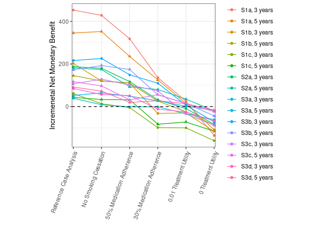

Process Sensitivity Analysis Results
================
16 September, 2024

This file processes results from the sensitivity analysis.

It aims to reproduce **Figure 4** and **Appendix 7**.

``` r
# Clear environment before start
rm(list=ls())

# Set save location for figures generated when knit rmd
knitr::opts_chunk$set(fig.path = "../outputs/")

# Load required libraries
library(dplyr)
library(ggplot2)
library(ggpubr)
```

## Import results

``` r
# Get all `ceplane` results files
files <- list.files("../outputs", pattern="*ceplane*")
print(files)
```

    ##  [1] "ceplane_5y.csv"                         
    ##  [2] "ceplane.csv"                            
    ##  [3] "Sen1_No_Smoking_Cessationceplane_5y.csv"
    ##  [4] "Sen1_No_Smoking_Cessationceplane.csv"   
    ##  [5] "Sen2_50_Med_Adherenceceplane_5y.csv"    
    ##  [6] "Sen2_50_Med_Adherenceceplane.csv"       
    ##  [7] "Sen3_30_Med_Adherenceceplane_5y.csv"    
    ##  [8] "Sen3_30_Med_Adherenceceplane.csv"       
    ##  [9] "Sen4_01_Treat_Utilceplane_5y.csv"       
    ## [10] "Sen4_01_Treat_Utilceplane.csv"          
    ## [11] "Sen5_0_Treat_Utilceplane_5y.csv"        
    ## [12] "Sen5_0_Treat_Utilceplane.csv"           
    ## [13] "Sen6_0_Discountceplane_5y.csv"          
    ## [14] "Sen6_0_Discountceplane.csv"             
    ## [15] "Sen7_3_Discountceplane_5y.csv"          
    ## [16] "Sen7_3_Discountceplane.csv"

## Combine into a single dataframe

``` r
# Define basic labels for each of the scenarios
labels <- list(
  "ceplane.csv" = "ref",
  "ceplane_5y.csv" = "ref",
  "Sen1_No_Smoking_Cessationceplane.csv" = "smoke",
  "Sen1_No_Smoking_Cessationceplane_5y.csv" = "smoke",
  "Sen2_50_Med_Adherenceceplane.csv" = "med50",
  "Sen2_50_Med_Adherenceceplane_5y.csv" = "med50",
  "Sen3_30_Med_Adherenceceplane.csv" = "med30",
  "Sen3_30_Med_Adherenceceplane_5y.csv" = "med30",
  "Sen4_01_Treat_Utilceplane.csv" = "util01",
  "Sen4_01_Treat_Utilceplane_5y.csv" = "util01",
  "Sen5_0_Treat_Utilceplane.csv" = "util0",
  "Sen5_0_Treat_Utilceplane_5y.csv" = "util0",
  "Sen6_0_Discountceplane.csv" = "discount0",
  "Sen6_0_Discountceplane_5y.csv" = "discount0",
  "Sen7_3_Discountceplane.csv" = "discount3",
  "Sen7_3_Discountceplane_5y.csv" = "discount3"
)
```

``` r
get_result <- function(file){
  #' Imports and processes the model result
  #' 
  #' @param file name of file in outputs/ to import and process

  # Import file
  df <- read.csv(paste0("../outputs/", file))

  # Add column with the sensitivity analysis scenario this corresponds to
  df$Analysis <- labels[[file]]

  # Detect whether the result was 3 years or 5 years from filename
  years <- ifelse(grepl("_5y", file), "5 years", "3 years")

  df_clean <- df %>%
    # Filter to Scenarios used in the plot
    filter(Scenario %in% c("S1a", "S1b", "S1c", "S2a", "S3a", "S3b", "S3c", "S3d")) %>%
    # Make column with scenario and years
    mutate(Years = years,
           Scen_Yrs = paste0(Scenario, ", ", Years)) %>%
    # Select required columns
    select(Analysis, Years, Scen_Yrs, INMB)

  return(df_clean)
}
```

``` r
# Apply get_result()
res_list <- lapply(files, get_result)

# Combine into single dataframe
res <- do.call(rbind, res_list)
```

## Define function to create figures

``` r
make_figure <- function(analysis){
  #' Create Figure 4 or Appendix 7 from Johnson et al. 2021
  #' 
  #' @param analysis list where keys are category from the Analysis column,
  #' and values are labels for each key

  # Create dataframe for plotting
  to_plot <- res %>%
    filter(Analysis %in% names(analysis)) %>%
    # Create a column with the labelled scenario
    mutate(AnalysisFull = recode(Analysis, !!!analysis)) %>%
    # Make the analysis column a factor (to fix order in the plots)
    mutate(AnalysisFull = factor(AnalysisFull, levels=unlist(unname(analysis))))
  
  # Create plot
  ggplot(to_plot, aes(x=AnalysisFull, y=INMB,
                      group=Scen_Yrs, shape=Years, color=Scen_Yrs)) +
    geom_line() +
    geom_point() +
    geom_hline(yintercept=0, linetype="dashed") +
    xlab("") +
    ylab("Incremenetal Net Monetary Benefit") +
    scale_x_discrete(expand = c(0.01,0)) +
    theme_bw() +
    theme(axis.text.x = element_text(angle=70, hjust=1),
          legend.title = element_blank())
}
```

## Figure 4

``` r
fig4_analysis <- list(
  "ref" = "Reference Case Analysis",
  "smoke" = "No Smoking Cessation",
  "med50" = "50% Medication Adherence",
  "med30" = "30% Medication Adherence",
  "util01" = "0.01 Treatment Utility",
  "util0" = "0 Treatment Utility"
)

make_figure(fig4_analysis)
```

<!-- -->

## Appendix 7

``` r
apx7_analysis <- list(
  "ref" = "Reference Case Analysis",
  "discount0" = "0% Discount Rate",
  "discount3" = "3% Discount Rate"
)

make_figure(apx7_analysis)
```

<!-- -->
