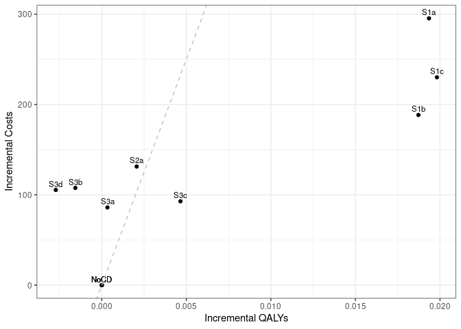

Sensitivity analysis: No Smoking Cessation
================
10 September, 2024

    ## 
    ## > errors<-c(
    ## +   ERR_INCORRECT_SETTING_VARIABLE=-1,
    ## +   ERR_INCORRECT_VECTOR_SIZE=-2,
    ## +   ERR_INCORRECT_INPUT_VAR=-3,
    ## +   ERR_EVENT_STACK_FULL=-4,
    ## +   .... [TRUNCATED] 
    ## 
    ## > record_mode<-c(
    ## +   record_mode_none=0,
    ## +   record_mode_agent=1,
    ## +   record_mode_event=2,
    ## +   record_mode_some_event=3
    ## + )
    ## 
    ## > agent_creation_mode<-c(
    ## +   agent_creation_mode_one=0,
    ## +   agent_creation_mode_all=1,
    ## +   agent_creation_mode_pre=2
    ## + )
    ## 
    ## > medication_classes<-c(
    ## +   MED_CLASS_SABA=1,
    ## +   MED_CLASS_LABA=2,
    ## +   MED_CLASS_LAMA=4,
    ## +   MED_CLASS_ICS=8,
    ## +   MED_CLASS_MACRO=16
    ## + )
    ## 
    ## > events<-c(
    ## +     event_start=0,
    ## +     event_fixed=1,
    ## +     event_birthday=2,
    ## +     event_smoking_change=3,
    ## +     event_COPD=4,
    ## +     event_exacerbat .... [TRUNCATED]

``` r
# CHANGE: Add a timer (will see addition below to print time too)
# Start timer
start.time <- Sys.time()
```

``` r
# CHANGE: Add save paths (will see later, we also add lines to save to csv)
outputs <- "../../outputs/Sen1_No_Smoking_Cessation"
files <- list(
  s1 = "s1.csv",
  s2 = "s2.csv",
  s3 = "s3.csv",
  sall = "sall.csv",
  ceplane = "ceplane.csv",
  clinical = "clinicalresults.csv"
)

# Apply file.path to each element in list to create path to file in outputs
paths <- lapply(files, function(filename) paste0(outputs, filename))
```

    ## Initializing the session

    ## [1] 0

**Global inputs:**

  - Medication adherence is 0.7
  - Smoking adherence is 0
  - Cost discounting: 0.015
  - QALY discounting: 0.015
  - Time horizon: 20
  - The WTP threshold for NMB is 50000

**Case detection inputs:**

  - Case detection occurs at 3 year intervals.
  - An outpatient diagnosis costs 61.18
  - The utility gain due to symptom relief from treatment is 0.0367

## S1 All patients scenario

All patients are eligible. The cost of case detection is:

| None | CDQ17 | FlowMeter | FlowMeter\_CDQ |
| ---: | ----: | --------: | -------------: |
|    0 | 11.56 |     30.46 |          42.01 |

#### S1NoCD: No Case detection

    ## [1] 0

    ## Terminating the session

    ## [1] 0

#### S1NoCD2: No Case detection- Other time interval

    ## Initializing the session

    ## [1] 0

    ## [1] 0

    ## Terminating the session

    ## [1] 0

#### S1A: CDQ ≥17 points

    ## Initializing the session

    ## [1] 0

    ## [1] 0

    ## Terminating the session

    ## [1] 0

#### S1B: Screening Spirometry with BD

    ## Initializing the session

    ## [1] 0

    ## [1] 0

    ## Terminating the session

    ## [1] 0

#### S1C: CDQ ≥17 points and Screening Spirometry with BD

    ## Initializing the session

    ## [1] 0

    ## [1] 0

    ## Terminating the session

    ## [1] 0

| Scenario  | Agents | PatientYears |  CopdPYs | NCaseDetections | DiagnosedPYs | OverdiagnosedPYs |  SABA |  LAMA | LAMALABA | ICSLAMALABA |   Mild | Moderate |  Severe | VerySevere | MildPY | ModeratePY | SeverePY | VerySeverePY |  NoCOPD |  GOLD1 |  GOLD2 |   GOLD3 | GOLD4 |      Cost | CostpAgent |    QALY | QALYpAgent |      NMB | IncrementalCosts | IncrementalQALY |     ICER | IncrementalNMB |
| :-------- | -----: | -----------: | -------: | --------------: | -----------: | ---------------: | ----: | ----: | -------: | ----------: | -----: | -------: | ------: | ---------: | -----: | ---------: | -------: | -----------: | ------: | -----: | -----: | ------: | ----: | --------: | ---------: | ------: | ---------: | -------: | ---------------: | --------------: | -------: | -------------: |
| S1NoCD    | 372380 |      6265935 | 712269.0 |         1911819 |     130760.2 |           133681 | 0.017 | 0.134 |    0.150 |       0.080 | 155016 |  28865.0 | 48874.0 |     4257.0 |  0.218 |      0.041 |    0.069 |        0.006 | 5279632 | 289757 | 306154 | 69265.0 | 12248 | 800039431 |   2148.449 | 4670895 |     12.543 | 625019.4 |            0.000 |           0.000 |      NaN |          0.000 |
| S1NoCD2   | 372310 |      6261342 | 714413.5 |         1246773 |     133941.0 |           164807 | 0.021 | 0.135 |    0.151 |       0.079 | 153844 |  28724.0 | 48627.0 |     4200.0 |  0.215 |      0.040 |    0.068 |        0.006 | 5272856 | 289933 | 308608 | 69530.0 | 11372 | 798731972 |   2145.341 | 4667372 |     12.536 | 624667.2 |            0.000 |           0.000 |      NaN |          0.000 |
| S1NoCDAvg | 372345 |      6263638 | 713341.2 |         1579296 |     132350.6 |           149244 | 0.019 | 0.135 |    0.151 |       0.080 | 154430 |  28794.5 | 48750.5 |     4228.5 |  0.216 |      0.040 |    0.068 |        0.006 | 5276244 | 289845 | 307381 | 69397.5 | 11810 | 799385701 |   2146.895 | 4669133 |     12.540 | 624843.3 |            0.000 |           0.000 |      NaN |          0.000 |
| S1a       | 372317 |      6267174 | 714638.0 |         1862751 |     332639.2 |           133994 | 0.026 | 0.160 |    0.312 |       0.095 | 150490 |  28236.0 | 47996.0 |     4104.0 |  0.211 |      0.040 |    0.067 |        0.006 | 5278234 | 288489 | 308587 | 70352.0 | 12236 | 909303378 |   2442.283 | 4675986 |     12.559 | 625515.4 |          293.834 |           0.016 | 18600.76 |        496.010 |
| S1b       | 372539 |      6272080 | 707060.7 |         1888385 |     235924.5 |           134439 | 0.022 | 0.149 |    0.240 |       0.088 | 148801 |  28131.0 | 47819.0 |     4109.0 |  0.210 |      0.040 |    0.068 |        0.006 | 5290290 | 288578 | 304530 | 67974.0 | 11300 | 869994855 |   2335.312 | 4678541 |     12.559 | 625591.1 |          186.863 |           0.015 | 12317.13 |        571.687 |
| S1c       | 372034 |      6266256 | 712395.1 |         1892828 |     206906.1 |           134925 | 0.020 | 0.145 |    0.215 |       0.086 | 151717 |  28793.0 | 47891.0 |     4184.0 |  0.213 |      0.040 |    0.067 |        0.006 | 5279494 | 287441 | 309053 | 69249.0 | 11806 | 884338769 |   2377.038 | 4672607 |     12.560 | 625604.1 |          228.589 |           0.016 | 14053.03 |        584.718 |

*Treatment rate:* SABA is expressed per all patient-years, LAMA,
LAMA/LABA, ICS/LAMA/LABA are per COPD patient-years *Exacerbations:*
Total exacerbations and rate per COPD patient-year: *GOLD Stage:*
Cumulative patient-years *Cost/QALY:* Total cost and QALYs *NMB:* Net
Monetary Benefit is calculated as QALY per patient-year \* Lamba - Cost
per patient-year

-----

## S2 Symptomatic patients scenario

Patients with symptoms at year 1 are eligible. The cost of case
detection is:

    ## Initializing the session

    ## [1] 0

| None | FlowMeter |
| ---: | --------: |
|    0 |     24.33 |

#### S2NoCD: No Case detection

    ## [1] 0

    ## Terminating the session

    ## [1] 0

#### S2a: Screening Spirometry without BD

    ## Initializing the session

    ## [1] 0

    ## [1] 0

    ## Terminating the session

    ## [1] 0

| Scenario | Agents | PatientYears |  CopdPYs | NCaseDetections | DiagnosedPYs | OverdiagnosedPYs |  SABA |  LAMA | LAMALABA | ICSLAMALABA |   Mild | Moderate | Severe | VerySevere | MildPY | ModeratePY | SeverePY | VerySeverePY |  NoCOPD |  GOLD1 |  GOLD2 | GOLD3 | GOLD4 |      Cost | CostpAgent |    QALY | QALYpAgent |      NMB | IncrementalCosts | IncrementalQALY |    ICER | IncrementalNMB |
| :------- | -----: | -----------: | -------: | --------------: | -----------: | ---------------: | ----: | ----: | -------: | ----------: | -----: | -------: | -----: | ---------: | -----: | ---------: | -------: | -----------: | ------: | -----: | -----: | ----: | ----: | --------: | ---------: | ------: | ---------: | -------: | ---------------: | --------------: | ------: | -------------: |
| S2NoCD   | 220672 |      3646308 | 502578.1 |         1110141 |     96247.49 |            77938 | 0.017 | 0.141 |    0.158 |       0.087 | 115097 |    21182 |  35308 |       3031 |  0.229 |      0.042 |     0.07 |        0.006 | 2988201 | 185992 | 226664 | 55060 | 10270 | 584381015 |   2648.188 | 2709801 |     12.280 | 611340.2 |            0.000 |           0.000 |     NaN |          0.000 |
| S2a      | 221092 |      3651066 | 499846.0 |         1090387 |    182750.48 |            78064 | 0.023 | 0.159 |    0.269 |       0.098 | 111323 |    20717 |  35000 |       2967 |  0.223 |      0.041 |     0.07 |        0.006 | 2995270 | 186009 | 223409 | 55954 |  9890 | 633874232 |   2867.016 | 2715995 |     12.284 | 611355.8 |          218.827 |           0.005 | 46673.7 |         15.595 |

*Treatment rate:* SABA is expressed per all patient-years, LAMA,
LAMA/LABA, ICS/LAMA/LABA are per COPD patient-years *Exacerbations:*
Total exacerbations and rate per COPD patient-year: *GOLD Stage:*
Cumulative patient-years *Cost/QALY:* Total cost and QALYs *NMB:* Net
Monetary Benefit is calculated as QALY per patient-year \* Lamba - Cost
per patient-year

-----

## S3 Smoking history scenario

Ever smokers ≥50 years of age are eligible. The cost of case detection
is:

    ## Initializing the session

    ## [1] 0

| None | CDQ195 | CDQ165 | FlowMeter | FlowMeter\_CDQ |
| ---: | -----: | -----: | --------: | -------------: |
|    0 |  11.56 |  11.56 |     24.33 |          42.01 |

#### S3NoCD: No Case detection

    ## [1] 0

    ## Terminating the session

    ## [1] 0

#### S3a: CDQ ≥19.5 points

    ## Initializing the session

    ## [1] 0

    ## [1] 0

    ## Terminating the session

    ## [1] 0

#### S3b: CDQ ≥16.5 points

    ## Initializing the session

    ## [1] 0

    ## [1] 0

    ## Terminating the session

    ## [1] 0

#### S3c: Screening spirometry without BD

    ## Initializing the session

    ## [1] 0

    ## [1] 0

    ## Terminating the session

    ## [1] 0

#### S3d: Screening Spirometry with BD + CDQ ≥17 points

    ## Initializing the session

    ## [1] 0

    ## [1] 0

    ## Terminating the session

    ## [1] 0

| Scenario | Agents | PatientYears |  CopdPYs | NCaseDetections | DiagnosedPYs | OverdiagnosedPYs |  SABA |  LAMA | LAMALABA | ICSLAMALABA |  Mild | Moderate | Severe | VerySevere | MildPY | ModeratePY | SeverePY | VerySeverePY |  NoCOPD |  GOLD1 |  GOLD2 | GOLD3 | GOLD4 |      Cost | CostpAgent |    QALY | QALYpAgent |      NMB | IncrementalCosts | IncrementalQALY |       ICER | IncrementalNMB |
| :------- | -----: | -----------: | -------: | --------------: | -----------: | ---------------: | ----: | ----: | -------: | ----------: | ----: | -------: | -----: | ---------: | -----: | ---------: | -------: | -----------: | ------: | -----: | -----: | ----: | ----: | --------: | ---------: | ------: | ---------: | -------: | ---------------: | --------------: | ---------: | -------------: |
| S3NoCD   | 173316 |      2617582 | 418083.2 |          805515 |     78733.46 |            58589 | 0.019 | 0.138 |    0.155 |       0.086 | 96848 |    17911 |  30521 |       2572 |  0.232 |      0.043 |    0.073 |        0.006 | 2090064 | 154040 | 187605 | 47611 |  8615 | 497655933 |   2871.379 | 1949999 |     11.251 | 559684.4 |            0.000 |           0.000 |        NaN |          0.000 |
| S3a      | 172749 |      2607014 | 419198.6 |          794675 |    111241.43 |            58440 | 0.021 | 0.143 |    0.204 |       0.089 | 97483 |    18377 |  30354 |       2505 |  0.233 |      0.044 |    0.072 |        0.006 | 2078815 | 153418 | 187874 | 48615 |  9032 | 528820123 |   3061.205 | 1942376 |     11.244 | 559134.9 |          189.826 |         \-0.007 | \-26385.63 |      \-549.541 |
| S3b      | 172604 |      2600802 | 414776.0 |          779054 |    168569.08 |            57911 | 0.027 | 0.152 |    0.288 |       0.096 | 93807 |    17298 |  28996 |       2538 |  0.226 |      0.042 |    0.070 |        0.006 | 2076928 | 152114 | 186309 | 47300 |  8918 | 536672767 |   3109.272 | 1939689 |     11.238 | 558780.8 |          237.893 |         \-0.013 | \-17865.77 |      \-903.671 |
| S3c      | 172691 |      2606695 | 414219.0 |          787597 |    139046.81 |            58443 | 0.024 | 0.149 |    0.248 |       0.095 | 96634 |    17838 |  29800 |       2526 |  0.233 |      0.043 |    0.072 |        0.006 | 2082987 | 151022 | 186034 | 48321 |  8981 | 531277666 |   3076.464 | 1943192 |     11.252 | 559544.7 |          205.085 |           0.001 |  156917.86 |      \-139.737 |
| S3d      | 172452 |      2599523 | 421140.5 |          788441 |    126587.62 |            58753 | 0.023 | 0.144 |    0.225 |       0.091 | 97963 |    18037 |  29857 |       2536 |  0.233 |      0.043 |    0.071 |        0.006 | 2069695 | 154957 | 188336 | 48401 |  9070 | 535593035 |   3105.751 | 1937182 |     11.233 | 558552.5 |          234.372 |         \-0.018 | \-13055.72 |     \-1131.957 |

*Treatment rate:* SABA is expressed per all patient-years, LAMA,
LAMA/LABA, ICS/LAMA/LABA are per COPD patient-years *Exacerbations:*
Total exacerbations and rate per COPD patient-year *GOLD Stage:*
Cumulative patient-years *Cost/QALY:* Total cost and QALYs *NMB:* Net
Monetary Benefit is calculated as QALY per patient-year \* Lamba - Cost
per patient-year

-----

## All Scenarios

*Ordered by descending Net Monetary Benefit*

| Scenario | Agents |      Cost | CostpAgent |    QALY | QALYpAgent |       ICER | IncrementalNMB |
| :------- | -----: | --------: | ---------: | ------: | ---------: | ---------: | -------------: |
| S1c      | 372034 | 884338769 |   2377.038 | 4672607 |     12.560 |   14053.03 |        584.718 |
| S1b      | 372539 | 869994855 |   2335.312 | 4678541 |     12.559 |   12317.13 |        571.687 |
| S1a      | 372317 | 909303378 |   2442.283 | 4675986 |     12.559 |   18600.76 |        496.010 |
| S2a      | 221092 | 633874232 |   2867.016 | 2715995 |     12.284 |   46673.70 |         15.595 |
| S1NoCD   | 372380 | 800039431 |   2148.449 | 4670895 |     12.543 |        NaN |          0.000 |
| S2NoCD   | 220672 | 584381015 |   2648.188 | 2709801 |     12.280 |        NaN |          0.000 |
| S3NoCD   | 173316 | 497655933 |   2871.379 | 1949999 |     11.251 |        NaN |          0.000 |
| S3c      | 172691 | 531277666 |   3076.464 | 1943192 |     11.252 |  156917.86 |      \-139.737 |
| S3a      | 172749 | 528820123 |   3061.205 | 1942376 |     11.244 | \-26385.63 |      \-549.541 |
| S3b      | 172604 | 536672767 |   3109.272 | 1939689 |     11.238 | \-17865.77 |      \-903.671 |
| S3d      | 172452 | 535593035 |   3105.751 | 1937182 |     11.233 | \-13055.72 |     \-1131.957 |

-----

## Cost Effectiveness Plane

Adjusted to the total population

| Scenario  | Agents | PropAgents |      Cost | CostpAgent | CostpAgentExcluded | CostpAgentAll |    QALY | QALYpAgent | QALYpAgentExcluded | QALYpAgentAll | IncrementalCosts | IncrementalQALY |    ICERAdj |       ICER |        INMB |
| :-------- | -----: | ---------: | --------: | ---------: | -----------------: | ------------: | ------: | ---------: | -----------------: | ------------: | ---------------: | --------------: | ---------: | ---------: | ----------: |
| S1NoCDAvg | 372345 |  1.0000000 | 799385701 |   2146.895 |              0.000 |      2146.895 | 4669133 |   12.53980 |            0.00000 |      12.53980 |          0.00000 |       0.0000000 |        NaN |        NaN |     0.00000 |
| S1a       | 372317 |  1.0000000 | 909303378 |   2442.283 |              0.000 |      2442.283 | 4675986 |   12.55915 |            0.00000 |      12.55915 |        295.38750 |       0.0193492 |   15266.10 |   18600.76 |   672.07478 |
| S1b       | 372539 |  1.0000000 | 869994855 |   2335.312 |              0.000 |      2335.312 | 4678541 |   12.55853 |            0.00000 |      12.55853 |        188.41693 |       0.0187234 |   10063.19 |   12317.13 |   747.75217 |
| S1c       | 372034 |  1.0000000 | 884338769 |   2377.038 |              0.000 |      2377.038 | 4672607 |   12.55962 |            0.00000 |      12.55962 |        230.14228 |       0.0198185 |   11612.49 |   14053.03 |   760.78344 |
| S2NoCD    | 220672 |  0.5926547 | 584381015 |   2648.188 |           1417.554 |      2146.895 | 2709801 |   12.27977 |           12.91814 |      12.53980 |          0.00000 |       0.0000000 |        NaN |        NaN |     0.00000 |
| S2a       | 221092 |  0.5937826 | 633874232 |   2867.016 |           1417.554 |      2278.219 | 2715995 |   12.28446 |           12.91814 |      12.54187 |        131.32403 |       0.0020638 |   63630.67 |   46673.70 |  \-28.13163 |
| S3NoCD    | 173316 |  0.4654715 | 497655933 |   2871.379 |           1516.009 |      2146.895 | 1949999 |   11.25112 |           13.66200 |      12.53980 |          0.00000 |       0.0000000 |        NaN |        NaN |     0.00000 |
| S3a       | 172749 |  0.4639488 | 528820123 |   3061.205 |           1516.009 |      2232.901 | 1942376 |   11.24392 |           13.66200 |      12.54014 |         86.00563 |       0.0003335 |  257912.00 | \-26385.63 |  \-69.33219 |
| S3b       | 172604 |  0.4635593 | 536672767 |   3109.272 |           1516.009 |      2254.581 | 1939689 |   11.23780 |           13.66200 |      12.53824 |        107.68570 |     \-0.0015624 | \-68921.25 | \-17865.77 | \-185.80798 |
| S3c       | 172691 |  0.4637930 | 531277666 |   3076.464 |           1516.009 |      2239.737 | 1943192 |   11.25242 |           13.66200 |      12.54446 |         92.84196 |       0.0046530 |   19953.34 |  156917.86 |   139.80576 |
| S3d       | 172452 |  0.4631511 | 535593035 |   3105.751 |           1516.009 |      2252.300 | 1937182 |   11.23316 |           13.66200 |      12.53708 |        105.40476 |     \-0.0027201 | \-38750.94 | \-13055.72 | \-241.40761 |

<!-- -->

## Clinical Results for all scenarios

Adjusted to the total population

| Scenario  | PropAgents | ProppPatientYears | ProppCopdPYs |   SABAAll |   LAMAAll | LAMALABAAll | ICSLAMALABAAll | MildpAgentAll | ModeratepAgentAll | SeverepAgentAll | VerySeverepAgentAll | NoCOPDpPYAll | GOLD1pPYAll | GOLD2pPYAll | GOLD3pPYAll | GOLD4pPYAll | DiagnosedpPYAll |
| :-------- | ---------: | ----------------: | -----------: | --------: | --------: | ----------: | -------------: | ------------: | ----------------: | --------------: | ------------------: | -----------: | ----------: | ----------: | ----------: | ----------: | --------------: |
| S1NoCDAvg |  1.0000000 |         1.0000000 |    1.0000000 | 0.0190064 | 0.1348172 |   0.1507949 |      0.0795208 |     0.4147498 |         0.0773328 |       0.1309283 |           0.0113564 |    0.8423609 |   0.0462742 |   0.0490739 |   0.0110794 |   0.0018855 |       0.1855361 |
| S1a       |  1.0000000 |         1.0000000 |    1.0000000 | 0.0262288 | 0.1598351 |   0.3118986 |      0.0945691 |     0.4041986 |         0.0758386 |       0.1289117 |           0.0110229 |    0.8422032 |   0.0460318 |   0.0492386 |   0.0112255 |   0.0019524 |       0.4654654 |
| S1b       |  1.0000000 |         1.0000000 |    1.0000000 | 0.0216906 | 0.1492133 |   0.2402455 |      0.0879284 |     0.3994240 |         0.0755116 |       0.1283597 |           0.0110297 |    0.8434666 |   0.0460099 |   0.0485533 |   0.0108376 |   0.0018016 |       0.3336693 |
| S1c       |  1.0000000 |         1.0000000 |    1.0000000 | 0.0203017 | 0.1446072 |   0.2154946 |      0.0857390 |     0.4078041 |         0.0773935 |       0.1287275 |           0.0112463 |    0.8425276 |   0.0458712 |   0.0493202 |   0.0110511 |   0.0018841 |       0.2904373 |
| S2NoCD    |  0.5926547 |         0.5821389 |    0.7045409 | 0.0190064 | 0.1348172 |   0.1507949 |      0.0795208 |     0.4147498 |         0.0773328 |       0.1309283 |           0.0113564 |    0.8423609 |   0.0462742 |   0.0490739 |   0.0110794 |   0.0018855 |       0.1855361 |
| S2a       |  0.5937826 |         0.5828986 |    0.7007109 | 0.0221728 | 0.1475796 |   0.2288062 |      0.0869481 |     0.4043215 |         0.0760274 |       0.1300011 |           0.0111756 |    0.8428254 |   0.0462468 |   0.0485308 |   0.0112180 |   0.0018244 |       0.3074568 |
| S3NoCD    |  0.4654715 |         0.4179012 |    0.5860915 | 0.0190064 | 0.1348172 |   0.1507949 |      0.0795208 |     0.4147498 |         0.0773328 |       0.1309283 |           0.0113564 |    0.8423609 |   0.0462742 |   0.0490739 |   0.0110794 |   0.0018855 |       0.1855361 |
| S3a       |  0.4639488 |         0.4162140 |    0.5876550 | 0.0201792 | 0.1376945 |   0.1798111 |      0.0816090 |     0.4168957 |         0.0786676 |       0.1306193 |           0.0111891 |    0.8420393 |   0.0462378 |   0.0491722 |   0.0112498 |   0.0019535 |       0.2308236 |
| S3b       |  0.4635593 |         0.4152223 |    0.5814552 | 0.0224019 | 0.1431166 |   0.2279525 |      0.0857091 |     0.4071358 |         0.0757911 |       0.1270078 |           0.0112810 |    0.8426047 |   0.0460665 |   0.0489550 |   0.0110458 |   0.0019362 |       0.3123144 |
| S3c       |  0.4637930 |         0.4161631 |    0.5806744 | 0.0212690 | 0.1409917 |   0.2048214 |      0.0846222 |     0.4146607 |         0.0772286 |       0.1291457 |           0.0112468 |    0.8427499 |   0.0458571 |   0.0488802 |   0.0112032 |   0.0019454 |       0.2710703 |
| S3d       |  0.4631511 |         0.4150180 |    0.5903774 | 0.0208534 | 0.1382478 |   0.1919223 |      0.0824395 |     0.4184156 |         0.0777981 |       0.1293575 |           0.0112790 |    0.8416285 |   0.0465280 |   0.0492853 |   0.0112228 |   0.0019607 |       0.2518424 |

## Time elapsed

Run time for this notebook:

``` r
end.time <- Sys.time()
time.taken <- end.time - start.time
time.taken
```

    ## Time difference of 8.590862 mins
