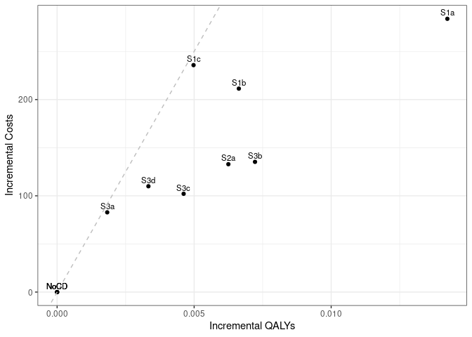

Sensitivity analysis: No Smoking Cessation
================
15 October, 2024

    ## 
    ## > errors<-c(
    ## +   ERR_INCORRECT_SETTING_VARIABLE=-1,
    ## +   ERR_INCORRECT_VECTOR_SIZE=-2,
    ## +   ERR_INCORRECT_INPUT_VAR=-3,
    ## +   ERR_EVENT_STACK_FULL=-4,
    ## +   .... [TRUNCATED] 
    ## 
    ## > record_mode<-c(
    ## +   record_mode_none=0,
    ## +   record_mode_agent=1,
    ## +   record_mode_event=2,
    ## +   record_mode_some_event=3
    ## + )
    ## 
    ## > agent_creation_mode<-c(
    ## +   agent_creation_mode_one=0,
    ## +   agent_creation_mode_all=1,
    ## +   agent_creation_mode_pre=2
    ## + )
    ## 
    ## > medication_classes<-c(
    ## +   MED_CLASS_SABA=1,
    ## +   MED_CLASS_LABA=2,
    ## +   MED_CLASS_LAMA=4,
    ## +   MED_CLASS_ICS=8,
    ## +   MED_CLASS_MACRO=16
    ## + )
    ## 
    ## > events<-c(
    ## +     event_start=0,
    ## +     event_fixed=1,
    ## +     event_birthday=2,
    ## +     event_smoking_change=3,
    ## +     event_COPD=4,
    ## +     event_exacerbat .... [TRUNCATED]

``` r
# CHANGE: Add a timer (will see addition below to print time too)
# Start timer
start.time <- Sys.time()
```

``` r
# CHANGE: Add save paths (will see later, we also add lines to save to csv)
outputs <- "../../outputs/Sen1_No_Smoking_Cessation"
files <- list(
  s1 = "s1.csv",
  s2 = "s2.csv",
  s3 = "s3.csv",
  sall = "sall.csv",
  ceplane = "ceplane.csv",
  clinical = "clinicalresults.csv"
)

# Apply to each element in list to create path to file in outputs
paths <- lapply(files, function(filename) paste0(outputs, filename))
```

    ## Initializing the session

    ## [1] 0

**Global inputs:**

  - Medication adherence is 0.7
  - Smoking adherence is 0
  - Cost discounting: 0.015
  - QALY discounting: 0.015
  - Time horizon: 20
  - The WTP threshold for NMB is 50000

**Case detection inputs:**

  - Case detection occurs at 3 year intervals.
  - An outpatient diagnosis costs 61.18
  - The utility gain due to symptom relief from treatment is 0.0367

## S1 All patients scenario

All patients are eligible. The cost of case detection is:

| None | CDQ17 | FlowMeter | FlowMeter\_CDQ |
| ---: | ----: | --------: | -------------: |
|    0 | 11.56 |     30.46 |          42.01 |

#### S1NoCD: No Case detection

    ## [1] 0

    ## Terminating the session

    ## [1] 0

#### S1NoCD2: No Case detection- Other time interval

    ## Initializing the session

    ## [1] 0

    ## [1] 0

    ## Terminating the session

    ## [1] 0

#### S1A: CDQ ≥17 points

    ## Initializing the session

    ## [1] 0

    ## [1] 0

    ## Terminating the session

    ## [1] 0

#### S1B: Screening Spirometry with BD

    ## Initializing the session

    ## [1] 0

    ## [1] 0

    ## Terminating the session

    ## [1] 0

#### S1C: CDQ ≥17 points and Screening Spirometry with BD

    ## Initializing the session

    ## [1] 0

    ## [1] 0

    ## Terminating the session

    ## [1] 0

| Scenario  |   Agents | PatientYears |  CopdPYs | NCaseDetections | DiagnosedPYs | OverdiagnosedPYs |  SABA |  LAMA | LAMALABA | ICSLAMALABA |     Mild | Moderate |  Severe | VerySevere | MildPY | ModeratePY | SeverePY | VerySeverePY |    NoCOPD |    GOLD1 |    GOLD2 |   GOLD3 |   GOLD4 |        Cost | CostpAgent |      QALY | QALYpAgent |      NMB | IncrementalCosts | IncrementalQALY |     ICER | IncrementalNMB |
| :-------- | -------: | -----------: | -------: | --------------: | -----------: | ---------------: | ----: | ----: | -------: | ----------: | -------: | -------: | ------: | ---------: | -----: | ---------: | -------: | -----------: | --------: | -------: | -------: | ------: | ------: | ----------: | ---------: | --------: | ---------: | -------: | ---------------: | --------------: | -------: | -------------: |
| S1NoCD    | 37204854 |    626018225 | 71202557 |       190989723 |     13185986 |         13393668 | 0.017 | 0.135 |    0.151 |       0.080 | 15418908 |  2881539 | 4847882 |   418531.0 |  0.217 |      0.040 |    0.068 |        0.006 | 527413624 | 28872284 | 30752411 | 6896116 | 1196927 | 79594247521 |   2139.351 | 466658875 |     12.543 | 625008.5 |            0.000 |           0.000 |      NaN |          0.000 |
| S1NoCD2   | 37191950 |    625889056 | 71140468 |       124648922 |     13317440 |         16364556 | 0.021 | 0.135 |    0.151 |       0.080 | 15424253 |  2881148 | 4845493 |   417620.0 |  0.217 |      0.040 |    0.068 |        0.006 | 527349723 | 28843031 | 30716736 | 6901546 | 1197088 | 79628195883 |   2141.006 | 466565294 |     12.545 | 625098.6 |            0.000 |           0.000 |      NaN |          0.000 |
| S1NoCDAvg | 37198402 |    625953640 | 71171513 |       157819322 |     13251713 |         14879112 | 0.019 | 0.135 |    0.151 |       0.080 | 15421580 |  2881344 | 4846688 |   418075.5 |  0.217 |      0.040 |    0.068 |        0.006 | 527381674 | 28857658 | 30734574 | 6898831 | 1197008 | 79611221702 |   2140.179 | 466612084 |     12.544 | 625053.6 |            0.000 |           0.000 |      NaN |          0.000 |
| S1a       | 37192142 |    625969287 | 71224394 |       186049005 |     33074933 |         13391900 | 0.026 | 0.158 |    0.309 |       0.094 | 14927938 |  2802971 | 4729427 |   409469.0 |  0.210 |      0.039 |    0.066 |        0.006 | 527343988 | 28826967 | 30773139 | 6928614 | 1207834 | 90029166181 |   2420.650 | 467067252 |     12.558 | 625490.6 |          281.299 |           0.015 | 18424.96 |        482.065 |
| S1b       | 37187925 |    625865189 | 71225582 |       188347039 |     23789318 |         13384883 | 0.022 | 0.148 |    0.240 |       0.087 | 15135261 |  2838459 | 4782768 |   413956.0 |  0.212 |      0.040 |    0.067 |        0.006 | 527244837 | 28851409 | 30762414 | 6920861 | 1204334 | 87358830750 |   2349.118 | 466782406 |     12.552 | 625250.3 |          209.767 |           0.009 | 23225.59 |        241.819 |
| S1c       | 37195823 |    625981366 | 71238478 |       189184178 |     20552964 |         13386224 | 0.020 | 0.144 |    0.214 |       0.085 | 15223475 |  2857925 | 4803132 |   415166.0 |  0.214 |      0.040 |    0.067 |        0.006 | 527342147 | 28839813 | 30776139 | 6931391 | 1205136 | 88369606438 |   2375.794 | 466792527 |     12.550 | 625104.0 |          236.443 |           0.007 | 35616.38 |         95.487 |

*Treatment rate:* SABA is expressed per all patient-years, LAMA,
LAMA/LABA, ICS/LAMA/LABA are per COPD patient-years *Exacerbations:*
Total exacerbations and rate per COPD patient-year: *GOLD Stage:*
Cumulative patient-years *Cost/QALY:* Total cost and QALYs *NMB:* Net
Monetary Benefit is calculated as QALY per patient-year \* Lamba - Cost
per patient-year

-----

## S2 Symptomatic patients scenario

Patients with symptoms at year 1 are eligible. The cost of case
detection is:

    ## Initializing the session

    ## [1] 0

| None | FlowMeter |
| ---: | --------: |
|    0 |     24.33 |

#### S2NoCD: No Case detection

    ## [1] 0

    ## Terminating the session

    ## [1] 0

#### S2a: Screening Spirometry without BD

    ## Initializing the session

    ## [1] 0

    ## [1] 0

    ## Terminating the session

    ## [1] 0

| Scenario |   Agents | PatientYears |  CopdPYs | NCaseDetections | DiagnosedPYs | OverdiagnosedPYs |  SABA |  LAMA | LAMALABA | ICSLAMALABA |     Mild | Moderate |  Severe | VerySevere | MildPY | ModeratePY | SeverePY | VerySeverePY |    NoCOPD |    GOLD1 |    GOLD2 |   GOLD3 |   GOLD4 |        Cost | CostpAgent |      QALY | QALYpAgent |      NMB | IncrementalCosts | IncrementalQALY |    ICER | IncrementalNMB |
| :------- | -------: | -----------: | -------: | --------------: | -----------: | ---------------: | ----: | ----: | -------: | ----------: | -------: | -------: | ------: | ---------: | -----: | ---------: | -------: | -----------: | --------: | -------: | -------: | ------: | ------: | ----------: | ---------: | --------: | ---------: | -------: | ---------------: | --------------: | ------: | -------------: |
| S2NoCD   | 22078475 |    364456518 | 50216445 |       110945016 |      9669472 |          7747302 | 0.017 | 0.141 |    0.159 |       0.087 | 11485953 |  2127051 | 3548098 |     303898 |  0.229 |      0.042 |    0.071 |        0.006 | 298681487 | 18624314 | 22530486 | 5565392 | 1033338 | 58623262798 |   2655.222 | 270860549 |     12.268 | 610748.9 |            0.000 |           0.000 |     NaN |          0.000 |
| S2a      | 22076350 |    364496013 | 50208573 |       108779574 |     18474524 |          7734901 | 0.023 | 0.157 |    0.268 |       0.097 | 11218640 |  2089613 | 3490800 |     299139 |  0.223 |      0.042 |    0.070 |        0.006 | 298727047 | 18618226 | 22519514 | 5573954 | 1032785 | 63456641765 |   2874.417 | 271102266 |     12.280 | 611136.2 |          219.195 |           0.012 | 18070.4 |        387.308 |

*Treatment rate:* SABA is expressed per all patient-years, LAMA,
LAMA/LABA, ICS/LAMA/LABA are per COPD patient-years *Exacerbations:*
Total exacerbations and rate per COPD patient-year: *GOLD Stage:*
Cumulative patient-years *Cost/QALY:* Total cost and QALYs *NMB:* Net
Monetary Benefit is calculated as QALY per patient-year \* Lamba - Cost
per patient-year

-----

## S3 Smoking history scenario

Ever smokers ≥50 years of age are eligible. The cost of case detection
is:

    ## Initializing the session

    ## [1] 0

| None | CDQ195 | CDQ165 | FlowMeter | FlowMeter\_CDQ |
| ---: | -----: | -----: | --------: | -------------: |
|    0 |  11.56 |  11.56 |     24.33 |          42.01 |

#### S3NoCD: No Case detection

    ## [1] 0

    ## Terminating the session

    ## [1] 0

#### S3a: CDQ ≥19.5 points

    ## Initializing the session

    ## [1] 0

    ## [1] 0

    ## Terminating the session

    ## [1] 0

#### S3b: CDQ ≥16.5 points

    ## Initializing the session

    ## [1] 0

    ## [1] 0

    ## Terminating the session

    ## [1] 0

#### S3c: Screening spirometry without BD

    ## Initializing the session

    ## [1] 0

    ## [1] 0

    ## Terminating the session

    ## [1] 0

#### S3d: Screening Spirometry with BD + CDQ ≥17 points

    ## Initializing the session

    ## [1] 0

    ## [1] 0

    ## Terminating the session

    ## [1] 0

| Scenario |   Agents | PatientYears |  CopdPYs | NCaseDetections | DiagnosedPYs | OverdiagnosedPYs |  SABA |  LAMA | LAMALABA | ICSLAMALABA |    Mild | Moderate |  Severe | VerySevere | MildPY | ModeratePY | SeverePY | VerySeverePY |    NoCOPD |    GOLD1 |    GOLD2 |   GOLD3 |  GOLD4 |        Cost | CostpAgent |      QALY | QALYpAgent |      NMB | IncrementalCosts | IncrementalQALY |      ICER | IncrementalNMB |
| :------- | -------: | -----------: | -------: | --------------: | -----------: | ---------------: | ----: | ----: | -------: | ----------: | ------: | -------: | ------: | ---------: | -----: | ---------: | -------: | -----------: | --------: | -------: | -------: | ------: | -----: | ----------: | ---------: | --------: | ---------: | -------: | ---------------: | --------------: | --------: | -------------: |
| S3NoCD   | 17251004 |    260100353 | 41760352 |        80093301 |      7808220 |          5817970 | 0.018 | 0.137 |    0.154 |       0.086 | 9778778 |  1815130 | 3033059 |     260471 |  0.234 |      0.043 |    0.073 |        0.006 | 207449252 | 15297713 | 18728772 | 4824301 | 894240 | 49706422473 |   2881.364 | 193732612 |     11.230 | 558629.8 |            0.000 |           0.000 |       NaN |          0.000 |
| S3a      | 17249134 |    260008283 | 41776161 |        79278529 |     11011389 |          5822190 | 0.021 | 0.143 |    0.204 |       0.090 | 9676022 |  1805447 | 3016891 |     260109 |  0.232 |      0.043 |    0.072 |        0.006 | 207345092 | 15302232 | 18726703 | 4829095 | 900681 | 52783263535 |   3060.053 | 193741259 |     11.232 | 558537.0 |          178.689 |           0.002 | 103962.75 |       \-92.750 |
| S3b      | 17250219 |    260104940 | 41785281 |        77779970 |     17177315 |          5822903 | 0.027 | 0.155 |    0.293 |       0.099 | 9510791 |  1780204 | 2977917 |     255631 |  0.228 |      0.043 |    0.071 |        0.006 | 207430795 | 15293333 | 18729492 | 4839340 | 904959 | 54744732216 |   3173.567 | 193956703 |     11.244 | 559012.6 |          292.203 |           0.014 |  21642.00 |        382.881 |
| S3c      | 17252836 |    260148464 | 41767142 |        78572238 |     14061462 |          5825793 | 0.024 | 0.149 |    0.249 |       0.095 | 9589326 |  1791300 | 2996772 |     256745 |  0.230 |      0.043 |    0.072 |        0.006 | 207489733 | 15294751 | 18722619 | 4831059 | 901887 | 53445425796 |   3097.776 | 193919005 |     11.240 | 558893.9 |          216.412 |           0.010 |  22516.88 |        264.143 |
| S3d      | 17252575 |    260145756 | 41795158 |        78912696 |     12676670 |          5832474 | 0.023 | 0.146 |    0.229 |       0.093 | 9621629 |  1796623 | 3007738 |     257735 |  0.230 |      0.043 |    0.072 |        0.006 | 207459074 | 15309738 | 18741138 | 4826857 | 900538 | 53805052918 |   3118.668 | 193882222 |     11.238 | 558774.9 |          237.304 |           0.008 |  31023.66 |        145.152 |

*Treatment rate:* SABA is expressed per all patient-years, LAMA,
LAMA/LABA, ICS/LAMA/LABA are per COPD patient-years *Exacerbations:*
Total exacerbations and rate per COPD patient-year *GOLD Stage:*
Cumulative patient-years *Cost/QALY:* Total cost and QALYs *NMB:* Net
Monetary Benefit is calculated as QALY per patient-year \* Lamba - Cost
per patient-year

-----

## All Scenarios

*Ordered by descending Net Monetary Benefit*

| Scenario |   Agents |        Cost | CostpAgent |      QALY | QALYpAgent |      ICER | IncrementalNMB |
| :------- | -------: | ----------: | ---------: | --------: | ---------: | --------: | -------------: |
| S1a      | 37192142 | 90029166181 |   2420.650 | 467067252 |     12.558 |  18424.96 |        482.065 |
| S2a      | 22076350 | 63456641765 |   2874.417 | 271102266 |     12.280 |  18070.40 |        387.308 |
| S3b      | 17250219 | 54744732216 |   3173.567 | 193956703 |     11.244 |  21642.00 |        382.881 |
| S3c      | 17252836 | 53445425796 |   3097.776 | 193919005 |     11.240 |  22516.88 |        264.143 |
| S1b      | 37187925 | 87358830750 |   2349.118 | 466782406 |     12.552 |  23225.59 |        241.819 |
| S3d      | 17252575 | 53805052918 |   3118.668 | 193882222 |     11.238 |  31023.66 |        145.152 |
| S1c      | 37195823 | 88369606438 |   2375.794 | 466792527 |     12.550 |  35616.38 |         95.487 |
| S1NoCD   | 37204854 | 79594247521 |   2139.351 | 466658875 |     12.543 |       NaN |          0.000 |
| S2NoCD   | 22078475 | 58623262798 |   2655.222 | 270860549 |     12.268 |       NaN |          0.000 |
| S3NoCD   | 17251004 | 49706422473 |   2881.364 | 193732612 |     11.230 |       NaN |          0.000 |
| S3a      | 17249134 | 52783263535 |   3060.053 | 193741259 |     11.232 | 103962.75 |       \-92.750 |

-----

## Cost Effectiveness Plane

Adjusted to the total population

| Scenario  |   Agents | PropAgents |        Cost | CostpAgent | CostpAgentExcluded | CostpAgentAll |      QALY | QALYpAgent | QALYpAgentExcluded | QALYpAgentAll | IncrementalCosts | IncrementalQALY |  ICERAdj |      ICER |       INMB |
| :-------- | -------: | ---------: | ----------: | ---------: | -----------------: | ------------: | --------: | ---------: | -----------------: | ------------: | ---------------: | --------------: | -------: | --------: | ---------: |
| S1NoCDAvg | 37198402 |  1.0000000 | 79611221702 |   2140.179 |              0.000 |      2140.179 | 466612084 |   12.54387 |            0.00000 |      12.54387 |           0.0000 |       0.0000000 |      NaN |       NaN |    0.00000 |
| S1a       | 37192142 |  1.0000000 | 90029166181 |   2420.650 |              0.000 |      2420.650 | 467067252 |   12.55822 |            0.00000 |      12.55822 |         280.4717 |       0.0143496 | 19545.61 |  18424.96 |  437.00810 |
| S1b       | 37187925 |  1.0000000 | 87358830750 |   2349.118 |              0.000 |      2349.118 | 466782406 |   12.55199 |            0.00000 |      12.55199 |         208.9396 |       0.0081140 | 25750.41 |  23225.59 |  196.76202 |
| S1c       | 37195823 |  1.0000000 | 88369606438 |   2375.794 |              0.000 |      2375.794 | 466792527 |   12.54960 |            0.00000 |      12.54960 |         235.6153 |       0.0057209 | 41184.96 |  35616.38 |   50.43005 |
| S2NoCD    | 22078475 |  0.5935329 | 58623262798 |   2655.222 |           1388.099 |      2140.179 | 270860549 |   12.26808 |           12.94659 |      12.54387 |           0.0000 |       0.0000000 |      NaN |       NaN |    0.00000 |
| S2a       | 22076350 |  0.5934758 | 63456641765 |   2874.417 |           1388.099 |      2270.193 | 271102266 |   12.28021 |           12.94659 |      12.55111 |         130.0144 |       0.0072377 | 17963.62 |  18070.40 |  231.86809 |
| S3NoCD    | 17251004 |  0.4637566 | 49706422473 |   2881.364 |           1499.183 |      2140.179 | 193732612 |   11.23022 |           13.67995 |      12.54387 |           0.0000 |       0.0000000 |      NaN |       NaN |    0.00000 |
| S3a       | 17249134 |  0.4637063 | 52783263535 |   3060.053 |           1499.183 |      2222.968 | 193741259 |   11.23194 |           13.67995 |      12.54479 |          82.7897 |       0.0009202 | 89973.28 | 103962.75 | \-36.78176 |
| S3b       | 17250219 |  0.4637355 | 54744732216 |   3173.567 |           1499.183 |      2275.654 | 193956703 |   11.24372 |           13.67995 |      12.55019 |         135.4759 |       0.0063129 | 21460.15 |  21642.00 |  180.16932 |
| S3c       | 17252836 |  0.4638058 | 53445425796 |   3097.776 |           1499.183 |      2240.620 | 193919005 |   11.23983 |           13.67995 |      12.54821 |         100.4413 |       0.0043370 | 23158.95 |  22516.88 |  116.41073 |
| S3d       | 17252575 |  0.4637988 | 53805052918 |   3118.668 |           1499.183 |      2250.298 | 193882222 |   11.23787 |           13.67995 |      12.54732 |         110.1197 |       0.0034442 | 31972.52 |  31023.66 |   62.09018 |

<!-- -->

## Clinical Results for all scenarios

Adjusted to the total population

| Scenario  | PropAgents | ProppPatientYears | ProppCopdPYs |   SABAAll |   LAMAAll | LAMALABAAll | ICSLAMALABAAll | MildpAgentAll | ModeratepAgentAll | SeverepAgentAll | VerySeverepAgentAll | NoCOPDpPYAll | GOLD1pPYAll | GOLD2pPYAll | GOLD3pPYAll | GOLD4pPYAll | DiagnosedpPYAll |
| :-------- | ---------: | ----------------: | -----------: | --------: | --------: | ----------: | -------------: | ------------: | ----------------: | --------------: | ------------------: | -----------: | ----------: | ----------: | ----------: | ----------: | --------------: |
| S1NoCDAvg |  1.0000000 |         1.0000000 |    1.0000000 | 0.0190548 | 0.1354468 |   0.1513316 |      0.0796706 |     0.4145764 |         0.0774588 |       0.1302929 |           0.0112391 |    0.8425251 |   0.0461019 |   0.0491004 |   0.0110213 |   0.0019123 |       0.1861941 |
| S1a       |  1.0000000 |         1.0000000 |    1.0000000 | 0.0264454 | 0.1583594 |   0.3090867 |      0.0938685 |     0.4013734 |         0.0753646 |       0.1271620 |           0.0110096 |    0.8424439 |   0.0460517 |   0.0491608 |   0.0110686 |   0.0019295 |       0.4643765 |
| S1b       |  1.0000000 |         1.0000000 |    1.0000000 | 0.0216384 | 0.1475344 |   0.2402284 |      0.0873071 |     0.4069940 |         0.0763274 |       0.1286108 |           0.0111315 |    0.8424256 |   0.0460984 |   0.0491518 |   0.0110581 |   0.0019243 |       0.3339996 |
| S1c       |  1.0000000 |         1.0000000 |    1.0000000 | 0.0201783 | 0.1438319 |   0.2141226 |      0.0849923 |     0.4092792 |         0.0768346 |       0.1291310 |           0.0111616 |    0.8424247 |   0.0460714 |   0.0491646 |   0.0110728 |   0.0019252 |       0.2885093 |
| S2NoCD    |  0.5935329 |         0.5822420 |    0.7055694 | 0.0190548 | 0.1354468 |   0.1513316 |      0.0796706 |     0.4145764 |         0.0774588 |       0.1302929 |           0.0112391 |    0.8425251 |   0.0461019 |   0.0491004 |   0.0110213 |   0.0019123 |       0.1861941 |
| S2a       |  0.5934758 |         0.5823051 |    0.7054588 | 0.0224000 | 0.1461087 |   0.2284248 |      0.0865713 |     0.4074052 |         0.0764552 |       0.1287575 |           0.0111116 |    0.8425427 |   0.0460897 |   0.0490809 |   0.0110347 |   0.0019114 |       0.3099289 |
| S3NoCD    |  0.4637566 |         0.4155265 |    0.5867566 | 0.0190548 | 0.1354468 |   0.1513316 |      0.0796706 |     0.4145764 |         0.0774588 |       0.1302929 |           0.0112391 |    0.8425251 |   0.0461019 |   0.0491004 |   0.0110213 |   0.0019123 |       0.1861941 |
| S3a       |  0.4637063 |         0.4153795 |    0.5869787 | 0.0201725 | 0.1391827 |   0.1806146 |      0.0822113 |     0.4118283 |         0.0772012 |       0.1298628 |           0.0112297 |    0.8424874 |   0.0461146 |   0.0491019 |   0.0110298 |   0.0019227 |       0.2311593 |
| S3b       |  0.4637355 |         0.4155339 |    0.5871068 | 0.0227387 | 0.1465216 |   0.2329580 |      0.0870327 |     0.4073781 |         0.0765210 |       0.1288124 |           0.0111091 |    0.8424892 |   0.0460946 |   0.0491013 |   0.0110453 |   0.0019294 |       0.3177703 |
| S3c       |  0.4638058 |         0.4156034 |    0.5868520 | 0.0213773 | 0.1429184 |   0.2072041 |      0.0846795 |     0.4094695 |         0.0768155 |       0.1293129 |           0.0111385 |    0.8425226 |   0.0460943 |   0.0490880 |   0.0110317 |   0.0019244 |       0.2740380 |
| S3d       |  0.4637988 |         0.4155991 |    0.5872456 | 0.0208136 | 0.1411855 |   0.1953009 |      0.0836058 |     0.4103399 |         0.0769590 |       0.1296084 |           0.0111652 |    0.8424774 |   0.0461184 |   0.0491178 |   0.0110250 |   0.0019223 |       0.2545080 |

## Time elapsed

Run time for this notebook:

``` r
end.time <- Sys.time()
time.taken <- end.time - start.time
time.taken
```

    ## Time difference of 15.45267 hours
