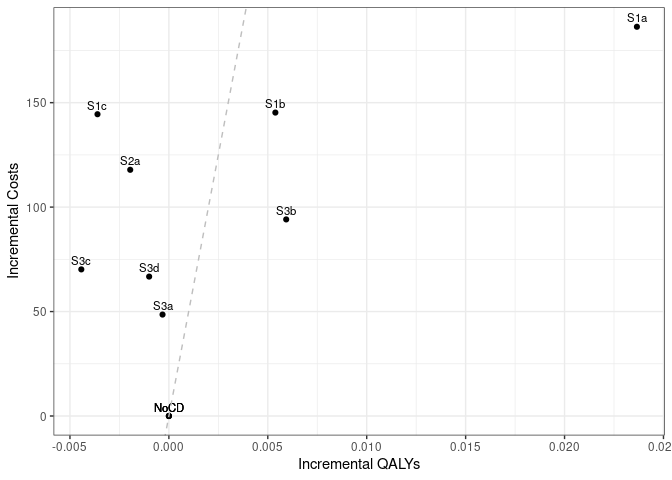

Sensitivity analysis: No Smoking Cessation
================
10 September, 2024

    ## 
    ## > errors<-c(
    ## +   ERR_INCORRECT_SETTING_VARIABLE=-1,
    ## +   ERR_INCORRECT_VECTOR_SIZE=-2,
    ## +   ERR_INCORRECT_INPUT_VAR=-3,
    ## +   ERR_EVENT_STACK_FULL=-4,
    ## +   .... [TRUNCATED] 
    ## 
    ## > record_mode<-c(
    ## +   record_mode_none=0,
    ## +   record_mode_agent=1,
    ## +   record_mode_event=2,
    ## +   record_mode_some_event=3
    ## + )
    ## 
    ## > agent_creation_mode<-c(
    ## +   agent_creation_mode_one=0,
    ## +   agent_creation_mode_all=1,
    ## +   agent_creation_mode_pre=2
    ## + )
    ## 
    ## > medication_classes<-c(
    ## +   MED_CLASS_SABA=1,
    ## +   MED_CLASS_LABA=2,
    ## +   MED_CLASS_LAMA=4,
    ## +   MED_CLASS_ICS=8,
    ## +   MED_CLASS_MACRO=16
    ## + )
    ## 
    ## > events<-c(
    ## +     event_start=0,
    ## +     event_fixed=1,
    ## +     event_birthday=2,
    ## +     event_smoking_change=3,
    ## +     event_COPD=4,
    ## +     event_exacerbat .... [TRUNCATED]

``` r
# CHANGE: Add a timer (will see addition below to print time too)
# Start timer
start.time <- Sys.time()
```

``` r
# CHANGE: Add save paths (will see later, we also add lines to save to csv)
outputs <- "../../outputs/Sen1_No_Smoking_Cessation"
files <- list(
  s1 = "s1_5y.csv",
  s2 = "s2_5y.csv",
  s3 = "s3_5y.csv",
  sall = "sall_5y.csv",
  ceplane = "ceplane_5y.csv",
  clinical = "clinicalresults_5y.csv"
)

# Apply to each element in list to create path to file in outputs
paths <- lapply(files, function(filename) paste0(outputs, filename))
```

    ## Initializing the session

    ## [1] 0

**Global inputs:**

  - Medication adherence is 0.7
  - Smoking adherence is 0
  - Cost discounting: 0.015
  - QALY discounting: 0.015
  - Time horizon: 20
  - The WTP threshold for NMB is 50000

**Case detection inputs:**

  - Case detection occurs at 5 year intervals.
  - An outpatient diagnosis costs 61.18
  - The utility gain due to symptom relief from treatment is 0.0367

## S1 All patients scenario

All patients are eligible. The cost of case detection is:

| None | CDQ17 | FlowMeter | FlowMeter\_CDQ |
| ---: | ----: | --------: | -------------: |
|    0 | 11.56 |     30.46 |          42.01 |

#### S1NoCD2: No Case detection- Other time interval

    ## [1] 0

    ## Terminating the session

    ## [1] 0

#### S1NoCD: No Case detection

    ## Initializing the session

    ## [1] 0

    ## [1] 0

    ## Terminating the session

    ## [1] 0

#### S1A: CDQ ≥17 points

    ## Initializing the session

    ## [1] 0

    ## [1] 0

    ## Terminating the session

    ## [1] 0

#### S1B: Screening Spirometry with BD

    ## Initializing the session

    ## [1] 0

    ## [1] 0

    ## Terminating the session

    ## [1] 0

#### S1C: CDQ ≥17 points and Screening Spirometry with BD

    ## Initializing the session

    ## [1] 0

    ## [1] 0

    ## Terminating the session

    ## [1] 0

| Scenario  | Agents | PatientYears |  CopdPYs | NCaseDetections | DiagnosedPYs | OverdiagnosedPYs |  SABA |  LAMA | LAMALABA | ICSLAMALABA |   Mild | Moderate |  Severe | VerySevere | MildPY | ModeratePY | SeverePY | VerySeverePY |  NoCOPD |  GOLD1 |  GOLD2 |   GOLD3 | GOLD4 |      Cost | CostpAgent |    QALY | QALYpAgent |      NMB | IncrementalCosts | IncrementalQALY |          ICER | IncrementalNMB |
| :-------- | -----: | -----------: | -------: | --------------: | -----------: | ---------------: | ----: | ----: | -------: | ----------: | -----: | -------: | ------: | ---------: | -----: | ---------: | -------: | -----------: | ------: | -----: | -----: | ------: | ----: | --------: | ---------: | ------: | ---------: | -------: | ---------------: | --------------: | ------------: | -------------: |
| S1NoCD2   | 372380 |      6265935 | 712269.0 |         1911819 |     130760.2 |           133681 | 0.017 | 0.134 |    0.150 |       0.080 | 155016 |  28865.0 | 48874.0 |     4257.0 |  0.218 |      0.041 |    0.069 |        0.006 | 5279632 | 289757 | 306154 | 69265.0 | 12248 | 800039431 |   2148.449 | 4670895 |     12.543 | 625019.4 |            0.000 |           0.000 |           NaN |          0.000 |
| S1NoCD    | 372310 |      6261342 | 714413.5 |         1246773 |     133941.0 |           164807 | 0.021 | 0.135 |    0.151 |       0.079 | 153844 |  28724.0 | 48627.0 |     4200.0 |  0.215 |      0.040 |    0.068 |        0.006 | 5272856 | 289933 | 308608 | 69530.0 | 11372 | 798731972 |   2145.341 | 4667372 |     12.536 | 624667.2 |            0.000 |           0.000 |           NaN |          0.000 |
| S1NoCDAvg | 372345 |      6263638 | 713341.2 |         1579296 |     132350.6 |           149244 | 0.019 | 0.135 |    0.151 |       0.080 | 154430 |  28794.5 | 48750.5 |     4228.5 |  0.216 |      0.040 |    0.068 |        0.006 | 5276244 | 289845 | 307381 | 69397.5 | 11810 | 799385701 |   2146.895 | 4669133 |     12.540 | 624843.3 |            0.000 |           0.000 |           NaN |          0.000 |
| S1a       | 371318 |      6253297 | 707774.2 |         1226385 |     283398.7 |           164613 | 0.028 | 0.156 |    0.275 |       0.092 | 149468 |  28093.0 | 47429.0 |     4022.0 |  0.211 |      0.040 |    0.067 |        0.006 | 5271446 | 285265 | 306588 | 69197.0 | 12223 | 866371385 |   2333.233 | 4665040 |     12.563 | 625839.9 |          187.892 |           0.027 |      6905.036 |       1172.650 |
| S1b       | 372160 |      6260867 | 713639.5 |         1237335 |     209805.7 |           164232 | 0.024 | 0.145 |    0.217 |       0.087 | 152248 |  28524.0 | 48279.0 |     4133.0 |  0.213 |      0.040 |    0.068 |        0.006 | 5273181 | 289050 | 308952 | 68761.0 | 12021 | 853048522 |   2292.155 | 4668817 |     12.545 | 624967.2 |          146.814 |           0.009 |     16430.174 |        299.968 |
| S1c       | 372248 |      6258066 | 713171.0 |         1240086 |     185048.2 |           164244 | 0.023 | 0.140 |    0.195 |       0.083 | 153098 |  28742.0 | 48110.0 |     4105.0 |  0.215 |      0.040 |    0.067 |        0.006 | 5270952 | 290389 | 307756 | 68302.0 | 11844 | 852957074 |   2291.368 | 4666574 |     12.536 | 624518.4 |          146.027 |           0.000 | \-2659581.345 |      \-148.772 |

*Treatment rate:* SABA is expressed per all patient-years, LAMA,
LAMA/LABA, ICS/LAMA/LABA are per COPD patient-years *Exacerbations:*
Total exacerbations and rate per COPD patient-year: *GOLD Stage:*
Cumulative patient-years *Cost/QALY:* Total cost and QALYs *NMB:* Net
Monetary Benefit is calculated as QALY per patient-year \* Lamba - Cost
per patient-year

-----

## S2 Symptomatic patients scenario

Patients with symptoms at year 1 are eligible. The cost of case
detection is:

    ## Initializing the session

    ## [1] 0

| None | FlowMeter |
| ---: | --------: |
|    0 |     24.33 |

#### S2NoCD: No Case detection

    ## [1] 0

    ## Terminating the session

    ## [1] 0

#### S2a: Screening Spirometry without BD

    ## Initializing the session

    ## [1] 0

    ## [1] 0

    ## Terminating the session

    ## [1] 0

| Scenario | Agents | PatientYears |  CopdPYs | NCaseDetections | DiagnosedPYs | OverdiagnosedPYs |  SABA |  LAMA | LAMALABA | ICSLAMALABA |   Mild | Moderate | Severe | VerySevere | MildPY | ModeratePY | SeverePY | VerySeverePY |  NoCOPD |  GOLD1 |  GOLD2 | GOLD3 | GOLD4 |      Cost | CostpAgent |    QALY | QALYpAgent |      NMB | IncrementalCosts | IncrementalQALY |       ICER | IncrementalNMB |
| :------- | -----: | -----------: | -------: | --------------: | -----------: | ---------------: | ----: | ----: | -------: | ----------: | -----: | -------: | -----: | ---------: | -----: | ---------: | -------: | -----------: | ------: | -----: | -----: | ----: | ----: | --------: | ---------: | ------: | ---------: | -------: | ---------------: | --------------: | ---------: | -------------: |
| S2NoCD   | 220307 |      3639677 | 505565.5 |          723638 |     97786.68 |            93935 | 0.021 | 0.140 |    0.158 |       0.087 | 116117 |    21211 |  34954 |       2947 |  0.230 |      0.042 |    0.069 |        0.006 | 2978976 | 188666 | 227333 | 54796 | 10027 | 580518447 |   2635.043 | 2704713 |     12.277 | 611215.8 |            0.000 |           0.000 |        NaN |          0.000 |
| S2a      | 220415 |      3638221 | 501917.5 |          715143 |    163146.32 |            94966 | 0.025 | 0.156 |    0.243 |       0.097 | 112438 |    20618 |  35416 |       2950 |  0.224 |      0.041 |    0.071 |        0.006 | 2981136 | 184454 | 226297 | 56182 | 10396 | 624560910 |   2833.568 | 2705381 |     12.274 | 610868.1 |          198.525 |         \-0.003 | \-66504.04 |      \-347.783 |

*Treatment rate:* SABA is expressed per all patient-years, LAMA,
LAMA/LABA, ICS/LAMA/LABA are per COPD patient-years *Exacerbations:*
Total exacerbations and rate per COPD patient-year: *GOLD Stage:*
Cumulative patient-years *Cost/QALY:* Total cost and QALYs *NMB:* Net
Monetary Benefit is calculated as QALY per patient-year \* Lamba - Cost
per patient-year

-----

## S3 Smoking history scenario

Ever smokers ≥50 years of age are eligible. The cost of case detection
is:

    ## Initializing the session

    ## [1] 0

| None | CDQ195 | CDQ165 | FlowMeter | FlowMeter\_CDQ |
| ---: | -----: | -----: | --------: | -------------: |
|    0 |  11.56 |  11.56 |     24.33 |          42.01 |

#### S3NoCD: No Case detection

    ## [1] 0

    ## Terminating the session

    ## [1] 0

#### S3a: CDQ ≥19.5 points

    ## Initializing the session

    ## [1] 0

    ## [1] 0

    ## Terminating the session

    ## [1] 0

#### S3b: CDQ ≥16.5 points

    ## Initializing the session

    ## [1] 0

    ## [1] 0

    ## Terminating the session

    ## [1] 0

#### S3c: Screening spirometry without BD

    ## Initializing the session

    ## [1] 0

    ## [1] 0

    ## Terminating the session

    ## [1] 0

#### S3d: Screening Spirometry with BD + CDQ ≥17 points

    ## Initializing the session

    ## [1] 0

    ## [1] 0

    ## Terminating the session

    ## [1] 0

| Scenario | Agents | PatientYears |  CopdPYs | NCaseDetections | DiagnosedPYs | OverdiagnosedPYs |  SABA |  LAMA | LAMALABA | ICSLAMALABA |  Mild | Moderate | Severe | VerySevere | MildPY | ModeratePY | SeverePY | VerySeverePY |  NoCOPD |  GOLD1 |  GOLD2 | GOLD3 | GOLD4 |      Cost | CostpAgent |    QALY | QALYpAgent |      NMB | IncrementalCosts | IncrementalQALY |       ICER | IncrementalNMB |
| :------- | -----: | -----------: | -------: | --------------: | -----------: | ---------------: | ----: | ----: | -------: | ----------: | ----: | -------: | -----: | ---------: | -----: | ---------: | -------: | -----------: | ------: | -----: | -----: | ----: | ----: | --------: | ---------: | ------: | ---------: | -------: | ---------------: | --------------: | ---------: | -------------: |
| S3NoCD   | 172589 |      2604637 | 418319.6 |          524971 |     79086.89 |            71678 | 0.022 | 0.138 |    0.155 |       0.089 | 98302 |    18321 |  30122 |       2519 |  0.235 |      0.044 |    0.072 |        0.006 | 2077411 | 152315 | 188388 | 48452 |  8801 | 495927340 |   2873.459 | 1939934 |     11.240 | 559136.2 |            0.000 |           0.000 |        NaN |          0.000 |
| S3a      | 172075 |      2593876 | 416479.3 |          520328 |    100059.70 |            71084 | 0.024 | 0.138 |    0.185 |       0.088 | 95853 |    18110 |  30132 |       2463 |  0.230 |      0.043 |    0.072 |        0.006 | 2068677 | 154661 | 184797 | 48193 |  8843 | 513227947 |   2982.583 | 1932792 |     11.232 | 558630.6 |          109.124 |         \-0.008 | \-13761.87 |      \-505.598 |
| S3b      | 172244 |      2599096 | 416839.0 |          515542 |    147739.33 |            70668 | 0.029 | 0.151 |    0.256 |       0.096 | 96068 |    17750 |  29634 |       2637 |  0.230 |      0.043 |    0.071 |        0.006 | 2073388 | 151932 | 188294 | 47494 |  9105 | 530444957 |   3079.614 | 1937428 |     11.248 | 559328.4 |          206.155 |           0.008 |   25875.54 |        192.204 |
| S3c      | 172360 |      2596738 | 415627.0 |          518155 |    123749.17 |            71073 | 0.026 | 0.145 |    0.222 |       0.092 | 97398 |    18105 |  30007 |       2525 |  0.234 |      0.044 |    0.072 |        0.006 | 2072286 | 149841 | 187894 | 48929 |  8987 | 521713037 |   3026.880 | 1935157 |     11.227 | 558343.8 |          153.421 |         \-0.013 | \-12005.05 |      \-792.409 |
| S3d      | 172824 |      2607407 | 418637.6 |          521920 |    112493.81 |            71832 | 0.025 | 0.139 |    0.203 |       0.087 | 96697 |    18201 |  29913 |       2499 |  0.231 |      0.043 |    0.071 |        0.006 | 2079581 | 153012 | 187885 | 48696 |  8930 | 521137298 |   3015.422 | 1942773 |     11.241 | 559051.5 |          141.963 |           0.001 |  123961.24 |       \-84.702 |

*Treatment rate:* SABA is expressed per all patient-years, LAMA,
LAMA/LABA, ICS/LAMA/LABA are per COPD patient-years *Exacerbations:*
Total exacerbations and rate per COPD patient-year *GOLD Stage:*
Cumulative patient-years *Cost/QALY:* Total cost and QALYs *NMB:* Net
Monetary Benefit is calculated as QALY per patient-year \* Lamba - Cost
per patient-year

-----

## All Scenarios

*Ordered by descending Net Monetary Benefit*

| Scenario | Agents |      Cost | CostpAgent |    QALY | QALYpAgent |          ICER | IncrementalNMB |
| :------- | -----: | --------: | ---------: | ------: | ---------: | ------------: | -------------: |
| S1a      | 371318 | 866371385 |   2333.233 | 4665040 |     12.563 |      6905.036 |       1172.650 |
| S1b      | 372160 | 853048522 |   2292.155 | 4668817 |     12.545 |     16430.174 |        299.968 |
| S3b      | 172244 | 530444957 |   3079.614 | 1937428 |     11.248 |     25875.542 |        192.204 |
| S1NoCD   | 372310 | 798731972 |   2145.341 | 4667372 |     12.536 |           NaN |          0.000 |
| S2NoCD   | 220307 | 580518447 |   2635.043 | 2704713 |     12.277 |           NaN |          0.000 |
| S3NoCD   | 172589 | 495927340 |   2873.459 | 1939934 |     11.240 |           NaN |          0.000 |
| S3d      | 172824 | 521137298 |   3015.422 | 1942773 |     11.241 |    123961.237 |       \-84.702 |
| S1c      | 372248 | 852957074 |   2291.368 | 4666574 |     12.536 | \-2659581.345 |      \-148.772 |
| S2a      | 220415 | 624560910 |   2833.568 | 2705381 |     12.274 |   \-66504.044 |      \-347.783 |
| S3a      | 172075 | 513227947 |   2982.583 | 1932792 |     11.232 |   \-13761.870 |      \-505.598 |
| S3c      | 172360 | 521713037 |   3026.880 | 1935157 |     11.227 |   \-12005.047 |      \-792.409 |

-----

## Cost Effectiveness Plane

Adjusted to the total population

| Scenario  | Agents | PropAgents |      Cost | CostpAgent | CostpAgentExcluded | CostpAgentAll |    QALY | QALYpAgent | QALYpAgentExcluded | QALYpAgentAll | IncrementalCosts | IncrementalQALY |      ICERAdj |          ICER |       INMB |
| :-------- | -----: | ---------: | --------: | ---------: | -----------------: | ------------: | ------: | ---------: | -----------------: | ------------: | ---------------: | --------------: | -----------: | ------------: | ---------: |
| S1NoCDAvg | 372345 |  1.0000000 | 799385701 |   2146.895 |              0.000 |      2146.895 | 4669133 |   12.53980 |            0.00000 |      12.53980 |          0.00000 |       0.0000000 |          NaN |           NaN |     0.0000 |
| S1a       | 371318 |  1.0000000 | 866371385 |   2333.233 |              0.000 |      2333.233 | 4665040 |   12.56346 |            0.00000 |      12.56346 |        186.33771 |       0.0236578 |     7876.382 |      6905.036 |   996.5513 |
| S1b       | 372160 |  1.0000000 | 853048522 |   2292.155 |              0.000 |      2292.155 | 4668817 |   12.54519 |            0.00000 |      12.54519 |        145.26009 |       0.0053826 |    26987.010 |     16430.174 |   123.8696 |
| S1c       | 372248 |  1.0000000 | 852957074 |   2291.368 |              0.000 |      2291.368 | 4666574 |   12.53620 |            0.00000 |      12.53620 |        144.47256 |     \-0.0036080 |  \-40042.789 | \-2659581.345 | \-324.8703 |
| S2NoCD    | 220307 |  0.5916744 | 580518447 |   2635.043 |           1439.556 |      2146.895 | 2704713 |   12.27702 |           12.92059 |      12.53980 |          0.00000 |       0.0000000 |          NaN |           NaN |     0.0000 |
| S2a       | 220415 |  0.5919644 | 624560910 |   2833.568 |           1439.556 |      2264.762 | 2705381 |   12.27403 |           12.92059 |      12.53785 |        117.86647 |     \-0.0019538 |  \-60327.516 |   \-66504.044 | \-215.5553 |
| S3NoCD    | 172589 |  0.4635190 | 495927340 |   2873.459 |           1519.145 |      2146.895 | 1939934 |   11.24019 |           13.66267 |      12.53980 |          0.00000 |       0.0000000 |          NaN |           NaN |     0.0000 |
| S3a       | 172075 |  0.4621386 | 513227947 |   2982.583 |           1519.145 |      2195.456 | 1932792 |   11.23226 |           13.66267 |      12.53948 |         48.56100 |     \-0.0003204 | \-151548.582 |   \-13761.870 |  \-64.5826 |
| S3b       | 172244 |  0.4625925 | 530444957 |   3079.614 |           1519.145 |      2241.006 | 1937428 |   11.24816 |           13.66267 |      12.54573 |         94.11090 |       0.0059301 |    15869.972 |     25875.542 |   202.3953 |
| S3c       | 172360 |  0.4629040 | 521713037 |   3026.880 |           1519.145 |      2217.082 | 1935157 |   11.22741 |           13.66267 |      12.53538 |         70.18647 |     \-0.0044259 |  \-15858.043 |   \-12005.047 | \-291.4826 |
| S3d       | 172824 |  0.4641502 | 521137298 |   3015.422 |           1519.145 |      2213.642 | 1942773 |   11.24134 |           13.66267 |      12.53881 |         66.74713 |     \-0.0009974 |  \-66924.315 |    123961.237 | \-116.6147 |

<!-- -->

## Clinical Results for all scenarios

Adjusted to the total population

| Scenario  | PropAgents | ProppPatientYears | ProppCopdPYs |   SABAAll |   LAMAAll | LAMALABAAll | ICSLAMALABAAll | MildpAgentAll | ModeratepAgentAll | SeverepAgentAll | VerySeverepAgentAll | NoCOPDpPYAll | GOLD1pPYAll | GOLD2pPYAll | GOLD3pPYAll | GOLD4pPYAll | DiagnosedpPYAll |
| :-------- | ---------: | ----------------: | -----------: | --------: | --------: | ----------: | -------------: | ------------: | ----------------: | --------------: | ------------------: | -----------: | ----------: | ----------: | ----------: | ----------: | --------------: |
| S1NoCDAvg |  1.0000000 |         1.0000000 |    1.0000000 | 0.0190064 | 0.1348172 |   0.1507949 |      0.0795208 |     0.4147498 |         0.0773328 |       0.1309283 |           0.0113564 |    0.8423609 |   0.0462742 |   0.0490739 |   0.0110794 |   0.0018855 |       0.1855361 |
| S1a       |  1.0000000 |         1.0000000 |    1.0000000 | 0.0278959 | 0.1556798 |   0.2745754 |      0.0917755 |     0.4025337 |         0.0756575 |       0.1277315 |           0.0108317 |    0.8429867 |   0.0456183 |   0.0490282 |   0.0110657 |   0.0019546 |       0.4004083 |
| S1b       |  1.0000000 |         1.0000000 |    1.0000000 | 0.0241760 | 0.1450764 |   0.2166932 |      0.0866328 |     0.4090929 |         0.0766445 |       0.1297265 |           0.0111054 |    0.8422445 |   0.0461677 |   0.0493465 |   0.0109827 |   0.0019200 |       0.2939940 |
| S1c       |  1.0000000 |         1.0000000 |    1.0000000 | 0.0231182 | 0.1399213 |   0.1952233 |      0.0831269 |     0.4112796 |         0.0772120 |       0.1292418 |           0.0110276 |    0.8422653 |   0.0464024 |   0.0491775 |   0.0109142 |   0.0018926 |       0.2594724 |
| S2NoCD    |  0.5916744 |         0.5810803 |    0.7087288 | 0.0190064 | 0.1348172 |   0.1507949 |      0.0795208 |     0.4147498 |         0.0773328 |       0.1309283 |           0.0113564 |    0.8423609 |   0.0462742 |   0.0490739 |   0.0110794 |   0.0018855 |       0.1855361 |
| S2a       |  0.5919644 |         0.5808479 |    0.7036149 | 0.0215135 | 0.1456050 |   0.2107882 |      0.0868619 |     0.4047960 |         0.0757258 |       0.1321428 |           0.0113620 |    0.8429092 |   0.0456107 |   0.0489156 |   0.0113020 |   0.0019446 |       0.2780115 |
| S3NoCD    |  0.4635190 |         0.4158345 |    0.5864229 | 0.0190064 | 0.1348172 |   0.1507949 |      0.0795208 |     0.4147498 |         0.0773328 |       0.1309283 |           0.0113564 |    0.8423609 |   0.0462742 |   0.0490739 |   0.0110794 |   0.0018855 |       0.1855361 |
| S3a       |  0.4621386 |         0.4141165 |    0.5838431 | 0.0197917 | 0.1349695 |   0.1681831 |      0.0789619 |     0.4085604 |         0.0768385 |       0.1310839 |           0.0112178 |    0.8424684 |   0.0467133 |   0.0485564 |   0.0110479 |   0.0018936 |       0.2154027 |
| S3b       |  0.4625925 |         0.4149498 |    0.5843472 | 0.0216665 | 0.1421777 |   0.2099323 |      0.0838550 |     0.4090103 |         0.0758479 |       0.1297041 |           0.0116812 |    0.8424920 |   0.0462463 |   0.0490876 |   0.0109315 |   0.0019347 |       0.2821516 |
| S3c       |  0.4629040 |         0.4145734 |    0.5826483 | 0.0205637 | 0.1387626 |   0.1897531 |      0.0816015 |     0.4124947 |         0.0767850 |       0.1306768 |           0.0113778 |    0.8426451 |   0.0459266 |   0.0490360 |   0.0111628 |   0.0019162 |       0.2488276 |
| S3d       |  0.4641502 |         0.4162767 |    0.5868686 | 0.0202995 | 0.1353599 |   0.1788044 |      0.0786271 |     0.4102619 |         0.0769775 |       0.1303081 |           0.0112973 |    0.8423207 |   0.0463689 |   0.0489792 |   0.0111158 |   0.0019057 |       0.2322873 |

## Time elapsed

Run time for this notebook:

``` r
end.time <- Sys.time()
time.taken <- end.time - start.time
time.taken
```

    ## Time difference of 8.574874 mins
