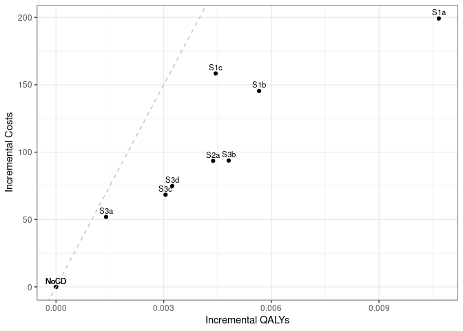

Sensitivity analysis: No Smoking Cessation
================
16 October, 2024

    ## 
    ## > errors<-c(
    ## +   ERR_INCORRECT_SETTING_VARIABLE=-1,
    ## +   ERR_INCORRECT_VECTOR_SIZE=-2,
    ## +   ERR_INCORRECT_INPUT_VAR=-3,
    ## +   ERR_EVENT_STACK_FULL=-4,
    ## +   .... [TRUNCATED] 
    ## 
    ## > record_mode<-c(
    ## +   record_mode_none=0,
    ## +   record_mode_agent=1,
    ## +   record_mode_event=2,
    ## +   record_mode_some_event=3
    ## + )
    ## 
    ## > agent_creation_mode<-c(
    ## +   agent_creation_mode_one=0,
    ## +   agent_creation_mode_all=1,
    ## +   agent_creation_mode_pre=2
    ## + )
    ## 
    ## > medication_classes<-c(
    ## +   MED_CLASS_SABA=1,
    ## +   MED_CLASS_LABA=2,
    ## +   MED_CLASS_LAMA=4,
    ## +   MED_CLASS_ICS=8,
    ## +   MED_CLASS_MACRO=16
    ## + )
    ## 
    ## > events<-c(
    ## +     event_start=0,
    ## +     event_fixed=1,
    ## +     event_birthday=2,
    ## +     event_smoking_change=3,
    ## +     event_COPD=4,
    ## +     event_exacerbat .... [TRUNCATED]

``` r
# CHANGE: Add a timer (will see addition below to print time too)
# Start timer
start.time <- Sys.time()
```

``` r
# CHANGE: Add save paths (will see later, we also add lines to save to csv)
outputs <- "../../outputs/Sen1_No_Smoking_Cessation"
files <- list(
  s1 = "s1_5y.csv",
  s2 = "s2_5y.csv",
  s3 = "s3_5y.csv",
  sall = "sall_5y.csv",
  ceplane = "ceplane_5y.csv",
  clinical = "clinicalresults_5y.csv"
)

# Apply to each element in list to create path to file in outputs
paths <- lapply(files, function(filename) paste0(outputs, filename))
```

    ## Initializing the session

    ## [1] 0

**Global inputs:**

  - Medication adherence is 0.7
  - Smoking adherence is 0
  - Cost discounting: 0.015
  - QALY discounting: 0.015
  - Time horizon: 20
  - The WTP threshold for NMB is 50000

**Case detection inputs:**

  - Case detection occurs at 5 year intervals.
  - An outpatient diagnosis costs 61.18
  - The utility gain due to symptom relief from treatment is 0.0367

## S1 All patients scenario

All patients are eligible. The cost of case detection is:

| None | CDQ17 | FlowMeter | FlowMeter\_CDQ |
| ---: | ----: | --------: | -------------: |
|    0 | 11.56 |     30.46 |          42.01 |

#### S1NoCD2: No Case detection- Other time interval

    ## [1] 0

    ## Terminating the session

    ## [1] 0

#### S1NoCD: No Case detection

    ## Initializing the session

    ## [1] 0

    ## [1] 0

    ## Terminating the session

    ## [1] 0

#### S1A: CDQ ≥17 points

    ## Initializing the session

    ## [1] 0

    ## [1] 0

    ## Terminating the session

    ## [1] 0

#### S1B: Screening Spirometry with BD

    ## Initializing the session

    ## [1] 0

    ## [1] 0

    ## Terminating the session

    ## [1] 0

#### S1C: CDQ ≥17 points and Screening Spirometry with BD

    ## Initializing the session

    ## [1] 0

    ## [1] 0

    ## Terminating the session

    ## [1] 0

| Scenario  |   Agents | PatientYears |   CopdPYs | NCaseDetections | DiagnosedPYs | OverdiagnosedPYs |  SABA |  LAMA | LAMALABA | ICSLAMALABA |     Mild | Moderate |  Severe | VerySevere | MildPY | ModeratePY | SeverePY | VerySeverePY |     NoCOPD |    GOLD1 |    GOLD2 |    GOLD3 |   GOLD4 |         Cost | CostpAgent |      QALY | QALYpAgent |      NMB | IncrementalCosts | IncrementalQALY |     ICER | IncrementalNMB |
| :-------- | -------: | -----------: | --------: | --------------: | -----------: | ---------------: | ----: | ----: | -------: | ----------: | -------: | -------: | ------: | ---------: | -----: | ---------: | -------: | -----------: | ---------: | -------: | -------: | -------: | ------: | -----------: | ---------: | --------: | ---------: | -------: | ---------------: | --------------: | -------: | -------------: |
| S1NoCD2   | 74397625 |   1251888615 | 142400097 |       381936924 |     26358454 |         26783324 | 0.017 | 0.135 |    0.151 |       0.080 | 30847754 |  5758388 | 9691126 |     836590 |  0.217 |      0.040 |    0.068 |        0.006 | 1054688429 | 57727616 | 61505481 | 13799186 | 2398591 | 159124648209 |   2138.840 | 933200651 |     12.543 | 625032.2 |            0.000 |           0.000 |      NaN |          0.000 |
| S1NoCD    | 74394066 |   1251871999 | 142377758 |       249324170 |     26617487 |         32718146 | 0.021 | 0.135 |    0.151 |       0.080 | 30874590 |  5768744 | 9690479 |     835272 |  0.217 |      0.041 |    0.068 |        0.006 | 1054693564 | 57729618 | 61465178 | 13817742 | 2397911 | 159276748461 |   2140.987 | 933192471 |     12.544 | 625054.5 |            0.000 |           0.000 |      NaN |          0.000 |
| S1NoCDAvg | 74395846 |   1251880307 | 142388928 |       315630547 |     26487970 |         29750735 | 0.019 | 0.135 |    0.151 |       0.080 | 30861172 |  5763566 | 9690802 |     835931 |  0.217 |      0.040 |    0.068 |        0.006 | 1054690996 | 57728617 | 61485330 | 13808464 | 2398251 | 159200698335 |   2139.914 | 933196561 |     12.544 | 625043.3 |            0.000 |           0.000 |      NaN |          0.000 |
| S1a       | 74386358 |   1251896635 | 142473656 |       245503789 |     56984175 |         32705395 | 0.028 | 0.153 |    0.273 |       0.091 | 30081756 |  5637945 | 9520747 |     824685 |  0.211 |      0.040 |    0.067 |        0.006 | 1054623394 | 57686664 | 61571086 | 13837097 | 2404913 | 174028848972 |   2339.526 | 933898758 |     12.555 | 625395.7 |          198.539 |           0.011 | 18392.33 |        341.194 |
| S1b       | 74391545 |   1251861823 | 142462209 |       247434066 |     41931074 |         32705922 | 0.024 | 0.144 |    0.216 |       0.085 | 30421419 |  5696210 | 9605672 |     831014 |  0.214 |      0.040 |    0.067 |        0.006 | 1054598750 | 57721840 | 61546620 | 13822533 | 2398634 | 169947664017 |   2284.502 | 933536456 |     12.549 | 625163.5 |          143.515 |           0.005 | 28424.02 |        108.939 |
| S1c       | 74393824 |   1251906428 | 142431705 |       248055301 |     37051931 |         32690365 | 0.023 | 0.142 |    0.196 |       0.084 | 30561505 |  5718432 | 9635256 |     832645 |  0.215 |      0.040 |    0.068 |        0.006 | 1054677312 | 57725840 | 61509508 | 13822224 | 2401731 | 171127045501 |   2300.286 | 933458732 |     12.548 | 625076.2 |          159.298 |           0.004 | 44006.44 |         21.696 |

*Treatment rate:* SABA is expressed per all patient-years, LAMA,
LAMA/LABA, ICS/LAMA/LABA are per COPD patient-years *Exacerbations:*
Total exacerbations and rate per COPD patient-year: *GOLD Stage:*
Cumulative patient-years *Cost/QALY:* Total cost and QALYs *NMB:* Net
Monetary Benefit is calculated as QALY per patient-year \* Lamba - Cost
per patient-year

-----

## S2 Symptomatic patients scenario

Patients with symptoms at year 1 are eligible. The cost of case
detection is:

    ## Initializing the session

    ## [1] 0

| None | FlowMeter |
| ---: | --------: |
|    0 |     24.33 |

#### S2NoCD: No Case detection

    ## [1] 0

    ## Terminating the session

    ## [1] 0

#### S2a: Screening Spirometry without BD

    ## Initializing the session

    ## [1] 0

    ## [1] 0

    ## Terminating the session

    ## [1] 0

| Scenario |   Agents | PatientYears |   CopdPYs | NCaseDetections | DiagnosedPYs | OverdiagnosedPYs |  SABA |  LAMA | LAMALABA | ICSLAMALABA |     Mild | Moderate |  Severe | VerySevere | MildPY | ModeratePY | SeverePY | VerySeverePY |    NoCOPD |    GOLD1 |    GOLD2 |    GOLD3 |   GOLD4 |         Cost | CostpAgent |      QALY | QALYpAgent |      NMB | IncrementalCosts | IncrementalQALY |     ICER | IncrementalNMB |
| :------- | -------: | -----------: | --------: | --------------: | -----------: | ---------------: | ----: | ----: | -------: | ----------: | -------: | -------: | ------: | ---------: | -----: | ---------: | -------: | -----------: | --------: | -------: | -------: | -------: | ------: | -----------: | ---------: | --------: | ---------: | -------: | ---------------: | --------------: | -------: | -------------: |
| S2NoCD   | 44157584 |    728952311 | 100323388 |       144982166 |     19523088 |         18911929 | 0.021 | 0.142 |    0.160 |       0.087 | 22913196 |  4246236 | 7091076 |     607396 |  0.228 |      0.042 |    0.071 |        0.006 | 597502927 | 37198908 | 45025648 | 11128697 | 2049374 | 117261957083 |   2655.534 | 541767607 |     12.269 | 610792.4 |            0.000 |           0.000 |      NaN |          0.000 |
| S2a      | 44167644 |    729258231 | 100451469 |       143393557 |     32589486 |         18909118 | 0.025 | 0.153 |    0.241 |       0.095 | 22572868 |  4195555 | 7015184 |     599814 |  0.225 |      0.042 |    0.070 |        0.006 | 597673662 | 37222091 | 45078868 | 11153960 | 2067390 | 124138133751 |   2810.613 | 542293812 |     12.278 | 611093.3 |          155.079 |           0.009 | 17005.48 |        300.888 |

*Treatment rate:* SABA is expressed per all patient-years, LAMA,
LAMA/LABA, ICS/LAMA/LABA are per COPD patient-years *Exacerbations:*
Total exacerbations and rate per COPD patient-year: *GOLD Stage:*
Cumulative patient-years *Cost/QALY:* Total cost and QALYs *NMB:* Net
Monetary Benefit is calculated as QALY per patient-year \* Lamba - Cost
per patient-year

-----

## S3 Smoking history scenario

Ever smokers ≥50 years of age are eligible. The cost of case detection
is:

    ## Initializing the session

    ## [1] 0

| None | CDQ195 | CDQ165 | FlowMeter | FlowMeter\_CDQ |
| ---: | -----: | -----: | --------: | -------------: |
|    0 |  11.56 |  11.56 |     24.33 |          42.01 |

#### S3NoCD: No Case detection

    ## [1] 0

    ## Terminating the session

    ## [1] 0

#### S3a: CDQ ≥19.5 points

    ## Initializing the session

    ## [1] 0

    ## [1] 0

    ## Terminating the session

    ## [1] 0

#### S3b: CDQ ≥16.5 points

    ## Initializing the session

    ## [1] 0

    ## [1] 0

    ## Terminating the session

    ## [1] 0

#### S3c: Screening spirometry without BD

    ## Initializing the session

    ## [1] 0

    ## [1] 0

    ## Terminating the session

    ## [1] 0

#### S3d: Screening Spirometry with BD + CDQ ≥17 points

    ## Initializing the session

    ## [1] 0

    ## [1] 0

    ## Terminating the session

    ## [1] 0

| Scenario |   Agents | PatientYears |  CopdPYs | NCaseDetections | DiagnosedPYs | OverdiagnosedPYs |  SABA |  LAMA | LAMALABA | ICSLAMALABA |     Mild | Moderate |  Severe | VerySevere | MildPY | ModeratePY | SeverePY | VerySeverePY |    NoCOPD |    GOLD1 |    GOLD2 |   GOLD3 |   GOLD4 |         Cost | CostpAgent |      QALY | QALYpAgent |      NMB | IncrementalCosts | IncrementalQALY |     ICER | IncrementalNMB |
| :------- | -------: | -----------: | -------: | --------------: | -----------: | ---------------: | ----: | ----: | -------: | ----------: | -------: | -------: | ------: | ---------: | -----: | ---------: | -------: | -----------: | --------: | -------: | -------: | ------: | ------: | -----------: | ---------: | --------: | ---------: | -------: | ---------------: | --------------: | -------: | -------------: |
| S3NoCD   | 34503305 |    520131900 | 83566026 |       104876864 |     15818113 |         14153690 | 0.022 | 0.137 |    0.154 |       0.086 | 19571024 |  3639873 | 6075336 |     520651 |  0.234 |      0.044 |    0.073 |        0.006 | 414791492 | 30617496 | 37480217 | 9639095 | 1796669 |  99600427724 |   2886.692 | 387416791 |     11.228 | 558533.1 |            0.000 |           0.000 |      NaN |          0.000 |
| S3a      | 34502959 |    520214215 | 83507663 |       104354722 |     20256743 |         14160507 | 0.024 | 0.141 |    0.189 |       0.089 | 19411438 |  3617031 | 6045913 |     519219 |  0.232 |      0.043 |    0.072 |        0.006 | 414923874 | 30575250 | 37437201 | 9663951 | 1800433 | 103657451678 |   3004.306 | 387588700 |     11.233 | 558670.3 |          117.614 |           0.005 | 23083.96 |        137.138 |
| S3b      | 34499019 |    520184485 | 83582574 |       103156699 |     29799478 |         14153270 | 0.029 | 0.151 |    0.258 |       0.096 | 19153466 |  3575091 | 5985288 |     514510 |  0.229 |      0.043 |    0.072 |        0.006 | 414823125 | 30587889 | 37477414 | 9673157 | 1810964 | 106572608911 |   3089.149 | 387784278 |     11.240 | 558933.0 |          202.457 |           0.012 | 16805.46 |        399.897 |
| S3c      | 34498158 |    520070825 | 83518338 |       103759249 |     24845682 |         14164602 | 0.026 | 0.146 |    0.223 |       0.093 | 19273175 |  3595164 | 6016844 |     516053 |  0.231 |      0.043 |    0.072 |        0.006 | 414775743 | 30587857 | 37449770 | 9650222 | 1799422 | 104673766491 |   3034.184 | 387592275 |     11.235 | 558723.7 |          147.492 |           0.007 | 21811.80 |        190.609 |
| S3d      | 34499680 |    520130180 | 83530301 |       104037313 |     22709145 |         14168991 | 0.025 | 0.144 |    0.207 |       0.091 | 19319362 |  3598421 | 6024286 |     517179 |  0.231 |      0.043 |    0.072 |        0.006 | 414821005 | 30578797 | 37457915 | 9663634 | 1797165 | 104999032656 |   3043.478 | 387583597 |     11.234 | 558677.1 |          156.786 |           0.006 | 26066.59 |        143.955 |

*Treatment rate:* SABA is expressed per all patient-years, LAMA,
LAMA/LABA, ICS/LAMA/LABA are per COPD patient-years *Exacerbations:*
Total exacerbations and rate per COPD patient-year *GOLD Stage:*
Cumulative patient-years *Cost/QALY:* Total cost and QALYs *NMB:* Net
Monetary Benefit is calculated as QALY per patient-year \* Lamba - Cost
per patient-year

-----

## All Scenarios

*Ordered by descending Net Monetary Benefit*

| Scenario |   Agents |         Cost | CostpAgent |      QALY | QALYpAgent |     ICER | IncrementalNMB |
| :------- | -------: | -----------: | ---------: | --------: | ---------: | -------: | -------------: |
| S3b      | 34499019 | 106572608911 |   3089.149 | 387784278 |     11.240 | 16805.46 |        399.897 |
| S1a      | 74386358 | 174028848972 |   2339.526 | 933898758 |     12.555 | 18392.33 |        341.194 |
| S2a      | 44167644 | 124138133751 |   2810.613 | 542293812 |     12.278 | 17005.48 |        300.888 |
| S3c      | 34498158 | 104673766491 |   3034.184 | 387592275 |     11.235 | 21811.80 |        190.609 |
| S3d      | 34499680 | 104999032656 |   3043.478 | 387583597 |     11.234 | 26066.59 |        143.955 |
| S3a      | 34502959 | 103657451678 |   3004.306 | 387588700 |     11.233 | 23083.96 |        137.138 |
| S1b      | 74391545 | 169947664017 |   2284.502 | 933536456 |     12.549 | 28424.02 |        108.939 |
| S1c      | 74393824 | 171127045501 |   2300.286 | 933458732 |     12.548 | 44006.44 |         21.696 |
| S1NoCD   | 74394066 | 159276748461 |   2140.987 | 933192471 |     12.544 |      NaN |          0.000 |
| S2NoCD   | 44157584 | 117261957083 |   2655.534 | 541767607 |     12.269 |      NaN |          0.000 |
| S3NoCD   | 34503305 |  99600427724 |   2886.692 | 387416791 |     11.228 |      NaN |          0.000 |

-----

## Cost Effectiveness Plane

Adjusted to the total population

| Scenario  |   Agents | PropAgents |         Cost | CostpAgent | CostpAgentExcluded | CostpAgentAll |      QALY | QALYpAgent | QALYpAgentExcluded | QALYpAgentAll | IncrementalCosts | IncrementalQALY |  ICERAdj |     ICER |        INMB |
| :-------- | -------: | ---------: | -----------: | ---------: | -----------------: | ------------: | --------: | ---------: | -----------------: | ------------: | ---------------: | --------------: | -------: | -------: | ----------: |
| S1NoCDAvg | 74395846 |  1.0000000 | 159200698335 |   2139.914 |              0.000 |      2139.914 | 933196561 |   12.54367 |            0.00000 |      12.54367 |          0.00000 |       0.0000000 |      NaN |      NaN |   0.0000000 |
| S1a       | 74386358 |  1.0000000 | 174028848972 |   2339.526 |              0.000 |      2339.526 | 933898758 |   12.55470 |            0.00000 |      12.55470 |        199.61258 |       0.0110397 | 18081.28 | 18392.33 | 352.3742441 |
| S1b       | 74391545 |  1.0000000 | 169947664017 |   2284.502 |              0.000 |      2284.502 | 933536456 |   12.54896 |            0.00000 |      12.54896 |        144.58859 |       0.0052941 | 27311.04 | 28424.02 | 120.1185902 |
| S1c       | 74393824 |  1.0000000 | 171127045501 |   2300.286 |              0.000 |      2300.286 | 933458732 |   12.54753 |            0.00000 |      12.54753 |        160.37182 |       0.0038650 | 41493.86 | 44006.44 |  32.8758142 |
| S2NoCD    | 44157584 |  0.5935491 | 117261957083 |   2655.534 |           1386.943 |      2139.914 | 541767607 |   12.26896 |           12.94482 |      12.54366 |          0.00000 |       0.0000000 |      NaN |      NaN | \-0.0042008 |
| S2a       | 44167644 |  0.5936843 | 124138133751 |   2810.613 |           1386.943 |      2232.153 | 542293812 |   12.27808 |           12.94482 |      12.54899 |         92.23934 |       0.0053226 | 17329.70 | 17005.48 | 173.8872461 |
| S3NoCD    | 34503305 |  0.4637800 |  99600427724 |   2886.692 |           1494.020 |      2139.914 | 387416791 |   11.22840 |           13.68125 |      12.54366 |          0.00000 |       0.0000000 |      NaN |      NaN | \-0.0042008 |
| S3a       | 34502959 |  0.4637753 | 103657451678 |   3004.306 |           1494.020 |      2194.454 | 387588700 |   11.23349 |           13.68125 |      12.54604 |         54.53988 |       0.0023744 | 22970.32 | 23083.96 |  64.1740583 |
| S3b       | 34499019 |  0.4637224 | 106572608911 |   3089.149 |           1494.020 |      2233.717 | 387784278 |   11.24044 |           13.68125 |      12.54939 |         93.80342 |       0.0057278 | 16376.84 | 16805.46 | 192.5827814 |
| S3c       | 34498158 |  0.4637108 | 104673766491 |   3034.184 |           1494.020 |      2208.211 | 387592275 |   11.23516 |           13.68125 |      12.54697 |         68.29721 |       0.0033053 | 20662.82 | 21811.80 |  96.9645594 |
| S3d       | 34499680 |  0.4637313 | 104999032656 |   3043.478 |           1494.020 |      2212.553 | 387583597 |   11.23441 |           13.68125 |      12.54657 |         72.63874 |       0.0029088 | 24972.23 | 26066.59 |  72.7961203 |

<!-- -->

## Clinical Results for all scenarios

Adjusted to the total population

| Scenario  | PropAgents | ProppPatientYears | ProppCopdPYs |   SABAAll |   LAMAAll | LAMALABAAll | ICSLAMALABAAll | MildpAgentAll | ModeratepAgentAll | SeverepAgentAll | VerySeverepAgentAll | NoCOPDpPYAll | GOLD1pPYAll | GOLD2pPYAll | GOLD3pPYAll | GOLD4pPYAll | DiagnosedpPYAll |
| :-------- | ---------: | ----------------: | -----------: | --------: | --------: | ----------: | -------------: | ------------: | ----------------: | --------------: | ------------------: | -----------: | ----------: | ----------: | ----------: | ----------: | --------------: |
| S1NoCDAvg |  1.0000000 |         1.0000000 |    1.0000000 | 0.0190473 | 0.1352836 |   0.1511410 |      0.0795532 |     0.4148239 |         0.0774716 |       0.1302600 |           0.0112363 |    0.8424855 |   0.0461135 |   0.0491144 |   0.0110302 |   0.0019157 |       0.1860255 |
| S1a       |  1.0000000 |         1.0000000 |    1.0000000 | 0.0278123 | 0.1534482 |   0.2729249 |      0.0907984 |     0.4043988 |         0.0757927 |       0.1279905 |           0.0110865 |    0.8424205 |   0.0460794 |   0.0491822 |   0.0110529 |   0.0019210 |       0.3999629 |
| S1b       |  1.0000000 |         1.0000000 |    1.0000000 | 0.0240696 | 0.1444335 |   0.2155905 |      0.0853753 |     0.4089365 |         0.0765707 |       0.1291232 |           0.0111708 |    0.8424242 |   0.0461088 |   0.0491641 |   0.0110416 |   0.0019161 |       0.2943312 |
| S1c       |  1.0000000 |         1.0000000 |    1.0000000 | 0.0229703 | 0.1416387 |   0.1958173 |      0.0837379 |     0.4108070 |         0.0768670 |       0.1295169 |           0.0111924 |    0.8424570 |   0.0461103 |   0.0491327 |   0.0110409 |   0.0019185 |       0.2601382 |
| S2NoCD    |  0.5935491 |         0.5822859 |    0.7045730 | 0.0190473 | 0.1352836 |   0.1511410 |      0.0795532 |     0.4148239 |         0.0774716 |       0.1302600 |           0.0112363 |    0.8424855 |   0.0461135 |   0.0491144 |   0.0110302 |   0.0019157 |       0.1860255 |
| S2a       |  0.5936843 |         0.5825303 |    0.7054725 | 0.0214502 | 0.1431169 |   0.2087483 |      0.0847761 |     0.4102138 |         0.0767836 |       0.1292283 |           0.0111333 |    0.8424082 |   0.0461225 |   0.0491492 |   0.0110491 |   0.0019299 |       0.2776421 |
| S3NoCD    |  0.4637800 |         0.4154805 |    0.5868857 | 0.0190473 | 0.1352836 |   0.1511410 |      0.0795532 |     0.4148239 |         0.0774716 |       0.1302600 |           0.0112363 |    0.8424855 |   0.0461135 |   0.0491144 |   0.0110302 |   0.0019157 |       0.1860255 |
| S3a       |  0.4637753 |         0.4155463 |    0.5864758 | 0.0198255 | 0.1379490 |   0.1715213 |      0.0813847 |     0.4126801 |         0.0771648 |       0.1298649 |           0.0112170 |    0.8425337 |   0.0460773 |   0.0490779 |   0.0110497 |   0.0019187 |       0.2172724 |
| S3b       |  0.4637224 |         0.4155225 |    0.5870019 | 0.0217642 | 0.1436251 |   0.2121273 |      0.0851968 |     0.4092275 |         0.0766039 |       0.1290548 |           0.0111542 |    0.8424740 |   0.0460883 |   0.0491108 |   0.0110571 |   0.0019271 |       0.2841958 |
| S3c       |  0.4637108 |         0.4154317 |    0.5865508 | 0.0207095 | 0.1407425 |   0.1915385 |      0.0832853 |     0.4108399 |         0.0768743 |       0.1294800 |           0.0111750 |    0.8425156 |   0.0460917 |   0.0490917 |   0.0110393 |   0.0019180 |       0.2494870 |
| S3d       |  0.4637313 |         0.4154792 |    0.5866348 | 0.0202886 | 0.1393272 |   0.1821778 |      0.0823358 |     0.4114549 |         0.0769170 |       0.1295782 |           0.0111900 |    0.8425103 |   0.0460827 |   0.0490966 |   0.0110498 |   0.0019161 |       0.2344668 |

## Time elapsed

Run time for this notebook:

``` r
end.time <- Sys.time()
time.taken <- end.time - start.time
time.taken
```

    ## Time difference of 1.361881 days
