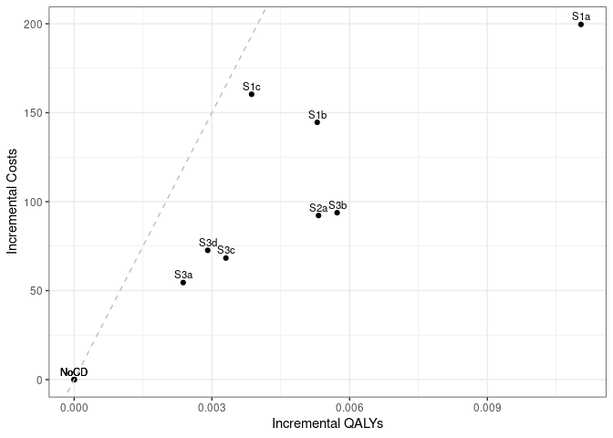

Sensitivity analysis: No Smoking Cessation
================
15 October, 2024

    ## 
    ## > errors<-c(
    ## +   ERR_INCORRECT_SETTING_VARIABLE=-1,
    ## +   ERR_INCORRECT_VECTOR_SIZE=-2,
    ## +   ERR_INCORRECT_INPUT_VAR=-3,
    ## +   ERR_EVENT_STACK_FULL=-4,
    ## +   .... [TRUNCATED] 
    ## 
    ## > record_mode<-c(
    ## +   record_mode_none=0,
    ## +   record_mode_agent=1,
    ## +   record_mode_event=2,
    ## +   record_mode_some_event=3
    ## + )
    ## 
    ## > agent_creation_mode<-c(
    ## +   agent_creation_mode_one=0,
    ## +   agent_creation_mode_all=1,
    ## +   agent_creation_mode_pre=2
    ## + )
    ## 
    ## > medication_classes<-c(
    ## +   MED_CLASS_SABA=1,
    ## +   MED_CLASS_LABA=2,
    ## +   MED_CLASS_LAMA=4,
    ## +   MED_CLASS_ICS=8,
    ## +   MED_CLASS_MACRO=16
    ## + )
    ## 
    ## > events<-c(
    ## +     event_start=0,
    ## +     event_fixed=1,
    ## +     event_birthday=2,
    ## +     event_smoking_change=3,
    ## +     event_COPD=4,
    ## +     event_exacerbat .... [TRUNCATED]

``` r
# CHANGE: Add a timer (will see addition below to print time too)
# Start timer
start.time <- Sys.time()
```

``` r
# CHANGE: Add save paths (will see later, we also add lines to save to csv)
outputs <- "../../outputs/Sen1_No_Smoking_Cessation"
files <- list(
  s1 = "s1_5y.csv",
  s2 = "s2_5y.csv",
  s3 = "s3_5y.csv",
  sall = "sall_5y.csv",
  ceplane = "ceplane_5y.csv",
  clinical = "clinicalresults_5y.csv"
)

# Apply to each element in list to create path to file in outputs
paths <- lapply(files, function(filename) paste0(outputs, filename))
```

    ## Initializing the session

    ## [1] 0

**Global inputs:**

  - Medication adherence is 0.7
  - Smoking adherence is 0
  - Cost discounting: 0.015
  - QALY discounting: 0.015
  - Time horizon: 20
  - The WTP threshold for NMB is 50000

**Case detection inputs:**

  - Case detection occurs at 5 year intervals.
  - An outpatient diagnosis costs 61.18
  - The utility gain due to symptom relief from treatment is 0.0367

## S1 All patients scenario

All patients are eligible. The cost of case detection is:

| None | CDQ17 | FlowMeter | FlowMeter\_CDQ |
| ---: | ----: | --------: | -------------: |
|    0 | 11.56 |     30.46 |          42.01 |

#### S1NoCD2: No Case detection- Other time interval

    ## [1] 0

    ## Terminating the session

    ## [1] 0

#### S1NoCD: No Case detection

    ## Initializing the session

    ## [1] 0

    ## [1] 0

    ## Terminating the session

    ## [1] 0

#### S1A: CDQ ≥17 points

    ## Initializing the session

    ## [1] 0

    ## [1] 0

    ## Terminating the session

    ## [1] 0

#### S1B: Screening Spirometry with BD

    ## Initializing the session

    ## [1] 0

    ## [1] 0

    ## Terminating the session

    ## [1] 0

#### S1C: CDQ ≥17 points and Screening Spirometry with BD

    ## Initializing the session

    ## [1] 0

    ## [1] 0

    ## Terminating the session

    ## [1] 0

| Scenario  |   Agents | PatientYears |  CopdPYs | NCaseDetections | DiagnosedPYs | OverdiagnosedPYs |  SABA |  LAMA | LAMALABA | ICSLAMALABA |     Mild | Moderate |  Severe | VerySevere | MildPY | ModeratePY | SeverePY | VerySeverePY |    NoCOPD |    GOLD1 |    GOLD2 |   GOLD3 |   GOLD4 |        Cost | CostpAgent |      QALY | QALYpAgent |      NMB | IncrementalCosts | IncrementalQALY |     ICER | IncrementalNMB |
| :-------- | -------: | -----------: | -------: | --------------: | -----------: | ---------------: | ----: | ----: | -------: | ----------: | -------: | -------: | ------: | ---------: | -----: | ---------: | -------: | -----------: | --------: | -------: | -------: | ------: | ------: | ----------: | ---------: | --------: | ---------: | -------: | ---------------: | --------------: | -------: | -------------: |
| S1NoCD2   | 37204854 |    626018225 | 71202557 |       190989723 |     13185986 |         13393668 | 0.017 | 0.135 |    0.151 |       0.080 | 15418908 |  2881539 | 4847882 |   418531.0 |  0.217 |       0.04 |    0.068 |        0.006 | 527413624 | 28872284 | 30752411 | 6896116 | 1196927 | 79594247521 |   2139.351 | 466658875 |     12.543 | 625008.5 |            0.000 |           0.000 |      NaN |          0.000 |
| S1NoCD    | 37191950 |    625889056 | 71140468 |       124648922 |     13317440 |         16364556 | 0.021 | 0.135 |    0.151 |       0.080 | 15424253 |  2881148 | 4845493 |   417620.0 |  0.217 |       0.04 |    0.068 |        0.006 | 527349723 | 28843031 | 30716736 | 6901546 | 1197088 | 79628195883 |   2141.006 | 466565294 |     12.545 | 625098.6 |            0.000 |           0.000 |      NaN |          0.000 |
| S1NoCDAvg | 37198402 |    625953640 | 71171513 |       157819322 |     13251713 |         14879112 | 0.019 | 0.135 |    0.151 |       0.080 | 15421580 |  2881344 | 4846688 |   418075.5 |  0.217 |       0.04 |    0.068 |        0.006 | 527381674 | 28857658 | 30734574 | 6898831 | 1197008 | 79611221702 |   2140.179 | 466612084 |     12.544 | 625053.6 |            0.000 |           0.000 |      NaN |          0.000 |
| S1a       | 37195208 |    625981312 | 71272710 |       122751743 |     28526479 |         16361764 | 0.028 | 0.153 |    0.273 |       0.091 | 15061201 |  2823590 | 4759004 |   410782.0 |  0.211 |       0.04 |    0.067 |        0.006 | 527310202 | 28846066 | 30794056 | 6933389 | 1210614 | 87015658430 |   2339.432 | 466968792 |     12.555 | 625387.7 |          198.426 |           0.010 | 20352.83 |        289.039 |
| S1b       | 37197852 |    625993620 | 71228378 |       123724740 |     20971968 |         16356344 | 0.024 | 0.145 |    0.216 |       0.086 | 15200763 |  2850096 | 4806431 |   415178.0 |  0.213 |       0.04 |    0.067 |        0.006 | 527361769 | 28875770 | 30751567 | 6911893 | 1202019 | 85019682451 |   2285.607 | 466815725 |     12.550 | 625191.1 |          144.601 |           0.005 | 30493.80 |         92.498 |
| S1c       | 37186225 |    625816475 | 71183274 |       123996885 |     18524349 |         16346258 | 0.023 | 0.142 |    0.196 |       0.084 | 15269130 |  2861634 | 4811385 |   414801.0 |  0.215 |       0.04 |    0.068 |        0.006 | 527237782 | 28835965 | 30741638 | 6918866 | 1201850 | 85476215421 |   2298.599 | 466624752 |     12.548 | 625117.5 |          157.593 |           0.004 | 44640.36 |         18.921 |

*Treatment rate:* SABA is expressed per all patient-years, LAMA,
LAMA/LABA, ICS/LAMA/LABA are per COPD patient-years *Exacerbations:*
Total exacerbations and rate per COPD patient-year: *GOLD Stage:*
Cumulative patient-years *Cost/QALY:* Total cost and QALYs *NMB:* Net
Monetary Benefit is calculated as QALY per patient-year \* Lamba - Cost
per patient-year

-----

## S2 Symptomatic patients scenario

Patients with symptoms at year 1 are eligible. The cost of case
detection is:

    ## Initializing the session

    ## [1] 0

| None | FlowMeter |
| ---: | --------: |
|    0 |     24.33 |

#### S2NoCD: No Case detection

    ## [1] 0

    ## Terminating the session

    ## [1] 0

#### S2a: Screening Spirometry without BD

    ## Initializing the session

    ## [1] 0

    ## [1] 0

    ## Terminating the session

    ## [1] 0

| Scenario |   Agents | PatientYears |  CopdPYs | NCaseDetections | DiagnosedPYs | OverdiagnosedPYs |  SABA |  LAMA | LAMALABA | ICSLAMALABA |     Mild | Moderate |  Severe | VerySevere | MildPY | ModeratePY | SeverePY | VerySeverePY |    NoCOPD |    GOLD1 |    GOLD2 |   GOLD3 |   GOLD4 |        Cost | CostpAgent |      QALY | QALYpAgent |      NMB | IncrementalCosts | IncrementalQALY |     ICER | IncrementalNMB |
| :------- | -------: | -----------: | -------: | --------------: | -----------: | ---------------: | ----: | ----: | -------: | ----------: | -------: | -------: | ------: | ---------: | -----: | ---------: | -------: | -----------: | --------: | -------: | -------: | ------: | ------: | ----------: | ---------: | --------: | ---------: | -------: | ---------------: | --------------: | -------: | -------------: |
| S2NoCD   | 22087417 |    364646034 | 50186627 |        72526119 |      9746775 |          9462789 | 0.021 | 0.142 |    0.159 |       0.087 | 11464621 |  2124260 | 3543653 |     304619 |  0.228 |      0.042 |    0.071 |        0.006 | 298890008 | 18629794 | 22515326 | 5556637 | 1022110 | 58618311506 |   2653.923 | 271012140 |     12.270 | 610845.0 |            0.000 |           0.000 |      NaN |           0.00 |
| S2a      | 22083208 |    364595007 | 50239139 |        71692048 |     16275036 |          9453921 | 0.025 | 0.153 |    0.241 |       0.095 | 11292655 |  2099389 | 3509042 |     300286 |  0.225 |      0.042 |    0.070 |        0.006 | 298790965 | 18626223 | 22537013 | 5579347 | 1031500 | 62093405681 |   2811.793 | 271120515 |     12.277 | 611049.5 |          157.869 |           0.007 | 21786.54 |         204.44 |

*Treatment rate:* SABA is expressed per all patient-years, LAMA,
LAMA/LABA, ICS/LAMA/LABA are per COPD patient-years *Exacerbations:*
Total exacerbations and rate per COPD patient-year: *GOLD Stage:*
Cumulative patient-years *Cost/QALY:* Total cost and QALYs *NMB:* Net
Monetary Benefit is calculated as QALY per patient-year \* Lamba - Cost
per patient-year

-----

## S3 Smoking history scenario

Ever smokers ≥50 years of age are eligible. The cost of case detection
is:

    ## Initializing the session

    ## [1] 0

| None | CDQ195 | CDQ165 | FlowMeter | FlowMeter\_CDQ |
| ---: | -----: | -----: | --------: | -------------: |
|    0 |  11.56 |  11.56 |     24.33 |          42.01 |

#### S3NoCD: No Case detection

    ## [1] 0

    ## Terminating the session

    ## [1] 0

#### S3a: CDQ ≥19.5 points

    ## Initializing the session

    ## [1] 0

    ## [1] 0

    ## Terminating the session

    ## [1] 0

#### S3b: CDQ ≥16.5 points

    ## Initializing the session

    ## [1] 0

    ## [1] 0

    ## Terminating the session

    ## [1] 0

#### S3c: Screening spirometry without BD

    ## Initializing the session

    ## [1] 0

    ## [1] 0

    ## Terminating the session

    ## [1] 0

#### S3d: Screening Spirometry with BD + CDQ ≥17 points

    ## Initializing the session

    ## [1] 0

    ## [1] 0

    ## Terminating the session

    ## [1] 0

| Scenario |   Agents | PatientYears |  CopdPYs | NCaseDetections | DiagnosedPYs | OverdiagnosedPYs |  SABA |  LAMA | LAMALABA | ICSLAMALABA |    Mild | Moderate |  Severe | VerySevere | MildPY | ModeratePY | SeverePY | VerySeverePY |    NoCOPD |    GOLD1 |    GOLD2 |   GOLD3 |  GOLD4 |        Cost | CostpAgent |      QALY | QALYpAgent |      NMB | IncrementalCosts | IncrementalQALY |     ICER | IncrementalNMB |
| :------- | -------: | -----------: | -------: | --------------: | -----------: | ---------------: | ----: | ----: | -------: | ----------: | ------: | -------: | ------: | ---------: | -----: | ---------: | -------: | -----------: | --------: | -------: | -------: | ------: | -----: | ----------: | ---------: | --------: | ---------: | -------: | ---------------: | --------------: | -------: | -------------: |
| S3NoCD   | 17252656 |    260094783 | 41770599 |        52444190 |      7909135 |          7072687 | 0.022 | 0.137 |    0.154 |       0.086 | 9782958 |  1820515 | 3040238 |     260475 |  0.234 |      0.044 |    0.073 |        0.006 | 207435240 | 15306525 | 18721148 | 4829059 | 898040 | 49824346254 |   2887.923 | 193730581 |     11.229 | 558563.5 |            0.000 |           0.000 |      NaN |          0.000 |
| S3a      | 17243481 |    259912088 | 41699334 |        52142253 |     10110197 |          7079583 | 0.024 | 0.141 |    0.189 |       0.089 | 9688105 |  1805528 | 3020469 |     258826 |  0.232 |      0.043 |    0.072 |        0.006 | 207327257 | 15287458 | 18694698 | 4811886 | 892931 | 51742662653 |   3000.709 | 193656912 |     11.231 | 558535.9 |          112.785 |           0.002 | 66246.23 |       \-27.660 |
| S3b      | 17247748 |    260025001 | 41817481 |        51563538 |     14906855 |          7078800 | 0.029 | 0.151 |    0.258 |       0.096 | 9577831 |  1791238 | 2994241 |     257043 |  0.229 |      0.043 |    0.072 |        0.006 | 207321180 | 15322740 | 18744664 | 4830073 | 901996 | 53304765553 |   3090.535 | 193842443 |     11.239 | 558845.0 |          202.612 |           0.010 | 20929.02 |        281.433 |
| S3c      | 17255289 |    260150051 | 41793716 |        51902628 |     12418598 |          7087241 | 0.026 | 0.146 |    0.222 |       0.092 | 9642590 |  1800040 | 3010319 |     258524 |  0.231 |      0.043 |    0.072 |        0.006 | 207466781 | 15314112 | 18733822 | 4827468 | 899118 | 52372898312 |   3035.179 | 193880135 |     11.236 | 558764.0 |          147.256 |           0.007 | 21176.66 |        200.429 |
| S3d      | 17249786 |    260094642 | 41791504 |        52022800 |     11361111 |          7083958 | 0.025 | 0.144 |    0.207 |       0.091 | 9669545 |  1804309 | 3019811 |     259616 |  0.231 |      0.043 |    0.072 |        0.006 | 207414812 | 15305575 | 18740388 | 4830487 | 898472 | 52605759305 |   3049.647 | 193811771 |     11.236 | 558730.6 |          161.724 |           0.007 | 24596.88 |        167.025 |

*Treatment rate:* SABA is expressed per all patient-years, LAMA,
LAMA/LABA, ICS/LAMA/LABA are per COPD patient-years *Exacerbations:*
Total exacerbations and rate per COPD patient-year *GOLD Stage:*
Cumulative patient-years *Cost/QALY:* Total cost and QALYs *NMB:* Net
Monetary Benefit is calculated as QALY per patient-year \* Lamba - Cost
per patient-year

-----

## All Scenarios

*Ordered by descending Net Monetary Benefit*

| Scenario |   Agents |        Cost | CostpAgent |      QALY | QALYpAgent |     ICER | IncrementalNMB |
| :------- | -------: | ----------: | ---------: | --------: | ---------: | -------: | -------------: |
| S1a      | 37195208 | 87015658430 |   2339.432 | 466968792 |     12.555 | 20352.83 |        289.039 |
| S3b      | 17247748 | 53304765553 |   3090.535 | 193842443 |     11.239 | 20929.02 |        281.433 |
| S2a      | 22083208 | 62093405681 |   2811.793 | 271120515 |     12.277 | 21786.54 |        204.440 |
| S3c      | 17255289 | 52372898312 |   3035.179 | 193880135 |     11.236 | 21176.66 |        200.429 |
| S3d      | 17249786 | 52605759305 |   3049.647 | 193811771 |     11.236 | 24596.88 |        167.025 |
| S1b      | 37197852 | 85019682451 |   2285.607 | 466815725 |     12.550 | 30493.80 |         92.498 |
| S1c      | 37186225 | 85476215421 |   2298.599 | 466624752 |     12.548 | 44640.36 |         18.921 |
| S1NoCD   | 37191950 | 79628195883 |   2141.006 | 466565294 |     12.545 |      NaN |          0.000 |
| S2NoCD   | 22087417 | 58618311506 |   2653.923 | 271012140 |     12.270 |      NaN |          0.000 |
| S3NoCD   | 17252656 | 49824346254 |   2887.923 | 193730581 |     11.229 |      NaN |          0.000 |
| S3a      | 17243481 | 51742662653 |   3000.709 | 193656912 |     11.231 | 66246.23 |       \-27.660 |

-----

## Cost Effectiveness Plane

Adjusted to the total population

| Scenario  |   Agents | PropAgents |        Cost | CostpAgent | CostpAgentExcluded | CostpAgentAll |      QALY | QALYpAgent | QALYpAgentExcluded | QALYpAgentAll | IncrementalCosts | IncrementalQALY |  ICERAdj |     ICER |      INMB |
| :-------- | -------: | ---------: | ----------: | ---------: | -----------------: | ------------: | --------: | ---------: | -----------------: | ------------: | ---------------: | --------------: | -------: | -------: | --------: |
| S1NoCDAvg | 37198402 |  1.0000000 | 79611221702 |   2140.179 |              0.000 |      2140.179 | 466612084 |   12.54387 |            0.00000 |      12.54387 |          0.00000 |       0.0000000 |      NaN |      NaN |   0.00000 |
| S1a       | 37195208 |  1.0000000 | 87015658430 |   2339.432 |              0.000 |      2339.432 | 466968792 |   12.55454 |            0.00000 |      12.55454 |        199.25342 |       0.0106673 | 18678.89 | 20352.82 | 334.11170 |
| S1b       | 37197852 |  1.0000000 | 85019682451 |   2285.607 |              0.000 |      2285.607 | 466815725 |   12.54953 |            0.00000 |      12.54953 |        145.42877 |       0.0056600 | 25694.18 | 30493.80 | 137.57062 |
| S1c       | 37186225 |  1.0000000 | 85476215421 |   2298.599 |              0.000 |      2298.599 | 466624752 |   12.54832 |            0.00000 |      12.54832 |        158.42035 |       0.0044483 | 35613.86 | 44640.36 |  63.99355 |
| S2NoCD    | 22087417 |  0.5937733 | 58618311506 |   2653.923 |           1389.248 |      2140.179 | 271012140 |   12.26998 |           12.94422 |      12.54387 |          0.00000 |       0.0000000 |      NaN |      NaN |   0.00000 |
| S2a       | 22083208 |  0.5936601 | 62093405681 |   2811.793 |           1389.248 |      2233.756 | 271120515 |   12.27723 |           12.94422 |      12.54825 |         93.57772 |       0.0043781 | 21374.21 | 21786.54 | 125.32559 |
| S3NoCD    | 17252656 |  0.4638010 | 49824346254 |   2887.923 |           1493.395 |      2140.179 | 193730581 |   11.22903 |           13.68119 |      12.54387 |          0.00000 |       0.0000000 |      NaN |      NaN |   0.00000 |
| S3a       | 17243481 |  0.4635543 | 51742662653 |   3000.709 |           1493.395 |      2192.117 | 193656912 |   11.23073 |           13.68119 |      12.54527 |         51.93821 |       0.0013940 | 37257.45 | 66246.23 |  17.76357 |
| S3b       | 17247748 |  0.4636691 | 53304765553 |   3090.535 |           1493.395 |      2233.939 | 193842443 |   11.23871 |           13.68119 |      12.54869 |         93.76072 |       0.0048123 | 19483.67 | 20929.02 | 146.85282 |
| S3c       | 17255289 |  0.4638718 | 52372898312 |   3035.179 |           1493.395 |      2208.585 | 193880135 |   11.23598 |           13.68119 |      12.54693 |         68.40670 |       0.0030521 | 22413.32 | 21176.66 |  84.19609 |
| S3d       | 17249786 |  0.4637238 | 52605759305 |   3049.647 |           1493.395 |      2215.066 | 193811771 |   11.23560 |           13.68119 |      12.54711 |         74.88760 |       0.0032382 | 23126.56 | 24596.89 |  87.02063 |

<!-- -->

## Clinical Results for all scenarios

Adjusted to the total population

| Scenario  | PropAgents | ProppPatientYears | ProppCopdPYs |   SABAAll |   LAMAAll | LAMALABAAll | ICSLAMALABAAll | MildpAgentAll | ModeratepAgentAll | SeverepAgentAll | VerySeverepAgentAll | NoCOPDpPYAll | GOLD1pPYAll | GOLD2pPYAll | GOLD3pPYAll | GOLD4pPYAll | DiagnosedpPYAll |
| :-------- | ---------: | ----------------: | -----------: | --------: | --------: | ----------: | -------------: | ------------: | ----------------: | --------------: | ------------------: | -----------: | ----------: | ----------: | ----------: | ----------: | --------------: |
| S1NoCDAvg |  1.0000000 |         1.0000000 |    1.0000000 | 0.0190548 | 0.1354468 |   0.1513316 |      0.0796706 |     0.4145764 |         0.0774588 |       0.1302929 |           0.0112391 |    0.8425251 |   0.0461019 |   0.0491004 |   0.0110213 |   0.0019123 |       0.1861941 |
| S1a       |  1.0000000 |         1.0000000 |    1.0000000 | 0.0278482 | 0.1534250 |   0.2729629 |      0.0908525 |     0.4049232 |         0.0759127 |       0.1279467 |           0.0110439 |    0.8423737 |   0.0460814 |   0.0491933 |   0.0110760 |   0.0019339 |       0.4002441 |
| S1b       |  1.0000000 |         1.0000000 |    1.0000000 | 0.0240917 | 0.1446612 |   0.2158567 |      0.0855915 |     0.4086463 |         0.0766199 |       0.1292126 |           0.0111613 |    0.8424395 |   0.0461279 |   0.0491244 |   0.0110415 |   0.0019202 |       0.2944328 |
| S1c       |  1.0000000 |         1.0000000 |    1.0000000 | 0.0229833 | 0.1415680 |   0.1958915 |      0.0835702 |     0.4106125 |         0.0769541 |       0.1293862 |           0.0111547 |    0.8424799 |   0.0460774 |   0.0491224 |   0.0110557 |   0.0019205 |       0.2602346 |
| S2NoCD    |  0.5937733 |         0.5825448 |    0.7051505 | 0.0190548 | 0.1354468 |   0.1513316 |      0.0796706 |     0.4145764 |         0.0774588 |       0.1302929 |           0.0112391 |    0.8425251 |   0.0461019 |   0.0491004 |   0.0110213 |   0.0019123 |       0.1861941 |
| S2a       |  0.5936601 |         0.5824633 |    0.7058883 | 0.0214490 | 0.1434612 |   0.2091222 |      0.0849061 |     0.4099831 |         0.0767959 |       0.1293722 |           0.0111234 |    0.8424382 |   0.0460994 |   0.0491376 |   0.0110580 |   0.0019273 |       0.2777966 |
| S3NoCD    |  0.4638010 |         0.4155176 |    0.5869005 | 0.0190548 | 0.1354468 |   0.1513316 |      0.0796706 |     0.4145764 |         0.0774588 |       0.1302929 |           0.0112391 |    0.8425251 |   0.0461019 |   0.0491004 |   0.0110213 |   0.0019123 |       0.1861941 |
| S3a       |  0.4635543 |         0.4152258 |    0.5858992 | 0.0198466 | 0.1380536 |   0.1714739 |      0.0814649 |     0.4120962 |         0.0770690 |       0.1297838 |           0.0111967 |    0.8426079 |   0.0460823 |   0.0490677 |   0.0109955 |   0.0019044 |       0.2173022 |
| S3b       |  0.4636691 |         0.4154062 |    0.5875593 | 0.0217858 | 0.1440359 |   0.2125182 |      0.0853803 |     0.4090993 |         0.0766788 |       0.1290683 |           0.0111479 |    0.8424404 |   0.0461319 |   0.0491416 |   0.0110236 |   0.0019187 |       0.2843963 |
| S3c       |  0.4638718 |         0.4156059 |    0.5872253 | 0.0207519 | 0.1409237 |   0.1914211 |      0.0833727 |     0.4107829 |         0.0769046 |       0.1294822 |           0.0111861 |    0.8424983 |   0.0461108 |   0.0491177 |   0.0110183 |   0.0019139 |       0.2494955 |
| S3d       |  0.4637238 |         0.4155174 |    0.5871943 | 0.0203062 | 0.1397428 |   0.1825038 |      0.0825487 |     0.4115494 |         0.0770272 |       0.1297507 |           0.0112166 |    0.8424927 |   0.0461004 |   0.0491311 |   0.0110236 |   0.0019130 |       0.2346429 |

## Time elapsed

Run time for this notebook:

``` r
end.time <- Sys.time()
time.taken <- end.time - start.time
time.taken
```

    ## Time difference of 14.48371 hours
