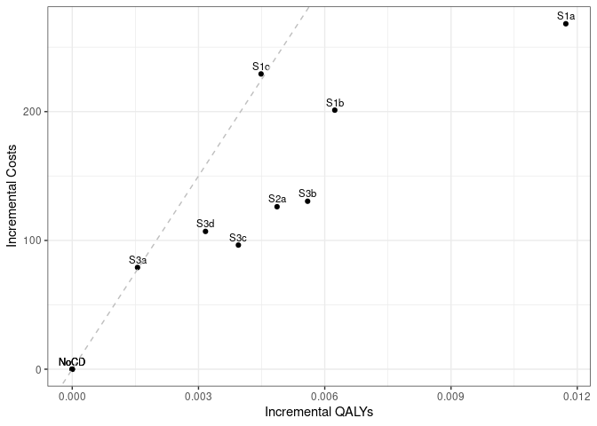

Sensitivity analysis: 50% Medication Adherence
================
18 October, 2024

    ## 
    ## > errors<-c(
    ## +   ERR_INCORRECT_SETTING_VARIABLE=-1,
    ## +   ERR_INCORRECT_VECTOR_SIZE=-2,
    ## +   ERR_INCORRECT_INPUT_VAR=-3,
    ## +   ERR_EVENT_STACK_FULL=-4,
    ## +   .... [TRUNCATED] 
    ## 
    ## > record_mode<-c(
    ## +   record_mode_none=0,
    ## +   record_mode_agent=1,
    ## +   record_mode_event=2,
    ## +   record_mode_some_event=3
    ## + )
    ## 
    ## > agent_creation_mode<-c(
    ## +   agent_creation_mode_one=0,
    ## +   agent_creation_mode_all=1,
    ## +   agent_creation_mode_pre=2
    ## + )
    ## 
    ## > medication_classes<-c(
    ## +   MED_CLASS_SABA=1,
    ## +   MED_CLASS_LABA=2,
    ## +   MED_CLASS_LAMA=4,
    ## +   MED_CLASS_ICS=8,
    ## +   MED_CLASS_MACRO=16
    ## + )
    ## 
    ## > events<-c(
    ## +     event_start=0,
    ## +     event_fixed=1,
    ## +     event_birthday=2,
    ## +     event_smoking_change=3,
    ## +     event_COPD=4,
    ## +     event_exacerbat .... [TRUNCATED]

``` r
# CHANGE: Add a timer (will see addition below to print time too)
# Start timer
start.time <- Sys.time()
```

``` r
# CHANGE: Add save paths (will see later, we also add lines to save to csv)
outputs <- "../../outputs/Sen2_50_Med_Adherence"
files <- list(
  s1 = "s1.csv",
  s2 = "s2.csv",
  s3 = "s3.csv",
  sall = "sall.csv",
  ceplane = "ceplane.csv",
  clinical = "clinicalresults.csv"
)

# Apply to each element in list to create path to file in outputs
paths <- lapply(files, function(filename) paste0(outputs, filename))
```

    ## Initializing the session

    ## [1] 0

**Global inputs:**

  - Medication adherence is 0.5
  - Smoking adherence is 0.7
  - Cost discounting: 0.015
  - QALY discounting: 0.015
  - Time horizon: 20
  - The WTP threshold for NMB is 50000

**Case detection inputs:**

  - Case detection occurs at 3 year intervals.
  - An outpatient diagnosis costs 61.18
  - The utility gain due to symptom relief from treatment is 0.0367

## S1 All patients scenario

All patients are eligible. The cost of case detection is:

| None | CDQ17 | FlowMeter | FlowMeter\_CDQ |
| ---: | ----: | --------: | -------------: |
|    0 | 11.56 |     30.46 |          42.01 |

#### S1NoCD: No Case detection

    ## [1] 0

    ## Terminating the session

    ## [1] 0

#### S1NoCD2: No Case detection- Other time interval

    ## Initializing the session

    ## [1] 0

    ## [1] 0

    ## Terminating the session

    ## [1] 0

#### S1A: CDQ ≥17 points

    ## Initializing the session

    ## [1] 0

    ## [1] 0

    ## Terminating the session

    ## [1] 0

#### S1B: Screening Spirometry with BD

    ## Initializing the session

    ## [1] 0

    ## [1] 0

    ## Terminating the session

    ## [1] 0

#### S1C: CDQ ≥17 points and Screening Spirometry with BD

    ## Initializing the session

    ## [1] 0

    ## [1] 0

    ## Terminating the session

    ## [1] 0

| Scenario  |   Agents | PatientYears |   CopdPYs | NCaseDetections | DiagnosedPYs | OverdiagnosedPYs |  SABA |  LAMA | LAMALABA | ICSLAMALABA |     Mild | Moderate |  Severe | VerySevere | MildPY | ModeratePY | SeverePY | VerySeverePY |     NoCOPD |    GOLD1 |    GOLD2 |    GOLD3 |   GOLD4 |         Cost | CostpAgent |      QALY | QALYpAgent |      NMB | IncrementalCosts | IncrementalQALY |     ICER | IncrementalNMB |
| :-------- | -------: | -----------: | --------: | --------------: | -----------: | ---------------: | ----: | ----: | -------: | ----------: | -------: | -------: | ------: | ---------: | -----: | ---------: | -------: | -----------: | ---------: | -------: | -------: | -------: | ------: | -----------: | ---------: | --------: | ---------: | -------: | ---------------: | --------------: | -------: | -------------: |
| S1NoCD    | 74392407 |   1251907307 | 142212406 |       381944850 |     26274805 |         26758616 | 0.012 | 0.108 |    0.122 |       0.062 | 31003787 |  5816037 | 9795782 |     846990 |  0.218 |      0.041 |    0.069 |        0.006 | 1054876137 | 57735611 | 61386579 | 13750377 | 2383911 | 157231263187 |   2113.539 | 933114492 |     12.543 | 625043.5 |            0.000 |           0.000 |      NaN |          0.000 |
| S1NoCD2   | 74385048 |   1251851172 | 142258440 |       249326491 |     26558387 |         32658641 | 0.015 | 0.108 |    0.122 |       0.062 | 31020843 |  5818416 | 9806253 |     847614 |  0.218 |      0.041 |    0.069 |        0.006 | 1054782630 | 57725415 | 61424823 | 13764879 | 2384028 | 157570221583 |   2118.305 | 933065438 |     12.544 | 625067.8 |            0.000 |           0.000 |      NaN |          0.000 |
| S1NoCDAvg | 74388728 |   1251879240 | 142235423 |       315635670 |     26416596 |         29708628 | 0.014 | 0.108 |    0.122 |       0.062 | 31012315 |  5817226 | 9801018 |     847302 |  0.218 |      0.041 |    0.069 |        0.006 | 1054829384 | 57730513 | 61405701 | 13757628 | 2383970 | 157400742385 |   2115.922 | 933089965 |     12.543 | 625055.7 |            0.000 |           0.000 |      NaN |          0.000 |
| S1a       | 74384605 |   1252075830 | 142428863 |       372144032 |     66126347 |         26740079 | 0.020 | 0.128 |    0.245 |       0.074 | 30212030 |  5713206 | 9649956 |     834884 |  0.212 |      0.040 |    0.068 |        0.006 | 1054834994 | 57750882 | 61477431 | 13819808 | 2412466 | 177342392759 |   2384.128 | 933910626 |     12.555 | 625373.9 |          270.589 |           0.012 | 22514.24 |        330.339 |
| S1b       | 74380901 |   1251870468 | 142282933 |       376743789 |     47481589 |         26759117 | 0.016 | 0.119 |    0.191 |       0.069 | 30535573 |  5752028 | 9719344 |     840027 |  0.215 |      0.040 |    0.068 |        0.006 | 1054779726 | 57694795 | 61439135 | 13783581 | 2402765 | 172345014250 |   2317.060 | 933455776 |     12.550 | 625166.4 |          203.521 |           0.007 | 31173.63 |        122.910 |
| S1c       | 74388307 |   1251985348 | 142353383 |       378380367 |     41011493 |         26750930 | 0.015 | 0.115 |    0.171 |       0.067 | 30687381 |  5766492 | 9743856 |     842790 |  0.216 |      0.041 |    0.068 |        0.006 | 1054819978 | 57741154 | 61447906 | 13802207 | 2398787 | 174452822867 |   2345.165 | 933418443 |     12.548 | 625050.8 |          231.625 |           0.005 | 48484.28 |          7.241 |

*Treatment rate:* SABA is expressed per all patient-years, LAMA,
LAMA/LABA, ICS/LAMA/LABA are per COPD patient-years *Exacerbations:*
Total exacerbations and rate per COPD patient-year: *GOLD Stage:*
Cumulative patient-years *Cost/QALY:* Total cost and QALYs *NMB:* Net
Monetary Benefit is calculated as QALY per patient-year \* Lamba - Cost
per patient-year

-----

## S2 Symptomatic patients scenario

Patients with symptoms at year 1 are eligible. The cost of case
detection is:

    ## Initializing the session

    ## [1] 0

| None | FlowMeter |
| ---: | --------: |
|    0 |     24.33 |

#### S2NoCD: No Case detection

    ## [1] 0

    ## Terminating the session

    ## [1] 0

#### S2a: Screening Spirometry without BD

    ## Initializing the session

    ## [1] 0

    ## [1] 0

    ## Terminating the session

    ## [1] 0

| Scenario |   Agents | PatientYears |   CopdPYs | NCaseDetections | DiagnosedPYs | OverdiagnosedPYs |  SABA |  LAMA | LAMALABA | ICSLAMALABA |     Mild | Moderate |  Severe | VerySevere | MildPY | ModeratePY | SeverePY | VerySeverePY |    NoCOPD |    GOLD1 |    GOLD2 |    GOLD3 |   GOLD4 |         Cost | CostpAgent |      QALY | QALYpAgent |      NMB | IncrementalCosts | IncrementalQALY |     ICER | IncrementalNMB |
| :------- | -------: | -----------: | --------: | --------------: | -----------: | ---------------: | ----: | ----: | -------: | ----------: | -------: | -------: | ------: | ---------: | -----: | ---------: | -------: | -----------: | --------: | -------: | -------: | -------: | ------: | -----------: | ---------: | --------: | ---------: | -------: | ---------------: | --------------: | -------: | -------------: |
| S2NoCD   | 44169627 |    729291960 | 100236178 |       222025465 |     19254230 |         15478034 | 0.013 | 0.113 |    0.129 |       0.068 | 23052229 |  4287439 | 7167641 |     614604 |  0.230 |      0.043 |    0.072 |        0.006 | 597908767 | 37228434 | 44976971 | 11068285 | 2045199 | 115689770205 |   2619.215 | 541939122 |     12.269 | 610855.7 |            0.000 |           0.000 |      NaN |          0.000 |
| S2a      | 44160949 |    729213338 | 100411633 |       217625192 |     36913605 |         15475395 | 0.017 | 0.126 |    0.214 |       0.077 | 22659589 |  4231677 | 7093609 |     610239 |  0.226 |      0.042 |    0.071 |        0.006 | 597665923 | 37293487 | 45021349 | 11111531 | 2060401 | 125061550641 |   2831.949 | 542188779 |     12.278 | 611046.1 |          212.733 |           0.008 | 26379.32 |        190.487 |

*Treatment rate:* SABA is expressed per all patient-years, LAMA,
LAMA/LABA, ICS/LAMA/LABA are per COPD patient-years *Exacerbations:*
Total exacerbations and rate per COPD patient-year: *GOLD Stage:*
Cumulative patient-years *Cost/QALY:* Total cost and QALYs *NMB:* Net
Monetary Benefit is calculated as QALY per patient-year \* Lamba - Cost
per patient-year

-----

## S3 Smoking history scenario

Ever smokers ≥50 years of age are eligible. The cost of case detection
is:

    ## Initializing the session

    ## [1] 0

| None | CDQ195 | CDQ165 | FlowMeter | FlowMeter\_CDQ |
| ---: | -----: | -----: | --------: | -------------: |
|    0 |  11.56 |  11.56 |     24.33 |          42.01 |

#### S3NoCD: No Case detection

    ## [1] 0

    ## Terminating the session

    ## [1] 0

#### S3a: CDQ ≥19.5 points

    ## Initializing the session

    ## [1] 0

    ## [1] 0

    ## Terminating the session

    ## [1] 0

#### S3b: CDQ ≥16.5 points

    ## Initializing the session

    ## [1] 0

    ## [1] 0

    ## Terminating the session

    ## [1] 0

#### S3c: Screening spirometry without BD

    ## Initializing the session

    ## [1] 0

    ## [1] 0

    ## Terminating the session

    ## [1] 0

#### S3d: Screening Spirometry with BD + CDQ ≥17 points

    ## Initializing the session

    ## [1] 0

    ## [1] 0

    ## Terminating the session

    ## [1] 0

| Scenario |   Agents | PatientYears |  CopdPYs | NCaseDetections | DiagnosedPYs | OverdiagnosedPYs |  SABA |  LAMA | LAMALABA | ICSLAMALABA |     Mild | Moderate |  Severe | VerySevere | MildPY | ModeratePY | SeverePY | VerySeverePY |    NoCOPD |    GOLD1 |    GOLD2 |   GOLD3 |   GOLD4 |         Cost | CostpAgent |      QALY | QALYpAgent |      NMB | IncrementalCosts | IncrementalQALY |     ICER | IncrementalNMB |
| :------- | -------: | -----------: | -------: | --------------: | -----------: | ---------------: | ----: | ----: | -------: | ----------: | -------: | -------: | ------: | ---------: | -----: | ---------: | -------: | -----------: | --------: | -------: | -------: | ------: | ------: | -----------: | ---------: | --------: | ---------: | -------: | ---------------: | --------------: | -------: | -------------: |
| S3NoCD   | 34502794 |    520253318 | 83427314 |       160207265 |     15553451 |         11626101 | 0.013 | 0.109 |    0.124 |       0.067 | 19673795 |  3670389 | 6139626 |     527437 |  0.236 |      0.044 |    0.074 |        0.006 | 415033734 | 30592843 | 37403869 | 9619950 | 1786638 |  98426416971 |   2852.709 | 387439852 |     11.229 | 558608.9 |            0.000 |           0.000 |      NaN |          0.000 |
| S3a      | 34508239 |    520351392 | 83468519 |       158678663 |     21955534 |         11636296 | 0.016 | 0.115 |    0.163 |       0.071 | 19505626 |  3646545 | 6110289 |     526009 |  0.234 |      0.044 |    0.073 |        0.006 | 415087952 | 30592954 | 37416871 | 9641580 | 1791150 | 104309434611 |   3022.740 | 387629749 |     11.233 | 558625.4 |          170.031 |           0.004 | 45571.55 |         16.523 |
| S3b      | 34501593 |    520349265 | 83557683 |       155592203 |     34356920 |         11633489 | 0.020 | 0.125 |    0.232 |       0.078 | 19244874 |  3613864 | 6067132 |     523651 |  0.230 |      0.043 |    0.073 |        0.006 | 415000581 | 30606946 | 37437945 | 9674105 | 1807299 | 108125502673 |   3133.928 | 387839467 |     11.241 | 558926.3 |          281.219 |           0.012 | 23487.00 |        317.451 |
| S3c      | 34499405 |    520280919 | 83498478 |       157140866 |     28097565 |         11620922 | 0.018 | 0.120 |    0.198 |       0.075 | 19346474 |  3630565 | 6083174 |     525621 |  0.232 |      0.043 |    0.073 |        0.006 | 414994253 | 30611419 | 37417741 | 9649619 | 1791264 | 105591264773 |   3060.669 | 387687156 |     11.238 | 558814.5 |          207.961 |           0.008 | 25142.05 |        205.611 |
| S3d      | 34510053 |    520465749 | 83500928 |       157881436 |     25327684 |         11637772 | 0.017 | 0.118 |    0.183 |       0.073 | 19415167 |  3642205 | 6106804 |     523886 |  0.233 |      0.044 |    0.073 |        0.006 | 415168132 | 30586635 | 37447836 | 9640182 | 1797947 | 106395250600 |   3083.022 | 387774692 |     11.237 | 558745.6 |          230.313 |           0.007 | 31374.94 |        136.721 |

*Treatment rate:* SABA is expressed per all patient-years, LAMA,
LAMA/LABA, ICS/LAMA/LABA are per COPD patient-years *Exacerbations:*
Total exacerbations and rate per COPD patient-year *GOLD Stage:*
Cumulative patient-years *Cost/QALY:* Total cost and QALYs *NMB:* Net
Monetary Benefit is calculated as QALY per patient-year \* Lamba - Cost
per patient-year

-----

## All Scenarios

*Ordered by descending Net Monetary Benefit*

| Scenario |   Agents |         Cost | CostpAgent |      QALY | QALYpAgent |     ICER | IncrementalNMB |
| :------- | -------: | -----------: | ---------: | --------: | ---------: | -------: | -------------: |
| S1a      | 74384605 | 177342392759 |   2384.128 | 933910626 |     12.555 | 22514.24 |        330.339 |
| S3b      | 34501593 | 108125502673 |   3133.928 | 387839467 |     11.241 | 23487.00 |        317.451 |
| S3c      | 34499405 | 105591264773 |   3060.669 | 387687156 |     11.238 | 25142.05 |        205.611 |
| S2a      | 44160949 | 125061550641 |   2831.949 | 542188779 |     12.278 | 26379.32 |        190.487 |
| S3d      | 34510053 | 106395250600 |   3083.022 | 387774692 |     11.237 | 31374.94 |        136.721 |
| S1b      | 74380901 | 172345014250 |   2317.060 | 933455776 |     12.550 | 31173.63 |        122.910 |
| S3a      | 34508239 | 104309434611 |   3022.740 | 387629749 |     11.233 | 45571.55 |         16.523 |
| S1c      | 74388307 | 174452822867 |   2345.165 | 933418443 |     12.548 | 48484.28 |          7.241 |
| S1NoCD   | 74392407 | 157231263187 |   2113.539 | 933114492 |     12.543 |      NaN |          0.000 |
| S2NoCD   | 44169627 | 115689770205 |   2619.215 | 541939122 |     12.269 |      NaN |          0.000 |
| S3NoCD   | 34502794 |  98426416971 |   2852.709 | 387439852 |     11.229 |      NaN |          0.000 |

-----

## Cost Effectiveness Plane

Adjusted to the total population

| Scenario  |   Agents | PropAgents |         Cost | CostpAgent | CostpAgentExcluded | CostpAgentAll |      QALY | QALYpAgent | QALYpAgentExcluded | QALYpAgentAll | IncrementalCosts | IncrementalQALY |  ICERAdj |     ICER |        INMB |
| :-------- | -------: | ---------: | -----------: | ---------: | -----------------: | ------------: | --------: | ---------: | -----------------: | ------------: | ---------------: | --------------: | -------: | -------: | ----------: |
| S1NoCDAvg | 74388728 |  1.0000000 | 157400742385 |   2115.922 |              0.000 |      2115.922 | 933089965 |   12.54343 |            0.00000 |      12.54343 |          0.00000 |       0.0000000 |      NaN |      NaN |   0.0000000 |
| S1a       | 74384605 |  1.0000000 | 177342392759 |   2384.128 |              0.000 |      2384.128 | 933910626 |   12.55516 |            0.00000 |      12.55516 |        268.20568 |       0.0117278 | 22869.13 | 22514.24 | 318.1865899 |
| S1b       | 74380901 |  1.0000000 | 172345014250 |   2317.060 |              0.000 |      2317.060 | 933455776 |   12.54967 |            0.00000 |      12.54967 |        201.13809 |       0.0062379 | 32244.43 | 31173.63 | 110.7577837 |
| S1c       | 74388307 |  1.0000000 | 174452822867 |   2345.165 |              0.000 |      2345.165 | 933418443 |   12.54792 |            0.00000 |      12.54792 |        229.24262 |       0.0044866 | 51094.68 | 48484.28 | \-4.9114118 |
| S2NoCD    | 44169627 |  0.5937677 | 115689770205 |   2619.215 |           1380.285 |      2115.922 | 541939122 |   12.26950 |           12.94383 |      12.54343 |          0.00000 |       0.0000000 |      NaN |      NaN | \-0.0042013 |
| S2a       | 44160949 |  0.5936511 | 125061550641 |   2831.949 |           1380.285 |      2242.067 | 542188779 |   12.27756 |           12.94383 |      12.54830 |        126.14490 |       0.0048661 | 25923.17 | 26379.32 | 117.1562449 |
| S3NoCD    | 34502794 |  0.4638175 |  98426416971 |   2852.709 |           1478.575 |      2115.922 | 387439852 |   11.22923 |           13.68026 |      12.54343 |          0.00000 |       0.0000000 |      NaN |      NaN | \-0.0042013 |
| S3a       | 34508239 |  0.4638907 | 104309434611 |   3022.740 |           1478.575 |      2194.899 | 387629749 |   11.23296 |           13.68026 |      12.54498 |         78.97657 |       0.0015514 | 50906.34 | 45571.55 | \-1.4103129 |
| S3b       | 34501593 |  0.4638014 | 108125502673 |   3133.928 |           1478.575 |      2246.330 | 387839467 |   11.24120 |           13.68026 |      12.54903 |        130.40768 |       0.0055929 | 23316.85 | 23487.00 | 149.2306943 |
| S3c       | 34499405 |  0.4637719 | 105591264773 |   3060.669 |           1478.575 |      2212.306 | 387687156 |   11.23750 |           13.68026 |      12.54738 |         96.38367 |       0.0039477 | 24415.03 | 25142.05 | 100.9980804 |
| S3d       | 34510053 |  0.4639151 | 106395250600 |   3083.022 |           1478.575 |      2222.902 | 387774692 |   11.23657 |           13.68026 |      12.54660 |        106.97993 |       0.0031663 | 33787.31 | 31374.94 |  51.3296282 |

<!-- -->

## Clinical Results for all scenarios

Adjusted to the total population

| Scenario  | PropAgents | ProppPatientYears | ProppCopdPYs |   SABAAll |   LAMAAll | LAMALABAAll | ICSLAMALABAAll | MildpAgentAll | ModeratepAgentAll | SeverepAgentAll | VerySeverepAgentAll | NoCOPDpPYAll | GOLD1pPYAll | GOLD2pPYAll | GOLD3pPYAll | GOLD4pPYAll | DiagnosedpPYAll |
| :-------- | ---------: | ----------------: | -----------: | --------: | --------: | ----------: | -------------: | ------------: | ----------------: | --------------: | ------------------: | -----------: | ----------: | ----------: | ----------: | ----------: | --------------: |
| S1NoCDAvg |  1.0000000 |         1.0000000 |    1.0000000 | 0.0138156 | 0.1081555 |   0.1222651 |      0.0623378 |     0.4168954 |         0.0782004 |       0.1317541 |           0.0113902 |    0.8425968 |   0.0461151 |   0.0490508 |   0.0109896 |   0.0019043 |       0.1857244 |
| S1a       |  1.0000000 |         1.0000000 |    1.0000000 | 0.0196630 | 0.1275355 |   0.2447582 |      0.0740433 |     0.4061597 |         0.0768063 |       0.1297306 |           0.0112239 |    0.8424689 |   0.0461241 |   0.0491004 |   0.0110375 |   0.0019268 |       0.4642763 |
| S1b       |  1.0000000 |         1.0000000 |    1.0000000 | 0.0159679 | 0.1185111 |   0.1913617 |      0.0688845 |     0.4105298 |         0.0773321 |       0.1306699 |           0.0112936 |    0.8425630 |   0.0460869 |   0.0490779 |   0.0110104 |   0.0019193 |       0.3337125 |
| S1c       |  1.0000000 |         1.0000000 |    1.0000000 | 0.0148228 | 0.1151058 |   0.1707935 |      0.0667863 |     0.4125296 |         0.0775188 |       0.1309864 |           0.0113296 |    0.8425178 |   0.0461197 |   0.0490804 |   0.0110243 |   0.0019160 |       0.2880964 |
| S2NoCD    |  0.5937677 |         0.5825578 |    0.7047202 | 0.0138156 | 0.1081555 |   0.1222651 |      0.0623378 |     0.4168954 |         0.0782004 |       0.1317541 |           0.0113902 |    0.8425968 |   0.0461151 |   0.0490508 |   0.0109896 |   0.0019043 |       0.1857244 |
| S2a       |  0.5936511 |         0.5824950 |    0.7059538 | 0.0164367 | 0.1171489 |   0.1821999 |      0.0680873 |     0.4116479 |         0.0774567 |       0.1307690 |           0.0113324 |    0.8424577 |   0.0461695 |   0.0490882 |   0.0110244 |   0.0019165 |       0.3096700 |
| S3NoCD    |  0.4638175 |         0.4155779 |    0.5865439 | 0.0138156 | 0.1081555 |   0.1222651 |      0.0623378 |     0.4168954 |         0.0782004 |       0.1317541 |           0.0113902 |    0.8425968 |   0.0461151 |   0.0490508 |   0.0109896 |   0.0019043 |       0.1857244 |
| S3a       |  0.4638907 |         0.4156562 |    0.5868336 | 0.0146940 | 0.1113720 |   0.1449816 |      0.0645433 |     0.4146139 |         0.0778759 |       0.1313530 |           0.0113704 |    0.8425716 |   0.0461123 |   0.0490586 |   0.0110064 |   0.0019079 |       0.2306814 |
| S3b       |  0.4638014 |         0.4156545 |    0.5874604 | 0.0167108 | 0.1176174 |   0.1855813 |      0.0684985 |     0.4111340 |         0.0774414 |       0.1307810 |           0.0113394 |    0.8425032 |   0.0461235 |   0.0490755 |   0.0110324 |   0.0019208 |       0.3177548 |
| S3c       |  0.4637719 |         0.4155999 |    0.5870442 | 0.0156315 | 0.1144212 |   0.1655922 |      0.0664841 |     0.4125082 |         0.0776675 |       0.1309994 |           0.0113661 |    0.8425459 |   0.0461291 |   0.0490612 |   0.0110132 |   0.0019080 |       0.2738246 |
| S3d       |  0.4639151 |         0.4157476 |    0.5870614 | 0.0151883 | 0.1131480 |   0.1564702 |      0.0657298 |     0.4133909 |         0.0778162 |       0.1313039 |           0.0113417 |    0.8425557 |   0.0461038 |   0.0490804 |   0.0110048 |   0.0019132 |       0.2543475 |

## Time elapsed

Run time for this notebook:

``` r
end.time <- Sys.time()
time.taken <- end.time - start.time
time.taken
```

    ## Time difference of 21.09425 hours
