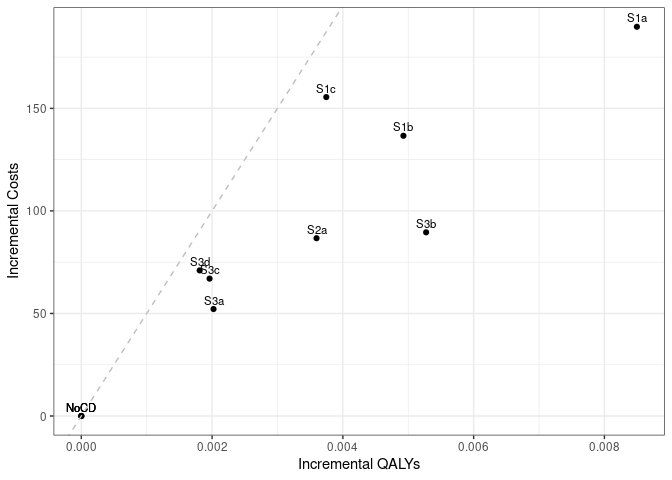

Sensitivity analysis: 50% Medication Adherence
================
18 October, 2024

    ## 
    ## > errors<-c(
    ## +   ERR_INCORRECT_SETTING_VARIABLE=-1,
    ## +   ERR_INCORRECT_VECTOR_SIZE=-2,
    ## +   ERR_INCORRECT_INPUT_VAR=-3,
    ## +   ERR_EVENT_STACK_FULL=-4,
    ## +   .... [TRUNCATED] 
    ## 
    ## > record_mode<-c(
    ## +   record_mode_none=0,
    ## +   record_mode_agent=1,
    ## +   record_mode_event=2,
    ## +   record_mode_some_event=3
    ## + )
    ## 
    ## > agent_creation_mode<-c(
    ## +   agent_creation_mode_one=0,
    ## +   agent_creation_mode_all=1,
    ## +   agent_creation_mode_pre=2
    ## + )
    ## 
    ## > medication_classes<-c(
    ## +   MED_CLASS_SABA=1,
    ## +   MED_CLASS_LABA=2,
    ## +   MED_CLASS_LAMA=4,
    ## +   MED_CLASS_ICS=8,
    ## +   MED_CLASS_MACRO=16
    ## + )
    ## 
    ## > events<-c(
    ## +     event_start=0,
    ## +     event_fixed=1,
    ## +     event_birthday=2,
    ## +     event_smoking_change=3,
    ## +     event_COPD=4,
    ## +     event_exacerbat .... [TRUNCATED]

``` r
# CHANGE: Add a timer (will see addition below to print time too)
# Start timer
start.time <- Sys.time()
```

``` r
# CHANGE: Add save paths (will see later, we also add lines to save to csv)
outputs <- "../../outputs/Sen2_50_Med_Adherence"
files <- list(
  s1 = "s1_5y.csv",
  s2 = "s2_5y.csv",
  s3 = "s3_5y.csv",
  sall = "sall_5y.csv",
  ceplane = "ceplane_5y.csv",
  clinical = "clinicalresults_5y.csv"
)

# Apply to each element in list to create path to file in outputs
paths <- lapply(files, function(filename) paste0(outputs, filename))
```

    ## Initializing the session

    ## [1] 0

**Global inputs:**

  - Medication adherence is 0.5
  - Smoking adherence is 0.7
  - Cost discounting: 0.015
  - QALY discounting: 0.015
  - Time horizon: 20
  - The WTP threshold for NMB is 50000

**Case detection inputs:**

  - Case detection occurs at 5 year intervals.
  - An outpatient diagnosis costs 61.18
  - The utility gain due to symptom relief from treatment is 0.0367

## S1 All patients scenario

All patients are eligible. The cost of case detection is:

| None | CDQ17 | FlowMeter | FlowMeter\_CDQ |
| ---: | ----: | --------: | -------------: |
|    0 | 11.56 |     30.46 |          42.01 |

#### S1NoCD2: No Case detection- Other time interval

    ## [1] 0

    ## Terminating the session

    ## [1] 0

#### S1NoCD: No Case detection

    ## Initializing the session

    ## [1] 0

    ## [1] 0

    ## Terminating the session

    ## [1] 0

#### S1A: CDQ ≥17 points

    ## Initializing the session

    ## [1] 0

    ## [1] 0

    ## Terminating the session

    ## [1] 0

#### S1B: Screening Spirometry with BD

    ## Initializing the session

    ## [1] 0

    ## [1] 0

    ## Terminating the session

    ## [1] 0

#### S1C: CDQ ≥17 points and Screening Spirometry with BD

    ## Initializing the session

    ## [1] 0

    ## [1] 0

    ## Terminating the session

    ## [1] 0

| Scenario  |   Agents | PatientYears |   CopdPYs | NCaseDetections | DiagnosedPYs | OverdiagnosedPYs |  SABA |  LAMA | LAMALABA | ICSLAMALABA |     Mild | Moderate |  Severe | VerySevere | MildPY | ModeratePY | SeverePY | VerySeverePY |     NoCOPD |    GOLD1 |    GOLD2 |    GOLD3 |   GOLD4 |         Cost | CostpAgent |      QALY | QALYpAgent |      NMB | IncrementalCosts | IncrementalQALY |     ICER | IncrementalNMB |
| :-------- | -------: | -----------: | --------: | --------------: | -----------: | ---------------: | ----: | ----: | -------: | ----------: | -------: | -------: | ------: | ---------: | -----: | ---------: | -------: | -----------: | ---------: | -------: | -------: | -------: | ------: | -----------: | ---------: | --------: | ---------: | -------: | ---------------: | --------------: | -------: | -------------: |
| S1NoCD2   | 74392407 |   1251907307 | 142212406 |       381944850 |     26274805 |         26758616 | 0.012 | 0.108 |    0.122 |       0.062 | 31003787 |  5816037 | 9795782 |     846990 |  0.218 |      0.041 |    0.069 |        0.006 | 1054876137 | 57735611 | 61386579 | 13750377 | 2383911 | 157231263187 |   2113.539 | 933114492 |     12.543 | 625043.5 |            0.000 |           0.000 |      NaN |          0.000 |
| S1NoCD    | 74385048 |   1251851172 | 142258440 |       249326491 |     26558387 |         32658641 | 0.015 | 0.108 |    0.122 |       0.062 | 31020843 |  5818416 | 9806253 |     847614 |  0.218 |      0.041 |    0.069 |        0.006 | 1054782630 | 57725415 | 61424823 | 13764879 | 2384028 | 157570221583 |   2118.305 | 933065438 |     12.544 | 625067.8 |            0.000 |           0.000 |      NaN |          0.000 |
| S1NoCDAvg | 74388728 |   1251879240 | 142235423 |       315635670 |     26416596 |         29708628 | 0.014 | 0.108 |    0.122 |       0.062 | 31012315 |  5817226 | 9801018 |     847302 |  0.218 |      0.041 |    0.069 |        0.006 | 1054829384 | 57730513 | 61405701 | 13757628 | 2383970 | 157400742385 |   2115.922 | 933089965 |     12.543 | 625055.7 |            0.000 |           0.000 |      NaN |          0.000 |
| S1a       | 74379940 |   1251885639 | 142439446 |       245498477 |     56950620 |         32649001 | 0.021 | 0.123 |    0.217 |       0.072 | 30411326 |  5736165 | 9685435 |     839882 |  0.214 |      0.040 |    0.068 |        0.006 | 1054639040 | 57754512 | 61506766 | 13810852 | 2400541 | 171498669442 |   2305.711 | 933611759 |     12.552 | 625290.8 |          187.406 |           0.008 | 22836.49 |        222.916 |
| S1b       | 74381259 |   1251883530 | 142303692 |       247443288 |     41818101 |         32653928 | 0.018 | 0.116 |    0.172 |       0.067 | 30650740 |  5761818 | 9727134 |     842179 |  0.215 |      0.040 |    0.068 |        0.006 | 1054772788 | 57734875 | 61439255 | 13773096 | 2394383 | 167548578854 |   2252.564 | 933362688 |     12.548 | 625165.3 |          134.259 |           0.005 | 28964.66 |         97.505 |
| S1c       | 74378642 |   1251834244 | 142210764 |       248047188 |     36940831 |         32638996 | 0.017 | 0.113 |    0.157 |       0.066 | 30749338 |  5783763 | 9759281 |     843976 |  0.216 |      0.041 |    0.069 |        0.006 | 1054811425 | 57666473 | 61412629 | 13783468 | 2391601 | 168945523502 |   2271.425 | 933242122 |     12.547 | 625087.5 |          153.120 |           0.003 | 44307.90 |         19.671 |

*Treatment rate:* SABA is expressed per all patient-years, LAMA,
LAMA/LABA, ICS/LAMA/LABA are per COPD patient-years *Exacerbations:*
Total exacerbations and rate per COPD patient-year: *GOLD Stage:*
Cumulative patient-years *Cost/QALY:* Total cost and QALYs *NMB:* Net
Monetary Benefit is calculated as QALY per patient-year \* Lamba - Cost
per patient-year

-----

## S2 Symptomatic patients scenario

Patients with symptoms at year 1 are eligible. The cost of case
detection is:

    ## Initializing the session

    ## [1] 0

| None | FlowMeter |
| ---: | --------: |
|    0 |     24.33 |

#### S2NoCD: No Case detection

    ## [1] 0

    ## Terminating the session

    ## [1] 0

#### S2a: Screening Spirometry without BD

    ## Initializing the session

    ## [1] 0

    ## [1] 0

    ## Terminating the session

    ## [1] 0

| Scenario |   Agents | PatientYears |   CopdPYs | NCaseDetections | DiagnosedPYs | OverdiagnosedPYs |  SABA |  LAMA | LAMALABA | ICSLAMALABA |     Mild | Moderate |  Severe | VerySevere | MildPY | ModeratePY | SeverePY | VerySeverePY |    NoCOPD |    GOLD1 |    GOLD2 |    GOLD3 |   GOLD4 |         Cost | CostpAgent |      QALY | QALYpAgent |      NMB | IncrementalCosts | IncrementalQALY |    ICER | IncrementalNMB |
| :------- | -------: | -----------: | --------: | --------------: | -----------: | ---------------: | ----: | ----: | -------: | ----------: | -------: | -------: | ------: | ---------: | -----: | ---------: | -------: | -----------: | --------: | -------: | -------: | -------: | ------: | -----------: | ---------: | --------: | ---------: | -------: | ---------------: | --------------: | ------: | -------------: |
| S2NoCD   | 44161947 |    729134345 | 100302968 |       145026996 |     19455742 |         18874539 | 0.015 | 0.114 |    0.129 |       0.069 | 23078136 |  4290149 | 7170384 |     614794 |  0.230 |      0.043 |    0.071 |        0.006 | 597692985 | 37218536 | 45009582 | 11102992 | 2053801 | 115909538934 |   2624.647 | 541812856 |     12.269 | 610813.9 |             0.00 |           0.000 |     NaN |          0.000 |
| S2a      | 44153696 |    729027331 | 100344554 |       143355795 |     32517861 |         18865336 | 0.018 | 0.123 |    0.193 |       0.075 | 22746217 |  4246299 | 7110252 |     611863 |  0.227 |      0.042 |    0.071 |        0.006 | 597553529 | 37247207 | 45004672 | 11120661 | 2049752 | 122347109538 |   2770.937 | 541973646 |     12.275 | 610964.4 |           146.29 |           0.006 | 24651.7 |        150.423 |

*Treatment rate:* SABA is expressed per all patient-years, LAMA,
LAMA/LABA, ICS/LAMA/LABA are per COPD patient-years *Exacerbations:*
Total exacerbations and rate per COPD patient-year: *GOLD Stage:*
Cumulative patient-years *Cost/QALY:* Total cost and QALYs *NMB:* Net
Monetary Benefit is calculated as QALY per patient-year \* Lamba - Cost
per patient-year

-----

## S3 Smoking history scenario

Ever smokers ≥50 years of age are eligible. The cost of case detection
is:

    ## Initializing the session

    ## [1] 0

| None | CDQ195 | CDQ165 | FlowMeter | FlowMeter\_CDQ |
| ---: | -----: | -----: | --------: | -------------: |
|    0 |  11.56 |  11.56 |     24.33 |          42.01 |

#### S3NoCD: No Case detection

    ## [1] 0

    ## Terminating the session

    ## [1] 0

#### S3a: CDQ ≥19.5 points

    ## Initializing the session

    ## [1] 0

    ## [1] 0

    ## Terminating the session

    ## [1] 0

#### S3b: CDQ ≥16.5 points

    ## Initializing the session

    ## [1] 0

    ## [1] 0

    ## Terminating the session

    ## [1] 0

#### S3c: Screening spirometry without BD

    ## Initializing the session

    ## [1] 0

    ## [1] 0

    ## Terminating the session

    ## [1] 0

#### S3d: Screening Spirometry with BD + CDQ ≥17 points

    ## Initializing the session

    ## [1] 0

    ## [1] 0

    ## Terminating the session

    ## [1] 0

| Scenario |   Agents | PatientYears |  CopdPYs | NCaseDetections | DiagnosedPYs | OverdiagnosedPYs |  SABA |  LAMA | LAMALABA | ICSLAMALABA |     Mild | Moderate |  Severe | VerySevere | MildPY | ModeratePY | SeverePY | VerySeverePY |    NoCOPD |    GOLD1 |    GOLD2 |   GOLD3 |   GOLD4 |         Cost | CostpAgent |      QALY | QALYpAgent |      NMB | IncrementalCosts | IncrementalQALY |     ICER | IncrementalNMB |
| :------- | -------: | -----------: | -------: | --------------: | -----------: | ---------------: | ----: | ----: | -------: | ----------: | -------: | -------: | ------: | ---------: | -----: | ---------: | -------: | -----------: | --------: | -------: | -------: | ------: | ------: | -----------: | ---------: | --------: | ---------: | -------: | ---------------: | --------------: | -------: | -------------: |
| S3NoCD   | 34500676 |    520235443 | 83388794 |       104904643 |     15744239 |         14130737 | 0.016 | 0.109 |    0.125 |       0.068 | 19617462 |  3662379 | 6137085 |     528055 |  0.235 |      0.044 |    0.074 |        0.006 | 415054182 | 30586162 | 37395785 | 9605002 | 1778358 |  98501757739 |   2855.067 | 387435871 |     11.230 | 558635.2 |            0.000 |           0.000 |      NaN |          0.000 |
| S3a      | 34502169 |    520355512 | 83420552 |       104390255 |     20185444 |         14134688 | 0.018 | 0.113 |    0.152 |       0.070 | 19501578 |  3645710 | 6111440 |     527291 |  0.234 |      0.044 |    0.073 |        0.006 | 415141235 | 30626684 | 37379513 | 9598663 | 1790076 | 102383685303 |   2967.456 | 387606713 |     11.234 | 558746.1 |          112.389 |           0.004 | 25167.23 |        110.895 |
| S3b      | 34490012 |    520233794 | 83433032 |       103171784 |     29722226 |         14138953 | 0.021 | 0.122 |    0.206 |       0.076 | 19284693 |  3623620 | 6079514 |     523577 |  0.231 |      0.043 |    0.073 |        0.006 | 415010187 | 30602671 | 37386278 | 9623489 | 1796865 | 105148327907 |   3048.660 | 387682275 |     11.240 | 558972.4 |          193.593 |           0.011 | 18235.31 |        337.226 |
| S3c      | 34499834 |    520197196 | 83431452 |       103790381 |     24789447 |         14121356 | 0.019 | 0.117 |    0.179 |       0.073 | 19421824 |  3636116 | 6104941 |     525767 |  0.233 |      0.044 |    0.073 |        0.006 | 414975852 | 30589127 | 37388809 | 9633998 | 1795343 | 103483452128 |   2999.535 | 387570241 |     11.234 | 558699.2 |          144.467 |           0.004 | 34653.96 |         63.975 |
| S3d      | 34498730 |    520216872 | 83438810 |       104059824 |     22656911 |         14120353 | 0.018 | 0.115 |    0.166 |       0.072 | 19480193 |  3645025 | 6101655 |     525691 |  0.233 |      0.044 |    0.073 |        0.006 | 414989555 | 30593485 | 37404336 | 9619200 | 1793800 | 103779652247 |   3008.217 | 387543900 |     11.234 | 558670.3 |          153.149 |           0.004 | 40678.72 |         35.093 |

*Treatment rate:* SABA is expressed per all patient-years, LAMA,
LAMA/LABA, ICS/LAMA/LABA are per COPD patient-years *Exacerbations:*
Total exacerbations and rate per COPD patient-year *GOLD Stage:*
Cumulative patient-years *Cost/QALY:* Total cost and QALYs *NMB:* Net
Monetary Benefit is calculated as QALY per patient-year \* Lamba - Cost
per patient-year

-----

## All Scenarios

*Ordered by descending Net Monetary Benefit*

| Scenario |   Agents |         Cost | CostpAgent |      QALY | QALYpAgent |     ICER | IncrementalNMB |
| :------- | -------: | -----------: | ---------: | --------: | ---------: | -------: | -------------: |
| S3b      | 34490012 | 105148327907 |   3048.660 | 387682275 |     11.240 | 18235.31 |        337.226 |
| S1a      | 74379940 | 171498669442 |   2305.711 | 933611759 |     12.552 | 22836.49 |        222.916 |
| S2a      | 44153696 | 122347109538 |   2770.937 | 541973646 |     12.275 | 24651.70 |        150.423 |
| S3a      | 34502169 | 102383685303 |   2967.456 | 387606713 |     11.234 | 25167.23 |        110.895 |
| S1b      | 74381259 | 167548578854 |   2252.564 | 933362688 |     12.548 | 28964.66 |         97.505 |
| S3c      | 34499834 | 103483452128 |   2999.535 | 387570241 |     11.234 | 34653.96 |         63.975 |
| S3d      | 34498730 | 103779652247 |   3008.217 | 387543900 |     11.234 | 40678.72 |         35.093 |
| S1c      | 74378642 | 168945523502 |   2271.425 | 933242122 |     12.547 | 44307.90 |         19.671 |
| S1NoCD   | 74385048 | 157570221583 |   2118.305 | 933065438 |     12.544 |      NaN |          0.000 |
| S2NoCD   | 44161947 | 115909538934 |   2624.647 | 541812856 |     12.269 |      NaN |          0.000 |
| S3NoCD   | 34500676 |  98501757739 |   2855.067 | 387435871 |     11.230 |      NaN |          0.000 |

-----

## Cost Effectiveness Plane

Adjusted to the total population

| Scenario  |   Agents | PropAgents |         Cost | CostpAgent | CostpAgentExcluded | CostpAgentAll |      QALY | QALYpAgent | QALYpAgentExcluded | QALYpAgentAll | IncrementalCosts | IncrementalQALY |  ICERAdj |     ICER |        INMB |
| :-------- | -------: | ---------: | -----------: | ---------: | -----------------: | ------------: | --------: | ---------: | -----------------: | ------------: | ---------------: | --------------: | -------: | -------: | ----------: |
| S1NoCDAvg | 74388728 |  1.0000000 | 157400742385 |   2115.922 |              0.000 |      2115.922 | 933089965 |   12.54343 |            0.00000 |      12.54343 |          0.00000 |       0.0000000 |      NaN |      NaN |   0.0000000 |
| S1a       | 74379940 |  1.0000000 | 171498669442 |   2305.711 |              0.000 |      2305.711 | 933611759 |   12.55193 |            0.00000 |      12.55193 |        189.78935 |       0.0084972 | 22335.58 | 22836.49 | 235.0693522 |
| S1b       | 74381259 |  1.0000000 | 167548578854 |   2252.564 |              0.000 |      2252.564 | 933362688 |   12.54836 |            0.00000 |      12.54836 |        136.64247 |       0.0049260 | 27738.93 | 28964.66 | 109.6584564 |
| S1c       | 74378642 |  1.0000000 | 168945523502 |   2271.425 |              0.000 |      2271.425 | 933242122 |   12.54718 |            0.00000 |      12.54718 |        155.50326 |       0.0037466 | 41505.65 | 44307.90 |  31.8245778 |
| S2NoCD    | 44161947 |  0.5936645 | 115909538934 |   2624.647 |           1372.664 |      2115.922 | 541812856 |   12.26877 |           12.94472 |      12.54343 |          0.00000 |       0.0000000 |      NaN |      NaN | \-0.0042013 |
| S2a       | 44153696 |  0.5935536 | 122347109538 |   2770.937 |           1372.664 |      2202.614 | 541973646 |   12.27471 |           12.94472 |      12.54703 |         86.69185 |       0.0035973 | 24099.31 | 24651.70 |  93.1677066 |
| S3NoCD    | 34500676 |  0.4637890 |  98501757739 |   2855.067 |           1476.607 |      2115.922 | 387435871 |   11.22981 |           13.67964 |      12.54343 |          0.00000 |       0.0000000 |      NaN |      NaN | \-0.0042013 |
| S3a       | 34502169 |  0.4638091 | 102383685303 |   2967.456 |           1476.607 |      2168.077 | 387606713 |   11.23427 |           13.67964 |      12.54545 |         52.15472 |       0.0020221 | 25792.89 | 25167.23 |  48.9439882 |
| S3b       | 34490012 |  0.4636457 | 105148327907 |   3048.660 |           1476.607 |      2205.483 | 387682275 |   11.24042 |           13.67964 |      12.54871 |         89.56084 |       0.0052734 | 16983.41 | 18235.31 | 174.1064421 |
| S3c       | 34499834 |  0.4637777 | 103483452128 |   2999.535 |           1476.607 |      2182.907 | 387570241 |   11.23397 |           13.67964 |      12.54539 |         66.98512 |       0.0019612 | 34156.01 | 34653.96 |  31.0682554 |
| S3d       | 34498730 |  0.4637629 | 103779652247 |   3008.217 |           1476.607 |      2186.911 | 387543900 |   11.23357 |           13.67964 |      12.54524 |         70.98882 |       0.0018101 | 39218.54 | 40678.72 |  19.5111477 |

<!-- -->

## Clinical Results for all scenarios

Adjusted to the total population

| Scenario  | PropAgents | ProppPatientYears | ProppCopdPYs |   SABAAll |   LAMAAll | LAMALABAAll | ICSLAMALABAAll | MildpAgentAll | ModeratepAgentAll | SeverepAgentAll | VerySeverepAgentAll | NoCOPDpPYAll | GOLD1pPYAll | GOLD2pPYAll | GOLD3pPYAll | GOLD4pPYAll | DiagnosedpPYAll |
| :-------- | ---------: | ----------------: | -----------: | --------: | --------: | ----------: | -------------: | ------------: | ----------------: | --------------: | ------------------: | -----------: | ----------: | ----------: | ----------: | ----------: | --------------: |
| S1NoCDAvg |  1.0000000 |         1.0000000 |    1.0000000 | 0.0138156 | 0.1081555 |   0.1222651 |      0.0623378 |     0.4168954 |         0.0782004 |       0.1317541 |           0.0113902 |    0.8425968 |   0.0461151 |   0.0490508 |   0.0109896 |   0.0019043 |       0.1857244 |
| S1a       |  1.0000000 |         1.0000000 |    1.0000000 | 0.0205261 | 0.1232932 |   0.2167199 |      0.0715701 |     0.4088646 |         0.0771198 |       0.1302157 |           0.0112918 |    0.8424404 |   0.0461340 |   0.0491313 |   0.0110320 |   0.0019175 |       0.3998234 |
| S1b       |  1.0000000 |         1.0000000 |    1.0000000 | 0.0176032 | 0.1156747 |   0.1721403 |      0.0670717 |     0.4120761 |         0.0774633 |       0.1307740 |           0.0113225 |    0.8425487 |   0.0461184 |   0.0490775 |   0.0110019 |   0.0019126 |       0.2938652 |
| S1c       |  1.0000000 |         1.0000000 |    1.0000000 | 0.0167543 | 0.1133007 |   0.1568122 |      0.0656851 |     0.4134162 |         0.0777611 |       0.1312108 |           0.0113470 |    0.8426127 |   0.0460656 |   0.0490581 |   0.0110106 |   0.0019105 |       0.2597611 |
| S2NoCD    |  0.5936645 |         0.5824319 |    0.7051898 | 0.0138156 | 0.1081555 |   0.1222651 |      0.0623378 |     0.4168954 |         0.0782004 |       0.1317541 |           0.0113902 |    0.8425968 |   0.0461151 |   0.0490508 |   0.0109896 |   0.0019043 |       0.1857244 |
| S2a       |  0.5935536 |         0.5823464 |    0.7054822 | 0.0157017 | 0.1148109 |   0.1671867 |      0.0666016 |     0.4124625 |         0.0776165 |       0.1309554 |           0.0113516 |    0.8425601 |   0.0461413 |   0.0490496 |   0.0110041 |   0.0019011 |       0.2775104 |
| S3NoCD    |  0.4637890 |         0.4155636 |    0.5862730 | 0.0138156 | 0.1081555 |   0.1222651 |      0.0623378 |     0.4168954 |         0.0782004 |       0.1317541 |           0.0113902 |    0.8425968 |   0.0461151 |   0.0490508 |   0.0109896 |   0.0019043 |       0.1857244 |
| S3a       |  0.4638091 |         0.4156595 |    0.5864963 | 0.0144184 | 0.1103462 |   0.1379969 |      0.0638454 |     0.4153318 |         0.0779752 |       0.1314075 |           0.0113798 |    0.8425824 |   0.0461439 |   0.0490347 |   0.0109840 |   0.0019136 |       0.2169083 |
| S3b       |  0.4636457 |         0.4155623 |    0.5865841 | 0.0159394 | 0.1153252 |   0.1697004 |      0.0670362 |     0.4124629 |         0.0776871 |       0.1309933 |           0.0113311 |    0.8425628 |   0.0461283 |   0.0490433 |   0.0110044 |   0.0019191 |       0.2839416 |
| S3c       |  0.4637777 |         0.4155330 |    0.5865730 | 0.0151010 | 0.1128900 |   0.1537982 |      0.0655178 |     0.4142686 |         0.0778479 |       0.1313230 |           0.0113595 |    0.8425609 |   0.0461186 |   0.0490462 |   0.0110129 |   0.0019179 |       0.2492633 |
| S3d       |  0.4637629 |         0.4155488 |    0.5866247 | 0.0147729 | 0.1116644 |   0.1465034 |      0.0647203 |     0.4150575 |         0.0779685 |       0.1312802 |           0.0113586 |    0.8425581 |   0.0461215 |   0.0490581 |   0.0110010 |   0.0019167 |       0.2342609 |

## Time elapsed

Run time for this notebook:

``` r
end.time <- Sys.time()
time.taken <- end.time - start.time
time.taken
```

    ## Time difference of 21.44028 hours
