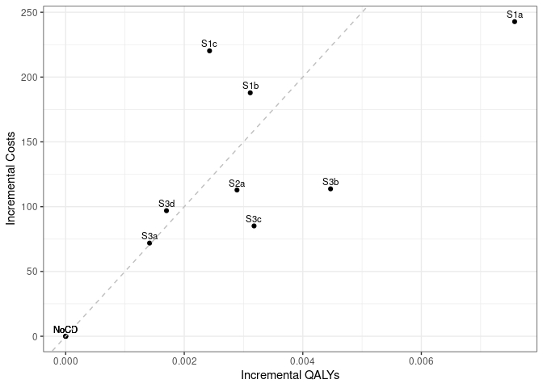

Sensitivity analysis: 30% Medication Adherence
================
18 October, 2024

    ## 
    ## > errors<-c(
    ## +   ERR_INCORRECT_SETTING_VARIABLE=-1,
    ## +   ERR_INCORRECT_VECTOR_SIZE=-2,
    ## +   ERR_INCORRECT_INPUT_VAR=-3,
    ## +   ERR_EVENT_STACK_FULL=-4,
    ## +   .... [TRUNCATED] 
    ## 
    ## > record_mode<-c(
    ## +   record_mode_none=0,
    ## +   record_mode_agent=1,
    ## +   record_mode_event=2,
    ## +   record_mode_some_event=3
    ## + )
    ## 
    ## > agent_creation_mode<-c(
    ## +   agent_creation_mode_one=0,
    ## +   agent_creation_mode_all=1,
    ## +   agent_creation_mode_pre=2
    ## + )
    ## 
    ## > medication_classes<-c(
    ## +   MED_CLASS_SABA=1,
    ## +   MED_CLASS_LABA=2,
    ## +   MED_CLASS_LAMA=4,
    ## +   MED_CLASS_ICS=8,
    ## +   MED_CLASS_MACRO=16
    ## + )
    ## 
    ## > events<-c(
    ## +     event_start=0,
    ## +     event_fixed=1,
    ## +     event_birthday=2,
    ## +     event_smoking_change=3,
    ## +     event_COPD=4,
    ## +     event_exacerbat .... [TRUNCATED]

``` r
# CHANGE: Add a timer (will see addition below to print time too)
# Start timer
start.time <- Sys.time()
```

``` r
# CHANGE: Add save paths (will see later, we also add lines to save to csv)
outputs <- "../../outputs/Sen3_30_Med_Adherence"
files <- list(
  s1 = "s1.csv",
  s2 = "s2.csv",
  s3 = "s3.csv",
  sall = "sall.csv",
  ceplane = "ceplane.csv",
  clinical = "clinicalresults.csv"
)

# Apply to each element in list to create path to file in outputs
paths <- lapply(files, function(filename) paste0(outputs, filename))
```

    ## Initializing the session

    ## [1] 0

**Global inputs:**

  - Medication adherence is 0.3
  - Smoking adherence is 0.7
  - Cost discounting: 0.015
  - QALY discounting: 0.015
  - Time horizon: 20
  - The WTP threshold for NMB is 50000

**Case detection inputs:**

  - Case detection occurs at 3 year intervals.
  - An outpatient diagnosis costs 61.18
  - The utility gain due to symptom relief from treatment is 0.0367

## S1 All patients scenario

All patients are eligible. The cost of case detection is:

| None | CDQ17 | FlowMeter | FlowMeter\_CDQ |
| ---: | ----: | --------: | -------------: |
|    0 | 11.56 |     30.46 |          42.01 |

#### S1NoCD: No Case detection

    ## [1] 0

    ## Terminating the session

    ## [1] 0

#### S1NoCD2: No Case detection- Other time interval

    ## Initializing the session

    ## [1] 0

    ## [1] 0

    ## Terminating the session

    ## [1] 0

#### S1A: CDQ ≥17 points

    ## Initializing the session

    ## [1] 0

    ## [1] 0

    ## Terminating the session

    ## [1] 0

#### S1B: Screening Spirometry with BD

    ## Initializing the session

    ## [1] 0

    ## [1] 0

    ## Terminating the session

    ## [1] 0

#### S1C: CDQ ≥17 points and Screening Spirometry with BD

    ## Initializing the session

    ## [1] 0

    ## [1] 0

    ## Terminating the session

    ## [1] 0

| Scenario  |   Agents | PatientYears |   CopdPYs | NCaseDetections | DiagnosedPYs | OverdiagnosedPYs |  SABA |  LAMA | LAMALABA | ICSLAMALABA |     Mild | Moderate |  Severe | VerySevere | MildPY | ModeratePY | SeverePY | VerySeverePY |     NoCOPD |    GOLD1 |    GOLD2 |    GOLD3 |   GOLD4 |         Cost | CostpAgent |      QALY | QALYpAgent |      NMB | IncrementalCosts | IncrementalQALY |     ICER | IncrementalNMB |
| :-------- | -------: | -----------: | --------: | --------------: | -----------: | ---------------: | ----: | ----: | -------: | ----------: | -------: | -------: | ------: | ---------: | -----: | ---------: | -------: | -----------: | ---------: | -------: | -------: | -------: | ------: | -----------: | ---------: | --------: | ---------: | -------: | ---------------: | --------------: | -------: | -------------: |
| S1NoCD    | 74391464 |   1251846696 | 142153257 |       381962757 |     26182070 |         26743570 | 0.008 | 0.074 |    0.085 |       0.042 | 31305666 |  5887378 | 9942880 |     860896 |  0.220 |      0.041 |    0.070 |        0.006 | 1054878905 | 57678781 | 61422913 | 13727862 | 2371783 | 154495883919 |   2076.796 | 932920249 |     12.541 | 624957.7 |            0.000 |           0.000 |      NaN |          0.000 |
| S1NoCD2   | 74388938 |   1251794382 | 142120660 |       249337054 |     26436102 |         32647198 | 0.009 | 0.074 |    0.085 |       0.042 | 31309814 |  5891563 | 9940655 |     858444 |  0.220 |      0.041 |    0.070 |        0.006 | 1054860306 | 57686410 | 61403514 | 13712934 | 2367853 | 154557237173 |   2077.691 | 932889290 |     12.541 | 624957.3 |            0.000 |           0.000 |      NaN |          0.000 |
| S1NoCDAvg | 74390201 |   1251820539 | 142136958 |       315649906 |     26309086 |         29695384 | 0.009 | 0.074 |    0.085 |       0.042 | 31307740 |  5889470 | 9941768 |     859670 |  0.220 |      0.041 |    0.070 |        0.006 | 1054869606 | 57682596 | 61413214 | 13720398 | 2369818 | 154526560546 |   2077.243 | 932904769 |     12.541 | 624957.5 |            0.000 |           0.000 |      NaN |          0.000 |
| S1a       | 74388637 |   1251954576 | 142304585 |       372150643 |     65937454 |         26759266 | 0.012 | 0.088 |    0.166 |       0.050 | 30751906 |  5811141 | 9836640 |     852012 |  0.216 |      0.041 |    0.069 |        0.006 | 1054840784 | 57750158 | 61420731 | 13779387 | 2392466 | 172583144536 |   2320.020 | 933448555 |     12.548 | 625093.4 |          243.224 |           0.008 | 32093.76 |        135.704 |
| S1b       | 74382676 |   1251687232 | 142249136 |       376719160 |     47403822 |         26751128 | 0.010 | 0.081 |    0.131 |       0.046 | 30956810 |  5843468 | 9882216 |     856328 |  0.218 |      0.041 |    0.069 |        0.006 | 1054636239 | 57698946 | 61436242 | 13769106 | 2385677 | 168485407152 |   2265.116 | 933041983 |     12.544 | 624925.3 |          188.320 |           0.003 | 60393.46 |       \-32.409 |
| S1c       | 74386960 |   1251788481 | 142230212 |       378359561 |     40866314 |         26773359 | 0.009 | 0.079 |    0.117 |       0.045 | 31082478 |  5861373 | 9903074 |     856965 |  0.219 |      0.041 |    0.070 |        0.006 | 1054746667 | 57715501 | 61414752 | 13768729 | 2378357 | 170903435118 |   2297.492 | 933044639 |     12.543 | 624858.6 |          220.696 |           0.002 | 90764.65 |       \-99.120 |

*Treatment rate:* SABA is expressed per all patient-years, LAMA,
LAMA/LABA, ICS/LAMA/LABA are per COPD patient-years *Exacerbations:*
Total exacerbations and rate per COPD patient-year: *GOLD Stage:*
Cumulative patient-years *Cost/QALY:* Total cost and QALYs *NMB:* Net
Monetary Benefit is calculated as QALY per patient-year \* Lamba - Cost
per patient-year

-----

## S2 Symptomatic patients scenario

Patients with symptoms at year 1 are eligible. The cost of case
detection is:

    ## Initializing the session

    ## [1] 0

| None | FlowMeter |
| ---: | --------: |
|    0 |     24.33 |

#### S2NoCD: No Case detection

    ## [1] 0

    ## Terminating the session

    ## [1] 0

#### S2a: Screening Spirometry without BD

    ## Initializing the session

    ## [1] 0

    ## [1] 0

    ## Terminating the session

    ## [1] 0

| Scenario |   Agents | PatientYears |   CopdPYs | NCaseDetections | DiagnosedPYs | OverdiagnosedPYs |  SABA |  LAMA | LAMALABA | ICSLAMALABA |     Mild | Moderate |  Severe | VerySevere | MildPY | ModeratePY | SeverePY | VerySeverePY |    NoCOPD |    GOLD1 |    GOLD2 |    GOLD3 |   GOLD4 |         Cost | CostpAgent |      QALY | QALYpAgent |      NMB | IncrementalCosts | IncrementalQALY |     ICER | IncrementalNMB |
| :------- | -------: | -----------: | --------: | --------------: | -----------: | ---------------: | ----: | ----: | -------: | ----------: | -------: | -------: | ------: | ---------: | -----: | ---------: | -------: | -----------: | --------: | -------: | -------: | -------: | ------: | -----------: | ---------: | --------: | ---------: | -------: | ---------------: | --------------: | -------: | -------------: |
| S2NoCD   | 44163779 |    729110125 | 100270393 |       221985438 |     19211382 |         15462784 | 0.008 | 0.078 |    0.091 |       0.046 | 23315005 |  4352165 | 7285709 |     624495 |  0.233 |      0.043 |    0.073 |        0.006 | 597704679 | 37249571 | 44985524 | 11072236 | 2046227 | 113807771008 |   2576.948 | 541685291 |     12.265 | 610691.8 |            0.000 |           0.000 |      NaN |          0.000 |
| S2a      | 44158975 |    729026188 | 100272735 |       217592129 |     36825608 |         15470520 | 0.011 | 0.087 |    0.147 |       0.052 | 23021851 |  4306908 | 7227650 |     622801 |  0.230 |      0.043 |    0.072 |        0.006 | 597620485 | 37227506 | 44976643 | 11100756 | 2051792 | 122196863470 |   2767.203 | 541838063 |     12.270 | 610741.2 |          190.255 |           0.005 | 39686.57 |         49.442 |

*Treatment rate:* SABA is expressed per all patient-years, LAMA,
LAMA/LABA, ICS/LAMA/LABA are per COPD patient-years *Exacerbations:*
Total exacerbations and rate per COPD patient-year: *GOLD Stage:*
Cumulative patient-years *Cost/QALY:* Total cost and QALYs *NMB:* Net
Monetary Benefit is calculated as QALY per patient-year \* Lamba - Cost
per patient-year

-----

## S3 Smoking history scenario

Ever smokers ≥50 years of age are eligible. The cost of case detection
is:

    ## Initializing the session

    ## [1] 0

| None | CDQ195 | CDQ165 | FlowMeter | FlowMeter\_CDQ |
| ---: | -----: | -----: | --------: | -------------: |
|    0 |  11.56 |  11.56 |     24.33 |          42.01 |

#### S3NoCD: No Case detection

    ## [1] 0

    ## Terminating the session

    ## [1] 0

#### S3a: CDQ ≥19.5 points

    ## Initializing the session

    ## [1] 0

    ## [1] 0

    ## Terminating the session

    ## [1] 0

#### S3b: CDQ ≥16.5 points

    ## Initializing the session

    ## [1] 0

    ## [1] 0

    ## Terminating the session

    ## [1] 0

#### S3c: Screening spirometry without BD

    ## Initializing the session

    ## [1] 0

    ## [1] 0

    ## Terminating the session

    ## [1] 0

#### S3d: Screening Spirometry with BD + CDQ ≥17 points

    ## Initializing the session

    ## [1] 0

    ## [1] 0

    ## Terminating the session

    ## [1] 0

| Scenario |   Agents | PatientYears |  CopdPYs | NCaseDetections | DiagnosedPYs | OverdiagnosedPYs |  SABA |  LAMA | LAMALABA | ICSLAMALABA |     Mild | Moderate |  Severe | VerySevere | MildPY | ModeratePY | SeverePY | VerySeverePY |    NoCOPD |    GOLD1 |    GOLD2 |   GOLD3 |   GOLD4 |         Cost | CostpAgent |      QALY | QALYpAgent |      NMB | IncrementalCosts | IncrementalQALY |     ICER | IncrementalNMB |
| :------- | -------: | -----------: | -------: | --------------: | -----------: | ---------------: | ----: | ----: | -------: | ----------: | -------: | -------: | ------: | ---------: | -----: | ---------: | -------: | -----------: | --------: | -------: | -------: | ------: | ------: | -----------: | ---------: | --------: | ---------: | -------: | ---------------: | --------------: | -------: | -------------: |
| S3NoCD   | 34502364 |    520181045 | 83389560 |       160193181 |     15527727 |         11621737 | 0.008 | 0.075 |    0.087 |       0.045 | 19860238 |  3719965 | 6233918 |     537331 |  0.238 |      0.045 |    0.075 |        0.006 | 415000286 | 30595320 | 37403260 | 9590751 | 1779341 |  96886423122 |   2808.110 | 387300797 |     11.225 | 558458.9 |            0.000 |           0.000 |      NaN |          0.000 |
| S3a      | 34501777 |    520204825 | 83346544 |       158657912 |     21883315 |         11618591 | 0.010 | 0.079 |    0.113 |       0.048 | 19730717 |  3699608 | 6197977 |     534191 |  0.237 |      0.044 |    0.074 |        0.006 | 415065753 | 30551971 | 37370539 | 9616621 | 1786632 | 102235576528 |   2963.197 | 387398025 |     11.228 | 558454.3 |          155.088 |           0.003 | 51540.61 |        \-4.636 |
| S3b      | 34491740 |    520134940 | 83414656 |       155571003 |     34222659 |         11625101 | 0.013 | 0.086 |    0.158 |       0.052 | 19522791 |  3671126 | 6167558 |     532171 |  0.234 |      0.044 |    0.074 |        0.006 | 414931517 | 30592280 | 37389230 | 9623028 | 1786295 | 105333248428 |   3053.869 | 387487889 |     11.234 | 558657.3 |          245.759 |           0.009 | 27669.88 |        198.332 |
| S3c      | 34499972 |    520254049 | 83415174 |       157160187 |     28012451 |         11621244 | 0.011 | 0.082 |    0.136 |       0.050 | 19627798 |  3687597 | 6182213 |     534270 |  0.235 |      0.044 |    0.074 |        0.006 | 415047185 | 30613135 | 37387488 | 9605751 | 1785727 | 103216378171 |   2991.782 | 387504455 |     11.232 | 558609.3 |          183.672 |           0.007 | 27489.92 |        150.399 |
| S3d      | 34501612 |    520176760 | 83398684 |       157824125 |     25232874 |         11625169 | 0.011 | 0.081 |    0.125 |       0.049 | 19659452 |  3691609 | 6195650 |     533235 |  0.236 |      0.044 |    0.074 |        0.006 | 414991047 | 30606601 | 37381005 | 9606907 | 1782386 | 104094294791 |   3017.085 | 387416978 |     11.229 | 558430.6 |          208.975 |           0.004 | 57854.73 |       \-28.372 |

*Treatment rate:* SABA is expressed per all patient-years, LAMA,
LAMA/LABA, ICS/LAMA/LABA are per COPD patient-years *Exacerbations:*
Total exacerbations and rate per COPD patient-year *GOLD Stage:*
Cumulative patient-years *Cost/QALY:* Total cost and QALYs *NMB:* Net
Monetary Benefit is calculated as QALY per patient-year \* Lamba - Cost
per patient-year

-----

## All Scenarios

*Ordered by descending Net Monetary Benefit*

| Scenario |   Agents |         Cost | CostpAgent |      QALY | QALYpAgent |     ICER | IncrementalNMB |
| :------- | -------: | -----------: | ---------: | --------: | ---------: | -------: | -------------: |
| S3b      | 34491740 | 105333248428 |   3053.869 | 387487889 |     11.234 | 27669.88 |        198.332 |
| S3c      | 34499972 | 103216378171 |   2991.782 | 387504455 |     11.232 | 27489.92 |        150.399 |
| S1a      | 74388637 | 172583144536 |   2320.020 | 933448555 |     12.548 | 32093.76 |        135.704 |
| S2a      | 44158975 | 122196863470 |   2767.203 | 541838063 |     12.270 | 39686.57 |         49.442 |
| S1NoCD   | 74391464 | 154495883919 |   2076.796 | 932920249 |     12.541 |      NaN |          0.000 |
| S2NoCD   | 44163779 | 113807771008 |   2576.948 | 541685291 |     12.265 |      NaN |          0.000 |
| S3NoCD   | 34502364 |  96886423122 |   2808.110 | 387300797 |     11.225 |      NaN |          0.000 |
| S3a      | 34501777 | 102235576528 |   2963.197 | 387398025 |     11.228 | 51540.61 |        \-4.636 |
| S3d      | 34501612 | 104094294791 |   3017.085 | 387416978 |     11.229 | 57854.73 |       \-28.372 |
| S1b      | 74382676 | 168485407152 |   2265.116 | 933041983 |     12.544 | 60393.46 |       \-32.409 |
| S1c      | 74386960 | 170903435118 |   2297.492 | 933044639 |     12.543 | 90764.65 |       \-99.120 |

-----

## Cost Effectiveness Plane

Adjusted to the total population

| Scenario  |   Agents | PropAgents |         Cost | CostpAgent | CostpAgentExcluded | CostpAgentAll |      QALY | QALYpAgent | QALYpAgentExcluded | QALYpAgentAll | IncrementalCosts | IncrementalQALY |  ICERAdj |     ICER |        INMB |
| :-------- | -------: | ---------: | -----------: | ---------: | -----------------: | ------------: | --------: | ---------: | -----------------: | ------------: | ---------------: | --------------: | -------: | -------: | ----------: |
| S1NoCDAvg | 74390201 |  1.0000000 | 154526560546 |   2077.243 |              0.000 |      2077.243 | 932904769 |   12.54069 |            0.00000 |      12.54069 |          0.00000 |       0.0000000 |      NaN |      NaN |    0.000000 |
| S1a       | 74388637 |  1.0000000 | 172583144536 |   2320.020 |              0.000 |      2320.020 | 933448555 |   12.54827 |            0.00000 |      12.54827 |        242.77677 |       0.0075737 | 32055.13 | 32093.76 |  135.909545 |
| S1b       | 74382676 |  1.0000000 | 168485407152 |   2265.116 |              0.000 |      2265.116 | 933041983 |   12.54381 |            0.00000 |      12.54381 |        187.87275 |       0.0031134 | 60343.42 | 60393.46 | \-32.203122 |
| S1c       | 74386960 |  1.0000000 | 170903435118 |   2297.492 |              0.000 |      2297.492 | 933044639 |   12.54312 |            0.00000 |      12.54312 |        220.24837 |       0.0024267 | 90760.92 | 90764.65 | \-98.914014 |
| S2NoCD    | 44163779 |  0.5936774 | 113807771008 |   2576.948 |           1347.126 |      2077.243 | 541685291 |   12.26537 |           12.94296 |      12.54069 |          0.00000 |       0.0000000 |      NaN |      NaN |    0.000000 |
| S2a       | 44158975 |  0.5936128 | 122196863470 |   2767.203 |           1347.126 |      2190.102 | 541838063 |   12.27017 |           12.94296 |      12.54358 |        112.85847 |       0.0028895 | 39058.09 | 39686.57 |   31.616687 |
| S3NoCD    | 34502364 |  0.4638025 |  96886423122 |   2808.110 |           1445.055 |      2077.243 | 387300797 |   11.22534 |           13.67845 |      12.54069 |          0.00000 |       0.0000000 |      NaN |      NaN |    0.000000 |
| S3a       | 34501777 |  0.4637946 | 102235576528 |   2963.197 |           1445.055 |      2149.162 | 387398025 |   11.22835 |           13.67845 |      12.54211 |         71.91810 |       0.0014149 | 50827.90 | 51540.61 |  \-1.171422 |
| S3b       | 34491740 |  0.4636597 | 105333248428 |   3053.869 |           1445.055 |      2190.997 | 387487889 |   11.23422 |           13.67845 |      12.54516 |        113.75393 |       0.0044685 | 25456.93 | 27669.88 |  109.670352 |
| S3c       | 34499972 |  0.4637704 | 103216378171 |   2991.782 |           1445.055 |      2162.381 | 387504455 |   11.23202 |           13.67845 |      12.54387 |         85.13771 |       0.0031775 | 26793.71 | 27489.92 |   73.738591 |
| S3d       | 34501612 |  0.4637924 | 104094294791 |   3017.085 |           1445.055 |      2174.151 | 387416978 |   11.22895 |           13.67845 |      12.54239 |         96.90736 |       0.0017000 | 57002.71 | 57854.73 | \-11.904950 |

<!-- -->

## Clinical Results for all scenarios

Adjusted to the total population

| Scenario  | PropAgents | ProppPatientYears | ProppCopdPYs |   SABAAll |   LAMAAll | LAMALABAAll | ICSLAMALABAAll | MildpAgentAll | ModeratepAgentAll | SeverepAgentAll | VerySeverepAgentAll | NoCOPDpPYAll | GOLD1pPYAll | GOLD2pPYAll | GOLD3pPYAll | GOLD4pPYAll | DiagnosedpPYAll |
| :-------- | ---------: | ----------------: | -----------: | --------: | --------: | ----------: | -------------: | ------------: | ----------------: | --------------: | ------------------: | -----------: | ----------: | ----------: | ----------: | ----------: | --------------: |
| S1NoCDAvg |  1.0000000 |         1.0000000 |    1.0000000 | 0.0085075 | 0.0742141 |   0.0853886 |      0.0417846 |     0.4208584 |         0.0791700 |       0.1336435 |           0.0115562 |    0.8426684 |   0.0460790 |   0.0490591 |   0.0109604 |   0.0018931 |       0.1850967 |
| S1a       |  1.0000000 |         1.0000000 |    1.0000000 | 0.0124633 | 0.0875741 |   0.1659651 |      0.0496501 |     0.4133952 |         0.0781187 |       0.1322331 |           0.0114535 |    0.8425552 |   0.0461280 |   0.0490599 |   0.0110063 |   0.0019110 |       0.4633544 |
| S1b       |  1.0000000 |         1.0000000 |    1.0000000 | 0.0100234 | 0.0814428 |   0.1308683 |      0.0462446 |     0.4161831 |         0.0785595 |       0.1328564 |           0.0115125 |    0.8425717 |   0.0460969 |   0.0490827 |   0.0110004 |   0.0019060 |       0.3332451 |
| S1c       |  1.0000000 |         1.0000000 |    1.0000000 | 0.0092746 | 0.0791646 |   0.1173694 |      0.0449469 |     0.4178485 |         0.0787957 |       0.1331292 |           0.0115204 |    0.8425918 |   0.0461064 |   0.0490616 |   0.0109992 |   0.0019000 |       0.2873251 |
| S2NoCD    |  0.5936774 |         0.5824398 |    0.7054491 | 0.0085075 | 0.0742141 |   0.0853886 |      0.0417846 |     0.4208584 |         0.0791700 |       0.1336435 |           0.0115562 |    0.8426684 |   0.0460790 |   0.0490591 |   0.0109604 |   0.0018931 |       0.1850967 |
| S2a       |  0.5936128 |         0.5823728 |    0.7054656 | 0.0102682 | 0.0805222 |   0.1250675 |      0.0457162 |     0.4169347 |         0.0785649 |       0.1328687 |           0.0115340 |    0.8426598 |   0.0460640 |   0.0490541 |   0.0109835 |   0.0018976 |       0.3090183 |
| S3NoCD    |  0.4638025 |         0.4155396 |    0.5866846 | 0.0085075 | 0.0742141 |   0.0853886 |      0.0417846 |     0.4208584 |         0.0791700 |       0.1336435 |           0.0115562 |    0.8426684 |   0.0460790 |   0.0490591 |   0.0109604 |   0.0018931 |       0.1850967 |
| S3a       |  0.4637946 |         0.4155586 |    0.5863819 | 0.0090880 | 0.0764295 |   0.1002423 |      0.0432345 |     0.4191195 |         0.0788968 |       0.1331611 |           0.0115141 |    0.8427041 |   0.0460436 |   0.0490324 |   0.0109809 |   0.0018989 |       0.2298668 |
| S3b       |  0.4636597 |         0.4155028 |    0.5868611 | 0.0104364 | 0.0806607 |   0.1268277 |      0.0458833 |     0.4163632 |         0.0785212 |       0.1327647 |           0.0114880 |    0.8426457 |   0.0460779 |   0.0490491 |   0.0109863 |   0.0018987 |       0.3165919 |
| S3c       |  0.4637704 |         0.4155979 |    0.5868648 | 0.0097106 | 0.0784631 |   0.1138586 |      0.0445219 |     0.4177430 |         0.0787366 |       0.1329514 |           0.0115153 |    0.8426549 |   0.0460910 |   0.0490446 |   0.0109720 |   0.0018982 |       0.2728995 |
| S3d       |  0.4637924 |         0.4155362 |    0.5867488 | 0.0094242 | 0.0775264 |   0.1076864 |      0.0439515 |     0.4181622 |         0.0787893 |       0.1331300 |           0.0115012 |    0.8426640 |   0.0460881 |   0.0490415 |   0.0109733 |   0.0018955 |       0.2533652 |

## Time elapsed

Run time for this notebook:

``` r
end.time <- Sys.time()
time.taken <- end.time - start.time
time.taken
```

    ## Time difference of 21.10292 hours
