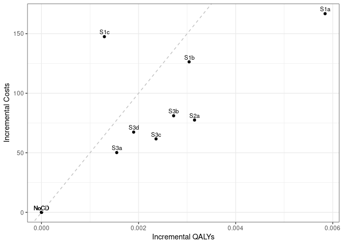

Sensitivity analysis: 30% Medication Adherence
================
18 October, 2024

    ## 
    ## > errors<-c(
    ## +   ERR_INCORRECT_SETTING_VARIABLE=-1,
    ## +   ERR_INCORRECT_VECTOR_SIZE=-2,
    ## +   ERR_INCORRECT_INPUT_VAR=-3,
    ## +   ERR_EVENT_STACK_FULL=-4,
    ## +   .... [TRUNCATED] 
    ## 
    ## > record_mode<-c(
    ## +   record_mode_none=0,
    ## +   record_mode_agent=1,
    ## +   record_mode_event=2,
    ## +   record_mode_some_event=3
    ## + )
    ## 
    ## > agent_creation_mode<-c(
    ## +   agent_creation_mode_one=0,
    ## +   agent_creation_mode_all=1,
    ## +   agent_creation_mode_pre=2
    ## + )
    ## 
    ## > medication_classes<-c(
    ## +   MED_CLASS_SABA=1,
    ## +   MED_CLASS_LABA=2,
    ## +   MED_CLASS_LAMA=4,
    ## +   MED_CLASS_ICS=8,
    ## +   MED_CLASS_MACRO=16
    ## + )
    ## 
    ## > events<-c(
    ## +     event_start=0,
    ## +     event_fixed=1,
    ## +     event_birthday=2,
    ## +     event_smoking_change=3,
    ## +     event_COPD=4,
    ## +     event_exacerbat .... [TRUNCATED]

``` r
# CHANGE: Add a timer (will see addition below to print time too)
# Start timer
start.time <- Sys.time()
```

``` r
# CHANGE: Add save paths (will see later, we also add lines to save to csv)
outputs <- "../../outputs/Sen3_30_Med_Adherence"
files <- list(
  s1 = "s1_5y.csv",
  s2 = "s2_5y.csv",
  s3 = "s3_5y.csv",
  sall = "sall_5y.csv",
  ceplane = "ceplane_5y.csv",
  clinical = "clinicalresults_5y.csv"
)

# Apply to each element in list to create path to file in outputs
paths <- lapply(files, function(filename) paste0(outputs, filename))
```

    ## Initializing the session

    ## [1] 0

**Global inputs:**

  - Medication adherence is 0.3
  - Smoking adherence is 0.7
  - Cost discounting: 0.015
  - QALY discounting: 0.015
  - Time horizon: 20
  - The WTP threshold for NMB is 50000

**Case detection inputs:**

  - Case detection occurs at 5 year intervals.
  - An outpatient diagnosis costs 61.18
  - The utility gain due to symptom relief from treatment is 0.0367

## S1 All patients scenario

All patients are eligible. The cost of case detection is:

| None | CDQ17 | FlowMeter | FlowMeter\_CDQ |
| ---: | ----: | --------: | -------------: |
|    0 | 11.56 |     30.46 |          42.01 |

#### S1NoCD2: No Case detection- Other time interval

    ## [1] 0

    ## Terminating the session

    ## [1] 0

#### S1NoCD: No Case detection

    ## Initializing the session

    ## [1] 0

    ## [1] 0

    ## Terminating the session

    ## [1] 0

#### S1A: CDQ ≥17 points

    ## Initializing the session

    ## [1] 0

    ## [1] 0

    ## Terminating the session

    ## [1] 0

#### S1B: Screening Spirometry with BD

    ## Initializing the session

    ## [1] 0

    ## [1] 0

    ## Terminating the session

    ## [1] 0

#### S1C: CDQ ≥17 points and Screening Spirometry with BD

    ## Initializing the session

    ## [1] 0

    ## [1] 0

    ## Terminating the session

    ## [1] 0

| Scenario  |   Agents | PatientYears |   CopdPYs | NCaseDetections | DiagnosedPYs | OverdiagnosedPYs |  SABA |  LAMA | LAMALABA | ICSLAMALABA |     Mild | Moderate |  Severe | VerySevere | MildPY | ModeratePY | SeverePY | VerySeverePY |     NoCOPD |    GOLD1 |    GOLD2 |    GOLD3 |   GOLD4 |         Cost | CostpAgent |      QALY | QALYpAgent |      NMB | IncrementalCosts | IncrementalQALY |      ICER | IncrementalNMB |
| :-------- | -------: | -----------: | --------: | --------------: | -----------: | ---------------: | ----: | ----: | -------: | ----------: | -------: | -------: | ------: | ---------: | -----: | ---------: | -------: | -----------: | ---------: | -------: | -------: | -------: | ------: | -----------: | ---------: | --------: | ---------: | -------: | ---------------: | --------------: | --------: | -------------: |
| S1NoCD2   | 74391464 |   1251846696 | 142153257 |       381962757 |     26182070 |         26743570 | 0.008 | 0.074 |    0.085 |       0.042 | 31305666 |  5887378 | 9942880 |     860896 |  0.220 |      0.041 |    0.070 |        0.006 | 1054878905 | 57678781 | 61422913 | 13727862 | 2371783 | 154495883919 |   2076.796 | 932920249 |     12.541 | 624957.7 |            0.000 |           0.000 |       NaN |          0.000 |
| S1NoCD    | 74388938 |   1251794382 | 142120660 |       249337054 |     26436102 |         32647198 | 0.009 | 0.074 |    0.085 |       0.042 | 31309814 |  5891563 | 9940655 |     858444 |  0.220 |      0.041 |    0.070 |        0.006 | 1054860306 | 57686410 | 61403514 | 13712934 | 2367853 | 154557237173 |   2077.691 | 932889290 |     12.541 | 624957.3 |            0.000 |           0.000 |       NaN |          0.000 |
| S1NoCDAvg | 74390201 |   1251820539 | 142136958 |       315649906 |     26309086 |         29695384 | 0.009 | 0.074 |    0.085 |       0.042 | 31307740 |  5889470 | 9941768 |     859670 |  0.220 |      0.041 |    0.070 |        0.006 | 1054869606 | 57682596 | 61413214 | 13720398 | 2369818 | 154526560546 |   2077.243 | 932904769 |     12.541 | 624957.5 |            0.000 |           0.000 |       NaN |          0.000 |
| S1a       | 74382169 |   1251794073 | 142148938 |       245520049 |     56731687 |         32661233 | 0.013 | 0.085 |    0.148 |       0.048 | 30843034 |  5825529 | 9851104 |     853312 |  0.217 |      0.041 |    0.069 |        0.006 | 1054833385 | 57677991 | 61382395 | 13749886 | 2384330 | 166917704937 |   2244.055 | 933238619 |     12.547 | 625082.8 |          166.364 |           0.006 |  28498.50 |        125.518 |
| S1b       | 74386737 |   1251822913 | 142173420 |       247455752 |     41703308 |         32659436 | 0.011 | 0.080 |    0.118 |       0.045 | 31038852 |  5851050 | 9885407 |     857499 |  0.218 |      0.041 |    0.070 |        0.006 | 1054836284 | 57706221 | 61393015 | 13737761 | 2382832 | 163918987276 |   2203.605 | 933087576 |     12.544 | 624983.2 |          125.914 |           0.003 |  41464.32 |         25.920 |
| S1c       | 74380210 |   1251614430 | 142136426 |       248027895 |     36825069 |         32641994 | 0.010 | 0.078 |    0.108 |       0.044 | 31124409 |  5859835 | 9907531 |     857117 |  0.219 |      0.041 |    0.070 |        0.006 | 1054673377 | 57680567 | 61378975 | 13736552 | 2388766 | 165476605577 |   2224.740 | 932875830 |     12.542 | 624874.7 |          147.049 |           0.001 | 113937.35 |       \-82.518 |

*Treatment rate:* SABA is expressed per all patient-years, LAMA,
LAMA/LABA, ICS/LAMA/LABA are per COPD patient-years *Exacerbations:*
Total exacerbations and rate per COPD patient-year: *GOLD Stage:*
Cumulative patient-years *Cost/QALY:* Total cost and QALYs *NMB:* Net
Monetary Benefit is calculated as QALY per patient-year \* Lamba - Cost
per patient-year

-----

## S2 Symptomatic patients scenario

Patients with symptoms at year 1 are eligible. The cost of case
detection is:

    ## Initializing the session

    ## [1] 0

| None | FlowMeter |
| ---: | --------: |
|    0 |     24.33 |

#### S2NoCD: No Case detection

    ## [1] 0

    ## Terminating the session

    ## [1] 0

#### S2a: Screening Spirometry without BD

    ## Initializing the session

    ## [1] 0

    ## [1] 0

    ## Terminating the session

    ## [1] 0

| Scenario |   Agents | PatientYears |   CopdPYs | NCaseDetections | DiagnosedPYs | OverdiagnosedPYs |  SABA |  LAMA | LAMALABA | ICSLAMALABA |     Mild | Moderate |  Severe | VerySevere | MildPY | ModeratePY | SeverePY | VerySeverePY |    NoCOPD |    GOLD1 |    GOLD2 |    GOLD3 |   GOLD4 |         Cost | CostpAgent |      QALY | QALYpAgent |      NMB | IncrementalCosts | IncrementalQALY |     ICER | IncrementalNMB |
| :------- | -------: | -----------: | --------: | --------------: | -----------: | ---------------: | ----: | ----: | -------: | ----------: | -------: | -------: | ------: | ---------: | -----: | ---------: | -------: | -----------: | --------: | -------: | -------: | -------: | ------: | -----------: | ---------: | --------: | ---------: | -------: | ---------------: | --------------: | -------: | -------------: |
| S2NoCD   | 44169529 |    729165463 | 100186080 |       145052565 |     19369144 |         18880982 | 0.009 | 0.078 |    0.091 |       0.046 | 23297548 |  4347180 | 7273198 |     625208 |  0.233 |      0.043 |    0.073 |        0.006 | 597835526 | 37205106 | 44965425 | 11066632 | 2036577 | 113773134517 |   2575.829 | 541738864 |     12.265 | 610673.7 |             0.00 |           0.000 |      NaN |          0.000 |
| S2a      | 44154734 |    729015420 | 100238813 |       143371118 |     32415085 |         18870033 | 0.012 | 0.085 |    0.133 |       0.050 | 23056457 |  4313674 | 7230388 |     621602 |  0.230 |      0.043 |    0.072 |        0.006 | 597641299 | 37244329 | 44954343 | 11080038 | 2044854 | 119517971595 |   2706.799 | 541781897 |     12.270 | 610796.9 |           130.97 |           0.005 | 25760.03 |        123.242 |

*Treatment rate:* SABA is expressed per all patient-years, LAMA,
LAMA/LABA, ICS/LAMA/LABA are per COPD patient-years *Exacerbations:*
Total exacerbations and rate per COPD patient-year: *GOLD Stage:*
Cumulative patient-years *Cost/QALY:* Total cost and QALYs *NMB:* Net
Monetary Benefit is calculated as QALY per patient-year \* Lamba - Cost
per patient-year

-----

## S3 Smoking history scenario

Ever smokers ≥50 years of age are eligible. The cost of case detection
is:

    ## Initializing the session

    ## [1] 0

| None | CDQ195 | CDQ165 | FlowMeter | FlowMeter\_CDQ |
| ---: | -----: | -----: | --------: | -------------: |
|    0 |  11.56 |  11.56 |     24.33 |          42.01 |

#### S3NoCD: No Case detection

    ## [1] 0

    ## Terminating the session

    ## [1] 0

#### S3a: CDQ ≥19.5 points

    ## Initializing the session

    ## [1] 0

    ## [1] 0

    ## Terminating the session

    ## [1] 0

#### S3b: CDQ ≥16.5 points

    ## Initializing the session

    ## [1] 0

    ## [1] 0

    ## Terminating the session

    ## [1] 0

#### S3c: Screening spirometry without BD

    ## Initializing the session

    ## [1] 0

    ## [1] 0

    ## Terminating the session

    ## [1] 0

#### S3d: Screening Spirometry with BD + CDQ ≥17 points

    ## Initializing the session

    ## [1] 0

    ## [1] 0

    ## Terminating the session

    ## [1] 0

| Scenario |   Agents | PatientYears |  CopdPYs | NCaseDetections | DiagnosedPYs | OverdiagnosedPYs |  SABA |  LAMA | LAMALABA | ICSLAMALABA |     Mild | Moderate |  Severe | VerySevere | MildPY | ModeratePY | SeverePY | VerySeverePY |    NoCOPD |    GOLD1 |    GOLD2 |   GOLD3 |   GOLD4 |         Cost | CostpAgent |      QALY | QALYpAgent |      NMB | IncrementalCosts | IncrementalQALY |     ICER | IncrementalNMB |
| :------- | -------: | -----------: | -------: | --------------: | -----------: | ---------------: | ----: | ----: | -------: | ----------: | -------: | -------: | ------: | ---------: | -----: | ---------: | -------: | -----------: | --------: | -------: | -------: | ------: | ------: | -----------: | ---------: | --------: | ---------: | -------: | ---------------: | --------------: | -------: | -------------: |
| S3NoCD   | 34502440 |    520177375 | 83288407 |       104908455 |     15661289 |         14135802 | 0.010 | 0.075 |    0.087 |       0.045 | 19826985 |  3706216 | 6213665 |     535510 |  0.238 |      0.044 |    0.075 |        0.006 | 415093326 | 30593267 | 37328780 | 9576983 | 1772963 |  96697364696 |   2802.624 | 387312972 |     11.226 | 558480.8 |            0.000 |           0.000 |      NaN |          0.000 |
| S3a      | 34501084 |    520245171 | 83348694 |       104384910 |     20113104 |         14124145 | 0.011 | 0.078 |    0.105 |       0.047 | 19748456 |  3702994 | 6203712 |     533360 |  0.237 |      0.044 |    0.074 |        0.006 | 415103522 | 30601247 | 37357962 | 9595849 | 1774560 | 100428493201 |   2910.879 | 387409706 |     11.229 | 558534.8 |          108.255 |           0.003 | 33360.91 |         53.993 |
| S3b      | 34495213 |    520110367 | 83374691 |       103170976 |     29634287 |         14117551 | 0.013 | 0.084 |    0.141 |       0.051 | 19609673 |  3681303 | 6177742 |     532928 |  0.235 |      0.044 |    0.074 |        0.006 | 414947630 | 30571379 | 37364980 | 9620898 | 1794407 | 102718833654 |   2977.771 | 387416611 |     11.231 | 558573.5 |          175.147 |           0.005 | 32699.25 |         92.668 |
| S3c      | 34507426 |    520376676 | 83400918 |       103840687 |     24713925 |         14135287 | 0.012 | 0.081 |    0.123 |       0.049 | 19688531 |  3694729 | 6200596 |     533573 |  0.236 |      0.044 |    0.074 |        0.006 | 415177824 | 30584838 | 37390715 | 9618238 | 1785032 | 101292949730 |   2935.396 | 387556698 |     11.231 | 558620.1 |          132.772 |           0.005 | 24402.14 |        139.278 |
| S3d      | 34496069 |    520150794 | 83359925 |       104057214 |     22569078 |         14135594 | 0.012 | 0.079 |    0.115 |       0.048 | 19714856 |  3694676 | 6199833 |     532885 |  0.237 |      0.044 |    0.074 |        0.006 | 414998725 | 30594011 | 37372808 | 9594607 | 1778055 | 101700345888 |   2948.172 | 387367057 |     11.229 | 558517.3 |          145.548 |           0.004 | 39973.64 |         36.507 |

*Treatment rate:* SABA is expressed per all patient-years, LAMA,
LAMA/LABA, ICS/LAMA/LABA are per COPD patient-years *Exacerbations:*
Total exacerbations and rate per COPD patient-year *GOLD Stage:*
Cumulative patient-years *Cost/QALY:* Total cost and QALYs *NMB:* Net
Monetary Benefit is calculated as QALY per patient-year \* Lamba - Cost
per patient-year

-----

## All Scenarios

*Ordered by descending Net Monetary Benefit*

| Scenario |   Agents |         Cost | CostpAgent |      QALY | QALYpAgent |      ICER | IncrementalNMB |
| :------- | -------: | -----------: | ---------: | --------: | ---------: | --------: | -------------: |
| S3c      | 34507426 | 101292949730 |   2935.396 | 387556698 |     11.231 |  24402.14 |        139.278 |
| S1a      | 74382169 | 166917704937 |   2244.055 | 933238619 |     12.547 |  28498.50 |        125.518 |
| S2a      | 44154734 | 119517971595 |   2706.799 | 541781897 |     12.270 |  25760.03 |        123.242 |
| S3b      | 34495213 | 102718833654 |   2977.771 | 387416611 |     11.231 |  32699.25 |         92.668 |
| S3a      | 34501084 | 100428493201 |   2910.879 | 387409706 |     11.229 |  33360.91 |         53.993 |
| S3d      | 34496069 | 101700345888 |   2948.172 | 387367057 |     11.229 |  39973.64 |         36.507 |
| S1b      | 74386737 | 163918987276 |   2203.605 | 933087576 |     12.544 |  41464.32 |         25.920 |
| S1NoCD   | 74388938 | 154557237173 |   2077.691 | 932889290 |     12.541 |       NaN |          0.000 |
| S2NoCD   | 44169529 | 113773134517 |   2575.829 | 541738864 |     12.265 |       NaN |          0.000 |
| S3NoCD   | 34502440 |  96697364696 |   2802.624 | 387312972 |     11.226 |       NaN |          0.000 |
| S1c      | 74380210 | 165476605577 |   2224.740 | 932875830 |     12.542 | 113937.35 |       \-82.518 |

-----

## Cost Effectiveness Plane

Adjusted to the total population

| Scenario  |   Agents | PropAgents |         Cost | CostpAgent | CostpAgentExcluded | CostpAgentAll |      QALY | QALYpAgent | QALYpAgentExcluded | QALYpAgentAll | IncrementalCosts | IncrementalQALY |   ICERAdj |      ICER |       INMB |
| :-------- | -------: | ---------: | -----------: | ---------: | -----------------: | ------------: | --------: | ---------: | -----------------: | ------------: | ---------------: | --------------: | --------: | --------: | ---------: |
| S1NoCDAvg | 74390201 |  1.0000000 | 154526560546 |   2077.243 |              0.000 |      2077.243 | 932904769 |   12.54069 |            0.00000 |      12.54069 |          0.00000 |       0.0000000 |       NaN |       NaN |    0.00000 |
| S1a       | 74382169 |  1.0000000 | 166917704937 |   2244.055 |              0.000 |      2244.055 | 933238619 |   12.54654 |            0.00000 |      12.54654 |        166.81187 |       0.0058425 |  28551.55 |  28498.50 |  125.31214 |
| S1b       | 74386737 |  1.0000000 | 163918987276 |   2203.605 |              0.000 |      2203.605 | 933087576 |   12.54374 |            0.00000 |      12.54374 |        126.36154 |       0.0030415 |  41545.62 |  41464.32 |   25.71412 |
| S1c       | 74380210 |  1.0000000 | 165476605577 |   2224.740 |              0.000 |      2224.740 | 932875830 |   12.54199 |            0.00000 |      12.54199 |        147.49621 |       0.0012954 | 113857.88 | 113937.35 | \-82.72414 |
| S2NoCD    | 44169529 |  0.5937547 | 113773134517 |   2575.829 |           1348.528 |      2077.243 | 541738864 |   12.26499 |           12.94365 |      12.54069 |          0.00000 |       0.0000000 |       NaN |       NaN |    0.00000 |
| S2a       | 44154734 |  0.5935558 | 119517971595 |   2706.799 |           1348.528 |      2154.737 | 541781897 |   12.27008 |           12.94365 |      12.54385 |         77.49392 |       0.0031528 |  24579.78 |  25760.03 |   80.14364 |
| S3NoCD    | 34502440 |  0.4638036 |  96697364696 |   2802.624 |           1449.798 |      2077.243 | 387312972 |   11.22567 |           13.67818 |      12.54069 |          0.00000 |       0.0000000 |       NaN |       NaN |    0.00000 |
| S3a       | 34501084 |  0.4637853 | 100428493201 |   2910.879 |           1449.798 |      2127.426 | 387409706 |   11.22891 |           13.67818 |      12.54224 |         50.18261 |       0.0015497 |  32382.61 |  33360.91 |   27.30127 |
| S3b       | 34495213 |  0.4637064 | 102718833654 |   2977.771 |           1449.798 |      2158.329 | 387416611 |   11.23103 |           13.67818 |      12.54342 |         81.08523 |       0.0027220 |  29788.76 |  32699.25 |   55.01514 |
| S3c       | 34507426 |  0.4638706 | 101292949730 |   2935.396 |           1449.798 |      2138.923 | 387556698 |   11.23111 |           13.67818 |      12.54305 |         61.67958 |       0.0023595 |  26140.57 |  24402.14 |   56.29715 |
| S3d       | 34496069 |  0.4637179 | 101700345888 |   2948.172 |           1449.798 |      2144.621 | 387367057 |   11.22931 |           13.67818 |      12.54259 |         67.37739 |       0.0018985 |  35490.10 |  39973.64 |   27.54680 |

<!-- -->

## Clinical Results for all scenarios

Adjusted to the total population

| Scenario  | PropAgents | ProppPatientYears | ProppCopdPYs |   SABAAll |   LAMAAll | LAMALABAAll | ICSLAMALABAAll | MildpAgentAll | ModeratepAgentAll | SeverepAgentAll | VerySeverepAgentAll | NoCOPDpPYAll | GOLD1pPYAll | GOLD2pPYAll | GOLD3pPYAll | GOLD4pPYAll | DiagnosedpPYAll |
| :-------- | ---------: | ----------------: | -----------: | --------: | --------: | ----------: | -------------: | ------------: | ----------------: | --------------: | ------------------: | -----------: | ----------: | ----------: | ----------: | ----------: | --------------: |
| S1NoCDAvg |  1.0000000 |         1.0000000 |    1.0000000 | 0.0085075 | 0.0742141 |   0.0853886 |      0.0417846 |     0.4208584 |         0.0791700 |       0.1336435 |           0.0115562 |    0.8426684 |   0.0460790 |   0.0490591 |   0.0109604 |   0.0018931 |       0.1850967 |
| S1a       |  1.0000000 |         1.0000000 |    1.0000000 | 0.0128770 | 0.0847565 |   0.1476233 |      0.0480432 |     0.4146563 |         0.0783189 |       0.1324391 |           0.0114720 |    0.8426573 |   0.0460763 |   0.0490355 |   0.0109841 |   0.0019047 |       0.3991003 |
| S1b       |  1.0000000 |         1.0000000 |    1.0000000 | 0.0109503 | 0.0795944 |   0.1183143 |      0.0450632 |     0.4172633 |         0.0786572 |       0.1328921 |           0.0115276 |    0.8426402 |   0.0460978 |   0.0490429 |   0.0109742 |   0.0019035 |       0.2933270 |
| S1c       |  1.0000000 |         1.0000000 |    1.0000000 | 0.0103913 | 0.0777808 |   0.1080734 |      0.0439639 |     0.4184501 |         0.0787822 |       0.1332012 |           0.0115235 |    0.8426504 |   0.0460849 |   0.0490398 |   0.0109751 |   0.0019085 |       0.2590826 |
| S2NoCD    |  0.5937547 |         0.5824840 |    0.7048559 | 0.0085075 | 0.0742141 |   0.0853886 |      0.0417846 |     0.4208584 |         0.0791700 |       0.1336435 |           0.0115562 |    0.8426684 |   0.0460790 |   0.0490591 |   0.0109604 |   0.0018931 |       0.1850967 |
| S2a       |  0.5935558 |         0.5823642 |    0.7052269 | 0.0097739 | 0.0788661 |   0.1150770 |      0.0447089 |     0.4176702 |         0.0787297 |       0.1330856 |           0.0115093 |    0.8426181 |   0.0461150 |   0.0490540 |   0.0109717 |   0.0018998 |       0.2768197 |
| S3NoCD    |  0.4638036 |         0.4155367 |    0.5859729 | 0.0085075 | 0.0742141 |   0.0853886 |      0.0417846 |     0.4208584 |         0.0791700 |       0.1336435 |           0.0115562 |    0.8426684 |   0.0460790 |   0.0490591 |   0.0109604 |   0.0018931 |       0.1850967 |
| S3a       |  0.4637853 |         0.4155909 |    0.5863971 | 0.0089057 | 0.0758135 |   0.0958052 |      0.0428593 |     0.4198080 |         0.0791277 |       0.1335114 |           0.0115275 |    0.8426292 |   0.0460833 |   0.0490806 |   0.0109751 |   0.0018943 |       0.2163406 |
| S3b       |  0.4637064 |         0.4154832 |    0.5865800 | 0.0099217 | 0.0793152 |   0.1168263 |      0.0450568 |     0.4179651 |         0.0788404 |       0.1331697 |           0.0115223 |    0.8425988 |   0.0460635 |   0.0490898 |   0.0109957 |   0.0019103 |       0.2832935 |
| S3c       |  0.4638706 |         0.4156959 |    0.5867645 | 0.0093747 | 0.0775076 |   0.1062108 |      0.0439243 |     0.4189779 |         0.0790119 |       0.1334616 |           0.0115296 |    0.8425967 |   0.0460663 |   0.0491034 |   0.0109924 |   0.0019026 |       0.2486430 |
| S3d       |  0.4637179 |         0.4155155 |    0.5864761 | 0.0091474 | 0.0766454 |   0.1013539 |      0.0433976 |     0.4193757 |         0.0790195 |       0.1334656 |           0.0115216 |    0.8426114 |   0.0460803 |   0.0490950 |   0.0109746 |   0.0018972 |       0.2336052 |

## Time elapsed

Run time for this notebook:

``` r
end.time <- Sys.time()
time.taken <- end.time - start.time
time.taken
```

    ## Time difference of 21.09909 hours
