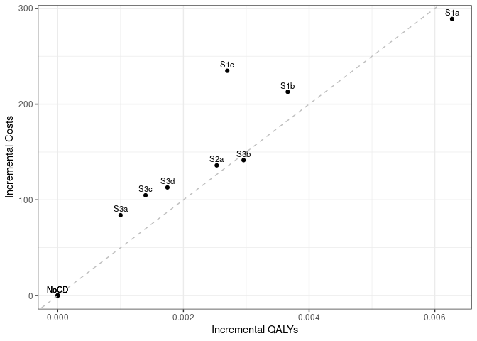

Sensitivity analysis: 0.01 Treatment Utility
================
15 October, 2024

    ## 
    ## > errors<-c(
    ## +   ERR_INCORRECT_SETTING_VARIABLE=-1,
    ## +   ERR_INCORRECT_VECTOR_SIZE=-2,
    ## +   ERR_INCORRECT_INPUT_VAR=-3,
    ## +   ERR_EVENT_STACK_FULL=-4,
    ## +   .... [TRUNCATED] 
    ## 
    ## > record_mode<-c(
    ## +   record_mode_none=0,
    ## +   record_mode_agent=1,
    ## +   record_mode_event=2,
    ## +   record_mode_some_event=3
    ## + )
    ## 
    ## > agent_creation_mode<-c(
    ## +   agent_creation_mode_one=0,
    ## +   agent_creation_mode_all=1,
    ## +   agent_creation_mode_pre=2
    ## + )
    ## 
    ## > medication_classes<-c(
    ## +   MED_CLASS_SABA=1,
    ## +   MED_CLASS_LABA=2,
    ## +   MED_CLASS_LAMA=4,
    ## +   MED_CLASS_ICS=8,
    ## +   MED_CLASS_MACRO=16
    ## + )
    ## 
    ## > events<-c(
    ## +     event_start=0,
    ## +     event_fixed=1,
    ## +     event_birthday=2,
    ## +     event_smoking_change=3,
    ## +     event_COPD=4,
    ## +     event_exacerbat .... [TRUNCATED]

``` r
# CHANGE: Add a timer (will see addition below to print time too)
# Start timer
start.time <- Sys.time()
```

``` r
# CHANGE: Add save paths (will see later, we also add lines to save to csv)
outputs <- "../../outputs/Sen4_01_Treat_Util"
files <- list(
  s1 = "s1.csv",
  s2 = "s2.csv",
  s3 = "s3.csv",
  sall = "sall.csv",
  ceplane = "ceplane.csv",
  clinical = "clinicalresults.csv"
)

# Apply to each element in list to create path to file in outputs
paths <- lapply(files, function(filename) paste0(outputs, filename))
```

    ## Initializing the session

    ## [1] 0

**Global inputs:**

  - Medication adherence is 0.7
  - Smoking adherence is 0.7
  - Cost discounting: 0.015
  - QALY discounting: 0.015
  - Time horizon: 20
  - The WTP threshold for NMB is 50000

**Case detection inputs:**

  - Case detection occurs at 3 year intervals.
  - An outpatient diagnosis costs 61.18
  - The utility gain due to symptom relief from treatment is 0.01

## S1 All patients scenario

All patients are eligible. The cost of case detection is:

| None | CDQ17 | FlowMeter | FlowMeter\_CDQ |
| ---: | ----: | --------: | -------------: |
|    0 | 11.56 |     30.46 |          42.01 |

#### S1NoCD: No Case detection

    ## [1] 0

    ## Terminating the session

    ## [1] 0

#### S1NoCD2: No Case detection- Other time interval

    ## Initializing the session

    ## [1] 0

    ## [1] 0

    ## Terminating the session

    ## [1] 0

#### S1A: CDQ ≥17 points

    ## Initializing the session

    ## [1] 0

    ## [1] 0

    ## Terminating the session

    ## [1] 0

#### S1B: Screening Spirometry with BD

    ## Initializing the session

    ## [1] 0

    ## [1] 0

    ## Terminating the session

    ## [1] 0

#### S1C: CDQ ≥17 points and Screening Spirometry with BD

    ## Initializing the session

    ## [1] 0

    ## [1] 0

    ## Terminating the session

    ## [1] 0

| Scenario  |   Agents | PatientYears |  CopdPYs | NCaseDetections | DiagnosedPYs | OverdiagnosedPYs |  SABA |  LAMA | LAMALABA | ICSLAMALABA |     Mild | Moderate |  Severe | VerySevere | MildPY | ModeratePY | SeverePY | VerySeverePY |    NoCOPD |    GOLD1 |    GOLD2 |   GOLD3 |   GOLD4 |        Cost | CostpAgent |      QALY | QALYpAgent |      NMB | IncrementalCosts | IncrementalQALY |     ICER | IncrementalNMB |
| :-------- | -------: | -----------: | -------: | --------------: | -----------: | ---------------: | ----: | ----: | -------: | ----------: | -------: | -------: | ------: | ---------: | -----: | ---------: | -------: | -----------: | --------: | -------: | -------: | ------: | ------: | ----------: | ---------: | --------: | ---------: | -------: | ---------------: | --------------: | -------: | -------------: |
| S1NoCD    | 37196486 |    625953636 | 71118021 |       190966216 |     13166456 |         13371458 | 0.017 | 0.135 |    0.151 |       0.080 | 15396892 |  2883299 | 4850541 |     419077 |  0.216 |      0.041 |    0.068 |        0.006 | 527427474 | 28845970 | 30727603 | 6872520 | 1191666 | 79864892645 |   2147.109 | 466402566 |     12.539 | 624797.3 |            0.000 |           0.000 |      NaN |          0.000 |
| S1NoCD2   | 37197623 |    626035666 | 71126460 |       124680042 |     13292032 |         16339249 | 0.021 | 0.135 |    0.151 |       0.080 | 15386115 |  2878926 | 4849649 |     418845 |  0.216 |      0.040 |    0.068 |        0.006 | 527498259 | 28860429 | 30702229 | 6887202 | 1198050 | 79996190237 |   2150.573 | 466462719 |     12.540 | 624855.5 |            0.000 |           0.000 |      NaN |          0.000 |
| S1NoCDAvg | 37197054 |    625994651 | 71122240 |       157823129 |     13229244 |         14855354 | 0.019 | 0.135 |    0.151 |       0.080 | 15391504 |  2881112 | 4850095 |     418961 |  0.216 |      0.041 |    0.068 |        0.006 | 527462866 | 28853200 | 30714916 | 6879861 | 1194858 | 79930541441 |   2148.841 | 466432643 |     12.540 | 624826.4 |            0.000 |           0.000 |      NaN |          0.000 |
| S1a       | 37195779 |    626218800 | 71281372 |       186100281 |     33119195 |         13388772 | 0.026 | 0.159 |    0.310 |       0.094 | 14905588 |  2814123 | 4756454 |     412031 |  0.209 |      0.039 |    0.067 |        0.006 | 527524487 | 28873365 | 30786968 | 6925999 | 1208772 | 90753454326 |   2439.886 | 466710529 |     12.547 | 624930.4 |          292.777 |           0.009 | 34372.28 |        133.114 |
| S1b       | 37200476 |    626144172 | 71252445 |       188422793 |     23802097 |         13372758 | 0.022 | 0.148 |    0.240 |       0.088 | 15103031 |  2841048 | 4796549 |     415612 |  0.212 |      0.040 |    0.067 |        0.006 | 527481440 | 28877807 | 30767692 | 6915814 | 1204950 | 87878153022 |   2362.286 | 466602622 |     12.543 | 624783.8 |          215.177 |           0.004 | 53355.61 |       \-13.533 |
| S1c       | 37192813 |    625960445 | 71159107 |       189176712 |     20537777 |         13372239 | 0.020 | 0.144 |    0.214 |       0.085 | 15172732 |  2850944 | 4816068 |     416845 |  0.213 |      0.040 |    0.068 |        0.006 | 527395566 | 28830750 | 30734973 | 6903078 | 1206962 | 88797560537 |   2387.492 | 466450153 |     12.541 | 624682.8 |          240.384 |           0.003 | 95476.24 |      \-114.497 |

*Treatment rate:* SABA is expressed per all patient-years, LAMA,
LAMA/LABA, ICS/LAMA/LABA are per COPD patient-years *Exacerbations:*
Total exacerbations and rate per COPD patient-year: *GOLD Stage:*
Cumulative patient-years *Cost/QALY:* Total cost and QALYs *NMB:* Net
Monetary Benefit is calculated as QALY per patient-year \* Lamba - Cost
per patient-year

-----

## S2 Symptomatic patients scenario

Patients with symptoms at year 1 are eligible. The cost of case
detection is:

    ## Initializing the session

    ## [1] 0

| None | FlowMeter |
| ---: | --------: |
|    0 |     24.33 |

#### S2NoCD: No Case detection

    ## [1] 0

    ## Terminating the session

    ## [1] 0

#### S2a: Screening Spirometry without BD

    ## Initializing the session

    ## [1] 0

    ## [1] 0

    ## Terminating the session

    ## [1] 0

| Scenario |   Agents | PatientYears |  CopdPYs | NCaseDetections | DiagnosedPYs | OverdiagnosedPYs |  SABA |  LAMA | LAMALABA | ICSLAMALABA |     Mild | Moderate |  Severe | VerySevere | MildPY | ModeratePY | SeverePY | VerySeverePY |    NoCOPD |    GOLD1 |    GOLD2 |   GOLD3 |   GOLD4 |        Cost | CostpAgent |      QALY | QALYpAgent |      NMB | IncrementalCosts | IncrementalQALY |    ICER | IncrementalNMB |
| :------- | -------: | -----------: | -------: | --------------: | -----------: | ---------------: | ----: | ----: | -------: | ----------: | -------: | -------: | ------: | ---------: | -----: | ---------: | -------: | -----------: | --------: | -------: | -------: | ------: | ------: | ----------: | ---------: | --------: | ---------: | -------: | ---------------: | --------------: | ------: | -------------: |
| S2NoCD   | 22078563 |    364522749 | 50166624 |       110968095 |      9653606 |          7738507 | 0.017 | 0.141 |    0.159 |       0.087 | 11438971 |  2125413 | 3543389 |     304919 |  0.228 |      0.042 |    0.071 |        0.006 | 298790021 | 18633807 | 22502661 | 5543543 | 1025792 | 58731887921 |   2660.132 | 270758372 |     12.263 | 610510.1 |            0.000 |           0.000 |     NaN |          0.000 |
| S2a      | 22077788 |    364622606 | 50226923 |       108797477 |     18511084 |          7734136 | 0.023 | 0.157 |    0.269 |       0.097 | 11192847 |  2087413 | 3500787 |     300763 |  0.223 |      0.042 |    0.070 |        0.006 | 298828425 | 18622586 | 22524521 | 5579724 | 1036307 | 63840415723 |   2891.613 | 270883900 |     12.270 | 610584.5 |          231.481 |           0.006 | 37847.2 |         74.329 |

*Treatment rate:* SABA is expressed per all patient-years, LAMA,
LAMA/LABA, ICS/LAMA/LABA are per COPD patient-years *Exacerbations:*
Total exacerbations and rate per COPD patient-year: *GOLD Stage:*
Cumulative patient-years *Cost/QALY:* Total cost and QALYs *NMB:* Net
Monetary Benefit is calculated as QALY per patient-year \* Lamba - Cost
per patient-year

-----

## S3 Smoking history scenario

Ever smokers ≥50 years of age are eligible. The cost of case detection
is:

    ## Initializing the session

    ## [1] 0

| None | CDQ195 | CDQ165 | FlowMeter | FlowMeter\_CDQ |
| ---: | -----: | -----: | --------: | -------------: |
|    0 |  11.56 |  11.56 |     24.33 |          42.01 |

#### S3NoCD: No Case detection

    ## [1] 0

    ## Terminating the session

    ## [1] 0

#### S3a: CDQ ≥19.5 points

    ## Initializing the session

    ## [1] 0

    ## [1] 0

    ## Terminating the session

    ## [1] 0

#### S3b: CDQ ≥16.5 points

    ## Initializing the session

    ## [1] 0

    ## [1] 0

    ## Terminating the session

    ## [1] 0

#### S3c: Screening spirometry without BD

    ## Initializing the session

    ## [1] 0

    ## [1] 0

    ## Terminating the session

    ## [1] 0

#### S3d: Screening Spirometry with BD + CDQ ≥17 points

    ## Initializing the session

    ## [1] 0

    ## [1] 0

    ## Terminating the session

    ## [1] 0

| Scenario |   Agents | PatientYears |  CopdPYs | NCaseDetections | DiagnosedPYs | OverdiagnosedPYs |  SABA |  LAMA | LAMALABA | ICSLAMALABA |    Mild | Moderate |  Severe | VerySevere | MildPY | ModeratePY | SeverePY | VerySeverePY |    NoCOPD |    GOLD1 |    GOLD2 |   GOLD3 |  GOLD4 |        Cost | CostpAgent |      QALY | QALYpAgent |      NMB | IncrementalCosts | IncrementalQALY |     ICER | IncrementalNMB |
| :------- | -------: | -----------: | -------: | --------------: | -----------: | ---------------: | ----: | ----: | -------: | ----------: | ------: | -------: | ------: | ---------: | -----: | ---------: | -------: | -----------: | --------: | -------: | -------: | ------: | -----: | ----------: | ---------: | --------: | ---------: | -------: | ---------------: | --------------: | -------: | -------------: |
| S3NoCD   | 17243525 |    260017880 | 41691838 |        80059027 |      7819384 |          5815322 | 0.018 | 0.137 |    0.154 |       0.086 | 9754415 |  1816466 | 3038101 |     261338 |  0.234 |      0.044 |    0.073 |        0.006 | 207433146 | 15294590 | 18682841 | 4808648 | 895345 | 49933527334 |   2895.784 | 193546783 |     11.224 | 558320.0 |            0.000 |           0.000 |      NaN |          0.000 |
| S3a      | 17245589 |    260114351 | 41778508 |        79305268 |     11012874 |          5816924 | 0.021 | 0.144 |    0.204 |       0.091 | 9648241 |  1803612 | 3027939 |     260144 |  0.231 |      0.043 |    0.072 |        0.006 | 207442211 | 15303706 | 18733677 | 4824249 | 900624 | 53097071421 |   3078.878 | 193630822 |     11.228 | 558313.4 |          183.094 |           0.004 | 51871.99 |        \-6.608 |
| S3b      | 17248093 |    260143539 | 41765340 |        77789956 |     17179218 |          5809490 | 0.027 | 0.156 |    0.293 |       0.099 | 9481831 |  1779958 | 2992091 |     258625 |  0.227 |      0.043 |    0.072 |        0.006 | 207483725 | 15287322 | 18724587 | 4837601 | 899769 | 55163743515 |   3198.252 | 193698483 |     11.230 | 558308.7 |          302.468 |           0.006 | 51947.57 |       \-11.340 |
| S3c      | 17249568 |    260123652 | 41796963 |        78552778 |     14093542 |          5811921 | 0.024 | 0.150 |    0.249 |       0.095 | 9556493 |  1794042 | 3007246 |     258985 |  0.229 |      0.043 |    0.072 |        0.006 | 207434647 | 15324709 | 18727689 | 4823824 | 902793 | 53820717606 |   3120.120 | 193662078 |     11.227 | 558233.3 |          224.336 |           0.003 | 81524.39 |       \-86.748 |
| S3d      | 17250373 |    260166499 | 41788451 |        78909896 |     12694599 |          5812281 | 0.023 | 0.147 |    0.229 |       0.093 | 9596955 |  1798651 | 3013620 |     260246 |  0.230 |      0.043 |    0.072 |        0.006 | 207483596 | 15310784 | 18731510 | 4829309 | 900292 | 54140141633 |   3138.491 | 193684186 |     11.228 | 558252.8 |          242.707 |           0.004 | 69157.79 |       \-67.234 |

*Treatment rate:* SABA is expressed per all patient-years, LAMA,
LAMA/LABA, ICS/LAMA/LABA are per COPD patient-years *Exacerbations:*
Total exacerbations and rate per COPD patient-year *GOLD Stage:*
Cumulative patient-years *Cost/QALY:* Total cost and QALYs *NMB:* Net
Monetary Benefit is calculated as QALY per patient-year \* Lamba - Cost
per patient-year

-----

## All Scenarios

*Ordered by descending Net Monetary Benefit*

| Scenario |   Agents |        Cost | CostpAgent |      QALY | QALYpAgent |     ICER | IncrementalNMB |
| :------- | -------: | ----------: | ---------: | --------: | ---------: | -------: | -------------: |
| S1a      | 37195779 | 90753454326 |   2439.886 | 466710529 |     12.547 | 34372.28 |        133.114 |
| S2a      | 22077788 | 63840415723 |   2891.613 | 270883900 |     12.270 | 37847.20 |         74.329 |
| S1NoCD   | 37196486 | 79864892645 |   2147.109 | 466402566 |     12.539 |      NaN |          0.000 |
| S2NoCD   | 22078563 | 58731887921 |   2660.132 | 270758372 |     12.263 |      NaN |          0.000 |
| S3NoCD   | 17243525 | 49933527334 |   2895.784 | 193546783 |     11.224 |      NaN |          0.000 |
| S3a      | 17245589 | 53097071421 |   3078.878 | 193630822 |     11.228 | 51871.99 |        \-6.608 |
| S3b      | 17248093 | 55163743515 |   3198.252 | 193698483 |     11.230 | 51947.57 |       \-11.340 |
| S1b      | 37200476 | 87878153022 |   2362.286 | 466602622 |     12.543 | 53355.61 |       \-13.533 |
| S3d      | 17250373 | 54140141633 |   3138.491 | 193684186 |     11.228 | 69157.79 |       \-67.234 |
| S3c      | 17249568 | 53820717606 |   3120.120 | 193662078 |     11.227 | 81524.39 |       \-86.748 |
| S1c      | 37192813 | 88797560537 |   2387.492 | 466450153 |     12.541 | 95476.24 |      \-114.497 |

-----

## Cost Effectiveness Plane

Adjusted to the total population

| Scenario  |   Agents | PropAgents |        Cost | CostpAgent | CostpAgentExcluded | CostpAgentAll |      QALY | QALYpAgent | QALYpAgentExcluded | QALYpAgentAll | IncrementalCosts | IncrementalQALY |   ICERAdj |     ICER |          INMB |
| :-------- | -------: | ---------: | ----------: | ---------: | -----------------: | ------------: | --------: | ---------: | -----------------: | ------------: | ---------------: | --------------: | --------: | -------: | ------------: |
| S1NoCDAvg | 37197054 |  1.0000000 | 79930541441 |   2148.841 |              0.000 |      2148.841 | 466432643 |   12.53950 |            0.00000 |      12.53950 |          0.00000 |       0.0000000 |       NaN |      NaN |     0.0000000 |
| S1a       | 37195779 |  1.0000000 | 90753454326 |   2439.886 |              0.000 |      2439.886 | 466710529 |   12.54741 |            0.00000 |      12.54741 |        291.04522 |       0.0079009 |  36836.96 | 34372.28 |   103.9998913 |
| S1b       | 37200476 |  1.0000000 | 87878153022 |   2362.286 |              0.000 |      2362.286 | 466602622 |   12.54292 |            0.00000 |      12.54292 |        213.44510 |       0.0034160 |  62484.70 | 53355.61 |  \-42.6472017 |
| S1c       | 37192813 |  1.0000000 | 88797560537 |   2387.492 |              0.000 |      2387.492 | 466450153 |   12.54141 |            0.00000 |      12.54141 |        238.65184 |       0.0019008 | 125552.98 | 95476.24 | \-143.6115459 |
| S2NoCD    | 22078563 |  0.5935568 | 58731887921 |   2660.132 |           1402.167 |      2148.841 | 270758372 |   12.26341 |           12.94271 |      12.53950 |          0.00000 |       0.0000000 |       NaN |      NaN |     0.0083989 |
| S2a       | 22077788 |  0.5935359 | 63840415723 |   2891.613 |           1402.167 |      2286.207 | 270883900 |   12.26952 |           12.94271 |      12.54315 |        137.36611 |       0.0036443 |  37693.02 | 37847.20 |    44.8591713 |
| S3NoCD    | 17243525 |  0.4635723 | 49933527334 |   2895.784 |           1503.344 |      2148.841 | 193546783 |   11.22432 |           13.67607 |      12.53950 |          0.00000 |       0.0000000 |       NaN |      NaN |     0.0083989 |
| S3a       | 17245589 |  0.4636278 | 53097071421 |   3078.878 |           1503.344 |      2233.805 | 193630822 |   11.22785 |           13.67607 |      12.54101 |         84.96483 |       0.0015004 |  56626.67 | 51871.98 |   \-9.9345121 |
| S3b       | 17248093 |  0.4636951 | 55163743515 |   3198.252 |           1503.344 |      2289.264 | 193698483 |   11.23014 |           13.67607 |      12.54190 |        140.42373 |       0.0023988 |  58539.12 | 51947.57 |  \-20.4752539 |
| S3c       | 17249568 |  0.4637348 | 53820717606 |   3120.120 |           1503.344 |      2253.099 | 193662078 |   11.22707 |           13.67607 |      12.54038 |        104.25841 |       0.0008778 | 118775.49 | 81524.39 |  \-60.3611513 |
| S3d       | 17250373 |  0.4637564 | 54140141633 |   3138.491 |           1503.344 |      2261.654 | 193684186 |   11.22783 |           13.67607 |      12.54068 |        112.81322 |       0.0011762 |  95915.91 | 69157.79 |  \-53.9964255 |

<!-- -->

## Clinical Results for all scenarios

Adjusted to the total population

| Scenario  | PropAgents | ProppPatientYears | ProppCopdPYs |   SABAAll |   LAMAAll | LAMALABAAll | ICSLAMALABAAll | MildpAgentAll | ModeratepAgentAll | SeverepAgentAll | VerySeverepAgentAll | NoCOPDpPYAll | GOLD1pPYAll | GOLD2pPYAll | GOLD3pPYAll | GOLD4pPYAll | DiagnosedpPYAll |
| :-------- | ---------: | ----------------: | -----------: | --------: | --------: | ----------: | -------------: | ------------: | ----------------: | --------------: | ------------------: | -----------: | ----------: | ----------: | ----------: | ----------: | --------------: |
| S1NoCDAvg |  1.0000000 |         1.0000000 |    1.0000000 | 0.0190088 | 0.1354718 |   0.1512902 |      0.0796021 |     0.4137829 |         0.0774554 |       0.1303892 |           0.0112633 |    0.8425996 |   0.0460918 |   0.0490658 |   0.0109903 |   0.0019087 |       0.1860071 |
| S1a       |  1.0000000 |         1.0000000 |    1.0000000 | 0.0264130 | 0.1594355 |   0.3100498 |      0.0943012 |     0.4007333 |         0.0756571 |       0.1278762 |           0.0110774 |    0.8423964 |   0.0461075 |   0.0491633 |   0.0110600 |   0.0019303 |       0.4646262 |
| S1b       |  1.0000000 |         1.0000000 |    1.0000000 | 0.0216055 | 0.1480604 |   0.2404960 |      0.0875941 |     0.4059903 |         0.0763713 |       0.1289378 |           0.0111722 |    0.8424281 |   0.0461201 |   0.0491384 |   0.0110451 |   0.0019244 |       0.3340531 |
| S1c       |  1.0000000 |         1.0000000 |    1.0000000 | 0.0201493 | 0.1442413 |   0.2143855 |      0.0852093 |     0.4079480 |         0.0766531 |       0.1294892 |           0.0112077 |    0.8425382 |   0.0460584 |   0.0491005 |   0.0110280 |   0.0019282 |       0.2886177 |
| S2NoCD    |  0.5935568 |         0.5823097 |    0.7053578 | 0.0190088 | 0.1354718 |   0.1512902 |      0.0796021 |     0.4137829 |         0.0774554 |       0.1303892 |           0.0112633 |    0.8425996 |   0.0460918 |   0.0490658 |   0.0109903 |   0.0019087 |       0.1860071 |
| S2a       |  0.5935359 |         0.5824692 |    0.7062056 | 0.0223351 | 0.1468614 |   0.2290467 |      0.0868672 |     0.4071715 |         0.0764348 |       0.1292457 |           0.0111517 |    0.8425215 |   0.0460676 |   0.0490957 |   0.0110473 |   0.0019254 |       0.3104013 |
| S3NoCD    |  0.4635723 |         0.4153676 |    0.5861997 | 0.0190088 | 0.1354718 |   0.1512902 |      0.0796021 |     0.4137829 |         0.0774554 |       0.1303892 |           0.0112633 |    0.8425996 |   0.0460918 |   0.0490658 |   0.0109903 |   0.0019087 |       0.1860071 |
| S3a       |  0.4636278 |         0.4155217 |    0.5874183 | 0.0201358 | 0.1392626 |   0.1805149 |      0.0822287 |     0.4109128 |         0.0771069 |       0.1301110 |           0.0112307 |    0.8424794 |   0.0461006 |   0.0491419 |   0.0110143 |   0.0019170 |       0.2306846 |
| S3b       |  0.4636951 |         0.4155683 |    0.5872332 | 0.0226883 | 0.1466743 |   0.2326983 |      0.0870001 |     0.4064201 |         0.0764674 |       0.1291411 |           0.0111894 |    0.8425049 |   0.0460727 |   0.0491259 |   0.0110354 |   0.0019156 |       0.3174192 |
| S3c       |  0.4637348 |         0.4155365 |    0.5876778 | 0.0213351 | 0.1429510 |   0.2072023 |      0.0845726 |     0.4084161 |         0.0768439 |       0.1295450 |           0.0111987 |    0.8424543 |   0.0461336 |   0.0491319 |   0.0110136 |   0.0019205 |       0.2739520 |
| S3d       |  0.4637564 |         0.4156050 |    0.5875581 | 0.0207664 | 0.1413812 |   0.1952106 |      0.0835996 |     0.4094977 |         0.0769666 |       0.1297144 |           0.0112325 |    0.8424726 |   0.0461088 |   0.0491357 |   0.0110219 |   0.0019164 |       0.2543044 |

## Time elapsed

Run time for this notebook:

``` r
end.time <- Sys.time()
time.taken <- end.time - start.time
time.taken
```

    ## Time difference of 17.10892 hours
