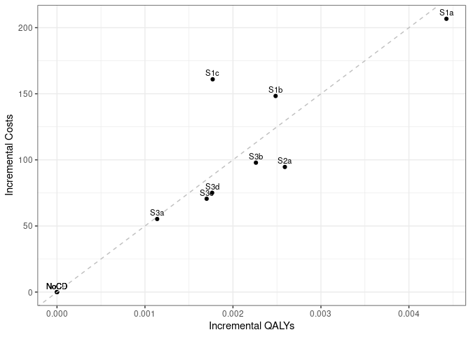

Sensitivity analysis: 0.01 Treatment Utility
================
10 September, 2024

    ## 
    ## > errors<-c(
    ## +   ERR_INCORRECT_SETTING_VARIABLE=-1,
    ## +   ERR_INCORRECT_VECTOR_SIZE=-2,
    ## +   ERR_INCORRECT_INPUT_VAR=-3,
    ## +   ERR_EVENT_STACK_FULL=-4,
    ## +   .... [TRUNCATED] 
    ## 
    ## > record_mode<-c(
    ## +   record_mode_none=0,
    ## +   record_mode_agent=1,
    ## +   record_mode_event=2,
    ## +   record_mode_some_event=3
    ## + )
    ## 
    ## > agent_creation_mode<-c(
    ## +   agent_creation_mode_one=0,
    ## +   agent_creation_mode_all=1,
    ## +   agent_creation_mode_pre=2
    ## + )
    ## 
    ## > medication_classes<-c(
    ## +   MED_CLASS_SABA=1,
    ## +   MED_CLASS_LABA=2,
    ## +   MED_CLASS_LAMA=4,
    ## +   MED_CLASS_ICS=8,
    ## +   MED_CLASS_MACRO=16
    ## + )
    ## 
    ## > events<-c(
    ## +     event_start=0,
    ## +     event_fixed=1,
    ## +     event_birthday=2,
    ## +     event_smoking_change=3,
    ## +     event_COPD=4,
    ## +     event_exacerbat .... [TRUNCATED]

``` r
# CHANGE: Add a timer (will see addition below to print time too)
# Start timer
start.time <- Sys.time()
```

``` r
# CHANGE: Add save paths (will see later, we also add lines to save to csv)
outputs <- "../../outputs/Sen4_01_Treat_Util"
files <- list(
  s1 = "s1_5y.csv",
  s2 = "s2_5y.csv",
  s3 = "s3_5y.csv",
  sall = "sall_5y.csv",
  ceplane = "ceplane_5y.csv",
  clinical = "clinicalresults_5y.csv"
)

# Apply to each element in list to create path to file in outputs
paths <- lapply(files, function(filename) paste0(outputs, filename))
```

    ## Initializing the session

    ## [1] 0

**Global inputs:**

  - Medication adherence is 0.7
  - Smoking adherence is 0.7
  - Cost discounting: 0.015
  - QALY discounting: 0.015
  - Time horizon: 20
  - The WTP threshold for NMB is 50000

**Case detection inputs:**

  - Case detection occurs at 5 year intervals.
  - An outpatient diagnosis costs 61.18
  - The utility gain due to symptom relief from treatment is 0.01

## S1 All patients scenario

All patients are eligible. The cost of case detection is:

| None | CDQ17 | FlowMeter | FlowMeter\_CDQ |
| ---: | ----: | --------: | -------------: |
|    0 | 11.56 |     30.46 |          42.01 |

#### S1NoCD2: No Case detection- Other time interval

    ## [1] 0

    ## Terminating the session

    ## [1] 0

#### S1NoCD: No Case detection

    ## Initializing the session

    ## [1] 0

    ## [1] 0

    ## Terminating the session

    ## [1] 0

#### S1A: CDQ ≥17 points

    ## Initializing the session

    ## [1] 0

    ## [1] 0

    ## Terminating the session

    ## [1] 0

#### S1B: Screening Spirometry with BD

    ## Initializing the session

    ## [1] 0

    ## [1] 0

    ## Terminating the session

    ## [1] 0

#### S1C: CDQ ≥17 points and Screening Spirometry with BD

    ## Initializing the session

    ## [1] 0

    ## [1] 0

    ## Terminating the session

    ## [1] 0

| Scenario  | Agents | PatientYears |  CopdPYs | NCaseDetections | DiagnosedPYs | OverdiagnosedPYs |  SABA |  LAMA | LAMALABA | ICSLAMALABA |   Mild | Moderate | Severe | VerySevere | MildPY | ModeratePY | SeverePY | VerySeverePY |  NoCOPD |  GOLD1 |  GOLD2 |   GOLD3 | GOLD4 |      Cost | CostpAgent |    QALY | QALYpAgent |      NMB | IncrementalCosts | IncrementalQALY |     ICER | IncrementalNMB |
| :-------- | -----: | -----------: | -------: | --------------: | -----------: | ---------------: | ----: | ----: | -------: | ----------: | -----: | -------: | -----: | ---------: | -----: | ---------: | -------: | -----------: | ------: | -----: | -----: | ------: | ----: | --------: | ---------: | ------: | ---------: | -------: | ---------------: | --------------: | -------: | -------------: |
| S1NoCD2   | 371579 |      6251100 | 706693.3 |         1907271 |     131040.9 |           133904 | 0.017 | 0.136 |    0.152 |       0.081 | 152231 |    28857 |  48565 |       4210 |  0.215 |      0.041 |    0.069 |        0.006 | 5270314 | 287267 | 304912 | 67938.0 | 12088 | 798567288 |   2149.118 | 4658248 |     12.536 | 624668.9 |            0.000 |           0.000 |      NaN |          0.000 |
| S1NoCD    | 371849 |      6258006 | 711427.5 |         1245925 |     134326.9 |           162900 | 0.021 | 0.138 |    0.153 |       0.081 | 153957 |    28983 |  48765 |       4194 |  0.216 |      0.041 |    0.069 |        0.006 | 5272466 | 288303 | 307998 | 68401.0 | 11986 | 803320692 |   2160.341 | 4662798 |     12.539 | 624814.3 |            0.000 |           0.000 |      NaN |          0.000 |
| S1NoCDAvg | 371714 |      6254553 | 709060.4 |         1576598 |     132683.9 |           148402 | 0.019 | 0.137 |    0.152 |       0.081 | 153094 |    28920 |  48665 |       4202 |  0.216 |      0.041 |    0.069 |        0.006 | 5271390 | 287785 | 306455 | 68169.5 | 12037 | 800943990 |   2154.732 | 4660523 |     12.538 | 624741.6 |            0.000 |           0.000 |      NaN |          0.000 |
| S1a       | 371757 |      6256333 | 711236.6 |         1227658 |     283012.7 |           162020 | 0.028 | 0.153 |    0.272 |       0.090 | 150225 |    28239 |  48102 |       4020 |  0.211 |      0.040 |    0.068 |        0.006 | 5271402 | 289052 | 305859 | 69490.0 | 11926 | 875098848 |   2353.954 | 4662759 |     12.542 | 624770.7 |          193.613 |           0.003 | 64543.82 |       \-43.627 |
| S1b       | 372238 |      6263582 | 706454.8 |         1238073 |     207905.9 |           163746 | 0.024 | 0.146 |    0.216 |       0.086 | 150254 |    28215 |  47817 |       4173 |  0.213 |      0.040 |    0.068 |        0.006 | 5282624 | 287574 | 304452 | 67829.0 | 11840 | 848458397 |   2279.344 | 4668182 |     12.541 | 624763.4 |          119.003 |           0.001 | 87410.88 |       \-50.932 |
| S1c       | 371786 |      6257609 | 711049.3 |         1239434 |     186398.5 |           165298 | 0.023 | 0.142 |    0.197 |       0.083 | 152185 |    28532 |  48293 |       4191 |  0.214 |      0.040 |    0.068 |        0.006 | 5272587 | 287263 | 307389 | 69672.0 | 11924 | 861061064 |   2316.013 | 4662855 |     12.542 | 624772.6 |          155.671 |           0.002 | 68297.87 |       \-41.706 |

*Treatment rate:* SABA is expressed per all patient-years, LAMA,
LAMA/LABA, ICS/LAMA/LABA are per COPD patient-years *Exacerbations:*
Total exacerbations and rate per COPD patient-year: *GOLD Stage:*
Cumulative patient-years *Cost/QALY:* Total cost and QALYs *NMB:* Net
Monetary Benefit is calculated as QALY per patient-year \* Lamba - Cost
per patient-year

-----

## S2 Symptomatic patients scenario

Patients with symptoms at year 1 are eligible. The cost of case
detection is:

    ## Initializing the session

    ## [1] 0

| None | FlowMeter |
| ---: | --------: |
|    0 |     24.33 |

#### S2NoCD: No Case detection

    ## [1] 0

    ## Terminating the session

    ## [1] 0

#### S2a: Screening Spirometry without BD

    ## Initializing the session

    ## [1] 0

    ## [1] 0

    ## Terminating the session

    ## [1] 0

| Scenario | Agents | PatientYears |  CopdPYs | NCaseDetections | DiagnosedPYs | OverdiagnosedPYs |  SABA |  LAMA | LAMALABA | ICSLAMALABA |   Mild | Moderate | Severe | VerySevere | MildPY | ModeratePY | SeverePY | VerySeverePY |  NoCOPD |  GOLD1 |  GOLD2 | GOLD3 | GOLD4 |      Cost | CostpAgent |    QALY | QALYpAgent |      NMB | IncrementalCosts | IncrementalQALY |     ICER | IncrementalNMB |
| :------- | -----: | -----------: | -------: | --------------: | -----------: | ---------------: | ----: | ----: | -------: | ----------: | -----: | -------: | -----: | ---------: | -----: | ---------: | -------: | -----------: | ------: | -----: | -----: | ----: | ----: | --------: | ---------: | ------: | ---------: | -------: | ---------------: | --------------: | -------: | -------------: |
| S2NoCD   | 220397 |      3639095 | 500462.1 |          723634 |     97984.28 |            94374 | 0.021 | 0.143 |    0.161 |       0.089 | 113632 |    20801 |  35464 |       3162 |  0.227 |      0.042 |    0.071 |        0.006 | 2983222 | 185215 | 225525 | 55153 |  9975 | 590082859 |   2677.363 | 2703020 |     12.264 | 610538.8 |            0.000 |           0.000 |      NaN |          0.000 |
| S2a      | 220997 |      3650523 | 503218.4 |          717655 |    163667.34 |            93940 | 0.025 | 0.154 |    0.241 |       0.096 | 113046 |    21082 |  35624 |       3147 |  0.225 |      0.042 |    0.071 |        0.006 | 2991406 | 186001 | 226733 | 55274 | 10587 | 631718348 |   2858.493 | 2711713 |     12.270 | 610659.6 |          181.129 |           0.006 | 29998.43 |        120.769 |

*Treatment rate:* SABA is expressed per all patient-years, LAMA,
LAMA/LABA, ICS/LAMA/LABA are per COPD patient-years *Exacerbations:*
Total exacerbations and rate per COPD patient-year: *GOLD Stage:*
Cumulative patient-years *Cost/QALY:* Total cost and QALYs *NMB:* Net
Monetary Benefit is calculated as QALY per patient-year \* Lamba - Cost
per patient-year

-----

## S3 Smoking history scenario

Ever smokers ≥50 years of age are eligible. The cost of case detection
is:

    ## Initializing the session

    ## [1] 0

| None | CDQ195 | CDQ165 | FlowMeter | FlowMeter\_CDQ |
| ---: | -----: | -----: | --------: | -------------: |
|    0 |  11.56 |  11.56 |     24.33 |          42.01 |

#### S3NoCD: No Case detection

    ## [1] 0

    ## Terminating the session

    ## [1] 0

#### S3a: CDQ ≥19.5 points

    ## Initializing the session

    ## [1] 0

    ## [1] 0

    ## Terminating the session

    ## [1] 0

#### S3b: CDQ ≥16.5 points

    ## Initializing the session

    ## [1] 0

    ## [1] 0

    ## Terminating the session

    ## [1] 0

#### S3c: Screening spirometry without BD

    ## Initializing the session

    ## [1] 0

    ## [1] 0

    ## Terminating the session

    ## [1] 0

#### S3d: Screening Spirometry with BD + CDQ ≥17 points

    ## Initializing the session

    ## [1] 0

    ## [1] 0

    ## Terminating the session

    ## [1] 0

| Scenario | Agents | PatientYears |  CopdPYs | NCaseDetections | DiagnosedPYs | OverdiagnosedPYs |  SABA |  LAMA | LAMALABA | ICSLAMALABA |  Mild | Moderate | Severe | VerySevere | MildPY | ModeratePY | SeverePY | VerySeverePY |  NoCOPD |  GOLD1 |  GOLD2 | GOLD3 | GOLD4 |      Cost | CostpAgent |    QALY | QALYpAgent |      NMB | IncrementalCosts | IncrementalQALY |       ICER | IncrementalNMB |
| :------- | -----: | -----------: | -------: | --------------: | -----------: | ---------------: | ----: | ----: | -------: | ----------: | ----: | -------: | -----: | ---------: | -----: | ---------: | -------: | -----------: | ------: | -----: | -----: | ----: | ----: | --------: | ---------: | ------: | ---------: | -------: | ---------------: | --------------: | ---------: | -------------: |
| S3NoCD   | 172607 |      2601783 | 418946.7 |          524751 |     79080.52 |            69779 | 0.022 | 0.136 |    0.153 |       0.085 | 96401 |    18147 |  30410 |       2620 |  0.230 |      0.043 |    0.073 |        0.006 | 2073801 | 154314 | 187496 | 48376 |  8660 | 500398655 |   2899.064 | 1936681 |     11.220 | 558109.9 |            0.000 |           0.000 |        NaN |          0.000 |
| S3a      | 172800 |      2606734 | 418711.7 |          522857 |    101566.38 |            70474 | 0.024 | 0.142 |    0.189 |       0.090 | 97831 |    18175 |  30641 |       2648 |  0.234 |      0.043 |    0.073 |        0.006 | 2078719 | 153284 | 187861 | 48302 |  9067 | 525843604 |   3043.076 | 1940304 |     11.229 | 558387.4 |          144.013 |           0.008 |   17080.30 |        277.563 |
| S3b      | 172689 |      2604205 | 418309.3 |          516299 |    150401.47 |            70109 | 0.028 | 0.152 |    0.261 |       0.096 | 95325 |    17937 |  30460 |       2588 |  0.228 |      0.043 |    0.073 |        0.006 | 2076849 | 152753 | 188770 | 47914 |  8764 | 540529545 |   3130.075 | 1938876 |     11.228 | 558247.8 |          231.012 |           0.007 |   31302.59 |        137.986 |
| S3c      | 172313 |      2598509 | 416186.8 |          518483 |    124356.00 |            70991 | 0.026 | 0.146 |    0.224 |       0.091 | 94448 |    18030 |  30042 |       2629 |  0.227 |      0.043 |    0.072 |        0.006 | 2073304 | 154887 | 185675 | 46559 |  9007 | 524243526 |   3042.391 | 1934883 |     11.229 | 558402.0 |          143.328 |           0.009 |   16455.19 |        292.181 |
| S3d      | 172648 |      2601114 | 418132.4 |          520387 |    114106.90 |            70142 | 0.025 | 0.143 |    0.208 |       0.091 | 95889 |    18326 |  29868 |       2568 |  0.229 |      0.044 |    0.071 |        0.006 | 2074052 | 154251 | 186772 | 47722 |  9166 | 525750686 |   3045.217 | 1936518 |     11.217 | 557783.1 |          146.154 |         \-0.004 | \-40450.85 |      \-326.810 |

*Treatment rate:* SABA is expressed per all patient-years, LAMA,
LAMA/LABA, ICS/LAMA/LABA are per COPD patient-years *Exacerbations:*
Total exacerbations and rate per COPD patient-year *GOLD Stage:*
Cumulative patient-years *Cost/QALY:* Total cost and QALYs *NMB:* Net
Monetary Benefit is calculated as QALY per patient-year \* Lamba - Cost
per patient-year

-----

## All Scenarios

*Ordered by descending Net Monetary Benefit*

| Scenario | Agents |      Cost | CostpAgent |    QALY | QALYpAgent |       ICER | IncrementalNMB |
| :------- | -----: | --------: | ---------: | ------: | ---------: | ---------: | -------------: |
| S3c      | 172313 | 524243526 |   3042.391 | 1934883 |     11.229 |   16455.19 |        292.181 |
| S3a      | 172800 | 525843604 |   3043.076 | 1940304 |     11.229 |   17080.30 |        277.563 |
| S3b      | 172689 | 540529545 |   3130.075 | 1938876 |     11.228 |   31302.59 |        137.986 |
| S2a      | 220997 | 631718348 |   2858.493 | 2711713 |     12.270 |   29998.43 |        120.769 |
| S1NoCD   | 371849 | 803320692 |   2160.341 | 4662798 |     12.539 |        NaN |          0.000 |
| S2NoCD   | 220397 | 590082859 |   2677.363 | 2703020 |     12.264 |        NaN |          0.000 |
| S3NoCD   | 172607 | 500398655 |   2899.064 | 1936681 |     11.220 |        NaN |          0.000 |
| S1c      | 371786 | 861061064 |   2316.013 | 4662855 |     12.542 |   68297.87 |       \-41.706 |
| S1a      | 371757 | 875098848 |   2353.954 | 4662759 |     12.542 |   64543.82 |       \-43.627 |
| S1b      | 372238 | 848458397 |   2279.344 | 4668182 |     12.541 |   87410.88 |       \-50.932 |
| S3d      | 172648 | 525750686 |   3045.217 | 1936518 |     11.217 | \-40450.85 |      \-326.810 |

-----

## Cost Effectiveness Plane

Adjusted to the total population

| Scenario  | Agents | PropAgents |      Cost | CostpAgent | CostpAgentExcluded | CostpAgentAll |    QALY | QALYpAgent | QALYpAgentExcluded | QALYpAgentAll | IncrementalCosts | IncrementalQALY |    ICERAdj |       ICER |        INMB |
| :-------- | -----: | ---------: | --------: | ---------: | -----------------: | ------------: | ------: | ---------: | -----------------: | ------------: | ---------------: | --------------: | ---------: | ---------: | ----------: |
| S1NoCDAvg | 371714 |  1.0000000 | 800943990 |   2154.732 |              0.000 |      2154.732 | 4660523 |   12.53793 |            0.00000 |      12.53793 |          0.00000 |       0.0000000 |        NaN |        NaN |     0.00000 |
| S1a       | 371757 |  1.0000000 | 875098848 |   2353.954 |              0.000 |      2353.954 | 4662759 |   12.54249 |            0.00000 |      12.54249 |        199.22209 |       0.0045658 |   43633.96 |   64543.82 |    29.06577 |
| S1b       | 372238 |  1.0000000 | 848458397 |   2279.344 |              0.000 |      2279.344 | 4668182 |   12.54085 |            0.00000 |      12.54085 |        124.61202 |       0.0029275 |   42566.54 |   87410.88 |    21.76120 |
| S1c       | 371786 |  1.0000000 | 861061064 |   2316.013 |              0.000 |      2316.013 | 4662855 |   12.54177 |            0.00000 |      12.54177 |        161.28077 |       0.0038453 |   41941.78 |   68297.87 |    30.98666 |
| S2NoCD    | 220397 |  0.5929209 | 590082859 |   2677.363 |           1393.506 |      2154.732 | 2703020 |   12.26432 |           12.93644 |      12.53793 |          0.00000 |       0.0000000 |        NaN |        NaN |     0.00000 |
| S2a       | 220997 |  0.5945350 | 631718348 |   2858.493 |           1393.506 |      2264.492 | 2711713 |   12.27036 |           12.93644 |      12.54043 |        109.76015 |       0.0025049 |   43818.28 |   29998.43 |    15.48454 |
| S3NoCD    | 172607 |  0.4643543 | 500398655 |   2899.064 |           1509.466 |      2154.732 | 1936681 |   11.22018 |           13.68029 |      12.53793 |          0.00000 |       0.0000000 |        NaN |        NaN |     0.00000 |
| S3a       | 172800 |  0.4648735 | 525843604 |   3043.076 |           1509.466 |      2222.401 | 1940304 |   11.22861 |           13.68029 |      12.54057 |         67.66929 |       0.0026423 |   25610.37 |   17080.30 |    64.44377 |
| S3b       | 172689 |  0.4645749 | 540529545 |   3130.075 |           1509.466 |      2262.361 | 1938876 |   11.22756 |           13.68029 |      12.54081 |        107.62875 |       0.0028858 |   37295.45 |   31302.59 |    36.66331 |
| S3c       | 172313 |  0.4635634 | 524243526 |   3042.391 |           1509.466 |      2220.074 | 1934883 |   11.22889 |           13.68029 |      12.54391 |         65.34232 |       0.0059835 |   10920.43 |   16455.19 |   233.83235 |
| S3d       | 172648 |  0.4644646 | 525750686 |   3045.217 |           1509.466 |      2222.768 | 1936518 |   11.21657 |           13.68029 |      12.53598 |         68.03656 |     \-0.0019495 | \-34899.19 | \-40450.85 | \-165.51241 |

<!-- -->

## Clinical Results for all scenarios

Adjusted to the total population

| Scenario  | PropAgents | ProppPatientYears | ProppCopdPYs |   SABAAll |   LAMAAll | LAMALABAAll | ICSLAMALABAAll | MildpAgentAll | ModeratepAgentAll | SeverepAgentAll | VerySeverepAgentAll | NoCOPDpPYAll | GOLD1pPYAll | GOLD2pPYAll | GOLD3pPYAll | GOLD4pPYAll | DiagnosedpPYAll |
| :-------- | ---------: | ----------------: | -----------: | --------: | --------: | ----------: | -------------: | ------------: | ----------------: | --------------: | ------------------: | -----------: | ----------: | ----------: | ----------: | ----------: | --------------: |
| S1NoCDAvg |  1.0000000 |         1.0000000 |    1.0000000 | 0.0190669 | 0.1369635 |   0.1524877 |      0.0811388 |     0.4118597 |         0.0778018 |       0.1309205 |           0.0113044 |    0.8428084 |   0.0460121 |   0.0489971 |   0.0108992 |   0.0019245 |       0.1871263 |
| S1a       |  1.0000000 |         1.0000000 |    1.0000000 | 0.0275939 | 0.1528553 |   0.2715599 |      0.0900362 |     0.4040946 |         0.0759609 |       0.1293910 |           0.0108135 |    0.8425706 |   0.0462015 |   0.0488879 |   0.0111071 |   0.0019062 |       0.3979164 |
| S1b       |  1.0000000 |         1.0000000 |    1.0000000 | 0.0240957 | 0.1455062 |   0.2164780 |      0.0860694 |     0.4036504 |         0.0757983 |       0.1284581 |           0.0112106 |    0.8433871 |   0.0459121 |   0.0486067 |   0.0108291 |   0.0018903 |       0.2942947 |
| S1c       |  1.0000000 |         1.0000000 |    1.0000000 | 0.0232776 | 0.1420757 |   0.1970811 |      0.0829701 |     0.4093349 |         0.0767431 |       0.1298946 |           0.0112726 |    0.8425882 |   0.0459062 |   0.0491224 |   0.0111340 |   0.0019055 |       0.2621457 |
| S2NoCD    |  0.5929209 |         0.5818313 |    0.7058102 | 0.0190669 | 0.1369635 |   0.1524877 |      0.0811388 |     0.4118597 |         0.0778018 |       0.1309205 |           0.0113044 |    0.8428084 |   0.0460121 |   0.0489971 |   0.0108992 |   0.0019245 |       0.1871263 |
| S2a       |  0.5945350 |         0.5836586 |    0.7096975 | 0.0214711 | 0.1446789 |   0.2094560 |      0.0865808 |     0.4098622 |         0.0784711 |       0.1312102 |           0.0112529 |    0.8425183 |   0.0460661 |   0.0491337 |   0.0109094 |   0.0020209 |       0.2791136 |
| S3NoCD    |  0.4643543 |         0.4159822 |    0.5908477 | 0.0190669 | 0.1369635 |   0.1524877 |      0.0811388 |     0.4118597 |         0.0778018 |       0.1309205 |           0.0113044 |    0.8428084 |   0.0460121 |   0.0489971 |   0.0108992 |   0.0019245 |       0.1871263 |
| S3a       |  0.4648735 |         0.4167738 |    0.5905162 | 0.0198996 | 0.1401796 |   0.1737758 |      0.0838079 |     0.4155589 |         0.0778490 |       0.1314944 |           0.0113756 |    0.8429018 |   0.0458185 |   0.0490297 |   0.0108831 |   0.0019889 |       0.2188998 |
| S3b       |  0.4645749 |         0.4163696 |    0.5899487 | 0.0217929 | 0.1464858 |   0.2162177 |      0.0875364 |     0.4089021 |         0.0772249 |       0.1310348 |           0.0112165 |    0.8429567 |   0.0457484 |   0.0491882 |   0.0108232 |   0.0019408 |       0.2878776 |
| S3c       |  0.4635634 |         0.4154588 |    0.5869553 | 0.0208668 | 0.1425390 |   0.1941579 |      0.0849063 |     0.4068308 |         0.0775298 |       0.1300031 |           0.0113349 |    0.8431872 |   0.0461228 |   0.0487230 |   0.0106115 |   0.0019805 |       0.2516983 |
| S3d       |  0.4644646 |         0.4158752 |    0.5896993 | 0.0204683 | 0.1411801 |   0.1849117 |      0.0848806 |     0.4104508 |         0.0782773 |       0.1294523 |           0.0111636 |    0.8429423 |   0.0460059 |   0.0488848 |   0.0107952 |   0.0020055 |       0.2367368 |

## Time elapsed

Run time for this notebook:

``` r
end.time <- Sys.time()
time.taken <- end.time - start.time
time.taken
```

    ## Time difference of 8.568825 mins
