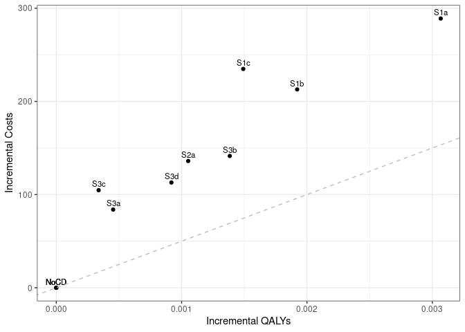

Sensitivity analysis: 0 Treatment Utility
================
10 September, 2024

    ## 
    ## > errors<-c(
    ## +   ERR_INCORRECT_SETTING_VARIABLE=-1,
    ## +   ERR_INCORRECT_VECTOR_SIZE=-2,
    ## +   ERR_INCORRECT_INPUT_VAR=-3,
    ## +   ERR_EVENT_STACK_FULL=-4,
    ## +   .... [TRUNCATED] 
    ## 
    ## > record_mode<-c(
    ## +   record_mode_none=0,
    ## +   record_mode_agent=1,
    ## +   record_mode_event=2,
    ## +   record_mode_some_event=3
    ## + )
    ## 
    ## > agent_creation_mode<-c(
    ## +   agent_creation_mode_one=0,
    ## +   agent_creation_mode_all=1,
    ## +   agent_creation_mode_pre=2
    ## + )
    ## 
    ## > medication_classes<-c(
    ## +   MED_CLASS_SABA=1,
    ## +   MED_CLASS_LABA=2,
    ## +   MED_CLASS_LAMA=4,
    ## +   MED_CLASS_ICS=8,
    ## +   MED_CLASS_MACRO=16
    ## + )
    ## 
    ## > events<-c(
    ## +     event_start=0,
    ## +     event_fixed=1,
    ## +     event_birthday=2,
    ## +     event_smoking_change=3,
    ## +     event_COPD=4,
    ## +     event_exacerbat .... [TRUNCATED]

``` r
# CHANGE: Add a timer (will see addition below to print time too)
# Start timer
start.time <- Sys.time()
```

``` r
# CHANGE: Add save paths (will see later, we also add lines to save to csv)
outputs <- "../../outputs/Sen5_0_Treat_Util"
files <- list(
  s1 = "s1.csv",
  s2 = "s2.csv",
  s3 = "s3.csv",
  sall = "sall.csv",
  ceplane = "ceplane.csv",
  clinical = "clinicalresults.csv"
)

# Apply to each element in list to create path to file in outputs
paths <- lapply(files, function(filename) paste0(outputs, filename))
```

    ## Initializing the session

    ## [1] 0

**Global inputs:**

  - Medication adherence is 0.7
  - Smoking adherence is 0.7
  - Cost discounting: 0.015
  - QALY discounting: 0.015
  - Time horizon: 20
  - The WTP threshold for NMB is 50000

**Case detection inputs:**

  - Case detection occurs at 3 year intervals.
  - An outpatient diagnosis costs 61.18
  - The utility gain due to symptom relief from treatment is 0

## S1 All patients scenario

All patients are eligible. The cost of case detection is:

| None | CDQ17 | FlowMeter | FlowMeter\_CDQ |
| ---: | ----: | --------: | -------------: |
|    0 | 11.56 |     30.46 |          42.01 |

#### S1NoCD: No Case detection

    ## [1] 0

    ## Terminating the session

    ## [1] 0

#### S1NoCD2: No Case detection- Other time interval

    ## Initializing the session

    ## [1] 0

    ## [1] 0

    ## Terminating the session

    ## [1] 0

#### S1A: CDQ ≥17 points

    ## Initializing the session

    ## [1] 0

    ## [1] 0

    ## Terminating the session

    ## [1] 0

#### S1B: Screening Spirometry with BD

    ## Initializing the session

    ## [1] 0

    ## [1] 0

    ## Terminating the session

    ## [1] 0

#### S1C: CDQ ≥17 points and Screening Spirometry with BD

    ## Initializing the session

    ## [1] 0

    ## [1] 0

    ## Terminating the session

    ## [1] 0

| Scenario  | Agents | PatientYears |  CopdPYs | NCaseDetections | DiagnosedPYs | OverdiagnosedPYs |  SABA |  LAMA | LAMALABA | ICSLAMALABA |   Mild | Moderate | Severe | VerySevere | MildPY | ModeratePY | SeverePY | VerySeverePY |  NoCOPD |  GOLD1 |  GOLD2 |   GOLD3 | GOLD4 |      Cost | CostpAgent |    QALY | QALYpAgent |      NMB | IncrementalCosts | IncrementalQALY |       ICER | IncrementalNMB |
| :-------- | -----: | -----------: | -------: | --------------: | -----------: | ---------------: | ----: | ----: | -------: | ----------: | -----: | -------: | -----: | ---------: | -----: | ---------: | -------: | -----------: | ------: | -----: | -----: | ------: | ----: | --------: | ---------: | ------: | ---------: | -------: | ---------------: | --------------: | ---------: | -------------: |
| S1NoCD    | 371579 |      6251100 | 706693.3 |         1907271 |     131040.9 |           133904 | 0.017 | 0.136 |    0.152 |       0.081 | 152231 |    28857 |  48565 |       4210 |  0.215 |      0.041 |    0.069 |        0.006 | 5270314 | 287267 | 304912 | 67938.0 | 12088 | 798567288 |   2149.118 | 4657457 |     12.534 | 624562.4 |            0.000 |           0.000 |        NaN |          0.000 |
| S1NoCD2   | 371849 |      6258006 | 711427.5 |         1245925 |     134326.9 |           162900 | 0.021 | 0.138 |    0.153 |       0.081 | 153957 |    28983 |  48765 |       4194 |  0.216 |      0.041 |    0.069 |        0.006 | 5272466 | 288303 | 307998 | 68401.0 | 11986 | 803320692 |   2160.341 | 4661989 |     12.537 | 624705.5 |            0.000 |           0.000 |        NaN |          0.000 |
| S1NoCDAvg | 371714 |      6254553 | 709060.4 |         1576598 |     132683.9 |           148402 | 0.019 | 0.137 |    0.152 |       0.081 | 153094 |    28920 |  48665 |       4202 |  0.216 |      0.041 |    0.069 |        0.006 | 5271390 | 287785 | 306455 | 68169.5 | 12037 | 800943990 |   2154.732 | 4659723 |     12.536 | 624634.0 |            0.000 |           0.000 |        NaN |          0.000 |
| S1a       | 371902 |      6259940 | 715671.7 |         1860288 |     332259.1 |           133758 | 0.027 | 0.157 |    0.308 |       0.093 | 148736 |    27895 |  46953 |       4074 |  0.208 |      0.039 |    0.066 |        0.006 | 5270381 | 290230 | 309289 | 68990.0 | 12196 | 900481317 |   2421.287 | 4663348 |     12.539 | 624538.0 |          272.168 |           0.005 |   54942.03 |       \-24.481 |
| S1b       | 372140 |      6259675 | 712868.5 |         1884251 |     237934.2 |           133471 | 0.021 | 0.149 |    0.242 |       0.088 | 150400 |    28799 |  48224 |       4222 |  0.211 |      0.040 |    0.068 |        0.006 | 5272825 | 288870 | 308796 | 68640.0 | 11651 | 882188218 |   2370.582 | 4663346 |     12.531 | 624187.4 |          221.463 |         \-0.003 | \-72105.34 |      \-375.032 |
| S1c       | 371919 |      6260241 | 706186.6 |         1892166 |     204936.3 |           134248 | 0.020 | 0.144 |    0.214 |       0.086 | 150938 |    28202 |  47543 |       4054 |  0.214 |      0.040 |    0.067 |        0.006 | 5279621 | 286590 | 304912 | 68525.0 | 11555 | 878053058 |   2360.872 | 4664353 |     12.541 | 624704.8 |          211.753 |           0.007 |   29901.46 |        142.332 |

*Treatment rate:* SABA is expressed per all patient-years, LAMA,
LAMA/LABA, ICS/LAMA/LABA are per COPD patient-years *Exacerbations:*
Total exacerbations and rate per COPD patient-year: *GOLD Stage:*
Cumulative patient-years *Cost/QALY:* Total cost and QALYs *NMB:* Net
Monetary Benefit is calculated as QALY per patient-year \* Lamba - Cost
per patient-year

-----

## S2 Symptomatic patients scenario

Patients with symptoms at year 1 are eligible. The cost of case
detection is:

    ## Initializing the session

    ## [1] 0

| None | FlowMeter |
| ---: | --------: |
|    0 |     24.33 |

#### S2NoCD: No Case detection

    ## [1] 0

    ## Terminating the session

    ## [1] 0

#### S2a: Screening Spirometry without BD

    ## Initializing the session

    ## [1] 0

    ## [1] 0

    ## Terminating the session

    ## [1] 0

| Scenario | Agents | PatientYears |  CopdPYs | NCaseDetections | DiagnosedPYs | OverdiagnosedPYs |  SABA |  LAMA | LAMALABA | ICSLAMALABA |   Mild | Moderate | Severe | VerySevere | MildPY | ModeratePY | SeverePY | VerySeverePY |  NoCOPD |  GOLD1 |  GOLD2 | GOLD3 | GOLD4 |      Cost | CostpAgent |    QALY | QALYpAgent |    NMB | IncrementalCosts | IncrementalQALY |     ICER | IncrementalNMB |
| :------- | -----: | -----------: | -------: | --------------: | -----------: | ---------------: | ----: | ----: | -------: | ----------: | -----: | -------: | -----: | ---------: | -----: | ---------: | -------: | -----------: | ------: | -----: | -----: | ----: | ----: | --------: | ---------: | ------: | ---------: | -----: | ---------------: | --------------: | -------: | -------------: |
| S2NoCD   | 219759 |      3629137 | 502614.4 |         1104519 |     96571.85 |            76657 | 0.017 | 0.142 |    0.159 |       0.088 | 114918 |    21470 |  35762 |       3125 |  0.229 |      0.043 |    0.071 |        0.006 | 2971512 | 185231 | 226774 | 55920 | 10059 | 592355610 |   2695.478 | 2694436 |     12.261 | 610348 |            0.000 |           0.000 |      NaN |          0.000 |
| S2a      | 221233 |      3655045 | 504163.3 |         1090071 |    187694.30 |            76886 | 0.023 | 0.161 |    0.273 |       0.100 | 111819 |    21267 |  35379 |       3000 |  0.222 |      0.042 |    0.070 |        0.006 | 2994733 | 187473 | 224775 | 56946 | 10292 | 644478701 |   2913.122 | 2714034 |     12.268 | 610475 |          217.644 |           0.007 | 31570.05 |        127.056 |

*Treatment rate:* SABA is expressed per all patient-years, LAMA,
LAMA/LABA, ICS/LAMA/LABA are per COPD patient-years *Exacerbations:*
Total exacerbations and rate per COPD patient-year: *GOLD Stage:*
Cumulative patient-years *Cost/QALY:* Total cost and QALYs *NMB:* Net
Monetary Benefit is calculated as QALY per patient-year \* Lamba - Cost
per patient-year

-----

## S3 Smoking history scenario

Ever smokers ≥50 years of age are eligible. The cost of case detection
is:

    ## Initializing the session

    ## [1] 0

| None | CDQ195 | CDQ165 | FlowMeter | FlowMeter\_CDQ |
| ---: | -----: | -----: | --------: | -------------: |
|    0 |  11.56 |  11.56 |     24.33 |          42.01 |

#### S3NoCD: No Case detection

    ## [1] 0

    ## Terminating the session

    ## [1] 0

#### S3a: CDQ ≥19.5 points

    ## Initializing the session

    ## [1] 0

    ## [1] 0

    ## Terminating the session

    ## [1] 0

#### S3b: CDQ ≥16.5 points

    ## Initializing the session

    ## [1] 0

    ## [1] 0

    ## Terminating the session

    ## [1] 0

#### S3c: Screening spirometry without BD

    ## Initializing the session

    ## [1] 0

    ## [1] 0

    ## Terminating the session

    ## [1] 0

#### S3d: Screening Spirometry with BD + CDQ ≥17 points

    ## Initializing the session

    ## [1] 0

    ## [1] 0

    ## Terminating the session

    ## [1] 0

| Scenario | Agents | PatientYears |  CopdPYs | NCaseDetections | DiagnosedPYs | OverdiagnosedPYs |  SABA |  LAMA | LAMALABA | ICSLAMALABA |  Mild | Moderate | Severe | VerySevere | MildPY | ModeratePY | SeverePY | VerySeverePY |  NoCOPD |  GOLD1 |  GOLD2 | GOLD3 | GOLD4 |      Cost | CostpAgent |    QALY | QALYpAgent |      NMB | IncrementalCosts | IncrementalQALY |        ICER | IncrementalNMB |
| :------- | -----: | -----------: | -------: | --------------: | -----------: | ---------------: | ----: | ----: | -------: | ----------: | ----: | -------: | -----: | ---------: | -----: | ---------: | -------: | -----------: | ------: | -----: | -----: | ----: | ----: | --------: | ---------: | ------: | ---------: | -------: | ---------------: | --------------: | ----------: | -------------: |
| S3NoCD   | 172154 |      2596453 | 416267.8 |          799855 |     76852.85 |            57928 | 0.018 | 0.136 |    0.152 |       0.085 | 97495 |    17657 |  29861 |       2619 |  0.234 |      0.042 |    0.072 |        0.006 | 2071385 | 153396 | 185269 | 48874 |  8728 | 494403150 |   2871.866 | 1932302 |     11.224 | 558341.5 |            0.000 |           0.000 |         NaN |          0.000 |
| S3a      | 172660 |      2605291 | 417975.1 |          794584 |    109412.00 |            58149 | 0.021 | 0.142 |    0.202 |       0.091 | 97401 |    17791 |  29901 |       2514 |  0.233 |      0.043 |    0.072 |        0.006 | 2078316 | 153154 | 186348 | 48897 |  9539 | 527017592 |   3052.343 | 1938744 |     11.229 | 558381.6 |          180.478 |           0.004 |    40903.32 |         40.137 |
| S3b      | 172336 |      2597409 | 414801.3 |          776924 |    169415.85 |            58485 | 0.027 | 0.156 |    0.292 |       0.098 | 93305 |    17249 |  29154 |       2538 |  0.225 |      0.042 |    0.070 |        0.006 | 2073562 | 151906 | 185791 | 48390 |  8665 | 542053886 |   3145.332 | 1933315 |     11.218 | 557769.0 |          273.466 |         \-0.006 |  \-45726.76 |      \-572.488 |
| S3c      | 172314 |      2601178 | 413310.6 |          785238 |    140563.81 |            58308 | 0.024 | 0.152 |    0.253 |       0.097 | 94971 |    17967 |  29976 |       2568 |  0.230 |      0.043 |    0.073 |        0.006 | 2078632 | 152348 | 184613 | 47450 |  9041 | 535046632 |   3105.068 | 1936134 |     11.236 | 558698.9 |          233.202 |           0.012 |    19741.99 |        357.423 |
| S3d      | 172882 |      2607172 | 418585.2 |          790887 |    126089.76 |            58037 | 0.022 | 0.148 |    0.229 |       0.093 | 96041 |    18109 |  30257 |       2592 |  0.229 |      0.043 |    0.072 |        0.006 | 2079272 | 153348 | 187559 | 48917 |  8624 | 542727747 |   3139.296 | 1940166 |     11.222 | 557985.0 |          267.430 |         \-0.002 | \-150188.73 |      \-356.462 |

*Treatment rate:* SABA is expressed per all patient-years, LAMA,
LAMA/LABA, ICS/LAMA/LABA are per COPD patient-years *Exacerbations:*
Total exacerbations and rate per COPD patient-year *GOLD Stage:*
Cumulative patient-years *Cost/QALY:* Total cost and QALYs *NMB:* Net
Monetary Benefit is calculated as QALY per patient-year \* Lamba - Cost
per patient-year

-----

## All Scenarios

*Ordered by descending Net Monetary Benefit*

| Scenario | Agents |      Cost | CostpAgent |    QALY | QALYpAgent |        ICER | IncrementalNMB |
| :------- | -----: | --------: | ---------: | ------: | ---------: | ----------: | -------------: |
| S3c      | 172314 | 535046632 |   3105.068 | 1936134 |     11.236 |    19741.99 |        357.423 |
| S1c      | 371919 | 878053058 |   2360.872 | 4664353 |     12.541 |    29901.46 |        142.332 |
| S2a      | 221233 | 644478701 |   2913.122 | 2714034 |     12.268 |    31570.05 |        127.056 |
| S3a      | 172660 | 527017592 |   3052.343 | 1938744 |     11.229 |    40903.32 |         40.137 |
| S1NoCD   | 371579 | 798567288 |   2149.118 | 4657457 |     12.534 |         NaN |          0.000 |
| S2NoCD   | 219759 | 592355610 |   2695.478 | 2694436 |     12.261 |         NaN |          0.000 |
| S3NoCD   | 172154 | 494403150 |   2871.866 | 1932302 |     11.224 |         NaN |          0.000 |
| S1a      | 371902 | 900481317 |   2421.287 | 4663348 |     12.539 |    54942.03 |       \-24.481 |
| S3d      | 172882 | 542727747 |   3139.296 | 1940166 |     11.222 | \-150188.73 |      \-356.462 |
| S1b      | 372140 | 882188218 |   2370.582 | 4663346 |     12.531 |  \-72105.34 |      \-375.032 |
| S3b      | 172336 | 542053886 |   3145.332 | 1933315 |     11.218 |  \-45726.76 |      \-572.488 |

-----

## Cost Effectiveness Plane

Adjusted to the total population

| Scenario  | Agents | PropAgents |      Cost | CostpAgent | CostpAgentExcluded | CostpAgentAll |    QALY | QALYpAgent | QALYpAgentExcluded | QALYpAgentAll | IncrementalCosts | IncrementalQALY |    ICERAdj |        ICER |        INMB |
| :-------- | -----: | ---------: | --------: | ---------: | -----------------: | ------------: | ------: | ---------: | -----------------: | ------------: | ---------------: | --------------: | ---------: | ----------: | ----------: |
| S1NoCDAvg | 371714 |  1.0000000 | 800943990 |   2154.732 |              0.000 |      2154.732 | 4659723 |   12.53577 |            0.00000 |      12.53577 |          0.00000 |       0.0000000 |        NaN |         NaN |     0.00000 |
| S1a       | 371902 |  1.0000000 | 900481317 |   2421.287 |              0.000 |      2421.287 | 4663348 |   12.53919 |            0.00000 |      12.53919 |        266.55473 |       0.0034104 |   78159.92 |    54942.03 |  \-96.03593 |
| S1b       | 372140 |  1.0000000 | 882188218 |   2370.582 |              0.000 |      2370.582 | 4663346 |   12.53116 |            0.00000 |      12.53116 |        215.84971 |     \-0.0046147 | \-46773.98 |  \-72105.33 | \-446.58667 |
| S1c       | 371919 |  1.0000000 | 878053058 |   2360.872 |              0.000 |      2360.872 | 4664353 |   12.54131 |            0.00000 |      12.54131 |        206.13991 |       0.0055383 |   37220.47 |    29901.46 |    70.77747 |
| S2NoCD    | 219759 |  0.5912045 | 592355610 |   2695.478 |           1372.698 |      2154.732 | 2694436 |   12.26087 |           12.93335 |      12.53577 |          0.00000 |       0.0000000 |        NaN |         NaN |     0.00000 |
| S2a       | 221233 |  0.5951699 | 644478701 |   2913.122 |           1372.698 |      2289.512 | 2714034 |   12.26776 |           12.93335 |      12.53721 |        134.78032 |       0.0014364 |   93829.37 |    31570.05 |  \-62.95829 |
| S3NoCD    | 172154 |  0.4631356 | 494403150 |   2871.866 |           1536.084 |      2154.732 | 1932302 |   11.22427 |           13.66717 |      12.53577 |          0.00000 |       0.0000000 |        NaN |         NaN |     0.00000 |
| S3a       | 172660 |  0.4644969 | 527017592 |   3052.343 |           1536.084 |      2240.382 | 1938744 |   11.22868 |           13.66717 |      12.53450 |         85.64968 |     \-0.0012759 | \-67127.20 |    40903.32 | \-149.44623 |
| S3b       | 172336 |  0.4636253 | 542053886 |   3145.332 |           1536.084 |      2282.172 | 1933315 |   11.21829 |           13.66717 |      12.53181 |        127.43983 |     \-0.0039688 | \-32110.53 |  \-45726.76 | \-325.87912 |
| S3c       | 172314 |  0.4635661 | 535046632 |   3105.068 |           1536.084 |      2263.411 | 1936134 |   11.23608 |           13.66717 |      12.54020 |        108.67955 |       0.0044244 |   24563.95 |    19741.99 |   112.53803 |
| S3d       | 172882 |  0.4650941 | 542727747 |   3139.296 |           1536.084 |      2281.728 | 1940166 |   11.22249 |           13.66717 |      12.53016 |        126.99637 |     \-0.0056126 | \-22627.12 | \-150188.73 | \-407.62503 |

<!-- -->

## Clinical Results for all scenarios

Adjusted to the total population

| Scenario  | PropAgents | ProppPatientYears | ProppCopdPYs |   SABAAll |   LAMAAll | LAMALABAAll | ICSLAMALABAAll | MildpAgentAll | ModeratepAgentAll | SeverepAgentAll | VerySeverepAgentAll | NoCOPDpPYAll | GOLD1pPYAll | GOLD2pPYAll | GOLD3pPYAll | GOLD4pPYAll | DiagnosedpPYAll |
| :-------- | ---------: | ----------------: | -----------: | --------: | --------: | ----------: | -------------: | ------------: | ----------------: | --------------: | ------------------: | -----------: | ----------: | ----------: | ----------: | ----------: | --------------: |
| S1NoCDAvg |  1.0000000 |         1.0000000 |    1.0000000 | 0.0190669 | 0.1369635 |   0.1524877 |      0.0811388 |     0.4118597 |         0.0778018 |       0.1309205 |           0.0113044 |    0.8428084 |   0.0460121 |   0.0489971 |   0.0108992 |   0.0019245 |       0.1871263 |
| S1a       |  1.0000000 |         1.0000000 |    1.0000000 | 0.0265445 | 0.1570223 |   0.3084907 |      0.0926510 |     0.3999333 |         0.0750063 |       0.1262510 |           0.0109545 |    0.8419219 |   0.0463631 |   0.0494077 |   0.0110209 |   0.0019483 |       0.4642618 |
| S1b       |  1.0000000 |         1.0000000 |    1.0000000 | 0.0214586 | 0.1491594 |   0.2417213 |      0.0881407 |     0.4041490 |         0.0773875 |       0.1295856 |           0.0113452 |    0.8423480 |   0.0461478 |   0.0493310 |   0.0109654 |   0.0018613 |       0.3337701 |
| S1c       |  1.0000000 |         1.0000000 |    1.0000000 | 0.0203173 | 0.1442037 |   0.2142410 |      0.0858433 |     0.4058357 |         0.0758283 |       0.1278316 |           0.0109002 |    0.8433575 |   0.0457794 |   0.0487061 |   0.0109461 |   0.0018458 |       0.2902014 |
| S2NoCD    |  0.5912045 |         0.5802392 |    0.7088457 | 0.0190669 | 0.1369635 |   0.1524877 |      0.0811388 |     0.4118597 |         0.0778018 |       0.1309205 |           0.0113044 |    0.8428084 |   0.0460121 |   0.0489971 |   0.0108992 |   0.0019245 |       0.1871263 |
| S2a       |  0.5951699 |         0.5843814 |    0.7110301 | 0.0224588 | 0.1502763 |   0.2333607 |      0.0900274 |     0.4025264 |         0.0770612 |       0.1295535 |           0.0109400 |    0.8428925 |   0.0462087 |   0.0485518 |   0.0110439 |   0.0019587 |       0.3152558 |
| S3NoCD    |  0.4631356 |         0.4151300 |    0.5870696 | 0.0190669 | 0.1369635 |   0.1524877 |      0.0811388 |     0.4118597 |         0.0778018 |       0.1309205 |           0.0113044 |    0.8428084 |   0.0460121 |   0.0489971 |   0.0108992 |   0.0019245 |       0.1871263 |
| S3a       |  0.4644969 |         0.4165431 |    0.5894774 | 0.0201971 | 0.1407461 |   0.1823544 |      0.0846326 |     0.4112275 |         0.0780854 |       0.1308999 |           0.0110111 |    0.8426805 |   0.0459215 |   0.0491228 |   0.0108954 |   0.0020529 |       0.2325859 |
| S3b       |  0.4636253 |         0.4152828 |    0.5850013 | 0.0226724 | 0.1487887 |   0.2343546 |      0.0889405 |     0.4004511 |         0.0766765 |       0.1289724 |           0.0110826 |    0.8430228 |   0.0457682 |   0.0490755 |   0.0108210 |   0.0019143 |       0.3180639 |
| S3c       |  0.4635661 |         0.4158854 |    0.5828990 | 0.0212574 | 0.1466240 |   0.2115343 |      0.0882504 |     0.4049496 |         0.0786114 |       0.1311894 |           0.0111638 |    0.8433063 |   0.0458168 |   0.0488672 |   0.0106675 |   0.0019739 |       0.2777743 |
| S3d       |  0.4650941 |         0.4168438 |    0.5903378 | 0.0207322 | 0.1440997 |   0.1979824 |      0.0857580 |     0.4074024 |         0.0789072 |       0.1318013 |           0.0112162 |    0.8425703 |   0.0459414 |   0.0493065 |   0.0108970 |   0.0019063 |       0.2559428 |

## Time elapsed

Run time for this notebook:

``` r
end.time <- Sys.time()
time.taken <- end.time - start.time
time.taken
```

    ## Time difference of 8.570056 mins
