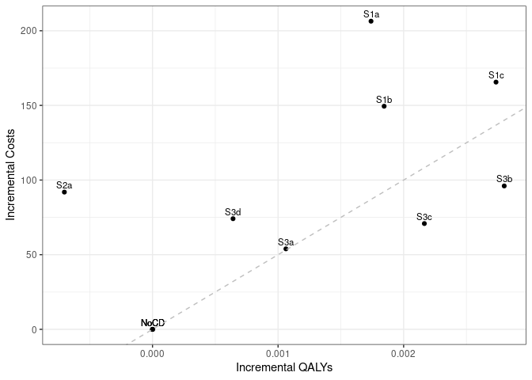

Sensitivity analysis: 0 Treatment Utility
================
16 October, 2024

    ## 
    ## > errors<-c(
    ## +   ERR_INCORRECT_SETTING_VARIABLE=-1,
    ## +   ERR_INCORRECT_VECTOR_SIZE=-2,
    ## +   ERR_INCORRECT_INPUT_VAR=-3,
    ## +   ERR_EVENT_STACK_FULL=-4,
    ## +   .... [TRUNCATED] 
    ## 
    ## > record_mode<-c(
    ## +   record_mode_none=0,
    ## +   record_mode_agent=1,
    ## +   record_mode_event=2,
    ## +   record_mode_some_event=3
    ## + )
    ## 
    ## > agent_creation_mode<-c(
    ## +   agent_creation_mode_one=0,
    ## +   agent_creation_mode_all=1,
    ## +   agent_creation_mode_pre=2
    ## + )
    ## 
    ## > medication_classes<-c(
    ## +   MED_CLASS_SABA=1,
    ## +   MED_CLASS_LABA=2,
    ## +   MED_CLASS_LAMA=4,
    ## +   MED_CLASS_ICS=8,
    ## +   MED_CLASS_MACRO=16
    ## + )
    ## 
    ## > events<-c(
    ## +     event_start=0,
    ## +     event_fixed=1,
    ## +     event_birthday=2,
    ## +     event_smoking_change=3,
    ## +     event_COPD=4,
    ## +     event_exacerbat .... [TRUNCATED]

``` r
# CHANGE: Add a timer (will see addition below to print time too)
# Start timer
start.time <- Sys.time()
```

``` r
# CHANGE: Add save paths (will see later, we also add lines to save to csv)
outputs <- "../../outputs/Sen5_0_Treat_Util"
files <- list(
  s1 = "s1_5y.csv",
  s2 = "s2_5y.csv",
  s3 = "s3_5y.csv",
  sall = "sall_5y.csv",
  ceplane = "ceplane_5y.csv",
  clinical = "clinicalresults_5y.csv"
)

# Apply to each element in list to create path to file in outputs
paths <- lapply(files, function(filename) paste0(outputs, filename))
```

    ## Initializing the session

    ## [1] 0

**Global inputs:**

  - Medication adherence is 0.7
  - Smoking adherence is 0.7
  - Cost discounting: 0.015
  - QALY discounting: 0.015
  - Time horizon: 20
  - The WTP threshold for NMB is 50000

**Case detection inputs:**

  - Case detection occurs at 5 year intervals.
  - An outpatient diagnosis costs 61.18
  - The utility gain due to symptom relief from treatment is 0

## S1 All patients scenario

All patients are eligible. The cost of case detection is:

| None | CDQ17 | FlowMeter | FlowMeter\_CDQ |
| ---: | ----: | --------: | -------------: |
|    0 | 11.56 |     30.46 |          42.01 |

#### S1NoCD2: No Case detection- Other time interval

    ## [1] 0

    ## Terminating the session

    ## [1] 0

#### S1NoCD: No Case detection

    ## Initializing the session

    ## [1] 0

    ## [1] 0

    ## Terminating the session

    ## [1] 0

#### S1A: CDQ ≥17 points

    ## Initializing the session

    ## [1] 0

    ## [1] 0

    ## Terminating the session

    ## [1] 0

#### S1B: Screening Spirometry with BD

    ## Initializing the session

    ## [1] 0

    ## [1] 0

    ## Terminating the session

    ## [1] 0

#### S1C: CDQ ≥17 points and Screening Spirometry with BD

    ## Initializing the session

    ## [1] 0

    ## [1] 0

    ## Terminating the session

    ## [1] 0

| Scenario  |   Agents | PatientYears |   CopdPYs | NCaseDetections | DiagnosedPYs | OverdiagnosedPYs |  SABA |  LAMA | LAMALABA | ICSLAMALABA |     Mild | Moderate |  Severe | VerySevere | MildPY | ModeratePY | SeverePY | VerySeverePY |     NoCOPD |    GOLD1 |    GOLD2 |    GOLD3 |   GOLD4 |         Cost | CostpAgent |      QALY | QALYpAgent |      NMB | IncrementalCosts | IncrementalQALY |     ICER | IncrementalNMB |
| :-------- | -------: | -----------: | --------: | --------------: | -----------: | ---------------: | ----: | ----: | -------: | ----------: | -------: | -------: | ------: | ---------: | -----: | ---------: | -------: | -----------: | ---------: | -------: | -------: | -------: | ------: | -----------: | ---------: | --------: | ---------: | -------: | ---------------: | --------------: | -------: | -------------: |
| S1NoCD2   | 74388747 |   1251903576 | 142277086 |       381929878 |     26336153 |         26747209 | 0.017 | 0.135 |    0.151 |       0.080 | 30809289 |  5766720 | 9701609 |   839538.0 |  0.217 |      0.041 |    0.068 |        0.006 | 1054811684 | 57697202 | 61465410 | 13763906 | 2389153 | 159789813678 |   2148.037 | 932633078 |     12.537 | 624716.3 |            0.000 |           0.000 |      NaN |          0.000 |
| S1NoCD    | 74388425 |   1251968458 | 142302175 |       249329256 |     26636736 |         32661650 | 0.021 | 0.136 |    0.151 |       0.080 | 30801067 |  5759155 | 9700407 |   837363.0 |  0.216 |      0.040 |    0.068 |        0.006 | 1054852003 | 57672835 | 61488796 | 13791895 | 2388663 | 160061317736 |   2151.697 | 932675718 |     12.538 | 624744.0 |            0.000 |           0.000 |      NaN |          0.000 |
| S1NoCDAvg | 74388586 |   1251936017 | 142289630 |       315629567 |     26486444 |         29704430 | 0.019 | 0.136 |    0.151 |       0.080 | 30805178 |  5762938 | 9701008 |   838450.5 |  0.216 |      0.041 |    0.068 |        0.006 | 1054831844 | 57685018 | 61477103 | 13777900 | 2388908 | 159925565707 |   2149.867 | 932654398 |     12.538 | 624730.2 |            0.000 |           0.000 |      NaN |          0.000 |
| S1a       | 74386318 |   1252092577 | 142511621 |       245523949 |     57058349 |         32655914 | 0.028 | 0.154 |    0.274 |       0.091 | 30028808 |  5656584 | 9558038 |   827432.0 |  0.211 |      0.040 |    0.067 |        0.006 | 1054768469 | 57752767 | 61521629 | 13851433 | 2413714 | 175298229824 |   2356.592 | 932770789 |     12.540 | 624620.8 |          204.896 |           0.002 | 125455.6 |      \-123.235 |
| S1b       | 74385413 |   1252007176 | 142455061 |       247448362 |     41936466 |         32651747 | 0.024 | 0.145 |    0.216 |       0.086 | 30368698 |  5706469 | 9627370 |   832514.0 |  0.213 |      0.040 |    0.068 |        0.006 | 1054746061 | 57768304 | 61498391 | 13812986 | 2404656 | 170952563916 |   2298.200 | 932704901 |     12.539 | 624642.5 |          146.504 |           0.001 | 162779.0 |      \-101.503 |
| S1c       | 74390720 |   1252048091 | 142295860 |       248074520 |     37009576 |         32668233 | 0.023 | 0.142 |    0.196 |       0.084 | 30456632 |  5715293 | 9646702 |   833108.0 |  0.214 |      0.040 |    0.068 |        0.006 | 1054933501 | 57690667 | 61453687 | 13794504 | 2396041 | 171904343832 |   2310.830 | 932748272 |     12.539 | 624614.3 |          159.134 |           0.001 | 270403.2 |      \-129.709 |

*Treatment rate:* SABA is expressed per all patient-years, LAMA,
LAMA/LABA, ICS/LAMA/LABA are per COPD patient-years *Exacerbations:*
Total exacerbations and rate per COPD patient-year: *GOLD Stage:*
Cumulative patient-years *Cost/QALY:* Total cost and QALYs *NMB:* Net
Monetary Benefit is calculated as QALY per patient-year \* Lamba - Cost
per patient-year

-----

## S2 Symptomatic patients scenario

Patients with symptoms at year 1 are eligible. The cost of case
detection is:

    ## Initializing the session

    ## [1] 0

| None | FlowMeter |
| ---: | --------: |
|    0 |     24.33 |

#### S2NoCD: No Case detection

    ## [1] 0

    ## Terminating the session

    ## [1] 0

#### S2a: Screening Spirometry without BD

    ## Initializing the session

    ## [1] 0

    ## [1] 0

    ## Terminating the session

    ## [1] 0

| Scenario |   Agents | PatientYears |   CopdPYs | NCaseDetections | DiagnosedPYs | OverdiagnosedPYs |  SABA |  LAMA | LAMALABA | ICSLAMALABA |     Mild | Moderate |  Severe | VerySevere | MildPY | ModeratePY | SeverePY | VerySeverePY |    NoCOPD |    GOLD1 |    GOLD2 |    GOLD3 |   GOLD4 |         Cost | CostpAgent |      QALY | QALYpAgent |      NMB | IncrementalCosts | IncrementalQALY |     ICER | IncrementalNMB |
| :------- | -------: | -----------: | --------: | --------------: | -----------: | ---------------: | ----: | ----: | -------: | ----------: | -------: | -------: | ------: | ---------: | -----: | ---------: | -------: | -----------: | --------: | -------: | -------: | -------: | ------: | -----------: | ---------: | --------: | ---------: | -------: | ---------------: | --------------: | -------: | -------------: |
| S2NoCD   | 44157029 |    729047563 | 100380900 |       145000421 |     19524492 |         18863743 | 0.021 | 0.142 |    0.160 |       0.087 | 22925265 |  4254784 | 7099566 |     609563 |  0.228 |      0.042 |    0.071 |        0.006 | 597538799 | 37245010 | 45040554 | 11117169 | 2054803 | 117807957835 |   2667.932 | 541387059 |     12.260 | 610356.8 |            0.000 |           0.000 |      NaN |          0.000 |
| S2a      | 44154576 |    729145856 | 100448839 |       143361789 |     32595478 |         18878233 | 0.025 | 0.154 |    0.242 |       0.095 | 22519648 |  4200194 | 7025459 |     605531 |  0.224 |      0.042 |    0.070 |        0.006 | 597564735 | 37286040 | 45033303 | 11135908 | 2066352 | 124844786047 |   2827.448 | 541466014 |     12.263 | 610320.8 |          159.516 |           0.002 | 64600.18 |       \-36.052 |

*Treatment rate:* SABA is expressed per all patient-years, LAMA,
LAMA/LABA, ICS/LAMA/LABA are per COPD patient-years *Exacerbations:*
Total exacerbations and rate per COPD patient-year: *GOLD Stage:*
Cumulative patient-years *Cost/QALY:* Total cost and QALYs *NMB:* Net
Monetary Benefit is calculated as QALY per patient-year \* Lamba - Cost
per patient-year

-----

## S3 Smoking history scenario

Ever smokers ≥50 years of age are eligible. The cost of case detection
is:

    ## Initializing the session

    ## [1] 0

| None | CDQ195 | CDQ165 | FlowMeter | FlowMeter\_CDQ |
| ---: | -----: | -----: | --------: | -------------: |
|    0 |  11.56 |  11.56 |     24.33 |          42.01 |

#### S3NoCD: No Case detection

    ## [1] 0

    ## Terminating the session

    ## [1] 0

#### S3a: CDQ ≥19.5 points

    ## Initializing the session

    ## [1] 0

    ## [1] 0

    ## Terminating the session

    ## [1] 0

#### S3b: CDQ ≥16.5 points

    ## Initializing the session

    ## [1] 0

    ## [1] 0

    ## Terminating the session

    ## [1] 0

#### S3c: Screening spirometry without BD

    ## Initializing the session

    ## [1] 0

    ## [1] 0

    ## Terminating the session

    ## [1] 0

#### S3d: Screening Spirometry with BD + CDQ ≥17 points

    ## Initializing the session

    ## [1] 0

    ## [1] 0

    ## Terminating the session

    ## [1] 0

| Scenario |   Agents | PatientYears |  CopdPYs | NCaseDetections | DiagnosedPYs | OverdiagnosedPYs |  SABA |  LAMA | LAMALABA | ICSLAMALABA |     Mild | Moderate |  Severe | VerySevere | MildPY | ModeratePY | SeverePY | VerySeverePY |    NoCOPD |    GOLD1 |    GOLD2 |   GOLD3 |   GOLD4 |         Cost | CostpAgent |      QALY | QALYpAgent |      NMB | IncrementalCosts | IncrementalQALY |     ICER | IncrementalNMB |
| :------- | -------: | -----------: | -------: | --------------: | -----------: | ---------------: | ----: | ----: | -------: | ----------: | -------: | -------: | ------: | ---------: | -----: | ---------: | -------: | -----------: | --------: | -------: | -------: | ------: | ------: | -----------: | ---------: | --------: | ---------: | -------: | ---------------: | --------------: | -------: | -------------: |
| S3NoCD   | 34491937 |    520096794 | 83394436 |       104866546 |     15798844 |         14116443 | 0.022 | 0.137 |    0.154 |       0.086 | 19479590 |  3630576 | 6075819 |     523166 |  0.234 |      0.044 |    0.073 |        0.006 | 414917152 | 30599570 | 37365292 | 9614469 | 1790750 |  99999943602 |   2899.227 | 387044339 |     11.221 | 558165.7 |            0.000 |           0.000 |      NaN |          0.000 |
| S3a      | 34494037 |    520214111 | 83457293 |       104351592 |     20245608 |         14129448 | 0.024 | 0.142 |    0.189 |       0.089 | 19332282 |  3614629 | 6055063 |     518761 |  0.232 |      0.043 |    0.073 |        0.006 | 414968911 | 30599997 | 37426814 | 9615582 | 1787056 | 104115381916 |   3018.359 | 387129436 |     11.223 | 558135.8 |          119.132 |           0.002 | 66783.39 |       \-29.939 |
| S3b      | 34509196 |    520537138 | 83620081 |       103218767 |     29823148 |         14132996 | 0.029 | 0.152 |    0.258 |       0.096 | 19135380 |  3582069 | 6004729 |     516649 |  0.229 |      0.043 |    0.072 |        0.006 | 415119150 | 30640730 | 37483240 | 9661621 | 1802895 | 107308147373 |   3109.552 | 387360806 |     11.225 | 558133.3 |          210.326 |           0.004 | 59106.08 |       \-32.403 |
| S3c      | 34504471 |    520423616 | 83513343 |       103824096 |     24853847 |         14121585 | 0.026 | 0.146 |    0.223 |       0.093 | 19220385 |  3595075 | 6024956 |     518536 |  0.230 |      0.043 |    0.072 |        0.006 | 415113845 | 30619979 | 37421385 | 9639642 | 1802009 | 105270593424 |   3050.926 | 387285272 |     11.224 | 558159.3 |          151.699 |           0.003 | 52193.94 |        \-6.377 |
| S3d      | 34501231 |    520389346 | 83507084 |       104079260 |     22711874 |         14135933 | 0.025 | 0.144 |    0.207 |       0.091 | 19266710 |  3605577 | 6035420 |     519637 |  0.231 |      0.043 |    0.072 |        0.006 | 415086795 | 30631737 | 37413709 | 9638221 | 1794998 | 105602366018 |   3060.829 | 387258905 |     11.224 | 558163.9 |          161.602 |           0.003 | 50559.69 |        \-1.789 |

*Treatment rate:* SABA is expressed per all patient-years, LAMA,
LAMA/LABA, ICS/LAMA/LABA are per COPD patient-years *Exacerbations:*
Total exacerbations and rate per COPD patient-year *GOLD Stage:*
Cumulative patient-years *Cost/QALY:* Total cost and QALYs *NMB:* Net
Monetary Benefit is calculated as QALY per patient-year \* Lamba - Cost
per patient-year

-----

## All Scenarios

*Ordered by descending Net Monetary Benefit*

| Scenario |   Agents |         Cost | CostpAgent |      QALY | QALYpAgent |      ICER | IncrementalNMB |
| :------- | -------: | -----------: | ---------: | --------: | ---------: | --------: | -------------: |
| S1NoCD   | 74388425 | 160061317736 |   2151.697 | 932675718 |     12.538 |       NaN |          0.000 |
| S2NoCD   | 44157029 | 117807957835 |   2667.932 | 541387059 |     12.260 |       NaN |          0.000 |
| S3NoCD   | 34491937 |  99999943602 |   2899.227 | 387044339 |     11.221 |       NaN |          0.000 |
| S3d      | 34501231 | 105602366018 |   3060.829 | 387258905 |     11.224 |  50559.69 |        \-1.789 |
| S3c      | 34504471 | 105270593424 |   3050.926 | 387285272 |     11.224 |  52193.94 |        \-6.377 |
| S3a      | 34494037 | 104115381916 |   3018.359 | 387129436 |     11.223 |  66783.39 |       \-29.939 |
| S3b      | 34509196 | 107308147373 |   3109.552 | 387360806 |     11.225 |  59106.08 |       \-32.403 |
| S2a      | 44154576 | 124844786047 |   2827.448 | 541466014 |     12.263 |  64600.18 |       \-36.052 |
| S1b      | 74385413 | 170952563916 |   2298.200 | 932704901 |     12.539 | 162779.04 |      \-101.503 |
| S1a      | 74386318 | 175298229824 |   2356.592 | 932770789 |     12.540 | 125455.61 |      \-123.235 |
| S1c      | 74390720 | 171904343832 |   2310.830 | 932748272 |     12.539 | 270403.20 |      \-129.709 |

-----

## Cost Effectiveness Plane

Adjusted to the total population

| Scenario  |   Agents | PropAgents |         Cost | CostpAgent | CostpAgentExcluded | CostpAgentAll |      QALY | QALYpAgent | QALYpAgentExcluded | QALYpAgentAll | IncrementalCosts | IncrementalQALY |   ICERAdj |      ICER |        INMB |
| :-------- | -------: | ---------: | -----------: | ---------: | -----------------: | ------------: | --------: | ---------: | -----------------: | ------------: | ---------------: | --------------: | --------: | --------: | ----------: |
| S1NoCDAvg | 74388586 |  1.0000000 | 159925565707 |   2149.867 |              0.000 |      2149.867 | 932654398 |   12.53760 |            0.00000 |      12.53760 |          0.00000 |       0.0000000 |       NaN |       NaN |     0.00000 |
| S1a       | 74386318 |  1.0000000 | 175298229824 |   2356.592 |              0.000 |      2356.592 | 932770789 |   12.53955 |            0.00000 |      12.53955 |        206.72538 |       0.0019469 | 106179.18 | 125455.61 | \-109.37796 |
| S1b       | 74385413 |  1.0000000 | 170952563916 |   2298.200 |              0.000 |      2298.200 | 932704901 |   12.53881 |            0.00000 |      12.53881 |        148.33311 |       0.0012137 | 122210.63 | 162779.03 |  \-87.64563 |
| S1c       | 74390720 |  1.0000000 | 171904343832 |   2310.830 |              0.000 |      2310.830 | 932748272 |   12.53850 |            0.00000 |      12.53850 |        160.96350 |       0.0009022 | 178404.12 | 270403.20 | \-115.85145 |
| S2NoCD    | 44157029 |  0.5935995 | 117807957835 |   2667.932 |           1393.167 |      2149.867 | 541387059 |   12.26050 |           12.94235 |      12.53760 |          0.00000 |       0.0000000 |       NaN |       NaN |     0.00000 |
| S2a       | 44154576 |  0.5935665 | 124844786047 |   2827.448 |           1393.167 |      2244.508 | 541466014 |   12.26296 |           12.94235 |      12.53909 |         94.64148 |       0.0014882 |  63595.91 |  64600.18 |  \-20.23301 |
| S3NoCD    | 34491937 |  0.4636724 |  99999943602 |   2899.227 |           1502.021 |      2149.867 | 387044339 |   11.22130 |           13.67559 |      12.53760 |          0.00000 |       0.0000000 |       NaN |       NaN |     0.00000 |
| S3a       | 34494037 |  0.4637007 | 104115381916 |   3018.359 |           1502.021 |      2205.148 | 387129436 |   11.22308 |           13.67559 |      12.53836 |         55.28112 |       0.0007579 |  72940.63 |  66783.39 |  \-17.38652 |
| S3b       | 34509196 |  0.4639044 | 107308147373 |   3109.552 |           1502.021 |      2247.762 | 387360806 |   11.22486 |           13.67559 |      12.53868 |         97.89513 |       0.0010814 |  90530.10 |  59106.08 |  \-43.82740 |
| S3c       | 34504471 |  0.4638409 | 105270593424 |   3050.926 |           1502.021 |      2220.467 | 387285272 |   11.22421 |           13.67559 |      12.53854 |         70.59986 |       0.0009346 |  75539.99 |  52193.95 |  \-23.86974 |
| S3d       | 34501231 |  0.4637974 | 105602366018 |   3060.829 |           1502.021 |      2224.992 | 387258905 |   11.22450 |           13.67559 |      12.53878 |         75.12527 |       0.0011758 |  63893.70 |  50559.69 |  \-16.33601 |

<!-- -->

## Clinical Results for all scenarios

Adjusted to the total population

| Scenario  | PropAgents | ProppPatientYears | ProppCopdPYs |   SABAAll |   LAMAAll | LAMALABAAll | ICSLAMALABAAll | MildpAgentAll | ModeratepAgentAll | SeverepAgentAll | VerySeverepAgentAll | NoCOPDpPYAll | GOLD1pPYAll | GOLD2pPYAll | GOLD3pPYAll | GOLD4pPYAll | DiagnosedpPYAll |
| :-------- | ---------: | ----------------: | -----------: | --------: | --------: | ----------: | -------------: | ------------: | ----------------: | --------------: | ------------------: | -----------: | ----------: | ----------: | ----------: | ----------: | --------------: |
| S1NoCDAvg |  1.0000000 |         1.0000000 |    1.0000000 | 0.0190054 | 0.1355252 |   0.1513708 |      0.0796683 |     0.4141116 |         0.0774707 |       0.1304099 |           0.0112712 |    0.8425605 |   0.0460767 |   0.0491056 |   0.0110053 |   0.0019082 |       0.1861446 |
| S1a       |  1.0000000 |         1.0000000 |    1.0000000 | 0.0277770 | 0.1541676 |   0.2735725 |      0.0911068 |     0.4036872 |         0.0760433 |       0.1284919 |           0.0111234 |    0.8424045 |   0.0461250 |   0.0491350 |   0.0110626 |   0.0019277 |       0.4003768 |
| S1b       |  1.0000000 |         1.0000000 |    1.0000000 | 0.0240246 | 0.1449184 |   0.2159908 |      0.0856256 |     0.4082615 |         0.0767149 |       0.1294255 |           0.0111919 |    0.8424441 |   0.0461406 |   0.0491198 |   0.0110327 |   0.0019206 |       0.2943838 |
| S1c       |  1.0000000 |         1.0000000 |    1.0000000 | 0.0229387 | 0.1419011 |   0.1959119 |      0.0838224 |     0.4094144 |         0.0768280 |       0.1296761 |           0.0111991 |    0.8425663 |   0.0460770 |   0.0490825 |   0.0110176 |   0.0019137 |       0.2600889 |
| S2NoCD    |  0.5935995 |         0.5823361 |    0.7054688 | 0.0190054 | 0.1355252 |   0.1513708 |      0.0796683 |     0.4141116 |         0.0774707 |       0.1304099 |           0.0112712 |    0.8425605 |   0.0460767 |   0.0491056 |   0.0110053 |   0.0019082 |       0.1861446 |
| S2a       |  0.5935665 |         0.5824146 |    0.7059463 | 0.0213966 | 0.1438505 |   0.2094804 |      0.0850851 |     0.4086675 |         0.0767385 |       0.1294165 |           0.0112173 |    0.8425126 |   0.0461064 |   0.0490974 |   0.0110198 |   0.0019173 |       0.2779271 |
| S3NoCD    |  0.4636724 |         0.4154340 |    0.5860893 | 0.0190054 | 0.1355252 |   0.1513708 |      0.0796683 |     0.4141116 |         0.0774707 |       0.1304099 |           0.0112712 |    0.8425605 |   0.0460767 |   0.0491056 |   0.0110053 |   0.0019082 |       0.1861446 |
| S3a       |  0.4637007 |         0.4155277 |    0.5865311 | 0.0197899 | 0.1383033 |   0.1717111 |      0.0814794 |     0.4121234 |         0.0772548 |       0.1301283 |           0.0112118 |    0.8425199 |   0.0460735 |   0.0491517 |   0.0110056 |   0.0019051 |       0.2173159 |
| S3b       |  0.4639044 |         0.4157857 |    0.5876752 | 0.0217416 | 0.1441790 |   0.2124183 |      0.0853294 |     0.4094186 |         0.0768062 |       0.1294332 |           0.0111818 |    0.8424143 |   0.0460965 |   0.0491883 |   0.0110409 |   0.0019176 |       0.2844185 |
| S3c       |  0.4638409 |         0.4156951 |    0.5869250 | 0.0206754 | 0.1410634 |   0.1917068 |      0.0833411 |     0.4105793 |         0.0769845 |       0.1297108 |           0.0112077 |    0.8424894 |   0.0460833 |   0.0491418 |   0.0110239 |   0.0019170 |       0.2496308 |
| S3d       |  0.4637974 |         0.4156677 |    0.5868810 | 0.0202585 | 0.1397122 |   0.1824904 |      0.0824625 |     0.4112144 |         0.0771280 |       0.1298555 |           0.0112228 |    0.8424917 |   0.0460937 |   0.0491366 |   0.0110229 |   0.0019114 |       0.2345851 |

## Time elapsed

Run time for this notebook:

``` r
end.time <- Sys.time()
time.taken <- end.time - start.time
time.taken
```

    ## Time difference of 1.315001 days
