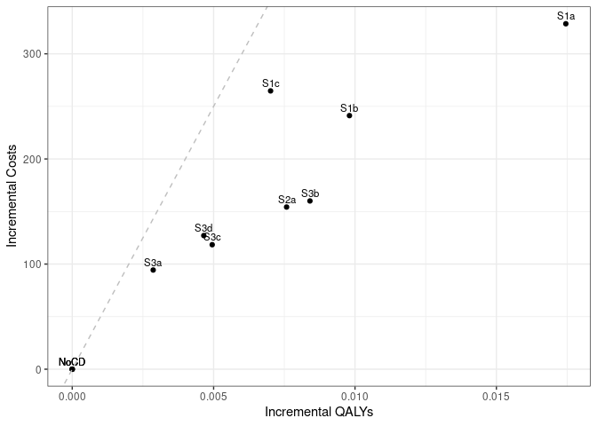

Sensitivity analysis: 0% Discount Rate
================
16 October, 2024

    ## 
    ## > errors<-c(
    ## +   ERR_INCORRECT_SETTING_VARIABLE=-1,
    ## +   ERR_INCORRECT_VECTOR_SIZE=-2,
    ## +   ERR_INCORRECT_INPUT_VAR=-3,
    ## +   ERR_EVENT_STACK_FULL=-4,
    ## +   .... [TRUNCATED] 
    ## 
    ## > record_mode<-c(
    ## +   record_mode_none=0,
    ## +   record_mode_agent=1,
    ## +   record_mode_event=2,
    ## +   record_mode_some_event=3
    ## + )
    ## 
    ## > agent_creation_mode<-c(
    ## +   agent_creation_mode_one=0,
    ## +   agent_creation_mode_all=1,
    ## +   agent_creation_mode_pre=2
    ## + )
    ## 
    ## > medication_classes<-c(
    ## +   MED_CLASS_SABA=1,
    ## +   MED_CLASS_LABA=2,
    ## +   MED_CLASS_LAMA=4,
    ## +   MED_CLASS_ICS=8,
    ## +   MED_CLASS_MACRO=16
    ## + )
    ## 
    ## > events<-c(
    ## +     event_start=0,
    ## +     event_fixed=1,
    ## +     event_birthday=2,
    ## +     event_smoking_change=3,
    ## +     event_COPD=4,
    ## +     event_exacerbat .... [TRUNCATED]

``` r
# CHANGE: Add a timer (will see addition below to print time too)
# Start timer
start.time <- Sys.time()
```

``` r
# CHANGE: Add save paths (will see later, we also add lines to save to csv)
outputs <- "../../outputs/Sen6_0_Discount"
files <- list(
  s1 = "s1.csv",
  s2 = "s2.csv",
  s3 = "s3.csv",
  sall = "sall.csv",
  ceplane = "ceplane.csv",
  clinical = "clinicalresults.csv"
)

# Apply to each element in list to create path to file in outputs
paths <- lapply(files, function(filename) paste0(outputs, filename))
```

    ## Initializing the session

    ## [1] 0

**Global inputs:**

  - Medication adherence is 0.7
  - Smoking adherence is 0.7
  - Cost discounting: 0.015
  - QALY discounting: 0.015
  - Time horizon: 20
  - The WTP threshold for NMB is 50000

**Case detection inputs:**

  - Case detection occurs at 3 year intervals.
  - An outpatient diagnosis costs 61.18
  - The utility gain due to symptom relief from treatment is 0.0367

## S1 All patients scenario

All patients are eligible. The cost of case detection is:

| None | CDQ17 | FlowMeter | FlowMeter\_CDQ |
| ---: | ----: | --------: | -------------: |
|    0 | 11.56 |     30.46 |          42.01 |

#### S1NoCD: No Case detection

    ## [1] 0

    ## Terminating the session

    ## [1] 0

#### S1NoCD2: No Case detection- Other time interval

    ## Initializing the session

    ## [1] 0

    ## [1] 0

    ## Terminating the session

    ## [1] 0

#### S1A: CDQ ≥17 points

    ## Initializing the session

    ## [1] 0

    ## [1] 0

    ## Terminating the session

    ## [1] 0

#### S1B: Screening Spirometry with BD

    ## Initializing the session

    ## [1] 0

    ## [1] 0

    ## Terminating the session

    ## [1] 0

#### S1C: CDQ ≥17 points and Screening Spirometry with BD

    ## Initializing the session

    ## [1] 0

    ## [1] 0

    ## Terminating the session

    ## [1] 0

| Scenario  |   Agents | PatientYears |   CopdPYs | NCaseDetections | DiagnosedPYs | OverdiagnosedPYs |  SABA |  LAMA | LAMALABA | ICSLAMALABA |     Mild | Moderate |  Severe | VerySevere | MildPY | ModeratePY | SeverePY | VerySeverePY |     NoCOPD |    GOLD1 |    GOLD2 |    GOLD3 |   GOLD4 |         Cost | CostpAgent |       QALY | QALYpAgent |      NMB | IncrementalCosts | IncrementalQALY |     ICER | IncrementalNMB |
| :-------- | -------: | -----------: | --------: | --------------: | -----------: | ---------------: | ----: | ----: | -------: | ----------: | -------: | -------: | ------: | ---------: | -----: | ---------: | -------: | -----------: | ---------: | -------: | -------: | -------: | ------: | -----------: | ---------: | ---------: | ---------: | -------: | ---------------: | --------------: | -------: | -------------: |
| S1NoCD    | 74388747 |   1251903576 | 142277086 |       381929878 |     26336153 |         26747209 | 0.017 | 0.135 |    0.151 |       0.080 | 30809289 |  5766720 | 9701609 |   839538.0 |  0.217 |      0.041 |    0.068 |        0.006 | 1054811684 | 57697202 | 61465410 | 13763906 | 2389153 | 185724530860 |   2496.675 | 1059845409 |     14.247 | 709872.8 |            0.000 |           0.000 |      NaN |          0.000 |
| S1NoCD2   | 74388425 |   1251968458 | 142302175 |       249329256 |     26636736 |         32661650 | 0.021 | 0.136 |    0.151 |       0.080 | 30801067 |  5759155 | 9700407 |   837363.0 |  0.216 |      0.040 |    0.068 |        0.006 | 1054852003 | 57672835 | 61488796 | 13791895 | 2388663 | 186033235253 |   2500.836 | 1059900380 |     14.248 | 709908.6 |            0.000 |           0.000 |      NaN |          0.000 |
| S1NoCDAvg | 74388586 |   1251936017 | 142289630 |       315629567 |     26486444 |         29704430 | 0.019 | 0.136 |    0.151 |       0.080 | 30805178 |  5762938 | 9701008 |   838450.5 |  0.216 |      0.041 |    0.068 |        0.006 | 1054831844 | 57685018 | 61477103 | 13777900 | 2388908 | 185878883057 |   2498.755 | 1059872895 |     14.248 | 709890.7 |            0.000 |           0.000 |      NaN |          0.000 |
| S1a       | 74380275 |   1252107231 | 142568770 |       372100831 |     66270673 |         26745802 | 0.026 | 0.159 |    0.310 |       0.094 | 29815042 |  5625494 | 9500837 |   824680.0 |  0.209 |      0.039 |    0.067 |        0.006 | 1054730269 | 57758498 | 61574433 | 13835312 | 2423951 | 210298062989 |   2827.336 | 1061052827 |     14.265 | 710434.9 |          330.661 |           0.018 | 18518.39 |        562.130 |
| S1b       | 74383024 |   1252030978 | 142410670 |       376764647 |     47607118 |         26748888 | 0.022 | 0.148 |    0.241 |       0.088 | 30192660 |  5683507 | 9596337 |   830158.0 |  0.212 |      0.040 |    0.067 |        0.006 | 1054810413 | 57710159 | 61499603 | 13827904 | 2405886 | 203807677144 |   2739.976 | 1060522850 |     14.258 | 710139.7 |          243.301 |           0.010 | 23844.45 |        266.882 |
| S1c       | 74393892 |   1252166867 | 142379318 |       378416895 |     41063274 |         26758496 | 0.020 | 0.144 |    0.214 |       0.085 | 30350312 |  5702044 | 9621386 |   828456.0 |  0.213 |      0.040 |    0.068 |        0.006 | 1054965444 | 57726777 | 61483651 | 13803995 | 2400849 | 205585395446 |   2763.471 | 1060470315 |     14.255 | 709976.7 |          266.796 |           0.007 | 35982.42 |        103.935 |

*Treatment rate:* SABA is expressed per all patient-years, LAMA,
LAMA/LABA, ICS/LAMA/LABA are per COPD patient-years *Exacerbations:*
Total exacerbations and rate per COPD patient-year: *GOLD Stage:*
Cumulative patient-years *Cost/QALY:* Total cost and QALYs *NMB:* Net
Monetary Benefit is calculated as QALY per patient-year \* Lamba - Cost
per patient-year

-----

## S2 Symptomatic patients scenario

Patients with symptoms at year 1 are eligible. The cost of case
detection is:

    ## Initializing the session

    ## [1] 0

| None | FlowMeter |
| ---: | --------: |
|    0 |     24.33 |

#### S2NoCD: No Case detection

    ## [1] 0

    ## Terminating the session

    ## [1] 0

#### S2a: Screening Spirometry without BD

    ## Initializing the session

    ## [1] 0

    ## [1] 0

    ## Terminating the session

    ## [1] 0

| Scenario |   Agents | PatientYears |   CopdPYs | NCaseDetections | DiagnosedPYs | OverdiagnosedPYs |  SABA |  LAMA | LAMALABA | ICSLAMALABA |     Mild | Moderate |  Severe | VerySevere | MildPY | ModeratePY | SeverePY | VerySeverePY |    NoCOPD |    GOLD1 |    GOLD2 |    GOLD3 |   GOLD4 |         Cost | CostpAgent |      QALY | QALYpAgent |      NMB | IncrementalCosts | IncrementalQALY |     ICER | IncrementalNMB |
| :------- | -------: | -----------: | --------: | --------------: | -----------: | ---------------: | ----: | ----: | -------: | ----------: | -------: | -------: | ------: | ---------: | -----: | ---------: | -------: | -----------: | --------: | -------: | -------: | -------: | ------: | -----------: | ---------: | --------: | ---------: | -------: | ---------------: | --------------: | -------: | -------------: |
| S2NoCD   | 44156404 |    729084497 | 100330760 |       221928932 |     19330952 |         15481473 | 0.017 | 0.142 |    0.159 |       0.087 | 22917076 |  4253860 | 7098458 |     609501 |  0.228 |      0.042 |    0.071 |        0.006 | 597619551 | 37246010 | 44990133 | 11123560 | 2050468 | 136124332103 |   3082.777 | 614729143 |     13.922 | 692998.8 |            0.000 |           0.000 |      NaN |          0.000 |
| S2a      | 44164773 |    729329891 | 100492049 |       217625447 |     37010683 |         15485858 | 0.023 | 0.157 |    0.269 |       0.097 | 22383331 |  4181008 | 7006346 |     603148 |  0.223 |      0.042 |    0.070 |        0.006 | 597700094 | 37284225 | 45068617 | 11147317 | 2064302 | 147612114724 |   3342.304 | 615416266 |     13.935 | 693385.2 |          259.528 |           0.013 | 20087.16 |        386.476 |

*Treatment rate:* SABA is expressed per all patient-years, LAMA,
LAMA/LABA, ICS/LAMA/LABA are per COPD patient-years *Exacerbations:*
Total exacerbations and rate per COPD patient-year: *GOLD Stage:*
Cumulative patient-years *Cost/QALY:* Total cost and QALYs *NMB:* Net
Monetary Benefit is calculated as QALY per patient-year \* Lamba - Cost
per patient-year

-----

## S3 Smoking history scenario

Ever smokers ≥50 years of age are eligible. The cost of case detection
is:

    ## Initializing the session

    ## [1] 0

| None | CDQ195 | CDQ165 | FlowMeter | FlowMeter\_CDQ |
| ---: | -----: | -----: | --------: | -------------: |
|    0 |  11.56 |  11.56 |     24.33 |          42.01 |

#### S3NoCD: No Case detection

    ## [1] 0

    ## Terminating the session

    ## [1] 0

#### S3a: CDQ ≥19.5 points

    ## Initializing the session

    ## [1] 0

    ## [1] 0

    ## Terminating the session

    ## [1] 0

#### S3b: CDQ ≥16.5 points

    ## Initializing the session

    ## [1] 0

    ## [1] 0

    ## Terminating the session

    ## [1] 0

#### S3c: Screening spirometry without BD

    ## Initializing the session

    ## [1] 0

    ## [1] 0

    ## Terminating the session

    ## [1] 0

#### S3d: Screening Spirometry with BD + CDQ ≥17 points

    ## Initializing the session

    ## [1] 0

    ## [1] 0

    ## Terminating the session

    ## [1] 0

| Scenario |   Agents | PatientYears |  CopdPYs | NCaseDetections | DiagnosedPYs | OverdiagnosedPYs |  SABA |  LAMA | LAMALABA | ICSLAMALABA |     Mild | Moderate |  Severe | VerySevere | MildPY | ModeratePY | SeverePY | VerySeverePY |    NoCOPD |    GOLD1 |    GOLD2 |   GOLD3 |   GOLD4 |         Cost | CostpAgent |      QALY | QALYpAgent |      NMB | IncrementalCosts | IncrementalQALY |     ICER | IncrementalNMB |
| :------- | -------: | -----------: | -------: | --------------: | -----------: | ---------------: | ----: | ----: | -------: | ----------: | -------: | -------: | ------: | ---------: | -----: | ---------: | -------: | -----------: | --------: | -------: | -------: | ------: | ------: | -----------: | ---------: | --------: | ---------: | -------: | ---------------: | --------------: | -------: | -------------: |
| S3NoCD   | 34500334 |    520264617 | 83469550 |       160191877 |     15617539 |         11630123 | 0.018 | 0.137 |    0.154 |       0.086 | 19525292 |  3631989 | 6073558 |     522424 |  0.234 |      0.044 |    0.073 |        0.006 | 415002016 | 30608834 | 37422882 | 9624470 | 1788687 | 115393106844 |   3344.695 | 437057823 |     12.668 | 630066.3 |            0.000 |           0.000 |      NaN |          0.000 |
| S3a      | 34507415 |    520428951 | 83482576 |       158676520 |     22030098 |         11639538 | 0.021 | 0.144 |    0.204 |       0.091 | 19287934 |  3609226 | 6045313 |     521405 |  0.231 |      0.043 |    0.072 |        0.006 | 415152628 | 30610103 | 37407716 | 9641236 | 1794702 | 122423689898 |   3547.750 | 437381358 |     12.675 | 630202.1 |          203.055 |           0.007 | 29965.58 |        135.759 |
| S3b      | 34499539 |    520396932 | 83618002 |       155590263 |     34428826 |         11625591 | 0.027 | 0.156 |    0.293 |       0.099 | 18988453 |  3564625 | 5980823 |     516662 |  0.227 |      0.043 |    0.072 |        0.006 | 414988556 | 30607762 | 37472866 | 9688489 | 1813970 | 127296658689 |   3689.808 | 437670761 |     12.686 | 630624.1 |          345.112 |           0.018 | 19110.81 |        557.812 |
| S3c      | 34496334 |    520227370 | 83568351 |       157099275 |     28171361 |         11622564 | 0.024 | 0.150 |    0.249 |       0.095 | 19145218 |  3585036 | 6010150 |     518449 |  0.229 |      0.043 |    0.072 |        0.006 | 414875686 | 30589301 | 37479876 | 9661353 | 1804425 | 124195481660 |   3600.252 | 437363546 |     12.679 | 630327.3 |          255.556 |           0.010 | 24735.86 |        261.014 |
| S3d      | 34507664 |    520495018 | 83555471 |       157877292 |     25364366 |         11630839 | 0.023 | 0.147 |    0.229 |       0.093 | 19209915 |  3595849 | 6028084 |     520340 |  0.230 |      0.043 |    0.072 |        0.006 | 415141325 | 30594930 | 37472224 | 9653084 | 1805226 | 124862452609 |   3618.398 | 437518342 |     12.679 | 630325.3 |          273.702 |           0.011 | 25688.98 |        259.021 |

*Treatment rate:* SABA is expressed per all patient-years, LAMA,
LAMA/LABA, ICS/LAMA/LABA are per COPD patient-years *Exacerbations:*
Total exacerbations and rate per COPD patient-year *GOLD Stage:*
Cumulative patient-years *Cost/QALY:* Total cost and QALYs *NMB:* Net
Monetary Benefit is calculated as QALY per patient-year \* Lamba - Cost
per patient-year

-----

## All Scenarios

*Ordered by descending Net Monetary Benefit*

| Scenario |   Agents |         Cost | CostpAgent |       QALY | QALYpAgent |     ICER | IncrementalNMB |
| :------- | -------: | -----------: | ---------: | ---------: | ---------: | -------: | -------------: |
| S1a      | 74380275 | 210298062989 |   2827.336 | 1061052827 |     14.265 | 18518.39 |        562.130 |
| S3b      | 34499539 | 127296658689 |   3689.808 |  437670761 |     12.686 | 19110.81 |        557.812 |
| S2a      | 44164773 | 147612114724 |   3342.304 |  615416266 |     13.935 | 20087.16 |        386.476 |
| S1b      | 74383024 | 203807677144 |   2739.976 | 1060522850 |     14.258 | 23844.45 |        266.882 |
| S3c      | 34496334 | 124195481660 |   3600.252 |  437363546 |     12.679 | 24735.86 |        261.014 |
| S3d      | 34507664 | 124862452609 |   3618.398 |  437518342 |     12.679 | 25688.98 |        259.021 |
| S3a      | 34507415 | 122423689898 |   3547.750 |  437381358 |     12.675 | 29965.58 |        135.759 |
| S1c      | 74393892 | 205585395446 |   2763.471 | 1060470315 |     14.255 | 35982.42 |        103.935 |
| S1NoCD   | 74388747 | 185724530860 |   2496.675 | 1059845409 |     14.247 |      NaN |          0.000 |
| S2NoCD   | 44156404 | 136124332103 |   3082.777 |  614729143 |     13.922 |      NaN |          0.000 |
| S3NoCD   | 34500334 | 115393106844 |   3344.695 |  437057823 |     12.668 |      NaN |          0.000 |

-----

## Cost Effectiveness Plane

Adjusted to the total population

| Scenario  |   Agents | PropAgents |         Cost | CostpAgent | CostpAgentExcluded | CostpAgentAll |       QALY | QALYpAgent | QALYpAgentExcluded | QALYpAgentAll | IncrementalCosts | IncrementalQALY |  ICERAdj |     ICER |      INMB |
| :-------- | -------: | ---------: | -----------: | ---------: | -----------------: | ------------: | ---------: | ---------: | -----------------: | ------------: | ---------------: | --------------: | -------: | -------: | --------: |
| S1NoCDAvg | 74388586 |  1.0000000 | 185878883057 |   2498.755 |              0.000 |      2498.755 | 1059872895 |   14.24779 |            0.00000 |      14.24779 |          0.00000 |       0.0000000 |      NaN |      NaN |   0.00000 |
| S1a       | 74380275 |  1.0000000 | 210298062989 |   2827.336 |              0.000 |      2827.336 | 1061052827 |   14.26524 |            0.00000 |      14.26524 |        328.58103 |       0.0174555 | 18823.91 | 18518.39 | 544.19487 |
| S1b       | 74383024 |  1.0000000 | 203807677144 |   2739.976 |              0.000 |      2739.976 | 1060522850 |   14.25759 |            0.00000 |      14.25759 |        241.22026 |       0.0098033 | 24605.92 | 23844.45 | 248.94679 |
| S1c       | 74393892 |  1.0000000 | 205585395446 |   2763.471 |              0.000 |      2763.471 | 1060470315 |   14.25480 |            0.00000 |      14.25480 |        264.71601 |       0.0070143 | 37739.41 | 35982.42 |  85.99958 |
| S2NoCD    | 44156404 |  0.5935911 | 136124332103 |   3082.777 |           1645.748 |      2498.755 |  614729143 |   13.92163 |           14.72417 |      14.24779 |          0.00000 |       0.0000000 |      NaN |      NaN |   0.00000 |
| S2a       | 44164773 |  0.5937036 | 147612114724 |   3342.304 |           1645.748 |      2653.000 |  615416266 |   13.93455 |           14.72417 |      14.25537 |        154.24422 |       0.0075804 | 20347.74 | 20087.16 | 224.77627 |
| S3NoCD    | 34500334 |  0.4637853 | 115393106844 |   3344.695 |           1767.081 |      2498.755 |  437057823 |   12.66822 |           15.61400 |      14.24779 |          0.00000 |       0.0000000 |      NaN |      NaN |   0.00000 |
| S3a       | 34507415 |  0.4638805 | 122423689898 |   3547.750 |           1767.081 |      2593.099 |  437381358 |   12.67500 |           15.61400 |      14.25065 |         94.34338 |       0.0028630 | 32952.94 | 29965.58 |  48.80527 |
| S3b       | 34499539 |  0.4637746 | 127296658689 |   3689.808 |           1767.081 |      2658.793 |  437670761 |   12.68628 |           15.61400 |      14.25620 |        160.03741 |       0.0084065 | 19037.24 | 19110.82 | 260.28980 |
| S3c       | 34496334 |  0.4637315 | 124195481660 |   3600.252 |           1767.081 |      2617.180 |  437363546 |   12.67855 |           15.61400 |      14.25274 |        118.42466 |       0.0049494 | 23927.08 | 24735.86 | 129.04529 |
| S3d       | 34507664 |  0.4638839 | 124862452609 |   3618.398 |           1767.081 |      2625.877 |  437518342 |   12.67887 |           15.61400 |      14.25244 |        127.12156 |       0.0046522 | 27325.23 | 25688.98 | 105.48684 |

<!-- -->

## Clinical Results for all scenarios

Adjusted to the total population

| Scenario  | PropAgents | ProppPatientYears | ProppCopdPYs |   SABAAll |   LAMAAll | LAMALABAAll | ICSLAMALABAAll | MildpAgentAll | ModeratepAgentAll | SeverepAgentAll | VerySeverepAgentAll | NoCOPDpPYAll | GOLD1pPYAll | GOLD2pPYAll | GOLD3pPYAll | GOLD4pPYAll | DiagnosedpPYAll |
| :-------- | ---------: | ----------------: | -----------: | --------: | --------: | ----------: | -------------: | ------------: | ----------------: | --------------: | ------------------: | -----------: | ----------: | ----------: | ----------: | ----------: | --------------: |
| S1NoCDAvg |  1.0000000 |         1.0000000 |    1.0000000 | 0.0190054 | 0.1355252 |   0.1513708 |      0.0796683 |     0.4141116 |         0.0774707 |       0.1304099 |           0.0112712 |    0.8425605 |   0.0460767 |   0.0491056 |   0.0110053 |   0.0019082 |       0.1861446 |
| S1a       |  1.0000000 |         1.0000000 |    1.0000000 | 0.0264033 | 0.1593018 |   0.3099946 |      0.0940914 |     0.4008461 |         0.0756315 |       0.1277333 |           0.0110873 |    0.8423642 |   0.0461290 |   0.0491766 |   0.0110496 |   0.0019359 |       0.4648330 |
| S1b       |  1.0000000 |         1.0000000 |    1.0000000 | 0.0216398 | 0.1482342 |   0.2406521 |      0.0877947 |     0.4059079 |         0.0764087 |       0.1290125 |           0.0111606 |    0.8424795 |   0.0460932 |   0.0491199 |   0.0110444 |   0.0019216 |       0.3342946 |
| S1c       |  1.0000000 |         1.0000000 |    1.0000000 | 0.0201517 | 0.1441110 |   0.2141912 |      0.0851720 |     0.4079678 |         0.0766467 |       0.1293303 |           0.0111361 |    0.8425119 |   0.0461015 |   0.0491018 |   0.0110241 |   0.0019174 |       0.2884076 |
| S2NoCD    |  0.5935911 |         0.5823656 |    0.7051165 | 0.0190054 | 0.1355252 |   0.1513708 |      0.0796683 |     0.4141116 |         0.0774707 |       0.1304099 |           0.0112712 |    0.8425605 |   0.0460767 |   0.0491056 |   0.0110053 |   0.0019082 |       0.1861446 |
| S2a       |  0.5937036 |         0.5825616 |    0.7062500 | 0.0223572 | 0.1465203 |   0.2287835 |      0.0867962 |     0.4069072 |         0.0764858 |       0.1291620 |           0.0111850 |    0.8424534 |   0.0460995 |   0.0491621 |   0.0110233 |   0.0019191 |       0.3102030 |
| S3NoCD    |  0.4637853 |         0.4155681 |    0.5866172 | 0.0190054 | 0.1355252 |   0.1513708 |      0.0796683 |     0.4141116 |         0.0774707 |       0.1304099 |           0.0112712 |    0.8425605 |   0.0460767 |   0.0491056 |   0.0110053 |   0.0019082 |       0.1861446 |
| S3a       |  0.4638805 |         0.4156993 |    0.5867088 | 0.0201156 | 0.1395918 |   0.1808230 |      0.0824771 |     0.4108939 |         0.0771596 |       0.1300215 |           0.0112568 |    0.8425660 |   0.0460728 |   0.0490892 |   0.0110179 |   0.0019129 |       0.2311946 |
| S3b       |  0.4637746 |         0.4156737 |    0.5876605 | 0.0227032 | 0.1471017 |   0.2332507 |      0.0873282 |     0.4068980 |         0.0765657 |       0.1291642 |           0.0111939 |    0.8424573 |   0.0460719 |   0.0491421 |   0.0110558 |   0.0019283 |       0.3181560 |
| S3c       |  0.4637315 |         0.4155383 |    0.5873116 | 0.0213262 | 0.1432680 |   0.2074859 |      0.0848645 |     0.4090175 |         0.0768424 |       0.1295624 |           0.0112182 |    0.8424856 |   0.0460621 |   0.0491521 |   0.0110349 |   0.0019208 |       0.2742435 |
| S3d       |  0.4638839 |         0.4157521 |    0.5872211 | 0.0207546 | 0.1415673 |   0.1954816 |      0.0837051 |     0.4098442 |         0.0769796 |       0.1297896 |           0.0112424 |    0.8425108 |   0.0460587 |   0.0491390 |   0.0110271 |   0.0019212 |       0.2545329 |

## Time elapsed

Run time for this notebook:

``` r
end.time <- Sys.time()
time.taken <- end.time - start.time
time.taken
```

    ## Time difference of 1.148049 days
