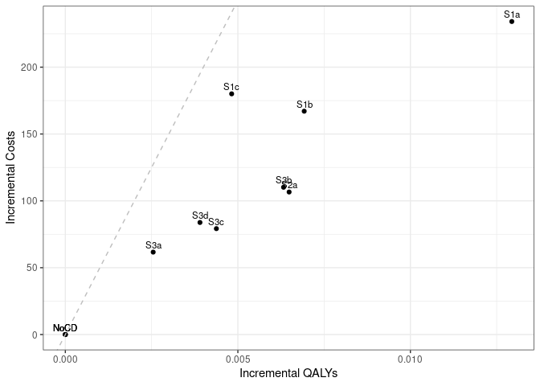

Sensitivity analysis: 0% Discount Rate
================
15 October, 2024

    ## 
    ## > errors<-c(
    ## +   ERR_INCORRECT_SETTING_VARIABLE=-1,
    ## +   ERR_INCORRECT_VECTOR_SIZE=-2,
    ## +   ERR_INCORRECT_INPUT_VAR=-3,
    ## +   ERR_EVENT_STACK_FULL=-4,
    ## +   .... [TRUNCATED] 
    ## 
    ## > record_mode<-c(
    ## +   record_mode_none=0,
    ## +   record_mode_agent=1,
    ## +   record_mode_event=2,
    ## +   record_mode_some_event=3
    ## + )
    ## 
    ## > agent_creation_mode<-c(
    ## +   agent_creation_mode_one=0,
    ## +   agent_creation_mode_all=1,
    ## +   agent_creation_mode_pre=2
    ## + )
    ## 
    ## > medication_classes<-c(
    ## +   MED_CLASS_SABA=1,
    ## +   MED_CLASS_LABA=2,
    ## +   MED_CLASS_LAMA=4,
    ## +   MED_CLASS_ICS=8,
    ## +   MED_CLASS_MACRO=16
    ## + )
    ## 
    ## > events<-c(
    ## +     event_start=0,
    ## +     event_fixed=1,
    ## +     event_birthday=2,
    ## +     event_smoking_change=3,
    ## +     event_COPD=4,
    ## +     event_exacerbat .... [TRUNCATED]

``` r
# CHANGE: Add a timer (will see addition below to print time too)
# Start timer
start.time <- Sys.time()
```

``` r
# CHANGE: Add save paths (will see later, we also add lines to save to csv)
outputs <- "../../outputs/Sen6_0_Discount"
files <- list(
  s1 = "s1_5y.csv",
  s2 = "s2_5y.csv",
  s3 = "s3_5y.csv",
  sall = "sall_5y.csv",
  ceplane = "ceplane_5y.csv",
  clinical = "clinicalresults_5y.csv"
)

# Apply to each element in list to create path to file in outputs
paths <- lapply(files, function(filename) paste0(outputs, filename))
```

    ## Initializing the session

    ## [1] 0

**Global inputs:**

  - Medication adherence is 0.7
  - Smoking adherence is 0.7
  - Cost discounting: 0.015
  - QALY discounting: 0.015
  - Time horizon: 20
  - The WTP threshold for NMB is 50000

**Case detection inputs:**

  - Case detection occurs at 5 year intervals.
  - An outpatient diagnosis costs 61.18
  - The utility gain due to symptom relief from treatment is 0.0367

## S1 All patients scenario

All patients are eligible. The cost of case detection is:

| None | CDQ17 | FlowMeter | FlowMeter\_CDQ |
| ---: | ----: | --------: | -------------: |
|    0 | 11.56 |     30.46 |          42.01 |

#### S1NoCD2: No Case detection- Other time interval

    ## [1] 0

    ## Terminating the session

    ## [1] 0

#### S1NoCD: No Case detection

    ## Initializing the session

    ## [1] 0

    ## [1] 0

    ## Terminating the session

    ## [1] 0

#### S1A: CDQ ≥17 points

    ## Initializing the session

    ## [1] 0

    ## [1] 0

    ## Terminating the session

    ## [1] 0

#### S1B: Screening Spirometry with BD

    ## Initializing the session

    ## [1] 0

    ## [1] 0

    ## Terminating the session

    ## [1] 0

#### S1C: CDQ ≥17 points and Screening Spirometry with BD

    ## Initializing the session

    ## [1] 0

    ## [1] 0

    ## Terminating the session

    ## [1] 0

| Scenario  |   Agents | PatientYears |  CopdPYs | NCaseDetections | DiagnosedPYs | OverdiagnosedPYs |  SABA |  LAMA | LAMALABA | ICSLAMALABA |     Mild | Moderate |  Severe | VerySevere | MildPY | ModeratePY | SeverePY | VerySeverePY |    NoCOPD |    GOLD1 |    GOLD2 |   GOLD3 |   GOLD4 |         Cost | CostpAgent |      QALY | QALYpAgent |      NMB | IncrementalCosts | IncrementalQALY |     ICER | IncrementalNMB |
| :-------- | -------: | -----------: | -------: | --------------: | -----------: | ---------------: | ----: | ----: | -------: | ----------: | -------: | -------: | ------: | ---------: | -----: | ---------: | -------: | -----------: | --------: | -------: | -------: | ------: | ------: | -----------: | ---------: | --------: | ---------: | -------: | ---------------: | --------------: | -------: | -------------: |
| S1NoCD2   | 37196486 |    625953636 | 71118021 |       190966216 |     13166456 |         13371458 | 0.017 | 0.135 |    0.151 |       0.080 | 15396892 |  2883299 | 4850541 |     419077 |  0.216 |      0.041 |    0.068 |        0.006 | 527427474 | 28845970 | 30727603 | 6872520 | 1191666 |  92827349205 |   2495.595 | 529928095 |     14.247 | 709840.6 |            0.000 |           0.000 |      NaN |          0.000 |
| S1NoCD    | 37197623 |    626035666 | 71126460 |       124680042 |     13292032 |         16339249 | 0.021 | 0.135 |    0.151 |       0.080 | 15386115 |  2878926 | 4849649 |     418845 |  0.216 |      0.040 |    0.068 |        0.006 | 527498259 | 28860429 | 30702229 | 6887202 | 1198050 |  92978309019 |   2499.577 | 529999539 |     14.248 | 709910.9 |            0.000 |           0.000 |      NaN |          0.000 |
| S1NoCDAvg | 37197054 |    625994651 | 71122240 |       157823129 |     13229244 |         14855354 | 0.019 | 0.135 |    0.151 |       0.080 | 15391504 |  2881112 | 4850095 |     418961 |  0.216 |      0.041 |    0.068 |        0.006 | 527462866 | 28853200 | 30714916 | 6879861 | 1194858 |  92902829112 |   2497.586 | 529963817 |     14.247 | 709875.8 |            0.000 |           0.000 |      NaN |          0.000 |
| S1a       | 37197502 |    626089853 | 71222084 |       122776626 |     28487983 |         16327137 | 0.028 | 0.154 |    0.273 |       0.091 | 14992350 |  2827989 | 4776515 |     413886 |  0.211 |      0.040 |    0.067 |        0.006 | 527456443 | 28870190 | 30752817 | 6907934 | 1206659 | 101593628148 |   2731.195 | 530443727 |     14.260 | 710278.7 |          231.618 |           0.012 | 19321.34 |        367.766 |
| S1b       | 37190655 |    625992698 | 71214502 |       123717512 |     20974578 |         16327973 | 0.024 | 0.145 |    0.216 |       0.086 | 15197291 |  2852978 | 4811387 |     417126 |  0.213 |      0.040 |    0.068 |        0.006 | 527372066 | 28861102 | 30747408 | 6915037 | 1207305 |  99147551251 |   2665.926 | 530160006 |     14.255 | 710093.8 |          166.350 |           0.007 | 23817.89 |        182.862 |
| S1c       | 37195162 |    626110982 | 71210037 |       124047387 |     18535585 |         16324587 | 0.023 | 0.142 |    0.196 |       0.084 | 15221449 |  2863867 | 4834566 |     417049 |  0.214 |      0.040 |    0.068 |        0.006 | 527490541 | 28868640 | 30764128 | 6896850 | 1196858 |  99801217926 |   2683.177 | 530199955 |     14.255 | 710043.9 |          183.601 |           0.006 | 29000.47 |        132.947 |

*Treatment rate:* SABA is expressed per all patient-years, LAMA,
LAMA/LABA, ICS/LAMA/LABA are per COPD patient-years *Exacerbations:*
Total exacerbations and rate per COPD patient-year: *GOLD Stage:*
Cumulative patient-years *Cost/QALY:* Total cost and QALYs *NMB:* Net
Monetary Benefit is calculated as QALY per patient-year \* Lamba - Cost
per patient-year

-----

## S2 Symptomatic patients scenario

Patients with symptoms at year 1 are eligible. The cost of case
detection is:

    ## Initializing the session

    ## [1] 0

| None | FlowMeter |
| ---: | --------: |
|    0 |     24.33 |

#### S2NoCD: No Case detection

    ## [1] 0

    ## Terminating the session

    ## [1] 0

#### S2a: Screening Spirometry without BD

    ## Initializing the session

    ## [1] 0

    ## [1] 0

    ## Terminating the session

    ## [1] 0

| Scenario |   Agents | PatientYears |  CopdPYs | NCaseDetections | DiagnosedPYs | OverdiagnosedPYs |  SABA |  LAMA | LAMALABA | ICSLAMALABA |     Mild | Moderate |  Severe | VerySevere | MildPY | ModeratePY | SeverePY | VerySeverePY |    NoCOPD |    GOLD1 |    GOLD2 |   GOLD3 |   GOLD4 |        Cost | CostpAgent |      QALY | QALYpAgent |      NMB | IncrementalCosts | IncrementalQALY |     ICER | IncrementalNMB |
| :------- | -------: | -----------: | -------: | --------------: | -----------: | ---------------: | ----: | ----: | -------: | ----------: | -------: | -------: | ------: | ---------: | -----: | ---------: | -------: | -----------: | --------: | -------: | -------: | ------: | ------: | ----------: | ---------: | --------: | ---------: | -------: | ---------------: | --------------: | -------: | -------------: |
| S2NoCD   | 22074342 |    364499893 | 50179989 |        72492409 |      9769650 |          9434235 | 0.021 | 0.142 |    0.160 |       0.087 | 11472370 |  2126666 | 3551252 |     304704 |  0.229 |      0.042 |    0.071 |        0.006 | 298757005 | 18626945 | 22501053 | 5562438 | 1027303 | 68198452610 |   3089.490 | 307327847 |     13.922 | 693030.6 |            0.000 |           0.000 |      NaN |          0.000 |
| S2a      | 22077777 |    364514086 | 50214779 |        71673455 |     16290550 |          9435494 | 0.025 | 0.153 |    0.241 |       0.095 | 11245330 |  2100490 | 3507989 |     302346 |  0.224 |      0.042 |    0.070 |        0.006 | 298734836 | 18629376 | 22530917 | 5562183 | 1028646 | 72055390304 |   3263.707 | 307521349 |     13.929 | 693186.3 |          174.217 |           0.007 | 26402.81 |        155.704 |

*Treatment rate:* SABA is expressed per all patient-years, LAMA,
LAMA/LABA, ICS/LAMA/LABA are per COPD patient-years *Exacerbations:*
Total exacerbations and rate per COPD patient-year: *GOLD Stage:*
Cumulative patient-years *Cost/QALY:* Total cost and QALYs *NMB:* Net
Monetary Benefit is calculated as QALY per patient-year \* Lamba - Cost
per patient-year

-----

## S3 Smoking history scenario

Ever smokers ≥50 years of age are eligible. The cost of case detection
is:

    ## Initializing the session

    ## [1] 0

| None | CDQ195 | CDQ165 | FlowMeter | FlowMeter\_CDQ |
| ---: | -----: | -----: | --------: | -------------: |
|    0 |  11.56 |  11.56 |     24.33 |          42.01 |

#### S3NoCD: No Case detection

    ## [1] 0

    ## Terminating the session

    ## [1] 0

#### S3a: CDQ ≥19.5 points

    ## Initializing the session

    ## [1] 0

    ## [1] 0

    ## Terminating the session

    ## [1] 0

#### S3b: CDQ ≥16.5 points

    ## Initializing the session

    ## [1] 0

    ## [1] 0

    ## Terminating the session

    ## [1] 0

#### S3c: Screening spirometry without BD

    ## Initializing the session

    ## [1] 0

    ## [1] 0

    ## Terminating the session

    ## [1] 0

#### S3d: Screening Spirometry with BD + CDQ ≥17 points

    ## Initializing the session

    ## [1] 0

    ## [1] 0

    ## Terminating the session

    ## [1] 0

| Scenario |   Agents | PatientYears |  CopdPYs | NCaseDetections | DiagnosedPYs | OverdiagnosedPYs |  SABA |  LAMA | LAMALABA | ICSLAMALABA |    Mild | Moderate |  Severe | VerySevere | MildPY | ModeratePY | SeverePY | VerySeverePY |    NoCOPD |    GOLD1 |    GOLD2 |   GOLD3 |  GOLD4 |        Cost | CostpAgent |      QALY | QALYpAgent |      NMB | IncrementalCosts | IncrementalQALY |     ICER | IncrementalNMB |
| :------- | -------: | -----------: | -------: | --------------: | -----------: | ---------------: | ----: | ----: | -------: | ----------: | ------: | -------: | ------: | ---------: | -----: | ---------: | -------: | -----------: | --------: | -------: | -------: | ------: | -----: | ----------: | ---------: | --------: | ---------: | -------: | ---------------: | --------------: | -------: | -------------: |
| S3NoCD   | 17254548 |    260185517 | 41753987 |        52456874 |      7922835 |          7061036 | 0.022 | 0.137 |    0.155 |       0.086 | 9767617 |  1818208 | 3040076 |     262205 |  0.234 |      0.044 |    0.073 |        0.006 | 207533583 | 15301679 | 18724752 | 4815426 | 897482 | 57864310924 |   3353.569 | 218572819 |     12.668 | 630023.8 |            0.000 |           0.000 |      NaN |          0.000 |
| S3a      | 17251608 |    260177738 | 41735217 |        52193377 |     10112286 |          7056308 | 0.024 | 0.142 |    0.189 |       0.089 | 9673981 |  1809610 | 3026757 |     259927 |  0.232 |      0.043 |    0.073 |        0.006 | 207543323 | 15307443 | 18697708 | 4818609 | 897810 | 60089152168 |   3483.104 | 218633446 |     12.673 | 630178.0 |          129.536 |           0.006 | 22833.54 |        154.117 |
| S3b      | 17246874 |    260180750 | 41770771 |        51592135 |     14901907 |          7060341 | 0.029 | 0.152 |    0.258 |       0.096 | 9537491 |  1786791 | 3000373 |     258790 |  0.228 |      0.043 |    0.072 |        0.006 | 207513062 | 15306657 | 18723252 | 4827550 | 898750 | 61869748507 |   3587.302 | 218763933 |     12.684 | 630626.0 |          233.734 |           0.017 | 13981.39 |        602.140 |
| S3c      | 17246125 |    260144350 | 41792942 |        51894923 |     12432863 |          7060467 | 0.026 | 0.147 |    0.223 |       0.093 | 9621451 |  1801612 | 3014035 |     259735 |  0.230 |      0.043 |    0.072 |        0.006 | 207459068 | 15294280 | 18748666 | 4834049 | 901039 | 60807623938 |   3525.872 | 218659412 |     12.679 | 630411.9 |          172.303 |           0.011 | 15373.49 |        388.087 |
| S3d      | 17255729 |    260233694 | 41777900 |        52047317 |     11356970 |          7062160 | 0.025 | 0.144 |    0.207 |       0.091 | 9643777 |  1802264 | 3018596 |     260225 |  0.231 |      0.043 |    0.072 |        0.006 | 207557193 | 15328896 | 18715546 | 4823282 | 894293 | 60941413668 |   3531.663 | 218712958 |     12.675 | 630208.5 |          178.094 |           0.007 | 24550.12 |        184.621 |

*Treatment rate:* SABA is expressed per all patient-years, LAMA,
LAMA/LABA, ICS/LAMA/LABA are per COPD patient-years *Exacerbations:*
Total exacerbations and rate per COPD patient-year *GOLD Stage:*
Cumulative patient-years *Cost/QALY:* Total cost and QALYs *NMB:* Net
Monetary Benefit is calculated as QALY per patient-year \* Lamba - Cost
per patient-year

-----

## All Scenarios

*Ordered by descending Net Monetary Benefit*

| Scenario |   Agents |         Cost | CostpAgent |      QALY | QALYpAgent |     ICER | IncrementalNMB |
| :------- | -------: | -----------: | ---------: | --------: | ---------: | -------: | -------------: |
| S3b      | 17246874 |  61869748507 |   3587.302 | 218763933 |     12.684 | 13981.39 |        602.140 |
| S3c      | 17246125 |  60807623938 |   3525.872 | 218659412 |     12.679 | 15373.49 |        388.087 |
| S1a      | 37197502 | 101593628148 |   2731.195 | 530443727 |     14.260 | 19321.34 |        367.766 |
| S3d      | 17255729 |  60941413668 |   3531.663 | 218712958 |     12.675 | 24550.12 |        184.621 |
| S1b      | 37190655 |  99147551251 |   2665.926 | 530160006 |     14.255 | 23817.89 |        182.862 |
| S2a      | 22077777 |  72055390304 |   3263.707 | 307521349 |     13.929 | 26402.81 |        155.704 |
| S3a      | 17251608 |  60089152168 |   3483.104 | 218633446 |     12.673 | 22833.54 |        154.117 |
| S1c      | 37195162 |  99801217926 |   2683.177 | 530199955 |     14.255 | 29000.47 |        132.947 |
| S1NoCD   | 37197623 |  92978309019 |   2499.577 | 529999539 |     14.248 |      NaN |          0.000 |
| S2NoCD   | 22074342 |  68198452610 |   3089.490 | 307327847 |     13.922 |      NaN |          0.000 |
| S3NoCD   | 17254548 |  57864310924 |   3353.569 | 218572819 |     12.668 |      NaN |          0.000 |

-----

## Cost Effectiveness Plane

Adjusted to the total population

| Scenario  |   Agents | PropAgents |         Cost | CostpAgent | CostpAgentExcluded | CostpAgentAll |      QALY | QALYpAgent | QALYpAgentExcluded | QALYpAgentAll | IncrementalCosts | IncrementalQALY |  ICERAdj |     ICER |        INMB |
| :-------- | -------: | ---------: | -----------: | ---------: | -----------------: | ------------: | --------: | ---------: | -----------------: | ------------: | ---------------: | --------------: | -------: | -------: | ----------: |
| S1NoCDAvg | 37197054 |  1.0000000 |  92902829112 |   2497.586 |              0.000 |      2497.586 | 529963817 |   14.24747 |            0.00000 |      14.24747 |          0.00000 |       0.0000000 |      NaN |      NaN |   0.0000000 |
| S1a       | 37197502 |  1.0000000 | 101593628148 |   2731.195 |              0.000 |      2731.195 | 530443727 |   14.26020 |            0.00000 |      14.26020 |        233.60927 |       0.0127303 | 18350.69 | 19321.34 | 402.9042829 |
| S1b       | 37190655 |  1.0000000 |  99147551251 |   2665.926 |              0.000 |      2665.926 | 530160006 |   14.25519 |            0.00000 |      14.25519 |        168.34082 |       0.0077268 | 21786.57 | 23817.89 | 218.0000651 |
| S1c       | 37195162 |  1.0000000 |  99801217926 |   2683.177 |              0.000 |      2683.177 | 530199955 |   14.25454 |            0.00000 |      14.25454 |        185.59176 |       0.0070735 | 26237.47 | 29000.47 | 168.0851524 |
| S2NoCD    | 22074342 |  0.5934433 |  68198452610 |   3089.490 |           1633.594 |      2497.586 | 307327847 |   13.92240 |           14.72196 |      14.24747 |          0.00000 |       0.0000000 |      NaN |      NaN |   0.0095421 |
| S2a       | 22077777 |  0.5935356 |  72055390304 |   3263.707 |           1633.594 |      2601.124 | 307521349 |   13.92900 |           14.72196 |      14.25131 |        103.53848 |       0.0038426 | 26945.14 | 26402.82 |  88.5993423 |
| S3NoCD    | 17254548 |  0.4638687 |  57864310924 |   3353.569 |           1756.977 |      2497.586 | 218572819 |   12.66755 |           15.61444 |      14.24747 |          0.00000 |       0.0000000 |      NaN |      NaN |   0.0095421 |
| S3a       | 17251608 |  0.4637896 |  60089152168 |   3483.104 |           1756.977 |      2557.537 | 218633446 |   12.67322 |           15.61444 |      14.25033 |         59.95117 |       0.0028640 | 20932.53 | 22833.54 |  83.2593204 |
| S3b       | 17246874 |  0.4636624 |  61869748507 |   3587.302 |           1756.977 |      2605.630 | 218763933 |   12.68427 |           15.61444 |      14.25583 |        108.04406 |       0.0083592 | 12925.12 | 13981.39 | 309.9268562 |
| S3c       | 17246125 |  0.4636422 |  60807623938 |   3525.872 |           1756.977 |      2577.111 | 218659412 |   12.67876 |           15.61444 |      14.25333 |         79.52544 |       0.0058637 | 13562.30 | 15373.49 | 213.6697731 |
| S3d       | 17255729 |  0.4639004 |  60941413668 |   3531.663 |           1756.977 |      2580.254 | 218712958 |   12.67480 |           15.61444 |      14.25074 |         82.66858 |       0.0032717 | 25267.69 | 24550.12 |  80.9265349 |

<!-- -->

## Clinical Results for all scenarios

Adjusted to the total population

| Scenario  | PropAgents | ProppPatientYears | ProppCopdPYs |   SABAAll |   LAMAAll | LAMALABAAll | ICSLAMALABAAll | MildpAgentAll | ModeratepAgentAll | SeverepAgentAll | VerySeverepAgentAll | NoCOPDpPYAll | GOLD1pPYAll | GOLD2pPYAll | GOLD3pPYAll | GOLD4pPYAll | DiagnosedpPYAll |
| :-------- | ---------: | ----------------: | -----------: | --------: | --------: | ----------: | -------------: | ------------: | ----------------: | --------------: | ------------------: | -----------: | ----------: | ----------: | ----------: | ----------: | --------------: |
| S1NoCDAvg |  1.0000000 |         1.0000000 |    1.0000000 | 0.0190088 | 0.1354718 |   0.1512902 |      0.0796021 |     0.4137829 |         0.0774554 |       0.1303892 |           0.0112633 |    0.8425996 |   0.0460918 |   0.0490658 |   0.0109903 |   0.0019087 |       0.1860071 |
| S1a       |  1.0000000 |         1.0000000 |    1.0000000 | 0.0277801 | 0.1541410 |   0.2732173 |      0.0911566 |     0.4030472 |         0.0760263 |       0.1284096 |           0.0111267 |    0.8424613 |   0.0461119 |   0.0491189 |   0.0110335 |   0.0019273 |       0.3999881 |
| S1b       |  1.0000000 |         1.0000000 |    1.0000000 | 0.0240553 | 0.1447802 |   0.2157515 |      0.0856247 |     0.4086320 |         0.0767122 |       0.1293709 |           0.0112159 |    0.8424572 |   0.0461045 |   0.0491178 |   0.0110465 |   0.0019286 |       0.2945268 |
| S1c       |  1.0000000 |         1.0000000 |    1.0000000 | 0.0229349 | 0.1422163 |   0.1962587 |      0.0839634 |     0.4092320 |         0.0769957 |       0.1299784 |           0.0112125 |    0.8424873 |   0.0461079 |   0.0491353 |   0.0110154 |   0.0019116 |       0.2602946 |
| S2NoCD    |  0.5934433 |         0.5822732 |    0.7055457 | 0.0190088 | 0.1354718 |   0.1512902 |      0.0796021 |     0.4137829 |         0.0774554 |       0.1303892 |           0.0112633 |    0.8425996 |   0.0460918 |   0.0490658 |   0.0109903 |   0.0019087 |       0.1860071 |
| S2a       |  0.5935356 |         0.5822958 |    0.7060348 | 0.0214261 | 0.1433997 |   0.2089133 |      0.0847853 |     0.4076552 |         0.0767471 |       0.1292182 |           0.0111992 |    0.8425444 |   0.0460948 |   0.0491128 |   0.0109898 |   0.0019109 |       0.2776121 |
| S3NoCD    |  0.4638687 |         0.4156354 |    0.5870736 | 0.0190088 | 0.1354718 |   0.1512902 |      0.0796021 |     0.4137829 |         0.0774554 |       0.1303892 |           0.0112633 |    0.8425996 |   0.0460918 |   0.0490658 |   0.0109903 |   0.0019087 |       0.1860071 |
| S3a       |  0.4637896 |         0.4156229 |    0.5868096 | 0.0197697 | 0.1380286 |   0.1714296 |      0.0812364 |     0.4112879 |         0.0772285 |       0.1300383 |           0.0112027 |    0.8426261 |   0.0461014 |   0.0490230 |   0.0109954 |   0.0019093 |       0.2168391 |
| S3b       |  0.4636624 |         0.4156278 |    0.5873096 | 0.0217273 | 0.1440757 |   0.2123156 |      0.0853238 |     0.4076544 |         0.0766218 |       0.1293406 |           0.0111731 |    0.8425735 |   0.0461000 |   0.0490636 |   0.0110097 |   0.0019108 |       0.2840923 |
| S3c       |  0.4636422 |         0.4155696 |    0.5876213 | 0.0206711 | 0.1409315 |   0.1917630 |      0.0832429 |     0.4099172 |         0.0770213 |       0.1297097 |           0.0111987 |    0.8425381 |   0.0460824 |   0.0491061 |   0.0110204 |   0.0019145 |       0.2493205 |
| S3d       |  0.4639004 |         0.4157123 |    0.5874098 | 0.0202417 | 0.1395900 |   0.1822885 |      0.0822922 |     0.4104446 |         0.0770251 |       0.1298089 |           0.0112098 |    0.8425700 |   0.0461324 |   0.0490486 |   0.0110024 |   0.0019036 |       0.2342313 |

## Time elapsed

Run time for this notebook:

``` r
end.time <- Sys.time()
time.taken <- end.time - start.time
time.taken
```

    ## Time difference of 13.80011 hours
